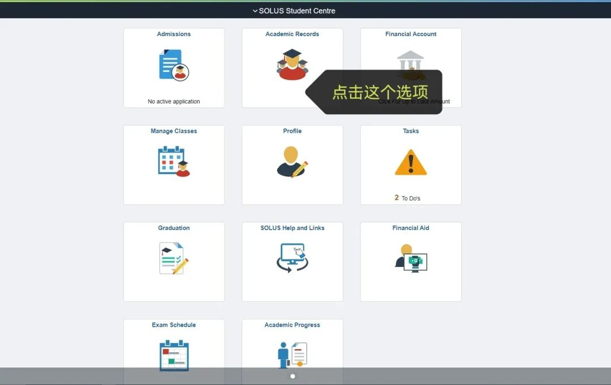
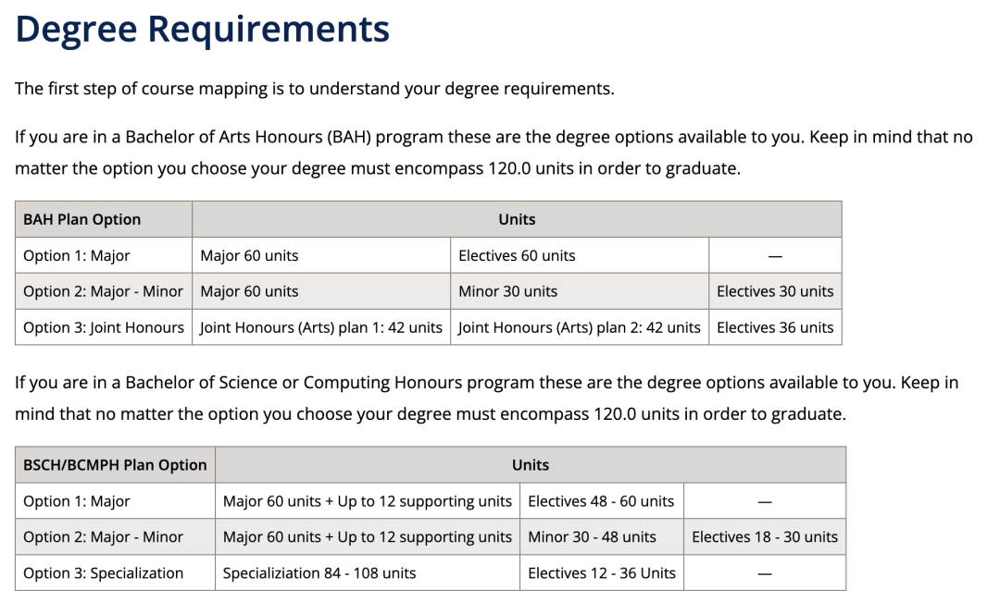

# GPS干货｜文理学院同学错过就会后悔的选专业指北！！！

> 来源：微信公众号  
> 原链接：https://mp.weixin.qq.com/s/ZImifnQaN4ObxGMjUA4FQw  
> 状态：自动搬运，暂未分类  
> 图片数量：13  
> OCR 图片文字数量：0

---

## 人工整理说明

本文件保留了公众号文章中的所有图片，没有自动删除装饰图。  
每张图片都用 `IMAGE-编号` 标记，方便后期人工检索、删除或补充说明。  
如果图片下方出现 OCR 文字，说明脚本尝试识别了图片中的文字，但需要人工检查准确性。

---

【IMAGE-001 START】

【IMAGE-001 END】

— Program Selection —

**文理学院**

**专业选择指北**

**GPS 干货**

【IMAGE-002 START】

【IMAGE-002 END】

**选 专 业 啦 ！！！**

即将要进入大二的**Arts and Sciences**的同学们请注意！又到了一年一度选专业的时候了！你还在纠结吗？或是已经有心仪的专业了呢？今年的选专业通道将在**2023 年 5 月 23 日至 6 月 2 日在 SOLUS 上开放**！在solus页面经历大更新后，熊猫酱在这里为你送上全新的如何选择以及操作的干货！

所有成绩都会陆续在**5月中旬之前**出来！大家可以在solus上面查看，并且衡量自己能不能进心仪的专业~**所有完成 24 个或更多单元的学生必须参与课程/计划选择过程。这涉及选择大家希望追求的学习领域（计划）。**

【IMAGE-003 START】

【IMAGE-003 END】

选专业操作流程

**Step 1 进入solus选专业页面**

【IMAGE-004 START】

【IMAGE-004 END】

- 首先呢，我们先要确认心仪的专业！如果有还没想好的宝贝可以看看咱们GPS之前出过的每个专业的详细介绍噢~
- 登陆自己的**solus系统**，在**Academic Records****页面中**选择**Program/Plan Selection**。

**Step 2 选择自己心仪的专业**

- 在**Program/Plan Selection****页面**里输入你心仪专业的**名称或关键词**。
- 选完**Major**后，如果你考虑再读一个**Minor**，可以在第二个框里输入专业名，点击continue。（如果不考虑可以直接忽略这一条~）

**Step 3 查看是否成功选择了专业**

【IMAGE-005 START】

【IMAGE-005 END】

- 如果你达到了**所选专业的前置条件，你将直接自动注册进所选专业**，并且可以在Academic Records页面中选择**View my current program**页面**，**查看自己的专业信息。

**Step 4 如果进入了Pending list**

- 如果**没有完全符合前置条件**，在solus上会收到消息，并告诉你已被列入待定名单，**这意味着你的的专业申请将在申请期后由专业内老师手动审查**，一旦专业内做出决定，你将收到一封电子邮件并告诉你专业申请的审查结果。除此之外solus还将通知你**必须选择一个你符合前置条件的备选专业。**
- PS：人工审查将在**6月16日**之前通知你结果

【IMAGE-006 START】

【IMAGE-006 END】

Tip 1：Degree Plan

**本科荣誉学位（Honour），一共需要修120学分。以下是几个选项供大家参考（Arts和Science/Computing有所不同）：**

**1. 只选Major**

Major可以修60学分和选修课60学分

**2. Major+Minor的结合**

Major可以修60学分，Minor修30-48学分和选修课18-30

**3. Specialization (仅存在于部分专业）**

需要修84-108学分，剩下的学分可以从选修中获得

**4. Joint Honour **(仅存在于部分Arts专业）****

选择两个感兴趣的专业（仅限art）每个修42学分，和36学分的选修课

【IMAGE-007 START】

【IMAGE-007 END】

每个专业的degree plan可以访问学校官网的2022-2023 academic calendar了解具体的课程要求

https://www.queensu.ca/academic-calendar/arts-science/schools-departments-programs/

【IMAGE-008 START】

【IMAGE-008 END】

以及查看自己是否满足进入一个专业的要求，可以在这个页面看到（点击“What it takes to be accepted to a Plan“，就可以看到每个专业的进专业要求啦！）：

https://www.queensu.ca/artsci/undergraduate/first-year-students/plan-selection

【IMAGE-009 START】

【IMAGE-009 END】

以上就是所有选择专业的干货内容啦，希望大家可以选到心仪的专业哦！如果还有任何疑问，欢迎在GPS新生群里或者找小助手提出自己的疑问哦，群里的学长学姐们会尽量第一时间回复你哒~

**【END】**

【IMAGE-010 START】

【IMAGE-010 END】

文字 | Eric

排版 | Eric

编辑 | Eric

审核 | Taniya Kyle

【IMAGE-011 START】

【IMAGE-011 END】

【IMAGE-012 START】

【IMAGE-012 END】

\*如有合作意愿，请联系微信：gpsxiaozhushou

【IMAGE-013 START】

【IMAGE-013 END】
