# GPS干货 |2025 SOLUS 使用教程（上）

> 来源：微信公众号  
> 原链接：https://mp.weixin.qq.com/s/UjFpuzrjcDGs78gUcQdMGg  
> 排版：已整理；正文图片：17 张

---

## SOLUS 是什么？

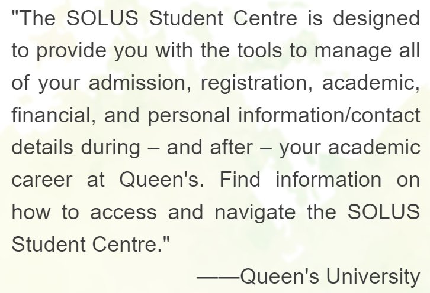

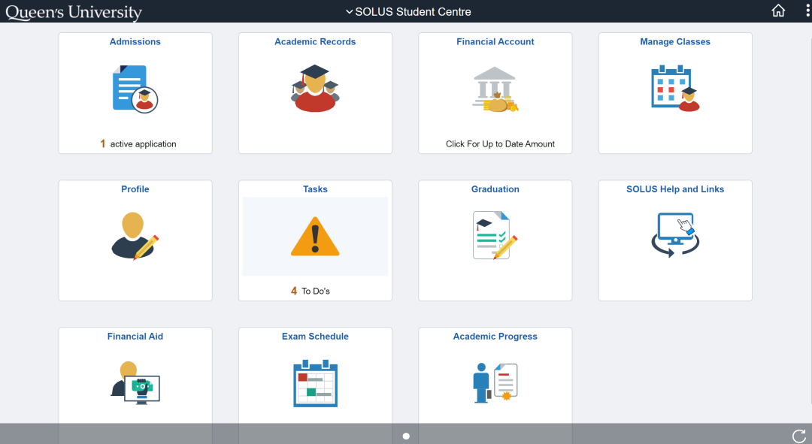

SOLUS 是一个学生个人账户平台，几乎涵盖了所有与“上学”相关的事务。去年，Queen's 对 SOLUS 的界面进行了重新设计，使其变得更加简洁和易于使用。今天，熊猫酱将为大家介绍新版 SOLUS 中各个板块的内容和功能。

## Admissions

当收到offer时，请务必尽快决定是否接受，因为offer是有有效期的！

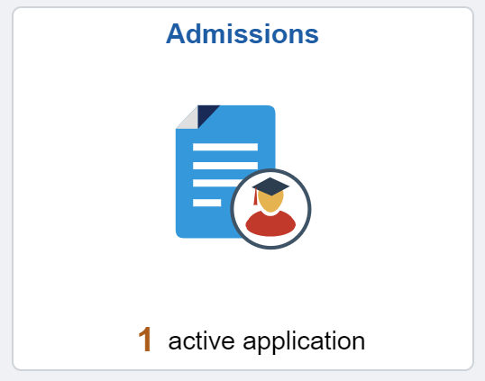

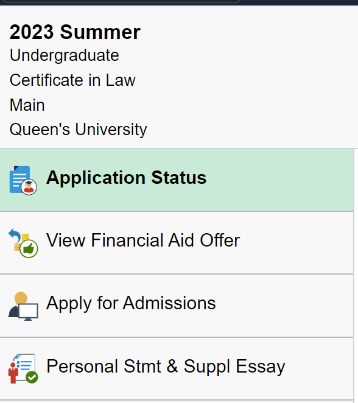

同学们可以在Admissions栏目中查看申请的各个专业和项目的进度，包括：审核中(Pending)和被拒绝(Rejected)。

  如果状态为Pending，To Do List中可能会要求提交额外材料，记得要定期检查哦～

## Academic Records

同学们在未来的学习生活中会经常用到Academic Records 的功能，主要包含了各类成绩、成绩单以及在读证明。

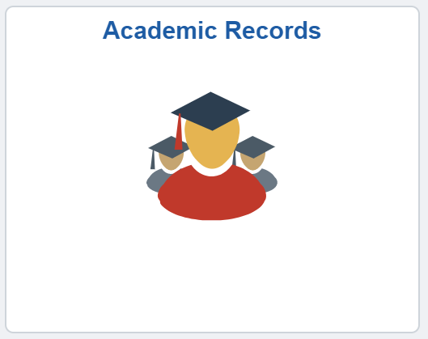

**注意：请注意：在获取 非正式成绩单 时，选择 "Report Type" 为 "Unofficial Transcript"（如图所示），然后点击 "Submit" 提交，即可获得 PDF 格式的非正式成绩单。**

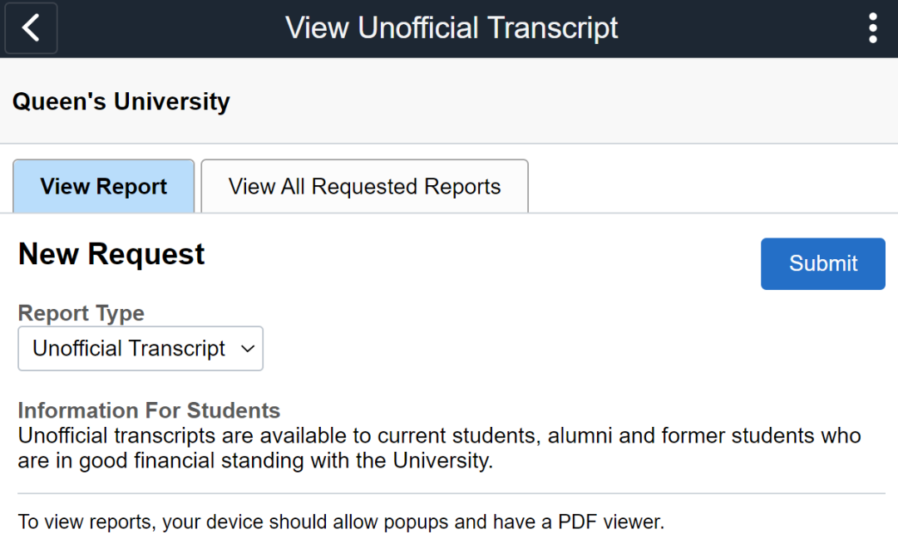

在获取 在读证明 时，选择所需的学年（通常为最近一年），点击 "**Retrieve**" 即可获取。

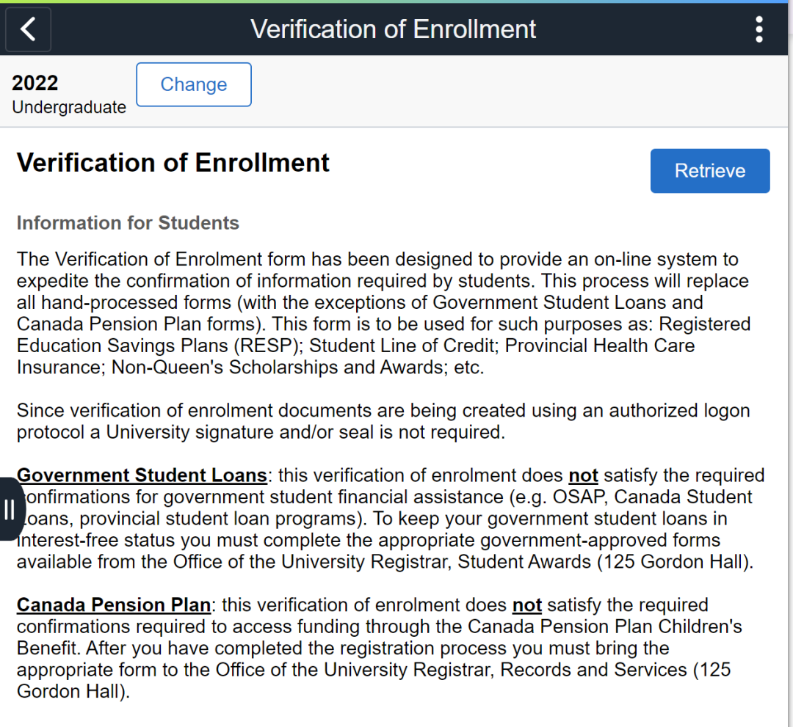

## Profile

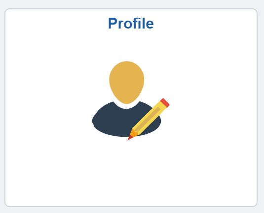

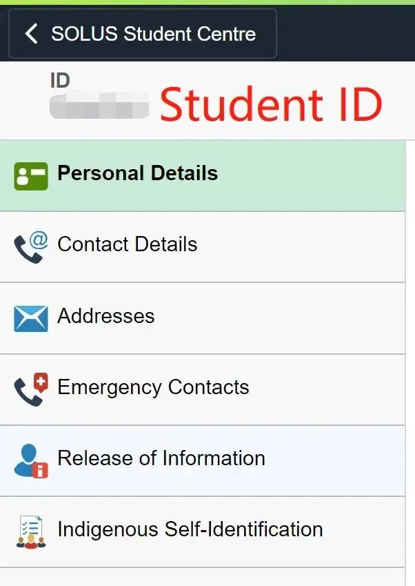

这里保存了同学们的个人信息和联系方式；成绩单和学生卡上的 sticker 会根据此地址寄送。搬家或更换手机号码后，记得在 Profile 中及时更新哦~

## Tasks

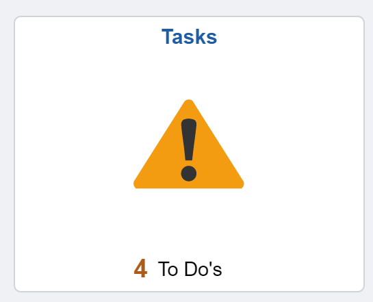

Tasks 可以提醒同学们有关学校生活的一些 due，同学们别忘了完成哦！

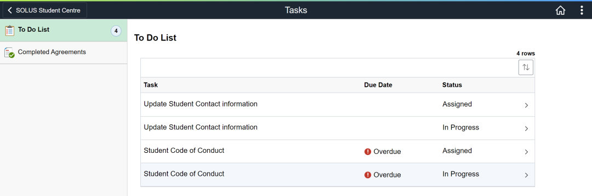

## Financial Aid

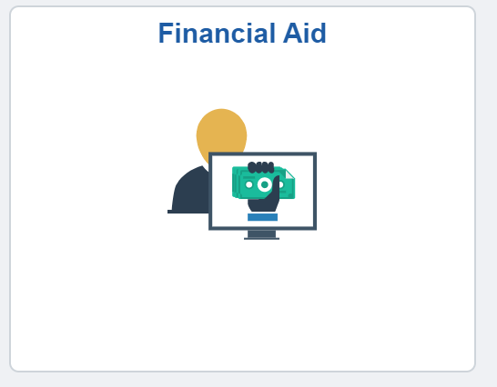

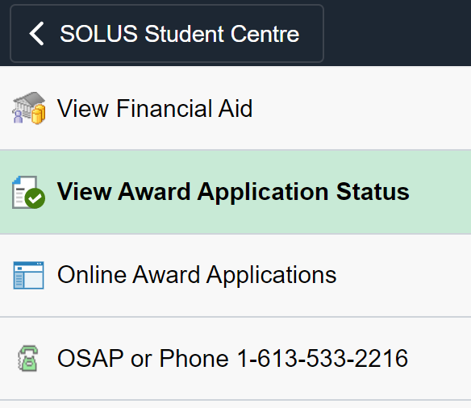

这一部分内容记录了所有的奖学金和学习补助，包括奖学金和各类补助金。例如，OSAP 是安省的学费补助金，但遗憾的是留学生无法申请 T\_T

## Exam Schedule

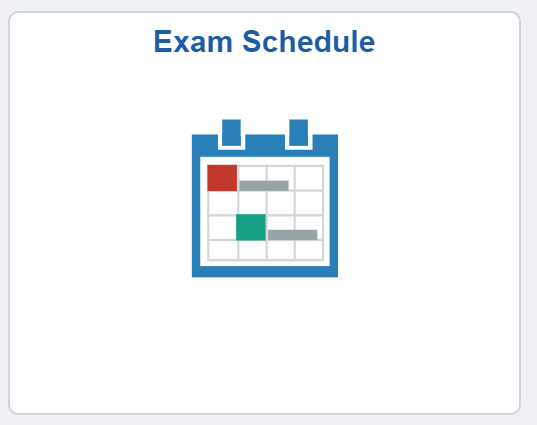

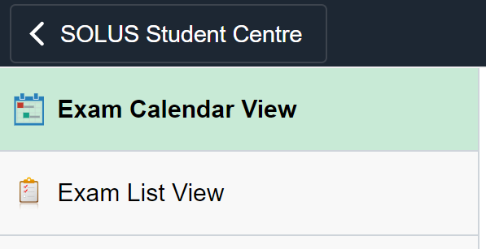

**Exam Schedule** 会在临近期中和期末考试时，逐步显示各科目的考试时间和地点，这对于同学们来说至关重要！考试前一定要仔细确认时间和地点哦（同班同学可能会在不同的考场）。

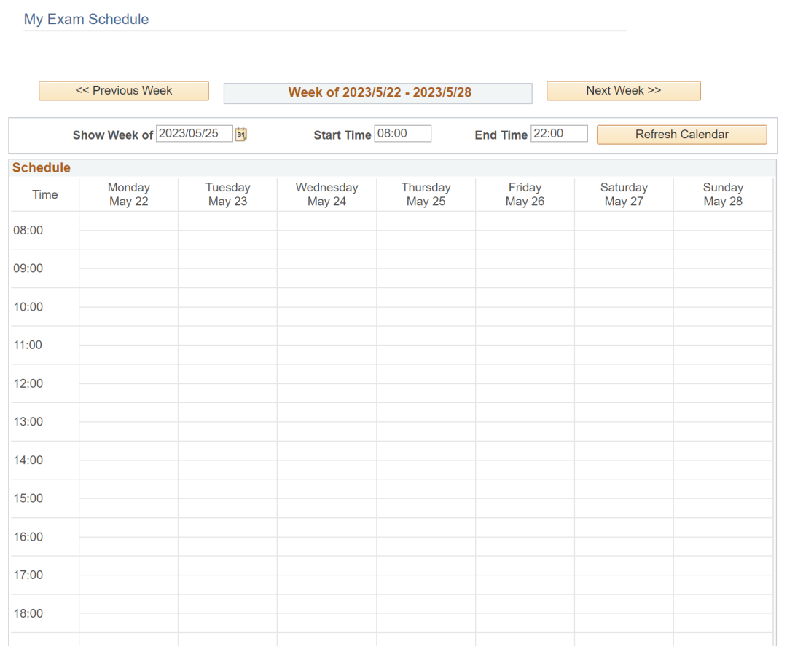

好啦，SOLUS指南（上）就在这里告一段落了！其余功能介绍请期待熊猫酱的下篇推文哦！

文字：Ruby

排版：Ruby

编辑：Ruby

审核：鸡粥, Helena, Simon

**Tip**
