# GPS干货 | 2025 SOLUS 使用教程（下）

> 来源：微信公众号  
> 原链接：https://mp.weixin.qq.com/s/NCn6alTjqnbIhxOQnltQsQ  
> 备注：这是纯 Markdown 文字版，方便后续人工编辑。

---

**SOLUS**

**使用教程（下）**

**SOLUS**

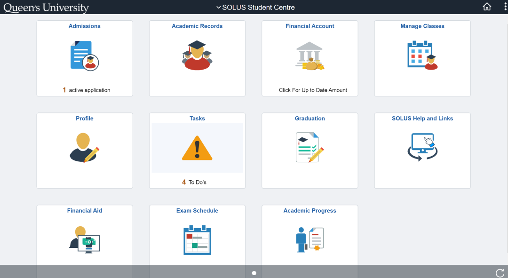

在上一篇中，熊猫酱介绍了 SOLUS 的前六个功能，今天我们来看看剩下的五个功能吧！

**Financial Account**

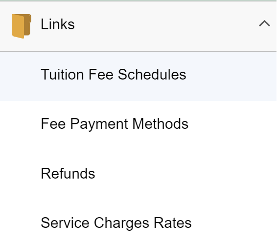

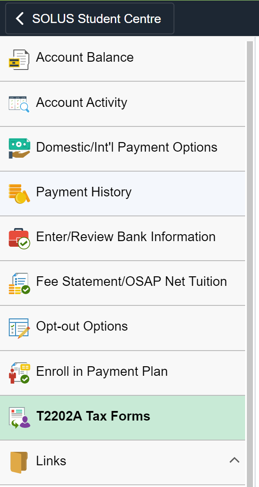

**Financial Account** 是很重要的一个功能！

  \* Account Balance 可以用来查看学生账户余额、学费、学杂费等金额；

  \* Account Activity 可以查看往期学生账户里的资金流动，如充 Flex；

  \* Domestic/Int'I Payment Option 可以通过CIBC银行的账户来进行转账（但是时效可能比直接从国内转账需要的时间还长）；

**·**Review Bank Information 可以预留自己银行的转账信息，方便在退款等事宜上使用便捷的 direct deposit (直接入账)；

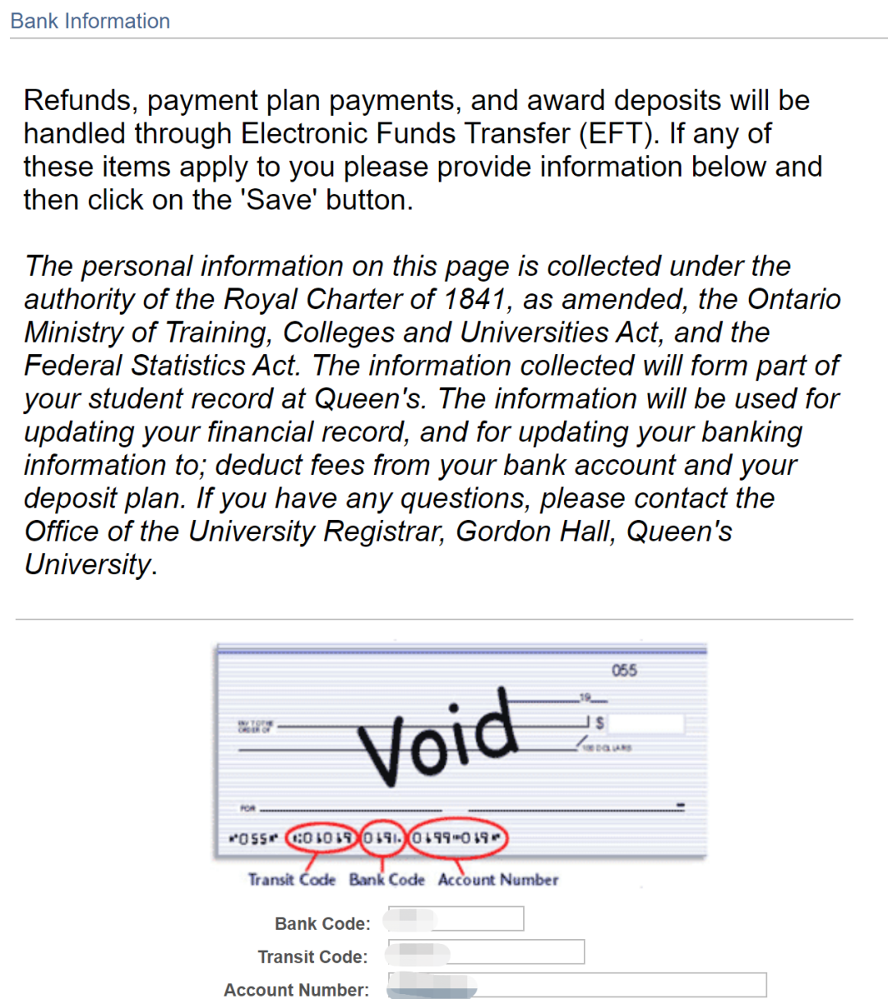

**·** Opt-out Options 可以选择取消部分学杂费；

**·** Fee Statement 可以查看该学期所支付的学费，在未来办理某些签证的时候可能会用到；

**·** T2202A Tax Forms 在交税时会用到，每年都会有一份 T2202A 税单；

**·** Links 可以连接到其他一些有用的、关于 Queen's Financial 的网页。

**Manage Classes**

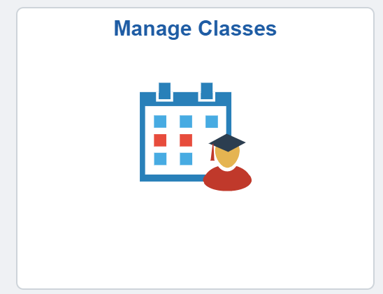

Manage Classes 里包含了与课程相关的一些功能。

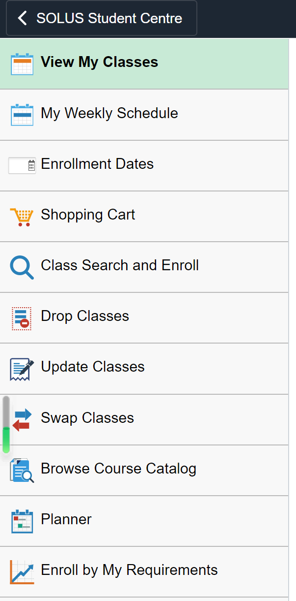

**View My Classes** 用列表的方式呈现这学期所有课程；

**Enrollment Dates**这里显示每个同学选课的起始时间，选课的时候竞争还是非常激烈的哟；

**Shopping Cart**顾名思义，可以让同学们暂存想学、但没决定是否要选的课程；

**Drop Classes** 退课；

**Swap Classes** 换到同一门课程不同的时间段  (sections)；

**Enroll by My Requirements**按照专业需求选课。

**NOTICE**

**My Weekly Schedule**里会显示将陪伴同学们直到毕业的课表！如图，每节课都会显示在一个小方格里。同学们还可以根据下方 "Display Options" 里选择是否展示课程名称和教授哦！是不是很方便呢？

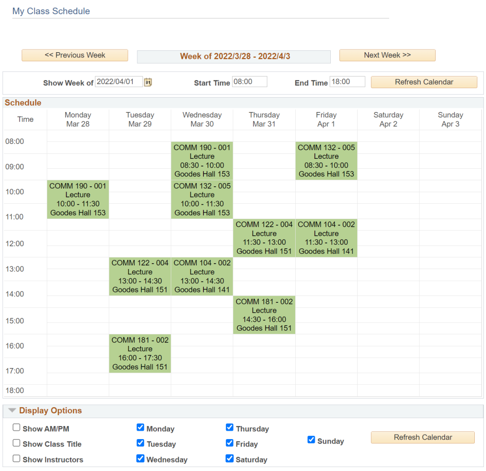

✦

•

✦

Classes Search and Enroll 可以查看在该学期开放申请一些课程，方便同学们选课。

Browse Course Catalog 虽然在选课操作上更方便，但也很容易选到特定学期不开设的课程。

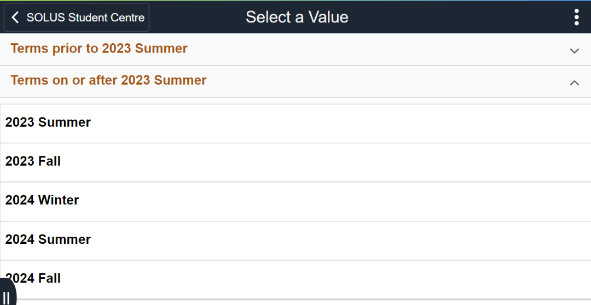

**Graduation**

即将毕业的同学别忘了在 Graduation 申请毕业哦！错过截止时间就需要支付逾期费用了！

**Academic Progress**

Academic Progress 记录了同学们在各专业要求的课程上的上课进度，与前文 Enroll by My Requirements 功能相似。

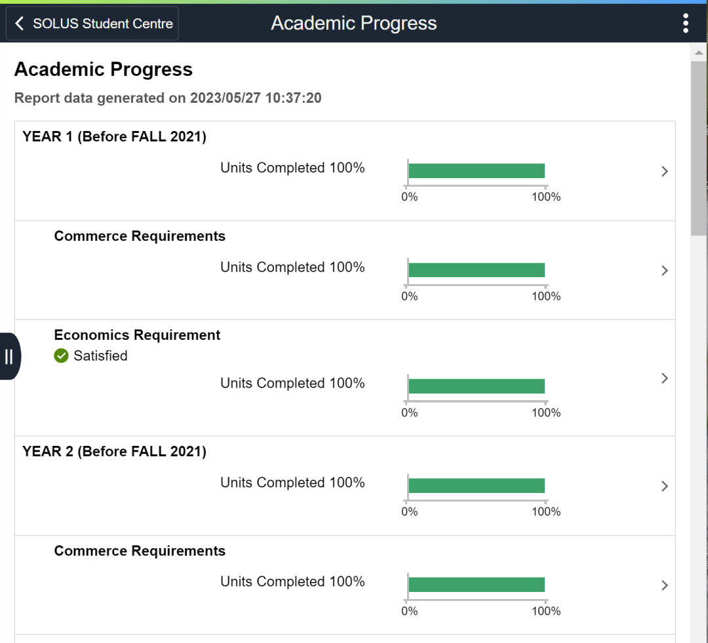

**SOLUS Help and Links**

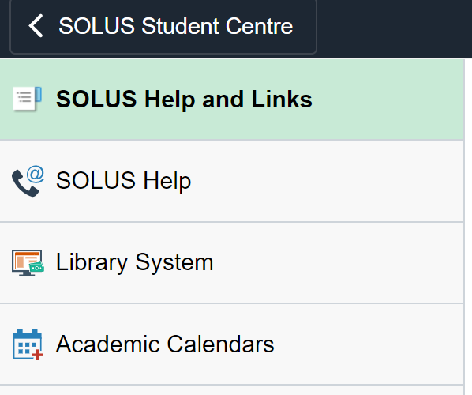

这一块内容记录的是所有的奖金和学习补助，包括奖学金和补助金。例如， OSAP是安省的学费补助金，可惜留学生不能申请 T\_T

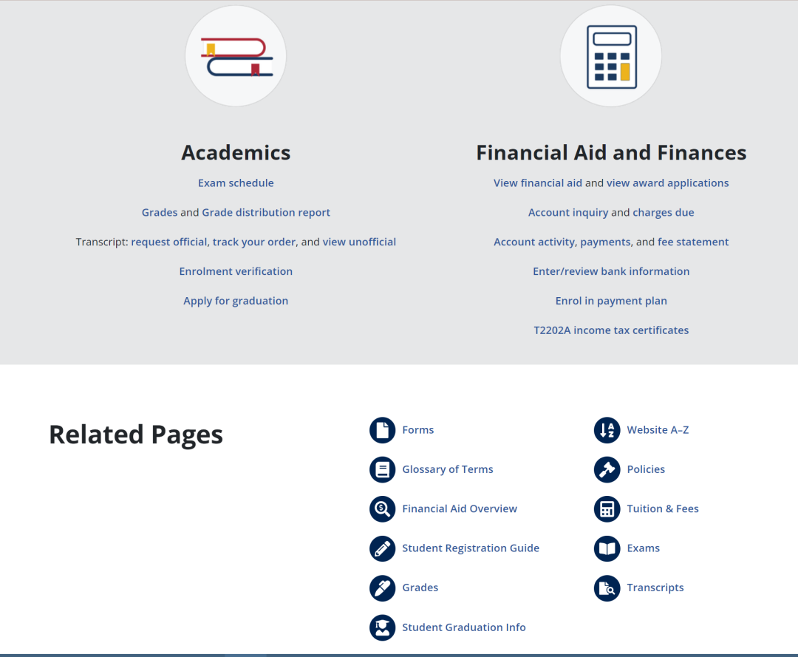

点击**Library System**就会跳转到学校图书馆主页啦！

**Academic Calendar** 学术日历，也就是女王的大事年表哦~

以上就是 SOLUS 所有的功能介绍了！感谢大家的阅读~ 如果还有不清楚的地方欢迎随时向熊猫酱提问或直接写邮件给 SOLUS (solus@queensu.ca) 哦！

文字：Ruby

排版：Ruby

编辑：Ruby

审核：鸡粥, Helena, Simon
