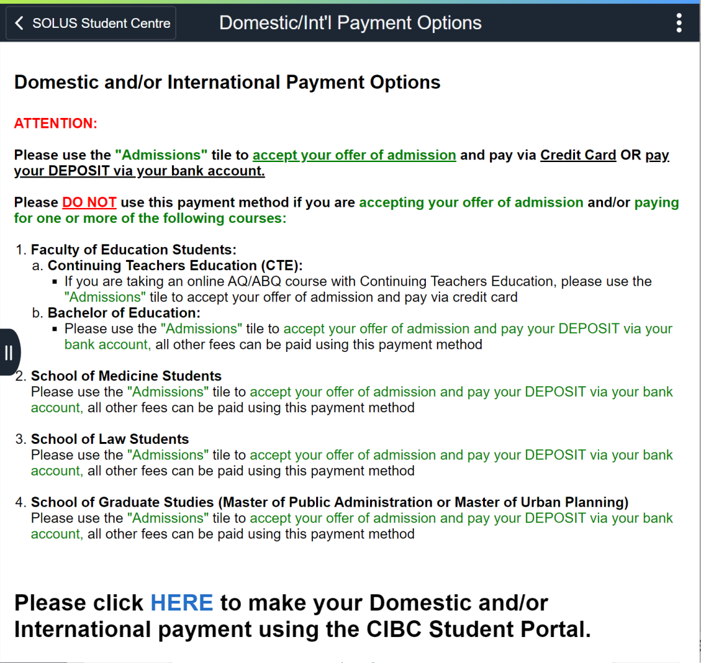
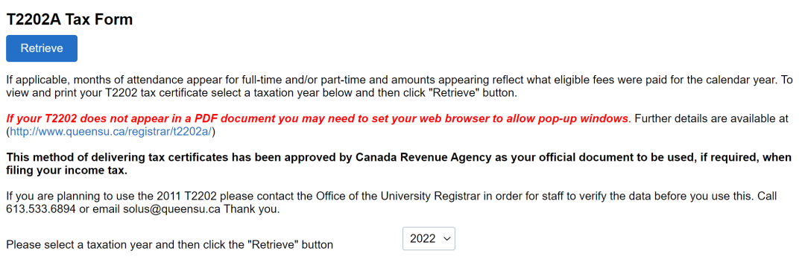
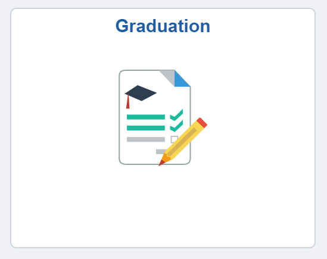
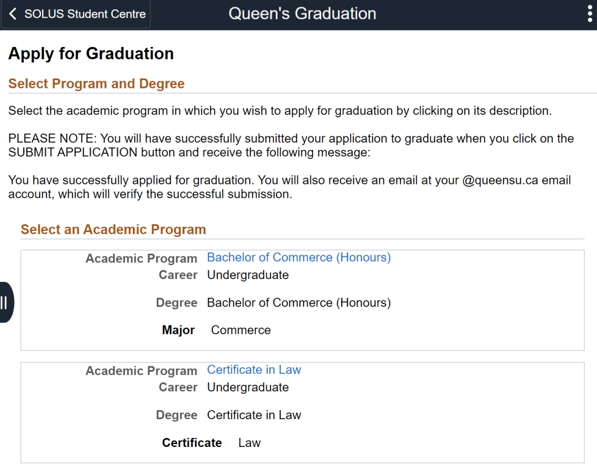
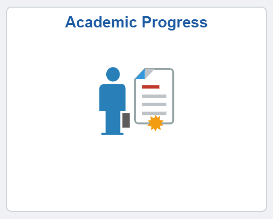
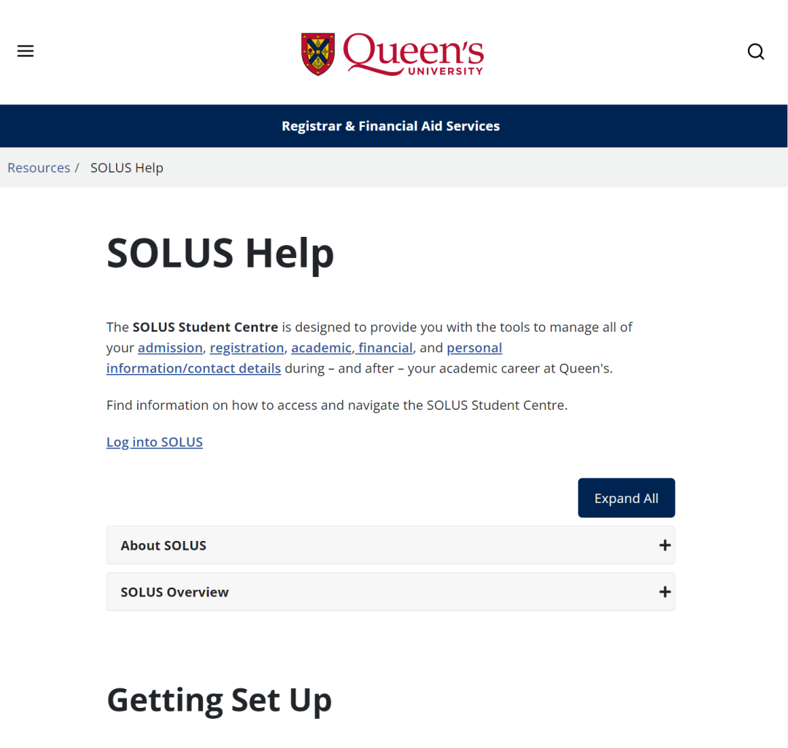
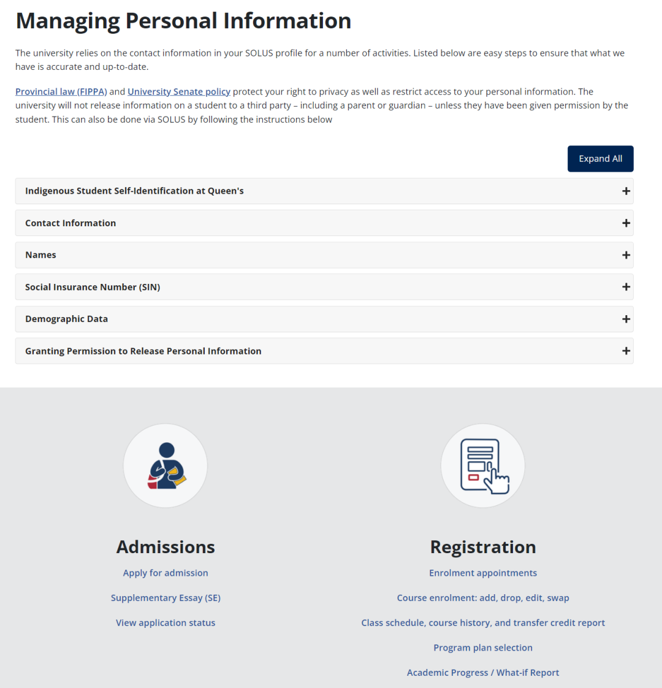
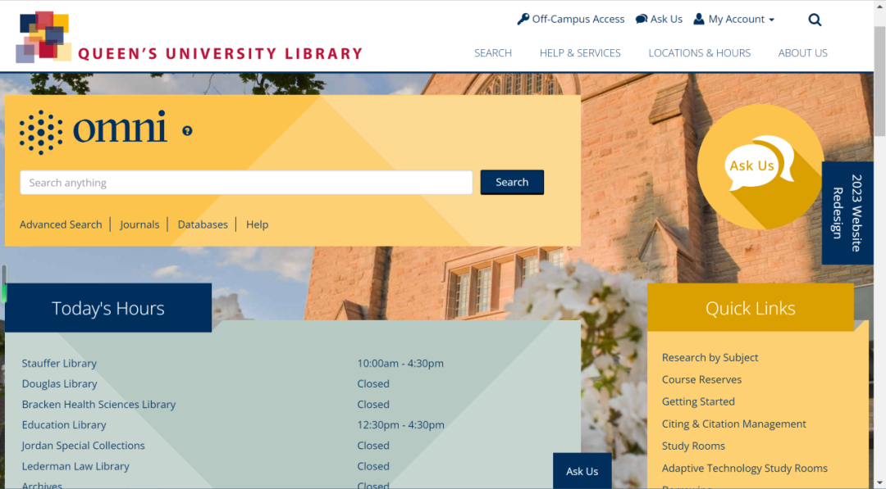
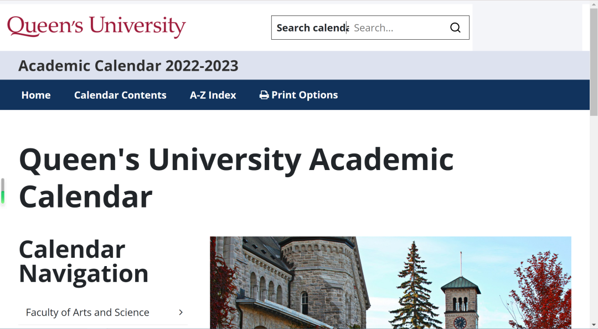

# GPS干货 | 2025 SOLUS 使用教程（下）

> 来源：微信公众号  
> 原链接：https://mp.weixin.qq.com/s/NCn6alTjqnbIhxOQnltQsQ  
> 状态：自动搬运，暂未分类  
> 图片数量：51  
> OCR 图片文字数量：0

---

## 人工整理说明

本文件保留了公众号文章中的所有图片，没有自动删除装饰图。  
每张图片都用 `IMAGE-编号` 标记，方便后期人工检索、删除或补充说明。  
如果图片下方出现 OCR 文字，说明脚本尝试识别了图片中的文字，但需要人工检查准确性。

---

【IMAGE-001 START】

【IMAGE-001 END】

【IMAGE-002 START】

【IMAGE-002 END】

【IMAGE-003 START】

【IMAGE-003 END】

【IMAGE-004 START】

【IMAGE-004 END】

【IMAGE-005 START】

【IMAGE-005 END】

【IMAGE-006 START】

【IMAGE-006 END】

【IMAGE-007 START】

【IMAGE-007 END】

【IMAGE-008 START】

【IMAGE-008 END】

【IMAGE-009 START】

【IMAGE-009 END】

**SOLUS**

**使用教程（下）**

【IMAGE-010 START】

【IMAGE-010 END】

【IMAGE-011 START】

【IMAGE-011 END】

【IMAGE-012 START】

【IMAGE-012 END】

【IMAGE-013 START】

【IMAGE-013 END】

【IMAGE-014 START】

【IMAGE-014 END】

【IMAGE-015 START】

【IMAGE-015 END】

【IMAGE-016 START】

【IMAGE-016 END】

**SOLUS**

【IMAGE-017 START】

【IMAGE-017 END】

【IMAGE-018 START】

【IMAGE-018 END】

【IMAGE-019 START】

【IMAGE-019 END】

在上一篇中，熊猫酱介绍了 SOLUS 的前六个功能，今天我们来看看剩下的五个功能吧！

**Financial Account**

【IMAGE-020 START】

【IMAGE-020 END】

【IMAGE-021 START】

【IMAGE-021 END】

【IMAGE-022 START】

【IMAGE-022 END】

【IMAGE-023 START】

【IMAGE-023 END】

【IMAGE-024 START】

【IMAGE-024 END】

【IMAGE-025 START】

【IMAGE-025 END】

**Financial Account** 是很重要的一个功能！

  \* Account Balance 可以用来查看学生账户余额、学费、学杂费等金额；

  \* Account Activity 可以查看往期学生账户里的资金流动，如充 Flex；

  \* Domestic/Int'I Payment Option 可以通过CIBC银行的账户来进行转账（但是时效可能比直接从国内转账需要的时间还长）；

【IMAGE-026 START】

【IMAGE-026 END】

**·**Review Bank Information 可以预留自己银行的转账信息，方便在退款等事宜上使用便捷的 direct deposit (直接入账)；

【IMAGE-027 START】

【IMAGE-027 END】

**·** Opt-out Options 可以选择取消部分学杂费；

**·** Fee Statement 可以查看该学期所支付的学费，在未来办理某些签证的时候可能会用到；

**·** T2202A Tax Forms 在交税时会用到，每年都会有一份 T2202A 税单；

【IMAGE-028 START】

【IMAGE-028 END】

**·** Links 可以连接到其他一些有用的、关于 Queen's Financial 的网页。

【IMAGE-029 START】

【IMAGE-029 END】

**Manage Classes**

【IMAGE-030 START】

【IMAGE-030 END】

Manage Classes 里包含了与课程相关的一些功能。

【IMAGE-031 START】

【IMAGE-031 END】

**View My Classes** 用列表的方式呈现这学期所有课程；

**Enrollment Dates**这里显示每个同学选课的起始时间，选课的时候竞争还是非常激烈的哟；

**Shopping Cart**顾名思义，可以让同学们暂存想学、但没决定是否要选的课程；

**Drop Classes** 退课；

**Swap Classes** 换到同一门课程不同的时间段  (sections)；

**Enroll by My Requirements**按照专业需求选课。

【IMAGE-032 START】

【IMAGE-032 END】

**NOTICE**

**My Weekly Schedule**里会显示将陪伴同学们直到毕业的课表！如图，每节课都会显示在一个小方格里。同学们还可以根据下方 "Display Options" 里选择是否展示课程名称和教授哦！是不是很方便呢？

【IMAGE-033 START】

【IMAGE-033 END】

✦

•

✦

Classes Search and Enroll 可以查看在该学期开放申请一些课程，方便同学们选课。

Browse Course Catalog 虽然在选课操作上更方便，但也很容易选到特定学期不开设的课程。

【IMAGE-034 START】

【IMAGE-034 END】

**Graduation**

【IMAGE-035 START】

【IMAGE-035 END】

【IMAGE-036 START】

【IMAGE-036 END】

即将毕业的同学别忘了在 Graduation 申请毕业哦！错过截止时间就需要支付逾期费用了！

**Academic Progress**

【IMAGE-037 START】

【IMAGE-037 END】

Academic Progress 记录了同学们在各专业要求的课程上的上课进度，与前文 Enroll by My Requirements 功能相似。

【IMAGE-038 START】

【IMAGE-038 END】

**SOLUS Help and Links**

【IMAGE-039 START】

【IMAGE-039 END】

【IMAGE-040 START】

【IMAGE-040 END】

这一块内容记录的是所有的奖金和学习补助，包括奖学金和补助金。例如， OSAP是安省的学费补助金，可惜留学生不能申请 T\_T

【IMAGE-041 START】

【IMAGE-041 END】

【IMAGE-042 START】

【IMAGE-042 END】

【IMAGE-043 START】

【IMAGE-043 END】

【IMAGE-044 START】

【IMAGE-044 END】

点击**Library System**就会跳转到学校图书馆主页啦！

【IMAGE-045 START】

【IMAGE-045 END】

【IMAGE-046 START】

【IMAGE-046 END】

**Academic Calendar** 学术日历，也就是女王的大事年表哦~

【IMAGE-047 START】

【IMAGE-047 END】

【IMAGE-048 START】

【IMAGE-048 END】

【IMAGE-049 START】

【IMAGE-049 END】

以上就是 SOLUS 所有的功能介绍了！感谢大家的阅读~ 如果还有不清楚的地方欢迎随时向熊猫酱提问或直接写邮件给 SOLUS (solus@queensu.ca) 哦！

【IMAGE-050 START】

【IMAGE-050 END】

【IMAGE-051 START】

【IMAGE-051 END】

文字：Ruby

排版：Ruby

编辑：Ruby

审核：鸡粥, Helena, Simon
