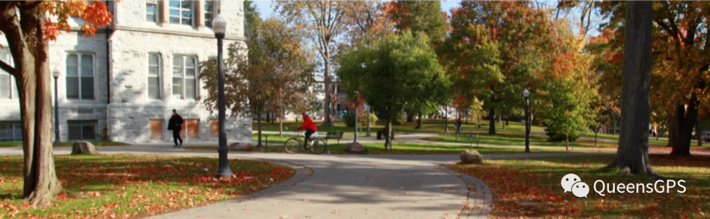
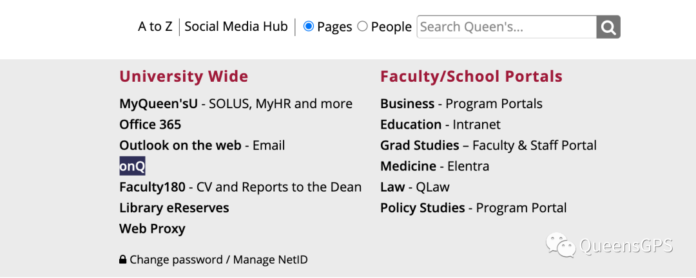
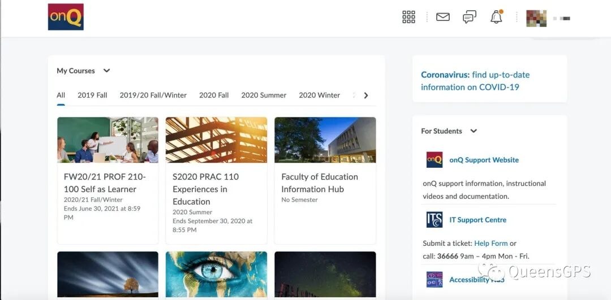
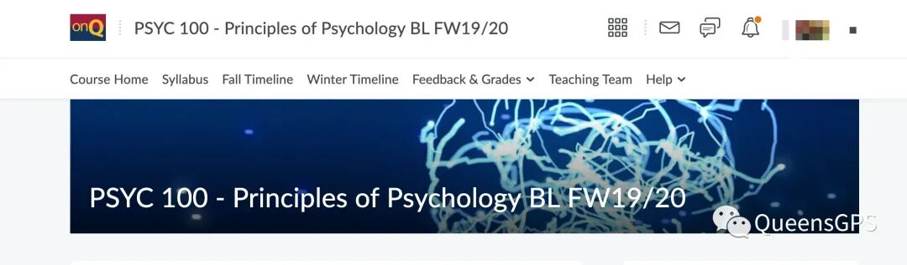
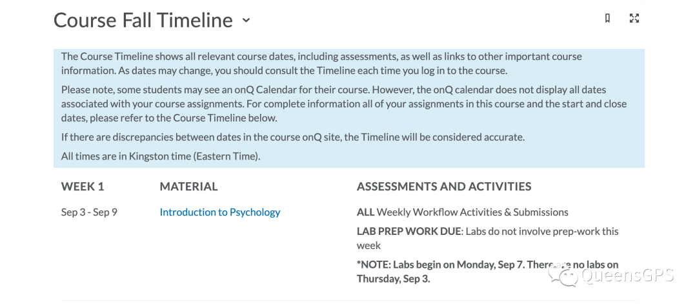
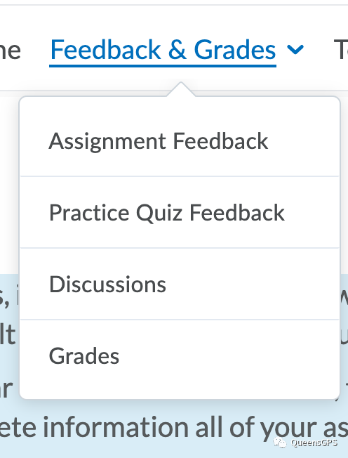
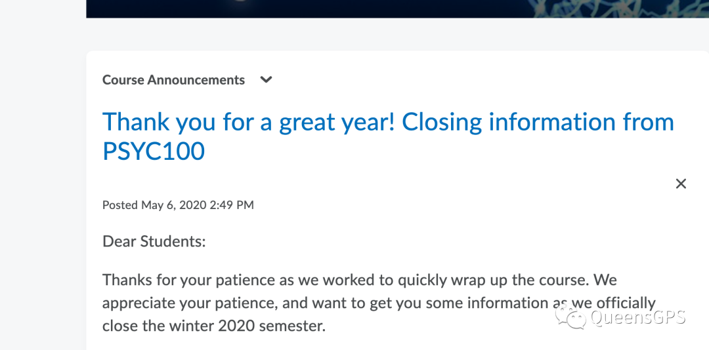
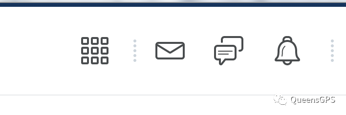
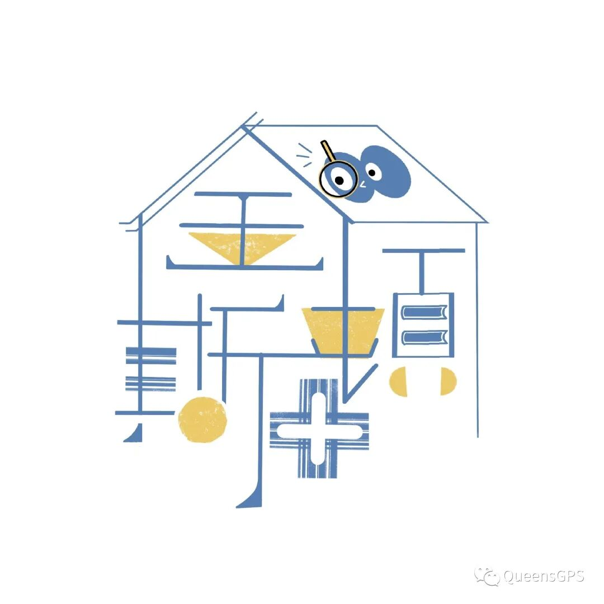
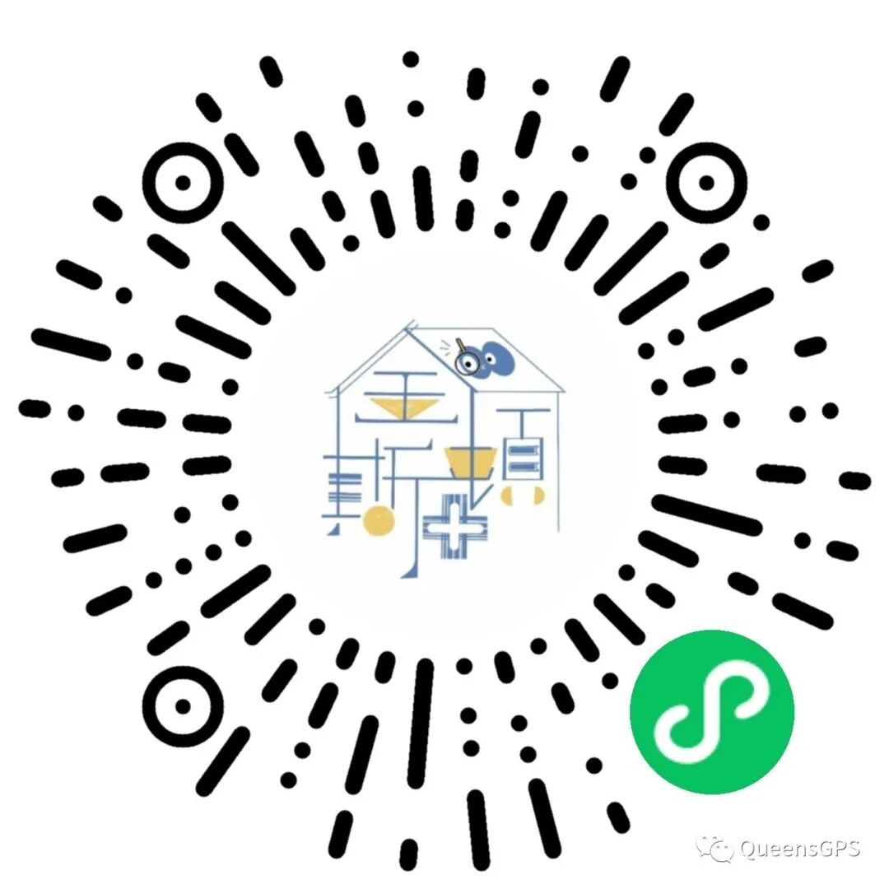

# GPS 干货| 它来了，每个Queen's 学生的好伙伴，OnQ

> 来源：微信公众号  
> 原链接：https://mp.weixin.qq.com/s/P4BVTawSoe4SRnN8RuAfEA  
> 状态：自动搬运，暂未分类  
> 图片数量：14  
> OCR 图片文字数量：0

---

## 人工整理说明

本文件保留了公众号文章中的所有图片，没有自动删除装饰图。  
每张图片都用 `IMAGE-编号` 标记，方便后期人工检索、删除或补充说明。  
如果图片下方出现 OCR 文字，说明脚本尝试识别了图片中的文字，但需要人工检查准确性。  
OCR 文字只是辅助，不代表一定需要保留到最终正文。

---

【IMAGE-001 START】

【IMAGE-001 END】

**#** 九月·开学季

含泪告别了“短短数月”的假期，我们终将正式迎来九月开学季。不管是对于新生还是老生来说，今年的新学期注定是一场不同以往的体验。远程授课将会比线下授课更加注重老师和学生之间的沟通与联系，主要会通过**zoom**和**邮件**等形式建立。而作为向学生们传递课程内容的重要媒介，**OnQ**将会扮演一个必不可少的角色。而对于大部分新同学来说，充分了解OnQ的功能也成为了一门重要的功课。那么今天熊猫酱就来带大家一起扒一扒OnQ的那些硬核操作。

【IMAGE-002 START】

【IMAGE-002 END】

【IMAGE-003 START】

【IMAGE-003 END】

**#** OnQ

【IMAGE-004 START】

【IMAGE-004 END】

不同于SOLUS，OnQ的主要作用是传递每一节课的**授课内容（包括syllabus，课件，录屏， assignment 布置/上传，分数查阅等重要操作**）。简单来说就是一个进阶班的google classroom，里面有你每节课的**一切相关内容**。用学生账号密码登陆进去就会看到你从大一开始每学期修过的课程。对于新生来说，你们可能看到你们秋季已经选上的一些课程，但是还不能点进去因为这些课程要在**9月8号**开学准时开放。

【IMAGE-005 START】

【IMAGE-005 END】

因为新学期的课程还是点不进去，所以这里就以我去年的psyc 100 为例给大家看看点进去以后的页面大概是什么样子（每节课可能又有点不一样）。一般来说主页正上方会有好几个sidebar比如上图所示的**course home（主页）；syllabus（教学大纲）；timeline（教学内容时间线）；feedback/grades（反馈及分数）；help（帮助）**等，这些排版顺序及名称每节课可能会不一样但是意思是差不多的。

比如你想看课程内容，这里可以直接点fall timeline，就会有每周的topic和作业显示，再依次点进去就可以看到了👇（这是19psyc年的内容，仅供参考）。网课的话一般是每周一个module，也是点进去就能看到。

【IMAGE-006 START】

【IMAGE-006 END】

再比如你想查阅自己的分数就可以直接点**feedback&grades**一般就有可以看到作业及考试分数等。

【IMAGE-007 START】

【IMAGE-007 END】

除了以上一些基本操作，大家可能会注意到上图还有一个**discussion**栏。大部分的课程都会设置这个专栏，主要是给学生们的一个线上问问题的板块。如果你有课程或者作业上的问题都可以在discussion专栏里发布，然后就会有课友，TA 或者教授本人为你解答。这也是除了邮件以外，另一个可以请教到教授的方法。

重点来了，主页还是一个教授发布**announcement**的地方，这里建议大家要定时查看一下教授有木有发布一些重要的消息。

【IMAGE-008 START】

【IMAGE-008 END】

右上角的小铃铛是**notification**， 在OnQ 上有任何新的更新比如教授上传了你的分数，都会在这里显示（会有一个小红点）。神似二维码的那个小正方形展开就是你其他的课程链接，点进去你就可以快速去另一节课的OnQ主页。中间这两个一个是信箱，平时不怎么会有消息；一个是评论，在你发布post并且有人评论之后会收到消息。

【IMAGE-009 START】

【IMAGE-009 END】

主页往下滑右侧通常是这门课的teaching team介绍，包括教授和TA们的联系方式也都会有显示。

**Tips💡：开学上OnQ第一件事一定不要忘了找这门课的教学大纲syllabus 看哦，很重要的！**

总～的来说，一门课程的信息只要教授上传了**你就都能在OnQ上找到** ٩(˃̶͈̀௰˂̶͈́)و）。

**#** 总结

以上这些操作看似繁琐，但是熊猫酱保证只要开始上学，大家就很快能掌握，因为你基本上每天都会和OnQ打交道，混着混着就混熟了对吧！

好啦，关于OnQ的介绍熊猫酱能想到的暂时只就这些啦，都是一些基操，相信对很多不知道OnQ是什么的大一新生们有所帮助。如果知道OnQ还有什么隐藏操作的学长学姐们欢迎在评论区留言或在Kingston+小程序提问哦～

【IMAGE-010 START】

【IMAGE-010 END】

**开学季，找不到课友？**

**学术问题需要帮助？**

**❤️❤️❤️**

**Kingston**+小程序**来了！**

一站式完美解决上面你的困惑，组局，找课友，社交，租房，拼车，出二手用品，你想要的上面都有！

【IMAGE-011 START】

【IMAGE-011 END】

**Kingston+**致力为同学们提供一个以校园为单位的交流互助桥梁，为大家搭建平台，互相帮助，信息共享，一起构建一个属于**Queens**的阳光健康向上的校园社区论坛。

【IMAGE-012 START】

【IMAGE-012 END】

文字 Nina

排版 Nina

编辑 容易

审核 唐韬 Chris

【IMAGE-013 START】

【IMAGE-013 END】

【IMAGE-014 START】

【IMAGE-014 END】
