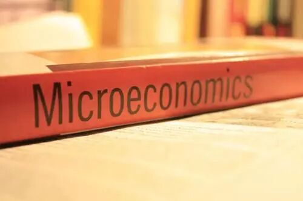

# GPS专业介绍 | 经济，一个看起来很有钱的专业

> 来源：微信公众号  
> 原链接：https://mp.weixin.qq.com/s/jkokEGuDvX_dMiDKrUFEGQ  
> 状态：自动搬运，暂未分类  
> 图片数量：5  
> OCR 图片文字数量：0

---

## 人工整理说明

本文件保留了公众号文章中的所有图片，没有自动删除装饰图。  
每张图片都用 `IMAGE-编号` 标记，方便后期人工检索、删除或补充说明。  
如果图片下方出现 OCR 文字，说明脚本尝试识别了图片中的文字，但需要人工检查准确性。  
OCR 文字只是辅助，不代表一定需要保留到最终正文。

---

改革春风吹满地，在以经济建设为中心的新时代，经济成为了一门与计算机并列的最受留学生欢迎的专业。那么经济学究竟是什么，学什么，前景如何？就听熊猫酱给你娓娓道来。

【IMAGE-001 START】

【IMAGE-001 END】

***01***

**经济学到底是个啥？**

经济学是研究人们如何分配社会有限的资源来满足他们的需要，也是研究商品与服务的生产，分配和消费的社会科学。他可以解释与分析许多诸如商业运营、金融资本、国际贸易和政府政策层面的问题，学习了经济学，你将：

- 拥有研究、沟通、领导力与创造性思维技能

- 了解如何解决复杂的地方，国家和国际经济问题

- 学习如何将适当的定量方法应用于一系列经济问题

- 深入了解周围的经济和世界

- 与出租车司机大哥battle经济民生话题的能力

- 获得早间遛鸟晨练大爷大妈团举办的楼市股市论坛的入场券一张

 ……

总之，是研究整个社会，人，以及钱的一个专业，如果你对以上提及的事物感兴趣，那么就选它！

【IMAGE-002 START】

【IMAGE-002 END】

***02***

**专业概述**

经济学是Queen's的**优势学科**，根据QS世界大学排名，Queen's经济学专业排在100多位，高于整体排名。而根据IDEAS数据库给出的数据，Queen's经济系的科研产出位列加拿大第三，仅次于多伦多大学和UBC。

本科economic department 有如下学位可供选择：

1. a BA Honours degree in Economics (ECON); 

2. a BA Honours degree in Applied Economics (APEC);

3. a BA Honours degree in Politics, Philosophy and Economics (PPEC), with a specialization in Economics

4. a BA Honours degree with medial concentrations in economics and any other discipline in the Faculty of Arts and Science;

5. a three-year BA degree with a minor concentration in economics

其中，4是Econ作为中专业与5是作为小专业与其他专业结合，1和2分别是经济学与应用经济学，economics更加偏向经济理论，而applied economics 更加偏重经济的实际应用。

想进无论ECON还是APEC 专业，大一有两门必修，一门是Econ110（或者Econ111+Econ112），这是最简单的入门课程，介绍了最基本的经济学理论，该门课年终GPA在1.9以上就能被选入经济学专业。还有一门Math (可以是126，110，或者120）。

具体enroll课程参考degree plan:

https://www.queensu.ca/artsci/sites/default/files/degree\_plans\_and\_course\_lists\_final\_1.pdf#%5B%7B%22num%22%3A705%2C%22gen%22%3A0%7D%2C%7B%22name%22%3A%22FitH%22%7D%2C796%5D

【IMAGE-003 START】

【IMAGE-003 END】

***03***

**课程概述**

**大一大二必修类**

**Econ 110  /  Econ 111+112**

**Principles of Economics**

**经济学基础**

Econ 110是经济学的入门级必修课程，难度不大。不仅有经济学的同学们会选，很多其他专业的同学作为辅修或是水课来选，因此这门课的规模还是很大的。

第一学期介绍微观经济（也是ECON 111），也就是涉及市场的供应和需求，企业生产、定价、竞争，个人消费与劳动力市场等微观层面的经济学。第二学期讲宏观经济（EOCN112），例如货币、银行、财政政策、经济周期等知识。学习内容多为知识点的普及，和我们市面上买到的经济学通识课和经济学原理等类似，主要是用知识点去判断两个经济量之间的增减关系，有时辅助以少量的计算和文字分析。

平时的课业也较为简单，没有长篇的阅读、写essay和繁琐的算术，主要以小quiz和小组合作assignment，各种大小考试也多年以选择题为主。只要扎扎实实，多做例题，你就能获得自己满意的分数。

高中学习过AP课程、且分数在4分以上的同学，可以直接换学分。但值得注意的是换学分也是有代价的，大二经济课程较为复杂，直接接触可能会有不适应的情况，GPA将有所下滑。

这门课同样的内容会有不同的课程时间安排，Econ110一周三次，每次一个小时，而110有拆分开来变成111+112的形式，时间也变成一周某天晚上连续三个小时，建议同学们根据自身情况进行选择。

**Econ 212**

**Microeconomic Theory I**

**微观经济学原理**

Econ 212 Microeconomics Theory是大二阶段经济学专业的必修课，是Econ111的进阶课程。相比大一基础课程对于经济学基本概念的介绍，这门课着重于将经济学的知识数学化，运用数学分析的方法进行计算。例如econ 111中介绍了几种市场类型，例如competitive、monopolistic competition，econ 212会教你两个公司在这种市场中具体的quantity demand和price。

在我看来，Econ212可以说是一门数学课程，是相对简单的，有人说这也是Queen‘s 200 level中最简单的课程。的确，平常的课业十分轻松。有的教授甚至不会安排homework、essay之类，只有三个quiz、midterm和final。每年的题目类型都十分相似，可以说备考时只要熟练掌握历年题目，B以上的分数是轻而易举，属于一门皆大欢喜的课程。

**Econ 222**

**Macroeconomic Theory I**

**宏观经济学原理**

与Econ111不同，大二的经济学必修课程分成了两部分，第二部分即Econ222。同样着重于用数学、图表等形式解决宏观层面的经济学问题，但也会介绍一些新的经济学知识和模型，例如solow model 和the golden rule，运用这些模型解题不难，但是真正去理解也有几分难度。

同时，这门课也有意培养学生对于数据的分析能力，assignment中会有从加拿大国家统计局下载加拿大历年经济数据，进行分析汇总的任务。这门课的难度，个人认为不在于midterm和final要运用的内容，而是assignment，教授上课不会cover，部分需要自己去进行探索。而midterm和final的模式与Econ 212类似，每年题型都差不多，好好刷题吧！

**Econ 255**

**Introduction to Mathematical Economics**

**数理经济学**

Econ 255 也是econ的专业必修课，其重点不在经济学，而是介绍高等数学概念，并稍稍与经济学相结合。对于学过Math 110、120等有难度数学课程的可以说是小菜一碟，知识范围比Math 126或121略广。除了每周一个assignment（做几道题），就是midterm 和final, 考试题型固定，多刷题是制胜的不二法宝。

以上四门就是大一大二阶段经济学专业的核心课程，可以说，四门课都不算很难，对于同学们来讲是提高GPA的大好机会，一分耕耘，四分收获。

大三专业课

**Econ 310**

**Microeconomic Theory II**

**微观经济理论 II**

本课程将从分析的角度研究个体决策者的行动，然后重点研究这些个体行动如何结合起来以确定市场经济的运作方式。本课程的重点将是考核微观经济学中基本概念的数学严谨性。我们还将尝试利用数学的力量来研究基本技术的几种应用。

这门课是一门Econ大三level较为简单的课，主要构成为Assignment、Midterm、Final。这是一门需要较多数学技巧的课程，但只要搞懂每种题型的解法，其实得到一个相对较高的分数是很有希望的。

**Econ 351**

**Introduction to Econometrics**

**计量经济学导论**

多元计量经济学模型中的估计和推断。强调对方法及其属性的理解，这与它们的正式理论发展不同。使用计量经济学软件来教授使用适当的模型准备和分析数据的实用工具。预计学生将利用ECON 250中涵盖的材料以及课程目录中适当的数学先决条件。

1.进行与普通最小二乘回归模型有关的规格说明，估计，推论和假设检验。

2.解释和评估普通最小二乘回归模型的输出。

3.在各种经济环境中应用普通最小二乘回归模型。

4.区分相关回归模型的主要特征，包括普通最小二乘法，固定效应和差异差模型。

5.适当地使用统计和计量经济学软件进行回归分析。

选修类

**Econ 239**

**Economic Development**

**发展经济学**

Econ 200 level选修课，prof蛮好的很耐心，介绍经济学发展模型，影响经济发展的因素以及各国家的经济学发展，作业形式主要为group assignment 和 individual 的country study。Assignment 分成short answer 和大题，还是有点难度的，平均分不是很高。country study 分成两篇，平均每篇2000-4000字，要找很多资料有点麻烦（建议ddl前1周开始准备不然很酸爽）不过只要写了一般分数都还可以。没有midterm 还是比较舒服的，Final可以多刷刷历年题目，总体来说算是一门不太难的选修。

**Econ 241**

**Economic Aspects of Selected Social Issues**

也是200 level 的选修课， prof 是 Art Steward 一位也教212的和蔼爷爷，这门课主要讲一些加拿大的社会问题，welfare systems 以及他们的利弊，可以说是很文科的东西。

这门课比较爽的是除了两个mid（各25%）和一个final（50%），考试内容都是short answer和long answer需要写的比较多，没有其他作业，但是！！onq上是空的，也不会有任何的ppt，所有考点笔记全靠上课抄板书+听课补充，并且这位爷爷的板书略微潦草。文字量庞大所以需要背的东西比较多，建议上这门课的朋友平时就多背背不要把所有笔记堆在考试前背（血的教训），万幸的考试的题每年几乎差不多，理解+记住课上笔记就是无敌的，总之推荐擅长背东西的朋友和对这方面感兴趣的朋友选。

**Econ 231 / Econ 232**

**Emergence of the Modern Industrial Economy**

**/ The dissffusion of Moderm Economic Growth**

大二econ课程中比较难的，主要学习英国工业革命前后的经济发展历史，需要大量的reading和essay写作，对于英文水平要求较高，甚至要求你需要有一定的研究能力，是一门不简单的课程。

***04***

**发展前景 & 自我提升**

有个笑话是这样讲的，如果你说自己是个物理学家，听者会回应：“物理学我不懂。”于是不再说下去。但如果你说自己是个经济学家，听者会回应：“经济学吗？我不懂，但我认为……”接着滔滔不绝。

这则笑话说明经济学不是那么高门槛，可以说是一门万金油学科，经济和更实用性的商科来讲，也相差一道较难跨越的门槛。在就业的方面，经济学可能不那么具备竞争性，那么我们如何在学术方面提高自己未来的竞争力呢？

-  经济的major有些单薄，必修课要求较少，其他学分可以加辅修课程。很多学长学姐的选择是主修经济，辅修统计、计算机等课程。

- Smith商学院提供商业证书（Business Certificate）项目，上六门200level的商业课程分别为：商业基础、金融导论、营销基础、财务会计、管理会计、组织行为学。不仅可以增加商业知识方面的阅历，也能体验Smith的课堂气氛。但需要注意的是，Queens文理学院的学生选修其他学院的课程只有前两门学分算入在内，也就是说，如果你的major是Econ，六门商业课程中只有你的前两门计算入用于毕业的120个学分中，有四门课程可能是需要额外收取学费的。

-  多参加与经济学相关的社团组织和竞赛。例如QECC，Queen’s Economic Case Conference，每年都会举办商业竞赛和讲座，你将有机会见到来自加拿大各知名企业团体的大佬。

【IMAGE-004 START】

【IMAGE-004 END】

***05***

**总结**

很多经济学家给出的对于经济学的定义是“一门研究选择的科学”。熊猫酱个人的看法是，如果你选择经济学，你进行的工作本质是使用不同的数学与统计模型，解释与检验经济常识和理论。

很多人认为经济学是与商科最紧密相关的学科，但其实相比偏向应用型的商科，经济学更关注理论本身。学习经济学，你可能不太能收获商业决策与求职的相关知识，但是你真正收获的是一种思辨的能力，“理性”是经济学思想的内核与核心假设，什么事理性的决策，预先假设人群都是理性的，以预测研究该决策对外部环境的影响。

好啦今天的介绍就到这里，希望大家在经济学的道路上扬帆起航！

文字 | 唐韬

排版 | 唐韬

编辑 | Rika

审核 | 容易 Olivia

【IMAGE-005 START】

【IMAGE-005 END】
