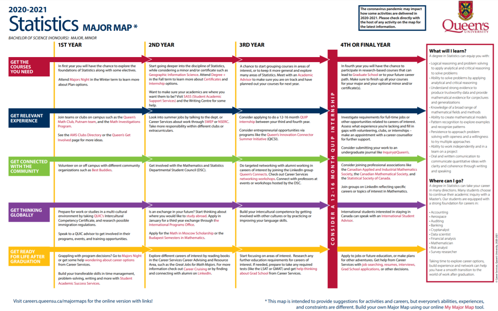
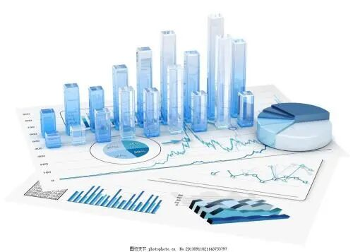

# GPS专业介绍 | 选择统计，开启痛并快乐的大学生活

> 来源：微信公众号  
> 原链接：https://mp.weixin.qq.com/s/adSRIHJS9soEpS-JKTjxew  
> 状态：自动搬运，暂未分类  
> 图片数量：9  
> OCR 图片文字数量：0

---

## 人工整理说明

本文件保留了公众号文章中的所有图片，没有自动删除装饰图。  
每张图片都用 `IMAGE-编号` 标记，方便后期人工检索、删除或补充说明。  
如果图片下方出现 OCR 文字，说明脚本尝试识别了图片中的文字，但需要人工检查准确性。  
OCR 文字只是辅助，不代表一定需要保留到最终正文。

---

Statistics

统计专业

Queen's统计专业怎么样？

【IMAGE-001 START】

【IMAGE-001 END】

【IMAGE-002 START】

【IMAGE-002 END】

统计难学吗？

【IMAGE-003 START】

【IMAGE-003 END】

在这个大数据的时代，相信有不少学弟学妹们对统计这个大热门专业一定非常感兴趣。那统计究竟怎么样，如何学？千万不要走开，熊猫酱这就来带你细细研究一番！

**统计学什么？**

统计学是应用数学的一个分支，主要通过利用概率论建立数学模型，收集所观察系统的数据，进行量化的分析、总结，并进而进行推断和预测，为相关决策提供依据和参考。它被广泛的应用在各门学科之上，从物理和社会科学到人文科学，甚至被用来工商业及政府的情报决策之上。在女王大学，为统计学又分了这四个方向：

**Algebra & Number Theory**

代数与数论

**Analysis, Geometry, & Topology**

分析，几何和拓扑

**Applied Mathematics**

应用数学

**Probability & Statistics**

概率与统计

**进专业要求：**

总GPA达到0.7，并在MATH 1##课程中获得C或以上的成绩。统计专业路径图如下：

【IMAGE-004 START】

【IMAGE-004 END】

想要选择统计系在大一就需要斟酌一下选课了，熊猫酱也为大家收集整理了统计系的**大一必修课**和大二及以后的**推荐课程**。

**大一必修**

【IMAGE-005 START】

【IMAGE-005 END】

推荐指数：★★★★★

Math 110 （年课）      

主要是讲线性代数。今年网课，难度不高。日常难度会比较高，劝退一部分学生（主要在考试），但认真学基本问题不大，A+可能难一些。由作业，考试，期末组成。不同老师有不同的分配。一般这几年G.G.Smith和Ivan教的比较多。（网课不太清楚）

建议就是，课后复习，把不懂的地方尽快搞懂，不要超过一周，不然会跟不上进度。G.G会提供他的notes某种意义上算是一本书，这也导致好多人干脆不去听课，直接看notes（实际上可行，因为G.G的课一般是照着notes读）。Ivan评价两极分化，有的很喜欢，有的不喜欢。他上课一般是想讲什么讲什么有的时候你会觉得课程不连接。但一定要去上，因为不提供notes（不确定明年提不提供，因为据说网课他也交了，好像搞了份notes,但之前没有）

**大一必修**

【IMAGE-006 START】

【IMAGE-006 END】

推荐指数：★★★★★

Math 120（年课）

主要是讲微积分。

这门课比较简单，没什么好说的，如果是普高生，基本大一上学期的内容高中都学过。老师也一般都很友好，有的老师会考试前给past exam。一般情况下，如果擅长数学，这门课会很轻松，感觉大家总体分数也比较高，A+很多。

这两门课的共同特点就是按部就班，跟着走。作业是每周一次。所以完全可以用作业来衡量你掌握的水平。这两门课也比较基础，很重要。基本后面的课都会用到里面的知识点。

想学统计的可能会在统计和数学中衡量。那就考虑一下自己喜欢的是数据还是理论。喜欢证明的当然选数学。然后大二实际上数学和统计的必修也差不多。所以，选择了如果不喜欢，可以在大三改另一门，一般不耽误。

进系要求小编，但应该很低来着，C还是C-。一般真学数学或统计，那不用考虑进不了系的问题。如果开始分就比较低，会考虑GPA，一般也会早期drop，所以，**基本学下来的都进系没问题。**

**大二推荐课程**

【IMAGE-007 START】

【IMAGE-007 END】

推荐指数：★★★★★

math280 math281 stat268 stat269

两门stat都是入门课，讲的内容比较多杂，但本身不难，尤其是268。

280讲的是 Advanced Calculus，基本是120的进阶。

281讲的是Real Analysis，算是比较重要的一门课，后期会讲一点拓扑

然后不是必修但大部分人都会修的是math231,math231讲的是微分方程，math210也会有部分人选择，但证明在这门课中应用较多，不喜欢证明的可以跳过这门课。

【IMAGE-008 START】

【IMAGE-008 END】

**结语**

统计学专业不是仅仅像其表面的文字表示，只是统计数字，而是包含了调查、收集、分析、预测等，应用的范围十分广泛，因此也要求毕业生掌握扎实的统计基础理论，为未来奠定坚实的基础。但统计专业本身便是一个比较枯燥的专业，但是与此同时，也是一个非常神奇的专业。很多方向，包括工程，物理，金融，等等一系列的学科，都会和大量的数据打交道。当我们可以将问题抽象成数据或模型并将其解决的时候，数理逻辑来思考问题的时候，统计的魅力也就由此显现了。

熊猫酱以为，选择统计学真真就是痛并且快乐着呀！别愣着了，冲就完事儿了！

【更多信息，可以登录数统系官网查看哦~】

https://www.queensu.ca/mathstat/undergraduate/prospective-undergraduate/stats

**-END-**

文字：Charlotte Rika

排版：RIKA

编辑：RIKA

审核：容易 Olivia

【IMAGE-009 START】

【IMAGE-009 END】
