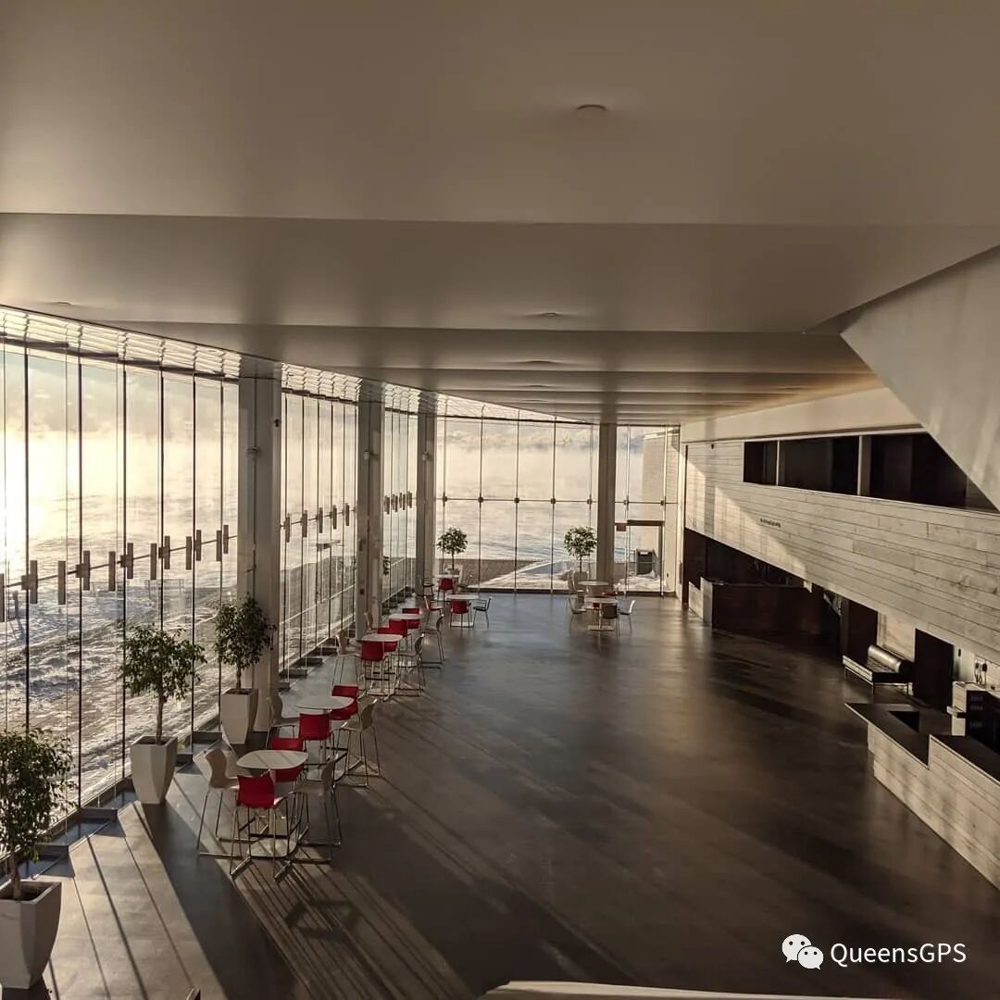
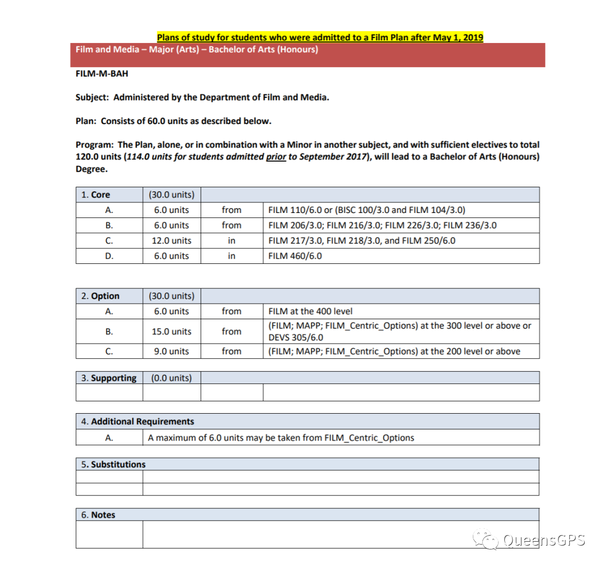
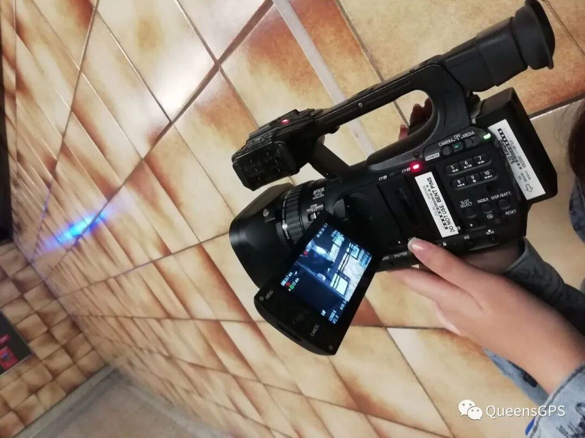
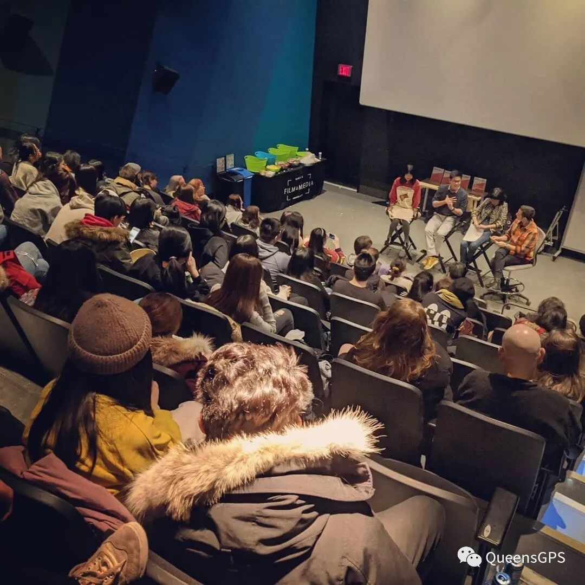

# GPS 专业介绍 | Film&Media：电影与自己的对话

> 来源：微信公众号  
> 原链接：https://mp.weixin.qq.com/s/W-lyvUsMKi-pTOtnv2O95g  
> 状态：自动搬运，暂未分类  
> 图片数量：10  
> OCR 图片文字数量：0

---

## 人工整理说明

本文件保留了公众号文章中的所有图片，没有自动删除装饰图。  
每张图片都用 `IMAGE-编号` 标记，方便后期人工检索、删除或补充说明。  
如果图片下方出现 OCR 文字，说明脚本尝试识别了图片中的文字，但需要人工检查准确性。  
OCR 文字只是辅助，不代表一定需要保留到最终正文。

---

【IMAGE-001 START】

【IMAGE-001 END】

电影替代了我们凝视着

一个与我们欲望更加和谐的世界

- 安德烈·巴赞

**什么是Film&Media?**

受到国内艺术类院校的影响，不少人对电影传媒专业的理解依旧只停留在表面。

“

“学习电影专业一定要有摄影基础吗？”

“这个专业学习影视表演吗？”

“我是不是一定要有美术绘画基础才能学习这个专业？”

“这个专业出来只能一定从事影视导演相关的职业吗？”

“这个专业很轻松吧，平时拍拍电影就行了？”

……

”

这些问题是大部分本专业学生经常被问到的问题，而这些问题普遍的答案都是：**不一定！**

诚然，以上所提到的都是专业相关的一些技术性技能，但是除了影视行业拍摄制作技能外，电影传媒专业的学习还包含了更深维度的学术性内容。

同其他文科专业一样，你在Film&Media专业所学习的也是独立批判性思考的能力，以及发散性思维。通过学习图像和媒体，思考并研究其所代表的意象，及背后的社会现象、意识形态等。借由影像反观社会，了解文化，省视自我。

**Queen's的Film&Media**

女王大学的影视传媒专业为想要学习专业电影制作技能，及想学习电影文化研究的同学提供了双向的选择。在开设学术性研究课程的同时，Film专业也提供了不少电影制作课程。每个人可以根据自己兴趣方向的不同，在大二之后自由选择相关课程进行进一步学习。相比于只教授电影拍摄技能的学校，Queen's的课程设置更具学术性。

除此之外，个人认为Queen's的Film&Media专业更加偏向电影文化的研究。传媒类的课程会有一些关于新媒体，流行文化，大众媒体的课，但是并不多，而且学习的内容并不深刻（大家都拿它当水课上……）想要学习传媒（特别是Communication和新闻）的同学需要考虑一下这个专业是否适合你。（现在转学去隔壁卡尔顿还来得及哈哈~）

【IMAGE-002 START】

【IMAGE-002 END】

**Film&Media Department所在的Isabel Bader Centre**

**(图源官方Facebook)**

**Degree Plan**

2019年，女王大学的Film&Media Department刚刚庆祝了其成立50周年的纪念。整个专业的结构也随之发生了一些变化。除了新增的硕博项目Screen Cultures and Curatorial Studies外，本科的课程设置也进行了很大的调整。

在新增了不少Major专业必修课的同时，也修改了Stage and Screen专修项目为Media and Performance Production（俗称MAPP），更改了一些课程内容。对这个项目感兴趣的同学可以在这个网站查看详细介绍：

https://sdm.queensu.ca/undergraduate/mapp/

2019年5月以后进专业的同学（即2022届）所需修的课程较前几届发生了很大变化。**大二除了Film250 Fundamental of Media Production外，新增了Film217及218 Film and Media History and Theory Pre/Post 1960的必修课程。除此之外还需要从Film206，216，226和236中选修两门。**

【IMAGE-003 START】

【IMAGE-003 END】

**2019年5月后的Degree Plan**

2020年学院又对新一届（即2023届）的专业必修要求做出了调整。修改Film250从6.0学分的年课为3.0学分的学期课，分为250A和250B，可在秋季或冬季选择。此外又又又新增了一门Film257 Concept Development为专业必修。真的是一届比一届难。

不过2020-2021学年新增了不少有趣的选修课！如Film316 Video Games and Culture，同时开设了不少Media相关课程，如Film320 Media and the Arts，补足了之前传媒领域相关课程缺失的空隙。同学们可以期待一下！具体课程可以点击以下链接查看：

https://www.queensu.ca/filmandmedia/undergraduate/courses-2020-21

**进专业要求**

上图可见，Film进专业的要求相对简单，大一只需要修Film110 Film，Media and Screen Cultures这一门课就可以了，没有其他课程要求。剩余学分可以在ArtSci任何专业领域选修。

**想要进Film Major或Medial（双专业）的同学必修在Film110拿到B+或以上的成绩，总GPA达到2.8。辅修Minor需要在Film110拿到B，总GPA不低于2.7。**

**//**

**课程介绍**

**01·**

**Film110: Film, Media and Screen Cultures**

这门课程是Film专业的入门课程，但是总体课程设置并不是很难，所以很多大一的同学也会选110作为选修（主要是没有exam!）主要课程形式为Lecture+Tutorial。Lecture上教授会先讲一下这周的主要学习内容，然后剩下大部分的时间就是看电影啦。这门课由四个不同的教授轮流授课，每周会有一个十问小Quiz，难度因教授不同而异。除此之外上学期会有一篇essay和presentation需要完成，下学期有一个Digital Project，由小组合作拍摄一个五分钟的短片。2019-2020学年110的内容和影片都大换血了（今年放了宫崎骏的千与千寻！），作业要求什么的可能和我当时上的有些出入，具体的课程介绍可以参考之后会推送的100level课程介绍推文，由刚刚上过这门课程的小姐姐为大家介绍哦！

**02·**

**Film 250: Fundamental of Media Production**

250是一节电影拍摄制作实践课，向你系统地介绍了电影拍摄的一些基本知识和技巧。这节课的主要形式是Lecture+Lab，在lab上有很多动手操作的作业，是一门比较轻松有趣的课。这门课主要学习拍摄的各种镜头角度，摄像机的使用，打光，声音，后期使用Final Cut Pro或Pr剪辑，调色，合成绿幕特效等，都是一些比较基础的拍摄操作。基本都是从零教起，所以完全没有基础的同学也不需要太过担心！评分标准会有个人作业和小组合作拍摄作业，要求各不相同，可以借学校的所有设备来完成拍摄（摄像机，三脚架，麦克风，各种灯）。个人觉得除了秋季的Fianl exam有点离谱外，其他都很轻松好拿分。今年的标准及作业和往年几乎都一样，但是明年250修改后可能会压缩一些课程内容吧。

【IMAGE-004 START】

【IMAGE-004 END】

**某次出外景中**

**//**

**03·**

**Film217: Film and Media History and Theory Pre-1960**

217是2019-2020学年新开的一门课程。正如其名，这门课主要研究的是电影传媒的发展历史，和重要学者提出的理论思想。217主要是历史部分的学习，虽然听起来可能很无聊，但是我个人上下来还是比较喜欢这门课的。正如教授在第一节课上所描述的那样，开设这门课程的原因是希望电影专业的学生能够对电影发展的历程和重要节点有所了解，学习重要电影学者所提出的理论和思考，丰富自己的学识储备和见解。这节课的课题覆盖德国表现主义，苏联电影，默剧闹剧，悲观色彩电影，试验和超现实主义电影，二战后期的日本电影，意大利新现实主义。同时会深入了解在这些电影运动中，对现代电影发展有深厚影响的导演及他们的作品，如查理·卓别林，小津安二郎，D·W·格里菲斯，维托里奥·德·西卡等。因为研究的是1895到1960年之间的电影，第一节课我们就看了一部一百年前的无声黑白电影，有点难熬。但是之后还是有看一些很有趣的电影，如意大利新现实主义风格强烈的电影《偷自行车的人》，小津安二郎的《东京物语》，卓别林的《城市之光》等，都是电影历史上值得一看的作品。这节课虽然听起来枯燥难懂，其实只要好好做reading，认真思考电影，每周的In class reflection和期中考试都很简单！最后的Final Project需要完成一个1960年前和现代电影的比较作业，可以是论文或视频论文的形式。

**04·**

**Film218: Film and Media History and Theory Post-1960**

218是217的延续课程，共用同一本textbook。相较于217，这门课主要集中与1960年之后的历史，着重学习电影理论及学者思想的研究。授课老师是Dan，个人目前在Film专业最喜欢的教授之一！相信我，他会把枯燥难懂的理论尽量以通俗易懂的方式教授给你，人特别好，盘他！这节课的内容大概包括电影作者论，现实主义/结构主义，电影符号学及意识形态，装置理论及心理精神分析，类型电影理论，女权电影理论，同性电影，黑人文化，后殖民主义民族电影，后现代主义等。粗看确实略微复杂难懂，但是Dan讲的非常好，他的lecture一定要去！reading也一定要看，就算没有完全看懂，一般教授上课都会再分析一遍，加深理解。作业大部分也依靠阅读和lecture，所以想要上好这门课一定要认真听认真学，只要稍微花点心思，拿A还是比较简单的。相较217很多传统经典电影，这节课看的猎奇电影不少，会有看完很懵逼的，也会有很惊喜，每一次看完都有重新认识电影学科的感觉，不剧透啦，等你们自己来体会吧哈哈！这门课除了In class reflection 外，还会有一个take home Mid-term exam，Film Clip Analysis和一个Syllabus Creation的Final Project。这门课非常理论，所以再次重复做reading很重要哦！

【IMAGE-005 START】

【IMAGE-005 END】

**Isabel 222 Screen Room**

**(图源官方Facebook)**

**//**

**05·**

**Film206: Research, Writing, and Presentation Methods**

Film&Media专业是一门很文的学科，如果你对自己的写作能力不自信，强烈推荐来上206！这节课被誉为是可以保证你“survive”电影专业的指导课程。这门课也是Dan教，会教授很多实用的research方法，例如如何在图书馆数据库找书，还有写作技巧，如何构建论文的thesis，MLA格式，如何正确引用或意译他人的观点，如何高效快速在lecture上记笔记。总之非常干货！能学到很多。在必修四选二中，非常推荐大家上这门。因为是写作类课程，所以这节课平常要写的paper也会比较多，大paper有三个，分别是Historical Paper，Genre Paper和Ideological Paper。其余小写作练习若干，practice makes perfect，只有练习才能提高。努努力，从B-到A不是梦！这节课所看的电影大部分是1980年代的美国cult movie，轻松娱乐。至于为什么是次文化电影，因为一个叫Sconce的学者说，这类电影能够更好地让初学电影的学生关注电影本身意义的逻辑、历史和争议，学习电影结构的形式特性及基础。因为有瑕疵，所以才是很好的学习教材。

**06·**

**Film236: Media and Culture Studies**

236是我在必修四选二中修的另一门课，本来是出于对传媒的兴趣而选的课，但是上了之后发现这门课和我想象的有点差距。这门课分为网课和实体课，分别由两个不同的教授上，所以内容也会略有出入。我上的是Keren Zaiontz教的实体课，她替换了之前一直饱受诟病的除了颜值外一无是处教课超烂的教授Ian Robinson。但是她上课自成一派，几乎没有ppt，总是提出各种问题，全靠讨论和课堂互动来教授课程内容，很难记笔记，而且reading多，essay也不少，所以刚开学没几周好多人中国人都drop了这节课，而我还迷之坚持着（叹气）。听说网课会轻松很多，不想太吃力的同学可以选择online的236哦（网课是Ian教！）就算结课了，我也很难总结我在这节课都学了什么。这节课lecture的内容都是每周阅读的发散思考，有时候一周五十多页的阅读真是让人吃不消，但如果你不做阅读，上课就完全没法参与互动。一些课题包括现代通讯科技对人与人之间距离的影响，沉浸式的自我，媒体内容与媒体消费者，像素化记忆，“真实”与“表现”，媒体发展与“再媒体化”，网络媒体的种族歧视现象，现代艺术和数字媒体，媒体与社会运动等等。总结来说就是多而复杂，广泛且难懂。平常有不少essay，最后有一个Final exam需要现场写paper。因为上课有点难懂，所以做reading很重要！如果想挑战一下自我，且对新媒体感兴趣的同学可以来试试Keren的236。有趣的是，虽然是关于传媒的课，但是Keren只允许坐在教室最后两排“technology row”的人使用电脑记笔记，其他人都要用纸笔，可能是想要大家回归媒体的本质吧哈哈~毕竟媒体始于印刷？

**07·**

**Film240: Media and Popular Culture**

最后为大家推荐一门Film里面相对简单好学的一门课240，**大一的同学也可以选！**这门课主要学习媒体与流行文化，介绍各种大众文化，新媒体平台对文化传播的影响，学习流行文化在社会中的作用，刻板印象形成的偏见，它的政治层面，文化价值等。为什么说240相对水呢，因为这门课只需要背ppt就可以应付考试了，全背下来就是满分。一学期大概有三次考试，一个Final Research Paper。很多工程与商学院的学生也会上这门课作为选修。重点说一下这门课的教授Philippe Gauthier。他特别的有意思，哈佛大学进修毕业，操着一口法式口音，为了试图把读ppt的3小时课程变得有趣，他会在上课时给自己加各种自带音效，手动消音脏话，考试时让我们在答卷最后作画。虽然他非常努力，但是还是不能改变这门课确实有点枯燥的事实哈哈！240提供线上和线下课程两个选择，Philippe的网课课件做的也很搞笑，不过我还是推荐大家来线下课亲自感受一下他~有兴趣的同学可以在instgram上搜索queens\_film\_drawings看一下往年学生的大作，通常Philippe还会回关你！

**//**

不知不觉写了很多，希望这篇文章能对想进Film&Media专业的你有些帮助。以安德烈·巴赞为始，也以他的另一句名言为终，愿你们能热爱这个专业，热爱电影，热爱生活。

【IMAGE-006 START】

【IMAGE-006 END】

**让生活本身成为**

**一场精彩的演出，**

**让电影这面完美的镜子映现**

**富有诗意的生活，**

**并最终改变生活；**

**但生活还是生活。**

【IMAGE-007 START】

【IMAGE-007 END】

**Kedi学姐2019年Film专业介绍引读：**

[GPS专业介绍 | 一入Film&Media深似海 从此头发是路人](https://mp.weixin.qq.com/s?__biz=MzA3OTc3NDUxNg==&mid=2651191937&idx=1&sn=ba1d7d11df9799377b6577fc7bd48116&scene=21#wechat_redirect)

文字 容易

排版 容易

编辑 容易

审核 TT Chris

【IMAGE-008 START】

【IMAGE-008 END】

【IMAGE-009 START】

【IMAGE-009 END】

【IMAGE-010 START】

【IMAGE-010 END】
