# GPS 专业介绍 | PSYC心理专业大盘点

> 来源：微信公众号  
> 原链接：https://mp.weixin.qq.com/s/J870yv_5mOZWpJFcblD49w  
> 状态：自动搬运，暂未分类  
> 图片数量：22  
> OCR 图片文字数量：0

---

## 人工整理说明

本文件保留了公众号文章中的所有图片，没有自动删除装饰图。  
每张图片都用 `IMAGE-编号` 标记，方便后期人工检索、删除或补充说明。  
如果图片下方出现 OCR 文字，说明脚本尝试识别了图片中的文字，但需要人工检查准确性。  
OCR 文字只是辅助，不代表一定需要保留到最终正文。

---

【IMAGE-001 START】

【IMAGE-001 END】

【IMAGE-002 START】

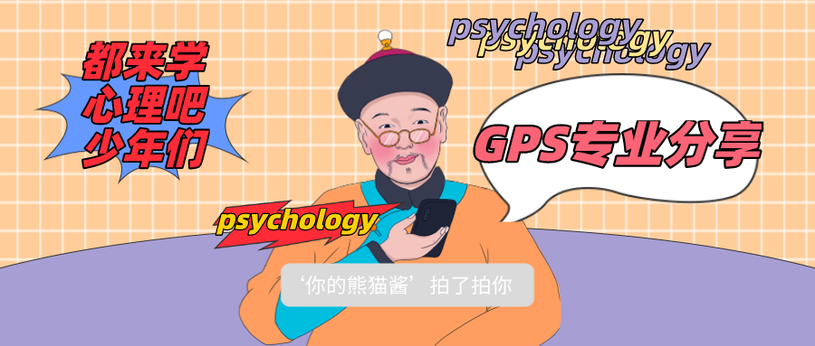

【IMAGE-002 END】

一提到心理，就想到侦探灼灼目光，专家们运筹帷幄，政客们狡猾一笑。

就好像，心理就是高情商，心理就是掌握人心。

【IMAGE-003 START】

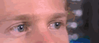

【IMAGE-003 END】

其实，心理学博大精深，涉及极其广泛，在广告、教育、经营管理等领域都有着重要影响。

分类更是五花八门：social psyc，clinical psyc，cognitive psyc，developmental psyc

等等等等，还可以分得更细，详细研究抑郁症、强迫症、精神分裂。。。。。。

情商高的人学心理可以了解人想法观念是如何形成的，通过自身的行为举止来影响对方。

情商不高的人学心理则可以了解对方的出发点，周围人有某种想法，做某件事了，可能是基于什么样的心理。

【IMAGE-004 START】

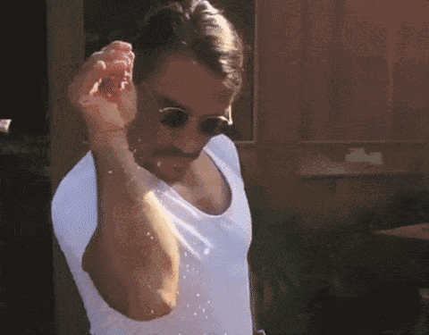

【IMAGE-004 END】

经常看到有学习经济、商科、生物、护理、社会学等专业的人minor心理，或选修心理课。

其实，无论是major任何学科，我都推荐你了解心理学，并有机会学习心理学。

它可以帮助你控制情绪，抒发愤懑，缓解焦虑等等，有利于内心世界的健康和平。

【IMAGE-005 START】

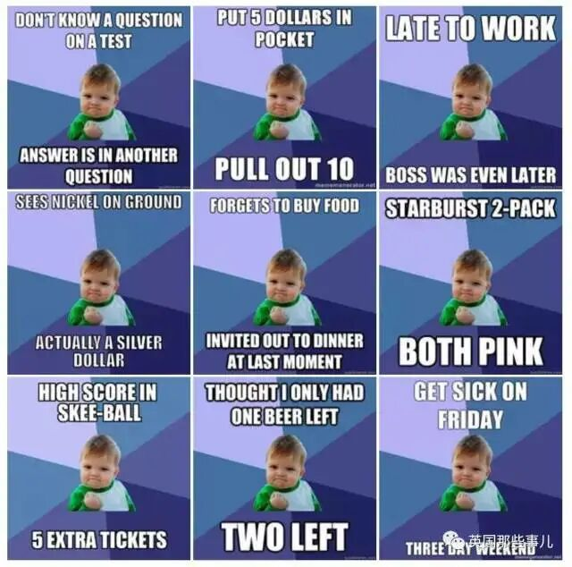

【IMAGE-005 END】

但是反过来，如果仅仅是认为电视剧里当心理咨询师很帅，犯罪心理学听起来就威风得很，想学会FBI微表情侦查，就跑来major心理的同学，其实可以再思考一下，到底要学习什么。

【IMAGE-006 START】

【IMAGE-006 END】

**MAJOR**

【IMAGE-007 START】

【IMAGE-007 END】

**MINOR**

Major

**V****S**

Minor

文学院和理学院中major和minor的要求不太一样，理学院和生物神经有更多联系，要求的学分也更多。

这些内容都在degree plan 中（google搜索Queens university degree plan），这里就不一一赘述了。

【IMAGE-008 START】

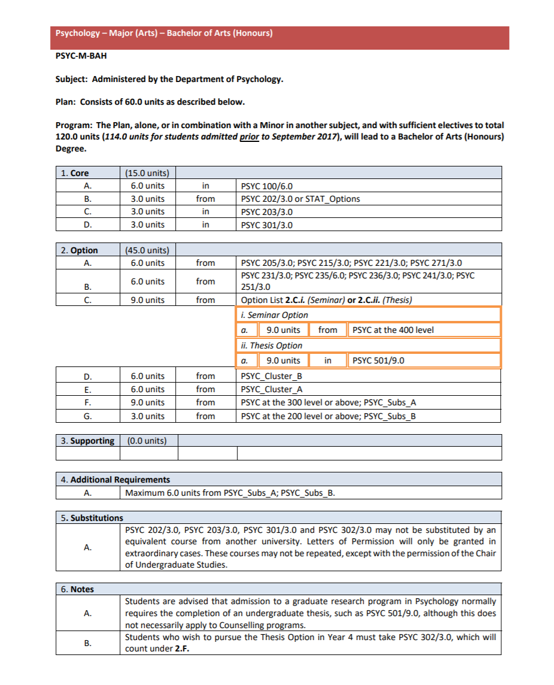

【IMAGE-008 END】

【IMAGE-009 START】

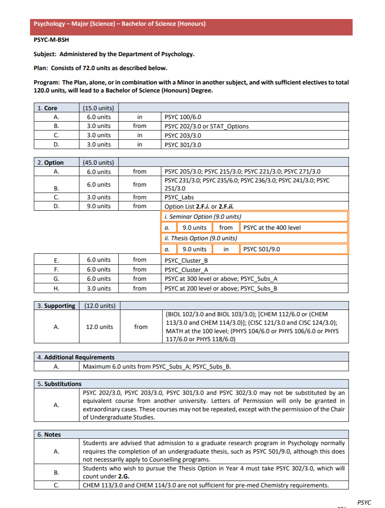

【IMAGE-009 END】

在这个标题下，我们主要聊一聊以arts心理学major为例，平时上什么课程，有哪些要求。

以我的情况为例，psyc major 和 econ minor，都需要满足学分要求才可以毕业，这些学分又分为core、option、supporting，想说的内容很多，千言万语化成一句话，看degree plan

【IMAGE-010 START】

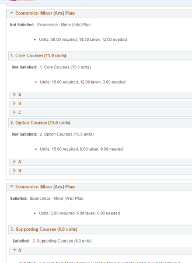

【IMAGE-010 END】

【IMAGE-011 START】

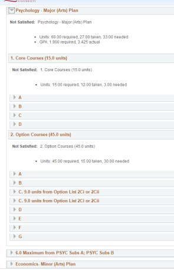

【IMAGE-011 END】

如果你已经在大一期末进入了该专业，可以从solus-my academics（页面左上角，enroll旁边）-view my advisement report得到你的详细学分情况。

【IMAGE-012 START】

【IMAGE-012 END】

courses

【IMAGE-013 START】

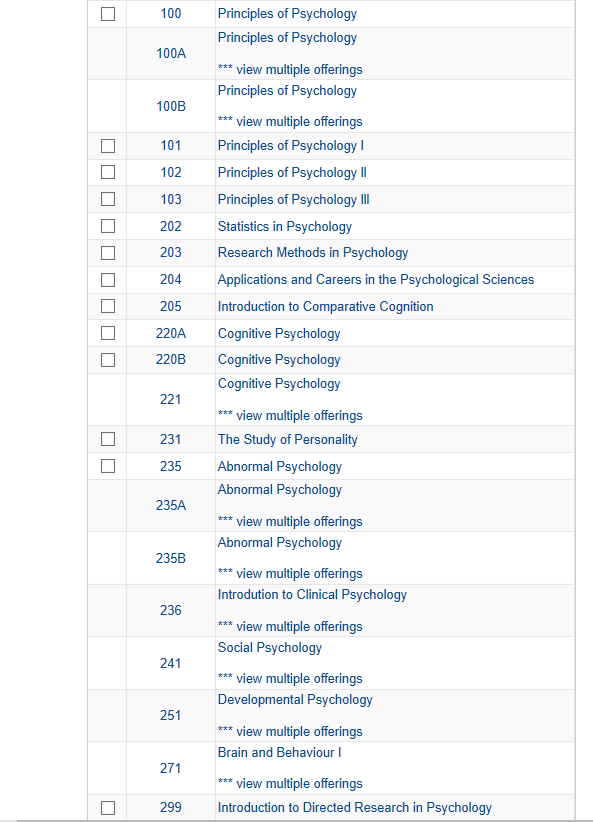

【IMAGE-013 END】

从皇后官网，进入solus系统，点击左上角search，就可以根据学期/根据专业的首字母查看课程。

以上是全部心理专业大一大二的课程。

我个人很喜欢221和251和236和241。。。。。。。

cognitive psyc，

developmental psyc，

clinical psyc，

social psyc

【IMAGE-014 START】

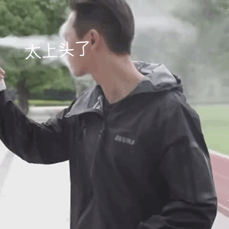

【IMAGE-014 END】

啊，好像除了203（research methods in psyc，一门必修中的必修，大二冬季上）还都挺喜欢的，每周看很多书的时候恨老师恨得牙痒痒，学完了发现上课的内容都很有意思。

大一

psyc100的规划去年和前年不一样，有改动，但是不论怎么改，想major/minor都得上，所以就不多说了。

如果大一不知道该上什么课，没排满课表，stat263是一个很好的选择，它可以替换psyc202（statistics in psyc），这样大二秋季只有两门心理，可以做一个缓冲，适应一下大量的阅读需求。

【IMAGE-015 START】

【IMAGE-015 END】

大二

大二的心理课一下子选择多了，其中有指定的课程：202（statistics in psyc）和203（research methods in psyc）

202被我用stat236顶替了。所以多说说203（research methods in psyc）

203要写两个大paper，格式什么的要求很细很严格，我写作不好很讨厌这门课，它又是core，也没办法替换成别的课，大三的core还要它的prerequisite，让我心碎让我流泪。

但是对于写作能力强的人来说，这门课很好拿分。

【IMAGE-016 START】

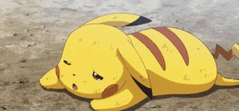

【IMAGE-016 END】

大二的课程选择主要看兴趣，因为这关乎着大三可以选择的课程。所以个人建议别把重心放到课程规划，考试形式上。

如果在兴趣方面没有太多偏向性，单论兴趣不知道该选哪一门，**271（Brain and Behaviour）会比较难一些，221（cognitive psyc）会更容易理解一些。**

比较特殊的有**251（developmental psyc）**，讲孩子发展的，上课会用到一个软件，输入你的性格等信息并挑选宝宝的人种、外表，就可以合成一个小宝宝，宝宝会长大，成长途中会经历很多事情，作为家长，你的每次决定都将影响ta未来的发展。除了宝宝丑，学习差，其他都很有趣。（就不放照片了哈）

还有**236（clinical psyc）**也挺特殊，这个门课有两场midterm和一个final（大二心理基本都是这样），但是，这三场考试都只有**选择题！！！40道！！**千万别小看这些选择题，看书、看ppt、找旧题做、背答案。这四个流程一个也别少！！！这门课的书看起来特别慢，同样的页数耗时大概是其他课书本的两到三倍。要背的内容也不少。

【IMAGE-017 START】

【IMAGE-017 END】

如果说大二的课程是在深挖大一psyc100的内容，那么大三大四的课程就是在大二的基础上继续发展。因为有很多课程有prerequisite。

在这一年，你的选择更多了，甚至可以申请交换（大二的一月开始申请），去其他地方，或者去英国校区（不会吧不会吧不会有人不知道QU有一个英国校区吧，申请简单要求低通过率高）

看到这里的朋友大多数可能是新生，了解大一大二的内容就足够了，因为到了大三，你会有很多自己个性化的发展，也会对自己的学习更加有掌控感，愿意多去找academic advisor或者多看degree plan。所以，学业方面我就不多说了。

主要强调一下学校有什么样的资源能帮到大家。

1. SASS 帮助母语非英语的同学，写paper需要帮助或者有阅读习惯方面的问题都可以去，平时快期末了还有讲座，大一我听了psyc100的复习讲座，还不错。
2. PSYC DEPARTMENT，进入专业后每周都有收到邮件讲心理部门最近邀请到哪个教授做什么主题的讲座；还有很多招聘学生给教师实验做兼职的广告。有时候还有心理部门的party，酒免费喝。
3. SWS（student wellness service）如果压力太大，可以预约心理疏导。

【IMAGE-018 START】

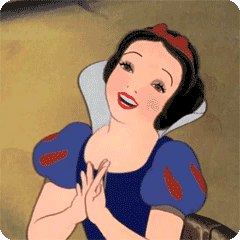

【IMAGE-018 END】

谢谢大家的耐心，关于心理，就先聊这么多。**2020年心理专业的微信群已经建好了**，会有美丽善良温柔可爱贴心聪慧的学长学姐答疑解惑，就等你来了。

【IMAGE-019 START】

【IMAGE-019 END】

**相关内容导览：**

1. [GPS课程介绍 | 选择Psyc100以前你需要知道的一些事](http://mp.weixin.qq.com/s?__biz=MzA3OTc3NDUxNg==&mid=2651192026&idx=1&sn=226bcb32e337991b0198ab889406962f&chksm=845f0c81b328859770d104ca9c7bcb48e4cf519896668172bfd41061e8440dcfb7ba9a81d64b&scene=21#wechat_redirect)
2. [GPS 干货| 海陆至尊干货汇总Part 1 学术篇](http://mp.weixin.qq.com/s?__biz=MzA3OTc3NDUxNg==&mid=2651192485&idx=2&sn=99c28a49b81c5f3081f993ef29c39bb7&chksm=845f0afeb32883e816d92ccc41b699473354f13942d9eb6c5571687971e669c6c35ca451e640&scene=21#wechat_redirect)
3. [GPS干货｜海陆至尊干货汇总Part 2 生活篇](http://mp.weixin.qq.com/s?__biz=MzA3OTc3NDUxNg==&mid=2651192909&idx=1&sn=8e94b5be8ee955f3a3f7ed01ef6c444c&chksm=845f0816b328810039e9ae134f04ff8e163bd4d3bf8d5a0126a6c2d457ff090db1f0094834f1&scene=21#wechat_redirect)

   文字 Judy

   排版 Judy

   编辑 容易

   审核 TT Chris

   ❤️❤️❤️

   【IMAGE-020 START】

   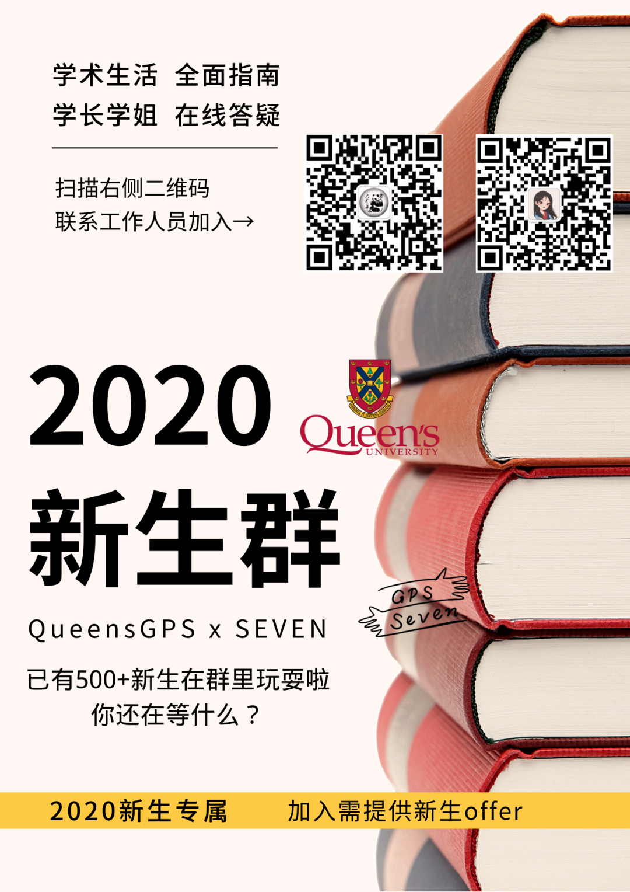

   【IMAGE-020 END】

   【IMAGE-021 START】

   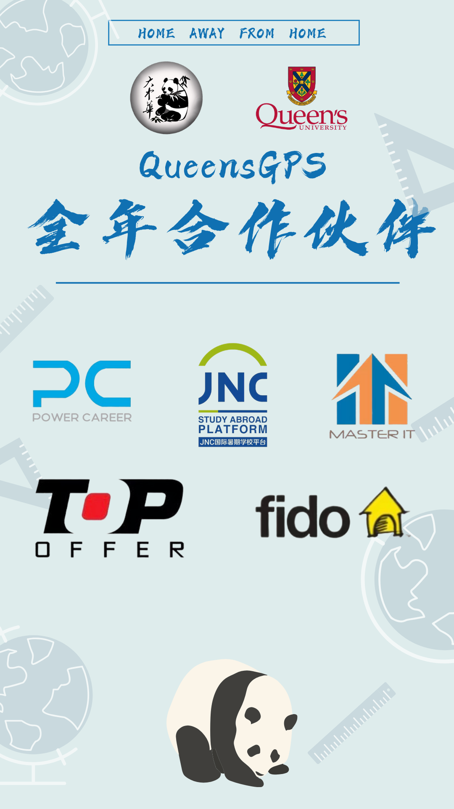

   【IMAGE-021 END】

   【IMAGE-022 START】

   

   【IMAGE-022 END】
