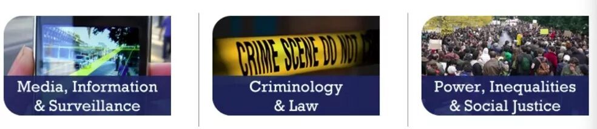
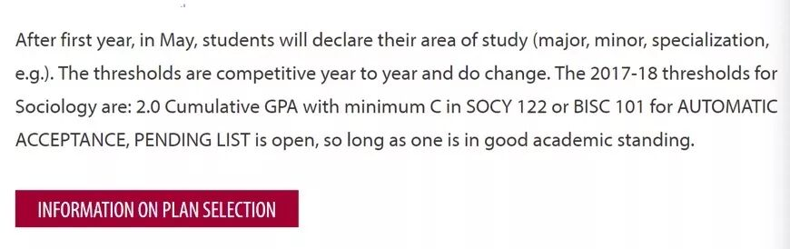
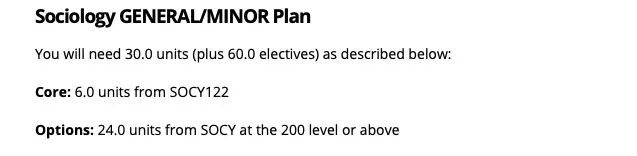
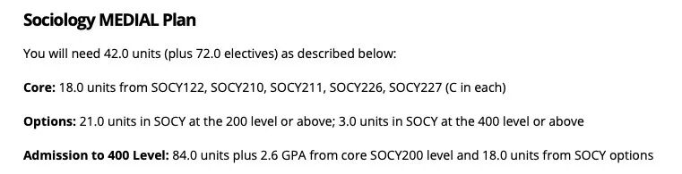
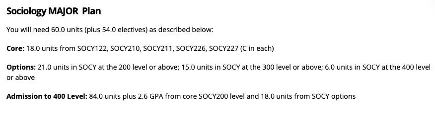
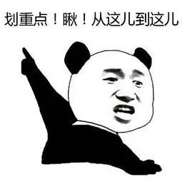
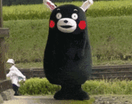

# GPS专业介绍 | 神秘的Sociology社会学

> 来源：微信公众号  
> 原链接：https://mp.weixin.qq.com/s/g90KQ0gi0rq_SWiOjqMm4A  
> 状态：自动搬运，暂未分类  
> 图片数量：13  
> OCR 图片文字数量：0

---

## 人工整理说明

本文件保留了公众号文章中的所有图片，没有自动删除装饰图。  
每张图片都用 `IMAGE-编号` 标记，方便后期人工检索、删除或补充说明。  
如果图片下方出现 OCR 文字，说明脚本尝试识别了图片中的文字，但需要人工检查准确性。  
OCR 文字只是辅助，不代表一定需要保留到最终正文。

---

【IMAGE-001 START】

【IMAGE-001 END】

当大家第一次接触到sociology，或者遇到学sociology的同学的时候可能会想，这人咋学个这么个学科？ 

确实，在大部分留学生都在学cs，econ，engineer的时候，可能sociology并不是一个待选项。 

大部分的人可能会觉得sociology不就是什么在国内学的马克思恩格斯巴拉巴拉巴拉主义吗？ 无聊死了！

但其实，我们Queen’s的socy可不仅仅只是如此，下面就一起揭开SOCY神秘的面纱吧。

【IMAGE-002 START】

【IMAGE-002 END】

**啥是SOCY？**

SOCY是一门复杂又有趣的学科，她不仅仅是要去研究不同的社会理论，看很多很多很多很多的书，同时也在默默中教会大家一种思考方式，一种跳出自己所处的环境，客观的分析日常身边和社会现象的能力。

一入SOCY深似海，从大一之后的课程中不仅仅要学习不同的基础理论，还会学习到包括Psychology; Surveillance; Gender; Criminal Justice等等一系列的领域。所以说SOCY只学什么马克思恩格斯Durkheim理论的锅我们可不背。

【IMAGE-003 START】

【IMAGE-003 END】

**Requirement？**

SOCY department进入专业的requirement相对于Queen’s其他的department简单一些。

根据2017-2018的标准而言，大一的课程综合达到2.0的GPA，并且SOCY122或者BISC101最低达到c就可以满足大二进入专业。

【IMAGE-004 START】

【IMAGE-004 END】

**Degree Plan**

SOCY就像其他的art&science department一样，也提供三种不同的degree plan，分别是General/minor; Medial plan；Major。 具体要求请看下图以及官方网站。

【IMAGE-005 START】

【IMAGE-005 END】

【IMAGE-006 START】

【IMAGE-006 END】

【IMAGE-007 START】

【IMAGE-007 END】

此处为官网链接：

https://www.queensu.ca/sociology/undergraduate-program/requirements

**SOCY courses**

SOCY的必修课主要是:

-  SOCY122（introduction to sociology）

-  210 (Social Research Method)

-  211 (Social Statistics)

-  226 (Central Concept in Sociology Theory)

-  227 (Theorizing contemporary Society)

其中4门200level的课程再加上18个unit（6门）sociology的elective course需要最少拿到2.6的GPA 才能够在大三学期末申请大四的专业课。 **（划重点！）**

【IMAGE-008 START】

【IMAGE-008 END】

**选修推荐！**

**SOCY 273**

**Social Psychology**

这门课对于那些对于社会心理学感兴趣的同学可以考虑上这门课，课程基本上cover了大部分的社会心理理论，以及关于self, identity, attraction, deviance等等一系列的课题。曾几何时，这门课水到不能再水，但是去年开始就换了教授，所以难度上会有很大的提升。

**SOCY 284**

**Sociology of information and communication technology**

这门课强烈推荐，TA和教授都超级无敌棒。课堂内容会包括像AI；社会理论对当代科技的互相影响等等，而且grade distribution也很棒，只要按时上课，按时完成作业就会是个easy b+ ~a。

**Socy 363**

**Science, Technology& Society**

和284是一个教授，相似的课程内容，在284的基础上深挖，也是只要好好学习天天向上，就easy b+以上。

详情参考：

（https://www.queensu.ca/sociology/sites/webpublish.queensu.ca.doswww/files/files/SOCY363F2018.pdf）

**Socy 300&309**

这两门课的prof David Murakami Wood是我在Queens见过的最牛\*\*\*\*的sociology prof （不接受反驳），主要研究social surveillance相关的课题，Canada Research Chair (Tier II) in Surveillance Studies，他也是Queen’s surveillance center的一员。 可惜他明年要去日本交流一年（哭），所以以后的同学们等他回来可以考虑上他的课。

**Socy304**

**surveillance & empire**

详情参考：

https://www.queensu.ca/sociology/sites/webpublish.queensu.ca.doswww/files/files/SOCY%20304%20Syllabus%20W2019.pdf

最后，

SOCY大部分的作业

都是要求大量的reading还有paper来完成的，

与其他的课程比较,

TA或者prof评分可能不会像数学啊理科那些

对就是对错就是错的评分标准，

考察的更多的是你对於内容的理解和研究，

所以对于socy感兴趣的朋友们快来吧！！！

【IMAGE-009 START】

【IMAGE-009 END】

文字 / Archie

排版 / Lexi

编辑 / Lucas TT

校对 / Kedi Bill

【IMAGE-010 START】

【IMAGE-010 END】

【IMAGE-011 START】

【IMAGE-011 END】

【IMAGE-012 START】

【IMAGE-012 END】

❤️ ❤️ ❤️

【IMAGE-013 START】

【IMAGE-013 END】
