# 【课程揭秘】皇后的戏精都去了哪里？戏剧学院里面到底在学些什么？

> 来源：微信公众号  
> 原链接：https://mp.weixin.qq.com/s/RNK3q11sqZgc63Il1BeDwQ  
> 状态：自动搬运，暂未分类  
> 图片数量：17  
> OCR 图片文字数量：0

---

## 人工整理说明

本文件保留了公众号文章中的所有图片，没有自动删除装饰图。  
每张图片都用 `IMAGE-编号` 标记，方便后期人工检索、删除或补充说明。  
如果图片下方出现 OCR 文字，说明脚本尝试识别了图片中的文字，但需要人工检查准确性。  
OCR 文字只是辅助，不代表一定需要保留到最终正文。

---

I regard the theatre as the greatest of all art forms, the most immediate way in which a human being can share with another the sense of what it is to be a human being.

——Oscar Wilde

【IMAGE-001 START】

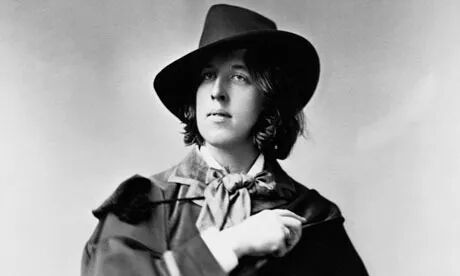

【IMAGE-001 END】

任何Drama 100的同学都会很熟悉上面的那句话：

*“我认为戏剧是最伟大的艺术形式，*

*它是一个人能够与别人分享关于人之为人感受的*

*最直接的方式。”*

这是来自爱尔兰文学家王尔德对戏剧的看法

每年的Drama 100第一节课上

教授都会骄傲地把这句话告诉我们

今天这个推文，

就将为大家揭秘皇后最戏精的专业

Drama！

【IMAGE-002 START】

【IMAGE-002 END】

**Queen's Dan School of**

**Drama & Music**

学院里有三大部门

【IMAGE-003 START】

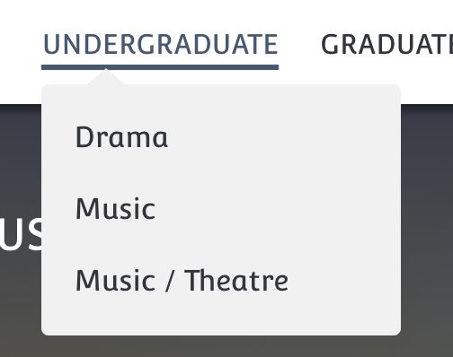

【IMAGE-003 END】

很好理解嘛

Music 和 Theatre 的组合

就是音乐剧

三个Program

今天我们要讲的就是Drama Department！

【IMAGE-004 START】

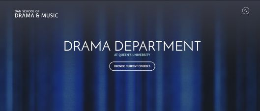

【IMAGE-004 END】

今天就是课程简介！

【IMAGE-005 START】

【IMAGE-005 END】

**课程尝鲜**

【IMAGE-006 START】

【IMAGE-006 END】

**戏剧入门**

DRAM 100

【IMAGE-007 START】

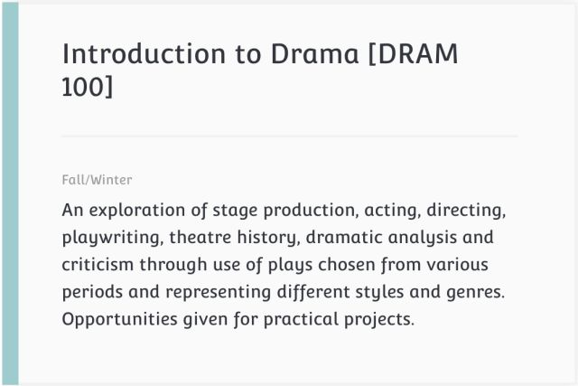

【IMAGE-007 END】

这是Drama给大一的同学们准备的课，

内容更多是对所有戏剧内容的大致探索。

分享给你戏剧欣赏的经验，

告诉你戏剧发展的基本历史，

和你分享一出舞台剧是经过怎样的过程产生的，

编剧的任务、导演的任务、Dramaturge的任务

演员的任务，他们到底在做什么

还告诉了你戏剧和其他艺术的不同。

为什么要坚守戏剧，

为什么它拥有无穷的魅力以至于

几千年来，戏剧依然是一门高雅美好的艺术。

它的欣赏门槛究竟存不存在，

它在未来是否会被淘汰。

在这门课里，你会受到启迪，对舞台艺术，

对人与人交流的方式，对艺术的存在形式：

戏剧，是美，是短暂的永恒。

这是一门整整一个学年的课程，

分为DRAM 100A和DRAM 100B。

只有该科成绩达到 B 及以上你才能Major Drama

**课程鲜度：☆☆☆☆**

1、课程要求读7-8本剧本和若干材料；

2、上下学期分别要完成两份大的Essay，上学期是Dramaturgy的，下学期关于Scenography的；

3、下学期的DRAM 100 Lab会要求出一部短剧，灯光服装声音，编剧导演演员，每个职位你都有机会初次尝试！

4、这也是很多其他专业的同学凑选修学分的课！

【IMAGE-008 START】

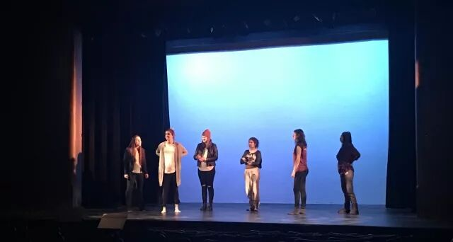

【IMAGE-008 END】

Lab Presentation 之前的对光现场

**表演**

DRAM 237

【IMAGE-009 START】

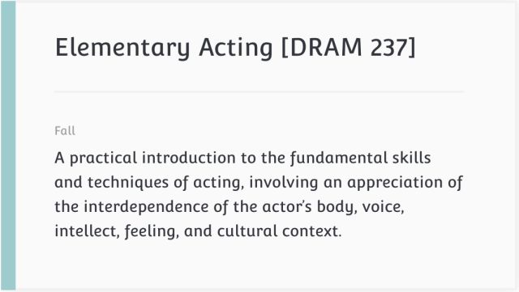

【IMAGE-009 END】

专业里最基础的表演课！

从学会呼吸，学会放松肢体，感受你的身体开始

慢慢再教你如何感受，如何理解台词。

教授Greg还会带你塑造一个人物，从无到有

你会想象那个人物的前半生，他所经历的一切

他的样子，他的声音，他的姿态、神态、习惯

没有表演是超越人物的，

当你表现另一个人物的时候，你必须依靠你的身体

如何更好更灵活运用你的身体，

将会是这门课带你探索的目标。

**课程鲜度：☆☆☆☆☆**

1、课程很轻松！只要用心完成每一次作业，拿A不再是梦想！

2、有很多训练给你自由发挥的空间，你完全可以打开戏精模式，大开脑洞！

3、这是一学期（秋季冬季名字不一样）的课程，大内容包括“一个人物的塑造”和“一个场景的展现”。

4、要求看剧院的指定剧目演出，并且以此来完成一份essay。

【IMAGE-010 START】

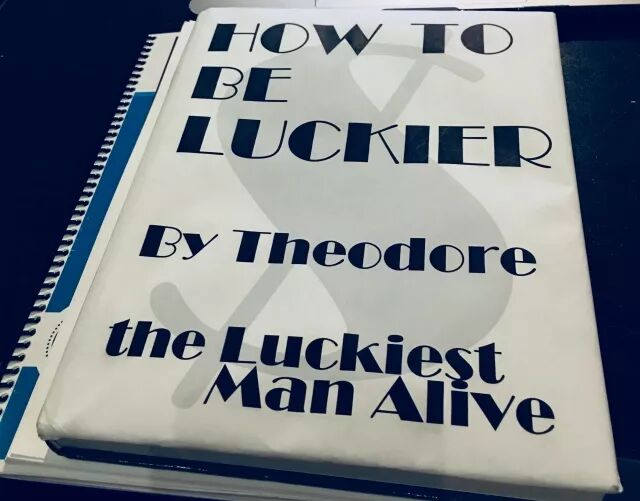

【IMAGE-010 END】

小编最后一次汇报演出时的道具

**剧作分析**

DRAM 220

【IMAGE-011 START】

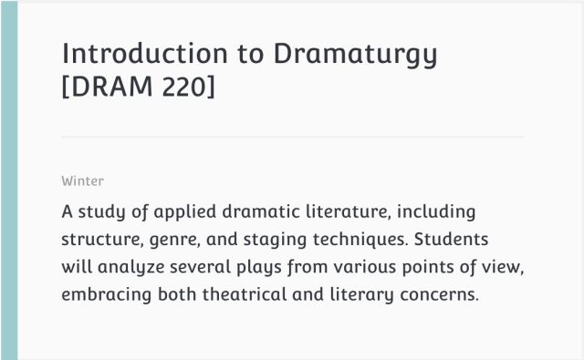

【IMAGE-011 END】

这是一门非常有意思的课！

Dramaturgy是一项技能，可以说

在一出剧目的准备过程中，

没有一个职位是不需要这项技能的。

中文翻译为：“拟剧论”或者是“编剧法”

其实简单来说就像是，对剧作的“阅读理解”。

不仅仅是细到一句台词的背后的潜台词，

或者是大到整个剧本的创作年代和历史背景；

可以具体到一个动作的含义，

也可以抽象到剧本中关于哲学的元素。

只有通过完整有效的剧作分析，

你在完成戏剧任务的时候才能不背离剧本，

才能抓住核心。

实用，并且有趣。

*小故事：*

有一天，一对情侣在课上直接吵起来了，

他们先后吵着离开了教室，

连教授Jenn都站在一旁不敢说话。

大家都惊呆了！

直到后来才知道，这是Jenn故意安排的！

为了让我们明白：

戏剧现实和现实的界限是模棱两可的。

当场就有学生表示差点被吓出心脏病！LOL

**课程鲜度：☆☆☆☆**

1、课程要求读10+的剧本；

2、基本上每周都有assignment，字数300到1500不等；

3、如果你不读剧本就去上课，当教授拿那些必读剧本举例子的时候你就会一脸懵逼！

【IMAGE-012 START】

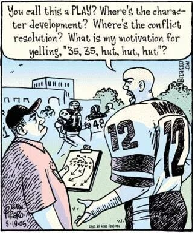

【IMAGE-012 END】

一幅尝试解释Dramaturgy作用的漫画

**编剧**

DRAM 251

【IMAGE-013 START】

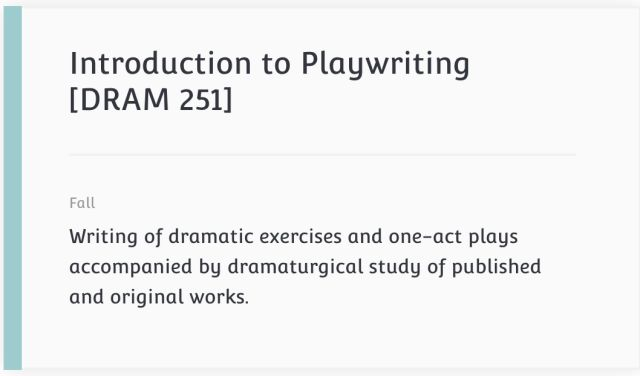

【IMAGE-013 END】

皇后drama，

eat and chat的代表。

教会你现如今流行并且非常实用的编剧方法，

有非常大量的presentation，

与别人分享自己的编剧故事。

每学期会要求出一部30到50页的剧本。

教授John对第一语言不是英语的同学很好，

会主动提出修改语法错误，

他还不止一次说，没什么好shy的，

毕竟他一点Mandarin都不会。

**课程鲜度：☆☆☆**

1、整个学期的目标一致；

2、每隔几周都有assignment或者exercise，都是非常有趣的编剧小任务！

3、没有onQ page！千万别忘了查邮件！

**舞台技术**

DRAM 240

【IMAGE-014 START】

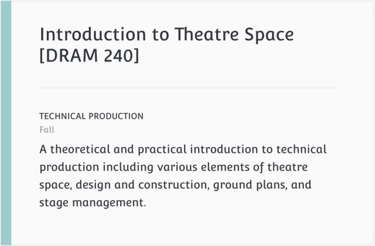

【IMAGE-014 END】

*舞台技术给给了梦境实现的可能性。*

这是一门偏实践类的课程：

Adair Redish作为这类实践课的领头者

会带领着大家走进剧院，

体验灯光、声音、舞台布置 服装等

给戏剧带来的影响。

在了解的同时，

也会给你剧本让你设计舞台，

你需要以此画出设计草图

除了这些他还会教你如何做一个stage manager

也给喜欢design的同学们的一个平台

**课程鲜度：☆☆☆☆**

1、一学期一共3-4个assignments 没有test midterm 或者 final

【IMAGE-015 START】

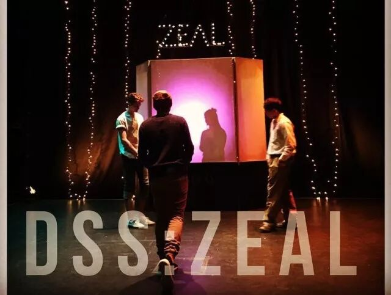

【IMAGE-015 END】

DSS 冬季话剧 Zeal，Isable Studio

还有非常有趣的暑期课程：Dram 271 & 273

中世纪戏剧文学和表演！就在英国的Queen‘s城堡！

【IMAGE-016 START】

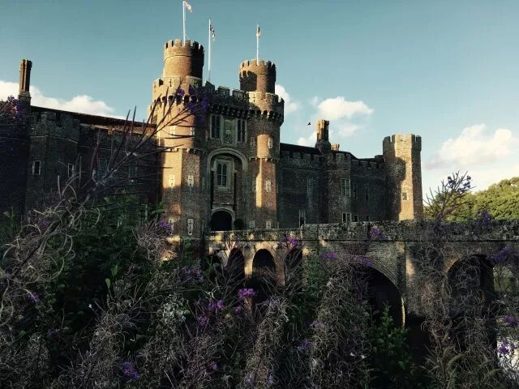

【IMAGE-016 END】

英语和历史专业的同学

都能从这个戏剧课程中拿到学分！

详细信息欢迎点击 阅读原文 了解！

Queen's Drama一直在努力为校园提供

丰富有趣的剧目

来为大家的课余生活带来别样的色彩！

戏精的存在就是为了让大家能够拥有精彩的每一天！

今天的课程介绍就到这里，

但是关于戏剧学院的秘密可多得是！

我们还会在接下来的几周推出更多专业相关的推文，

敬请大家关注！

文字 /  王子翊

感谢 / 万美杉

编辑 / 王子翊

校对 / 王子奇、楚晗

全年赞助 / Tian Bao Travel

【IMAGE-017 START】

【IMAGE-017 END】
