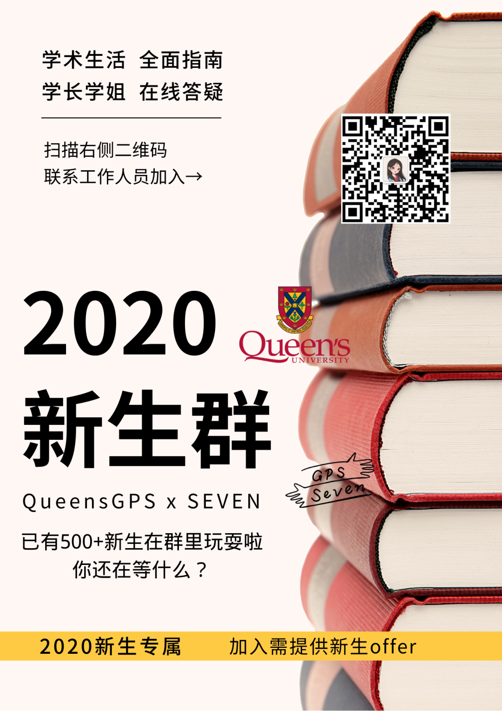
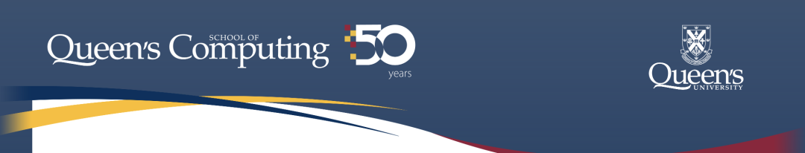
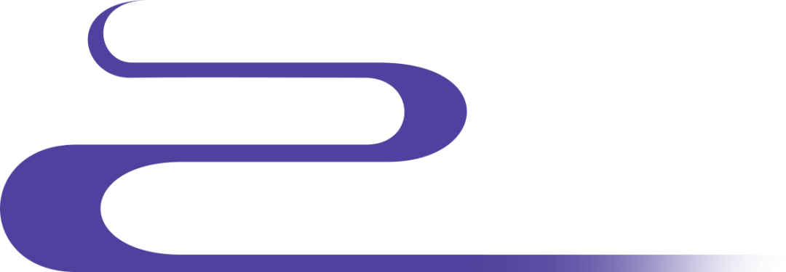

# GPS专业介绍｜你的Computing“秃然”出现

> 来源：微信公众号  
> 原链接：https://mp.weixin.qq.com/s/n9PhDhXPYfQN5aq7II5QHQ  
> 状态：自动搬运，暂未分类  
> 图片数量：13  
> OCR 图片文字数量：0

---

## 人工整理说明

本文件保留了公众号文章中的所有图片，没有自动删除装饰图。  
每张图片都用 `IMAGE-编号` 标记，方便后期人工检索、删除或补充说明。  
如果图片下方出现 OCR 文字，说明脚本尝试识别了图片中的文字，但需要人工检查准确性。  
OCR 文字只是辅助，不代表一定需要保留到最终正文。

---

【IMAGE-001 START】

【IMAGE-001 END】

【IMAGE-002 START】

【IMAGE-002 END】

【IMAGE-003 START】

【IMAGE-003 END】

“Queen's School of Computing 成立于1969年，经过几十年的发展已成为了该领域的领先机构之一，尤其是在软件设计、工程以及生物医学计算领域。

学院积极从事广泛主题的研究，并拥有杰出的研究记录。研究领域包括：信息系统，人机学习，软件工程，算法设计与分析，计算语言学，理论计算机科学，计算几何与图论，生物医学计算，感知与机器人技术，人工智能，并行系统和编程语言以及系统。”

-- 源于 School of Computing 官网

【IMAGE-004 START】

【IMAGE-004 END】

***背景简介***

***why computing？***

“Hello World！”

这一定是你在新学习一门计算机语言时打出的第一句话，像新生儿第一次向这个世界问好。从初生到发展成为如今的互联网IT世界再到未来的新新科技，计算机的发展给了我们无限可能，其成果更是充斥着我们的方方面面。还记得有次专业宣讲，一位教授说“computing is the future of medicine”，这些都说明着计算机已是人类生活重要的一环，并且正在成为不可或缺的一环。

对于渴望迈入CS大门的你，这个专业可能枯燥，可能复杂难懂，但也会在每一个程序运行成功后感到莫大的成就感，从Queen’s开始的旅程你准备好了吗？

***学位选择***

***degree plans***

所有大一ArtSci的学生在第一年并不算是真正的在各专业学习，需要在大一结束后的五六月份左右选择自己想要进入的专业。Computing也属于文理学院的范畴，同样需要在大一完成必修课并达到要求的分数后才算是真正的进入了这个专业。

**Requirements**

Automatic Acceptance - GPA不低于2.6，CISC12# 成绩不低于B

Pending List - GPA不低于2.3，\*\*CISC12# 成绩不低于B-

\*\* CISC12#：CISC121 或者 CISC124

**Computing Majors**

可以选择另一专业作为minor辅修

Fundamental Computation

Data Analytics

Artificial Intelligence

Game Development

Biomedical Computation

**Specializations**

不能选择minor辅修

Computer Science（CSCI）

Software Design（SODE）

Cognitive Science（COGS）

Biomedical Computing（BMCO）

Computing and Mathematics（COMA）

 - 没有Automatic Acceptance，需要计算机系和数学系共同审核后决定录取

Computing and the Creative Arts（COCA）

 - 没有Automatic Acceptance，需要计算机系和电影/音乐/戏剧/美术系共同审核后决定录取

***大一课程介绍***

***courses information***

下面给大家介绍一下想要进入computing专业在第一年的必修/选修课！

CISC 101（选修）

Elements of Computing Science

【IMAGE-005 START】

【IMAGE-005 END】

如果你之前没有编程基础，那么建议最好从这门课开始上起。这门课使用Python语言，从最基本的算法、变量等基础知识带你打开编程的大门。

课程整体安排其实不算很难，但对于第一次接触编程的小白来说，有时候还是会觉得有点难以应付（尤其是当你的教授只是把online教材上的内容写在ppt上并且读一遍的时候...)。但只要跟上学习进度并确保掌握所学习的内容，是没有什么问题的！

    内容（2019 Fall 供参考）：

- Midterm Test & Final Exam；

- 一周一次编程作业（小的exercise和大的assignment交替安排）；

- 没有实体课本，需要购买online的教材，并根据授课进程完成上面的练习。

（注意这个练习一定要全部完成才能拿到占比5%的相应分数哦～不难的，就是有点多...）

CISC 121（必修）

Introduction to Computing Science I

【IMAGE-006 START】

【IMAGE-006 END】

大一的必修课之一，这门课会快速介绍Python这门语言（算是对CISC101内容的一个复习，但节奏会快很多），然后主要针对基础的算法和数据结构进行学习。

有些assignment真的有点点复杂，综合性还是比较强的，需要认真思考。多练习，对所学越熟悉，考试会越顺畅（我会告诉你，midterm时候好多人，对就是我，是因为没做完题而没有考好的嘛）。

    内容（2020 Winter 供参考）：

- Midterm Test & Final Exam；

- 两周一due的assignment（都是根据学习进度对知识进行阶段性考察）；

- 一个全是选择的小quiz，主要是考察computational complexity的相关知识。

（看着简单，想拿高分还是不容易的...)

CISC 124（必修）

Introduction to Computing Science II

【IMAGE-007 START】

【IMAGE-007 END】

大一的必修课之二，也是很多大二大三课程的prerequisite，这门课你将学习Java这门语言。"主要内容是面向对象编程，其中会涉及到接口（interface）、封装（encapsulation）、继承（inheritance）、抽象类（abstract class）、异常处理（exception handling）等在面向对象编程中常见的元素，都是在未来会常常用到的理论知识"。

如果大一没来得及修这门课，可以放在暑假上，这样大二开始就可以继续上别的课啦！

（以上部分文字源于知乎账号：女王大学秘报）

CISC 102

Discrete Mathematics for Computing I

【IMAGE-008 START】

【IMAGE-008 END】

注意：COCA方向，数学相关课程只需要CISC102和MATH110二选一即可

如果你选择上MATH111/112，这门CISC102是必修；如果你选择上MATH110，那么这门课就是选修。这虽然是一门CISC开头的课，但它其实是一门纯数学课，涉及到集合、概率、逻辑命题等等。

这门课真的算简单！作为选修也是很好的选择，教授也很nice（期末考试前的office hour，本来是提问时间，硬是给上成了一堂8人小班课）！但千万不要因为简单放松警惕随意对待，想拿高分也不容易的！

    内容（2019 Fall 供参考）：

 - 三次quiz（自主选择参加，最好都参加）；

 - Final Exam（教授会根据三种不同占比的计分方式取最高的成绩作为你最后的成绩）；

 - 平时作业不记分

（但请自觉完成好吗！因为随堂测验真的出过作业原题！）

MATH 110/111/112（必修）

Linear Algebra

【IMAGE-009 START】

【IMAGE-009 END】

大一的必修课之三，学CS，数学是逃不掉的，线代更是必不可少的！其中112是学期制课程，其余110和111则是年课。难度上来说，111比110简单些，因此若是以后方向选择向往COMA的同学，建议最好选择MATH110更利于日后的学习。

111这门课一定程度上要看教授的出题风格（上下学期教授不一样），但基本来说只要认真完成平时作业并且充分理解课上的例题，问题不大！（据说111的教授Petter是教线代教的最好的，这个教授真的讲得很细致，课上会给你充分思考和理解的时间，所以一节课可能就讲两道例题...)。

    内容（MATH111 供参考）：

 - 两学期分别计分，最后成绩取平均值；

 - 每学期Midterm Test & Final Exam；

 - 每学期五次作业（都算分）；

 - 每周有固定tutorial作为答疑时间，并不是强制参加的课程。

MATH 120/121/123/124（必修）

Calculus

【IMAGE-010 START】

【IMAGE-010 END】

注意：COCA方向，这门课程为选修

大一的选修课之四，其中120/121为年课，123/124为学期课，但是因为大部分计算机专业需要至少6个微积分学分，因此选择这两门课程和选择年课并没有什么区别。同样，121比120简单些，因此若是以后方向选择向往COMA的同学，建议最好选择MATH120更利于日后的学习。

121这门课不算很难，尤其上学期的内容基本是加拿大高中grade12 calculus学过的内容。并且网上的录播课程可以反复观看，根据自己的节奏来安排学习。

注意：考试只能使用Casio fx-991系列的计算器！

    内容（MATH121 供参考）：

 - 两学期分别计分，最后成绩取平均值；

 - 所有的授课内容均采用网上录播的形式，外加每周两次次课堂：一节讲题，一节算预习；

 - 每学期三次term test，取成绩最好两次计算；

 - 每周一个online quiz（本周知识预览）；

 - 每周一个online webwork（本周知识考察）；

 - Final Exam；

 - 隔周一次tutorial小组形式做题（算参与分）。

总体来说，computing专业大一的必修课不算多，有多余的时间来选择自己想上的选修课程。大二大三的课程可能会根据不同专业方向略有差别，但该有的必修还是一个都不会少。希望这篇推文能对大家有所帮助，期待一起来感受编程的魅力！

【IMAGE-011 START】

【IMAGE-011 END】

/\* Welcome to join us！\*/

Class of 11111101000

文字 / Alisa

排版 / Alisa

编辑 / 容易

审核 / Chris TT

【IMAGE-012 START】

【IMAGE-012 END】

【IMAGE-013 START】

【IMAGE-013 END】
