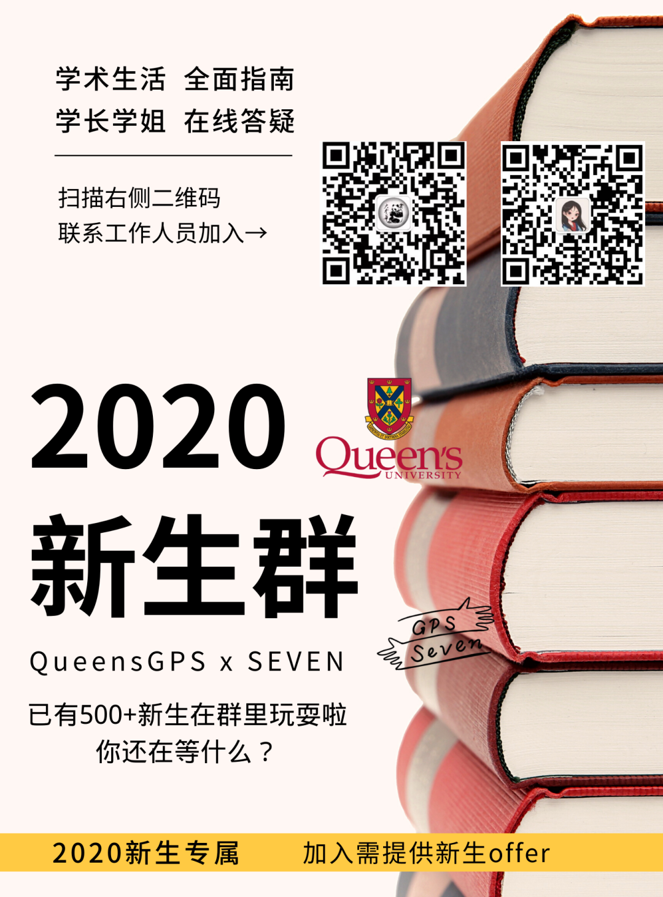
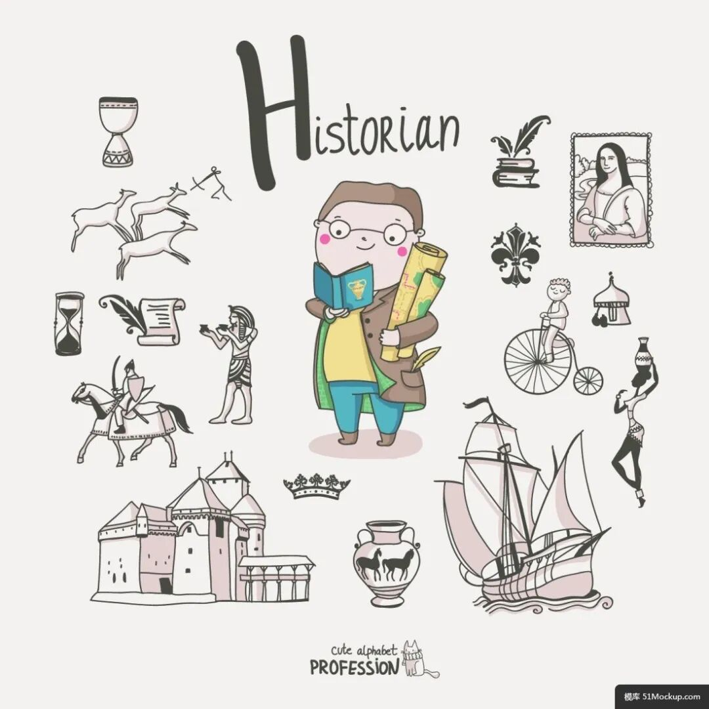
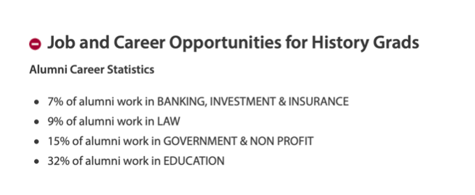
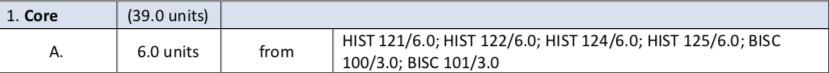
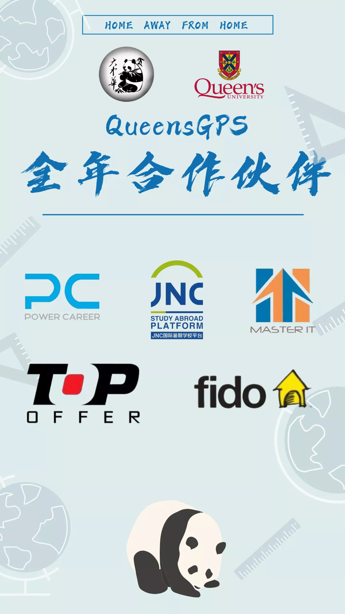

# GPS 专业介绍 | Queen’s的小众专业—History

> 来源：微信公众号  
> 原链接：https://mp.weixin.qq.com/s/QelPXbSOQXkD1zkN-r7l_w  
> 状态：自动搬运，暂未分类  
> 图片数量：8  
> OCR 图片文字数量：0

---

## 人工整理说明

本文件保留了公众号文章中的所有图片，没有自动删除装饰图。  
每张图片都用 `IMAGE-编号` 标记，方便后期人工检索、删除或补充说明。  
如果图片下方出现 OCR 文字，说明脚本尝试识别了图片中的文字，但需要人工检查准确性。  
OCR 文字只是辅助，不代表一定需要保留到最终正文。

---

【IMAGE-001 START】

【IMAGE-001 END】

“历史系在Queen’s究竟有多小众？我认识的学历史的中国学生不到十个。”

                                            ---作者书

历史系概况

历史不仅仅是站在客观角度了解过去并将事件记录下来，更多的是从先辈的经历中总结得失，或是以史为鉴、警示后人，也可能是针对以前的事件进行批判。

历史其实**综合性很强**，因为它可以和各个学科联系起来，例如经济史、数学史、人类史等，更为重要的是，**在历史研究中穿插着大量的research、description和critical analysis**，因此每次**写essay的时候都是对自己各种技能的大考验**。

把essay写出来我觉得不算最难，**最难的是essay的深度**，**以及你自己的想法**，有的时候站在多角度看问题，并且在不同角度之间展开辩论会给人眼前一亮的感觉，从而帮助自己拿到满意的分数。

【IMAGE-002 START】

【IMAGE-002 END】

**历史（或者整个文科）最令人头痛的，我觉得是各种reading。**动辄十几二十页，多的可以五十页往上，文章里的各种专有词生僻词可以让你抓狂，可能读了好几页还是脑袋空空，因此**历史对于阅读技能的要求还是挺高**。不看肯定不行，因为到了Seminar，你就会发现别人讨论得热火朝天，而你却满脸问号。

**不过历史的很多reading不枯燥并且很有趣**，例如122读的一篇关于海地革命与北美和欧洲的关联，并且里面很多的观点可以拿来作为知识积累，这些东西用到essay和final上会很出彩。

**历史对于语言的要求也不会很低，比如各种事件名称的记忆。**我就是事件名称中文记得清楚，英文一脸懵。这样其实很吃亏，**建议大家平时尽量记事件的英文名，而不是第一反应是中文**，**这样final可能就会出现 “提笔忘字” 的情况**：这个事件我知道中文但我不知道英文！

**Queen’s的历史课程其实很多元化**，到了200 Level基本上各个方面都会有涉猎，比如中国近代史（299：China Since 1880），女性历史（254: Women and Gender in 20th Century Canada）、冷战时期（211: The Cold War）等。

大家完全可以根据自己的兴趣选择喜欢的课程。至于毕业之后，其实很多人会**去从事教育、非营利组织以及法律相关的**职业，**所以历史学的就业路径虽然不如理工科专业那么多样，但也不算单一。**

【IMAGE-003 START】

【IMAGE-003 END】

如何进入历史系（Major）

进入历史系其实不难，**需要一门100 Level的必修课程达到C及以上**，**并且总GPA在2.3以上即可被自动录取**，如果有一项**没有满足将会被放到pending list**，会由历史系**根据录取人数来选择录取或否**。

（今年因为疫情录取计划有较大变化，但是每年的录取要求都有细微变动，建议可以在历史系网站查询）。100 Level的课程选项在degree plan中可以查到，如下图：

【IMAGE-004 START】

【IMAGE-004 END】

注意：BISC为Queen’s 英国校区的课程，因为没上过，所以这里只介绍Kingston校区的课程。

由上面的表格可以看到，如果**想进入历史系，可以选择HIST-121、HIST-122、HIST-124、HIST-125中的任意一门课程作为Core。**以上四门课都是年课，只要达到了前文提到的要求即可进入历史系（当然也可以上BISC 100和BISC 101，两个半年课）。

大一必修课程介绍（HIST-122）

**我上的是HIST-122，而且122是大一历史必修课里相对而言比较简单的**，所以接下来会介绍**HIST-122：Making of Modern World（现代世界的形成）**，由两部分组成：**Lecture和Seminar**。

**01**

**Lecture**

**122的主要目的就是为了帮助大家对于世界历史有一个基本的轮廓**，因此，122中会有一些中国同学很熟悉的内容，比如丝绸之路、郑和下西洋、鸦片战争、抗日战争、大跃进运动等。**122难度不算很大，但是这门课知识点比较多并且这门课的时间跨度很大，会从刚开始的美索不达米亚文明一直讲到现代。**

**一节Lecture的时间是90分钟，每周一次**。19年的122 Lecture是两个教授授课。

第一学期是Aditi教授负责（为Aditi教授疯狂打call！人很好、回邮件很快！），**上课会有南亚口音**、但是**她会把课程中的重点难点放到她的PPT中**，PPT在每个Lecture之前放在OnQ上。

**第一学期会从美索不达米亚文明讲到大革命**（法国、美国和海地），会由**一个short quiz（10%）、一篇essay（10%）和一个Mid-term test（20%）**组成。

第二学期是McQuade教授负责（多大博士，人也不错，但是每节Lecture要记attendance，知识点喜欢口述而不是写在PPT上，office hour每周只有一天两个小时）。第二学期的分数构成略有不同，会**由一个essay proposal（5%）、一篇essay（15%）和一个final组成（20%）**。在122中，Lecture和**Seminar的表现也会计入总分（包括出勤和参与讨论的积极性），各占5%。**

值得一提的是，无论是第一学期还是第二学期，在期末考试之前，**教授都会在上传一个study guide到OnQ，考试的题目也只会从guide里面出**，所以大家一定要**在考试之前准备一下guide中对应题目的论述思路**。**期末考试没有选择题，全部是论述题，考试时长三小时。****三小时内写两个long answer和两个short answer**，手写断，所以一定要提前理清思路！

**02**

**Seminar**

**Seminar主要针对Lecture的内容进行答疑，也会对每周布置下来的reading进行讨论。**

**Seminar有个好TA非常非常非常重要！！！**所有作业的评分都掌握在TA的手上，包括期末考试的评分，也是TA直接负责。好的TA是心动的感觉，不好的TA就是心绞痛的感觉。TA怎么样其实也看运气，我122的TA人很好，给分很公正并且在讨论的时候会照顾到Seminar的每一个人。

【IMAGE-005 START】

【IMAGE-005 END】

**Seminar每周一节，一节90分钟**。在90分钟里，对于布置的reading讨论占大头，**建议大家在Seminar之前一定要看reading**。**如果时间不够就看introduction、summary和conclusion，**把文章的大体内容搞清楚，这样在讨论reading的时候就不会一脸懵。

**Reading里面很多的内容可以用在你的essay和final里面，会很加分！**Seminar同样会**针对教授布置下来的作业进行更详细的说明**，所以有不懂的一定要去问TA，避免因理解有偏差而影响作业的分数（我POLS-110论文血的教训）。

每个TA都会有office hour，如果对于Lecture、essay和final不明白的地方也可以在office hour讨论。**essay定题目和上交之前拿去和TA讨论一下，看看有没有什么可以更改的地方（比如说题目的具体方向和论述的深度）。**

**强烈建议开始写essay之前列一个小提纲，这样可以在写essay的时候明确自己阐述过程需要包含的观点，也可以帮助自己在写essay的时候不偏离主题。**

**03**

**总结**

总之，**122总体难度不算大**，**课程的内容和一些reading很有趣**。对人文方面有兴趣的同学也可以作为electives去学。

但是这门课**看的东西很多，写的东西也不少（尤其final），对于历史知识的基础也会有一定的要求**。

这门课**过不难**，但是**高分过还是很有挑战性**。如果想高分过122，平时**一定要多看书增加知识积累**，并且**写的essay可以有对于某一个历史问题的争论（Make arguments****）**，并且**要从多角度看待**（比如明治维新，它可以说是现代日本的奠基，也可以说是日本走向军国主义道路中不可或缺的一环）。

在**追求问题深度的同时**，**Deep research也至关重要**，因为Deep research可以帮助一篇essay打下坚实的基础，从而变得更有说服力和权威性。

**最后**

历史系虽然枯燥，但是有一些reading也没有想象中的那么古板。通过历史，可以重温前辈们所经历过的峥嵘岁月。

更重要的是，在和教授与同学讨论前辈功过的过程中，各种想法的交流、碰撞和融合，从而积累了更多的学识，将一件事情观察且思考的更加全面。

这可能就是历史系枯燥生活中穿插的一点趣味，也是我为什么选择就读历史系的原因。

【IMAGE-006 START】

【IMAGE-006 END】

**特别鸣谢这篇专业介绍的作者，奶茶精同学！疯狂打call！！！**

希望大家喜欢今天的专业介绍，也请大家接着期待接下来的专业介绍，熊猫酱祝大家身体健康，万事如意。

文字 / 奶茶精

排版 / 小土

编辑 / 容易

审核 / TT Chris

【IMAGE-007 START】

【IMAGE-007 END】

【IMAGE-008 START】

【IMAGE-008 END】
