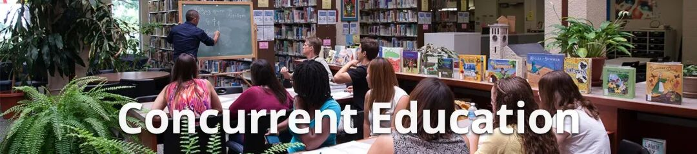
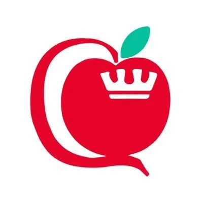
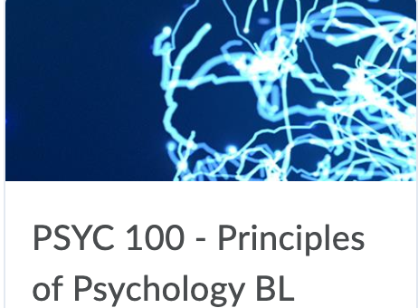

# GPS 专业介绍 | 教育系？双学位？Con-ed到底是个什么样的专业？

> 来源：微信公众号  
> 原链接：https://mp.weixin.qq.com/s/KmSEu_ScbLbPsI32Tl8KBg  
> 状态：自动搬运，暂未分类  
> 图片数量：11  
> OCR 图片文字数量：0

---

## 人工整理说明

本文件保留了公众号文章中的所有图片，没有自动删除装饰图。  
每张图片都用 `IMAGE-编号` 标记，方便后期人工检索、删除或补充说明。  
如果图片下方出现 OCR 文字，说明脚本尝试识别了图片中的文字，但需要人工检查准确性。  
OCR 文字只是辅助，不代表一定需要保留到最终正文。

---

Queen's Concurrent Education

【IMAGE-001 START】

【IMAGE-001 END】

做为皇后大学校内**最低调，人数最少，毕业所需时间最长**的一个院系---Con-Ed，仿佛只有本院系的学生才对它有着一定程度上的了解。而对于很新生或是同年级其他院系的学生而言，Con-Ed到底是一个什么样的专业他们都是一知半解。甚至于有的时候熊猫酱介绍自己是Con-Ed专业，很多小伙伴都会有表示自己不认识，没听过TAT。。。

【IMAGE-002 START】

【IMAGE-002 END】

所以，今天熊猫酱决定为大家做一个详细的专业介绍，不仅仅是为了让秋季的Con-Ed新生对自己的专业多一层了解，也是为了给其他没听过这个专业的同学科普一下。

【IMAGE-003 START】

【IMAGE-003 END】

**PART 1：专业简介**

Concurrent Education， 通常称Con-Ed，是皇后大学给对教育充满热情的同学所设的专门的，独立的院系。和普通学校的教育专业不同，它的特别之处在于**需要五年 ➕ 一个暑期**的时间毕业，而不是正常的四年。这是因为在我们选择这个院系的时候，我们就同时选择了两个学位：**教育 ➕ 文/理/音乐/美术**（Bachelor of Education ➕ Bachelor of Arts/Science/Music or Fine Art (Visual Art）。所以在其他文理学院学生选专业的时候，我们也会需要和他们一样选择我们除了教育的第二个专业（音乐，美术自动算一个专业）。一旦毕业，我们都会得到一份**双学位的荣誉毕业证书**。前四年我们所修的基本上全都是**文理学院的课**，用这四年来帮我们把毕业所需要的120个学分拿到手。到了最后一年，我们将把所有的时间全部都用来**实习和完成教育专业**的课程。

【IMAGE-004 START】

【IMAGE-004 END】

**PART 2：大一必修课**

就像熊猫酱之前说的，前四年的课着重于修文理学院的学分，所以Con-Ed大一只有一门必修的教育专业课---**PROF 110**。这门课主要是培养学生一些教育行业的**理论知识**和当老师的**专业素养**。内容包括**Teaching Philosophy，Growth Mindset, Collabrative Inquiry**等。这门课基本上每周会要写一篇简短的**reflection**，偶尔也会布置一些assignment，但是作业都不难，老师人也很nice，只要不是太浪，轻轻松松就能过。

【IMAGE-005 START】

【IMAGE-005 END】

接下来要讲的就是另一门专业必修课---**PSYC 100**。这门课想必大家都略有耳闻，每年都有一些被摧残的学长学姐们给出惨痛建议：千万千万不要上心理100！可惜一旦进了Con-Ed的大门，心理算是逃不掉了，因为专业要求**一定要pass** 这门课。大一可以**选择先不修这门课**所以严格意义上不算是大一必修但是到了大二大三**一定要补上，所以早上晚上都是上**。大一如果不及格也得找其他时间重修，**直到pass为止**。心理这门课**又文又理**，topic又很多，除了死记硬背还要对每章有一定程度上的理解才能做到**学以致用**来应对考试时的**short/long answer**。唉，说到这里，熊猫酱又想起了以前考试周被心理支配的恐惧。。。所以这里给大家的建议就是一定要**认真地学这门课**，不懂就及时寻求帮助。

【IMAGE-006 START】

【IMAGE-006 END】

除了上面这两门课，大一还需要完成一个60小时的实习课，叫做**Practicum 100**。这是一门off time-table的课，也就是说大家需要在课余时间或者假期找时间来做完。第一年主要就是在**当地的教育局或者多伦多的学校**找一个placement，去当老师的助手，做**observation**。实习每年都有，内容不太一样，时常也会加长，到了第二年就不需要局限于在Kingston或者多伦多的学校做了，可以找其他的教育局，只要是Queen‘s**认可的教育局就可以**。其他详细内容在第一学期老师都会给你们介绍的。

对于Con-Ed学生来说，不论是将来**找工作面试还是仅仅为了毕业**，这门实习课无疑是非常重要的。因为这门课**没有成绩，只有pass/fail**，如果哪一年没过，就要在下一年重修，只有过了才能继续下面的实习。实习期间会给学生带来**丰富的教学经验和知识**，很多时候，这些**实践经验会比理论知识来的更重要**。所以熊猫酱要提醒各位，每年千万不要忘了做自己的实习哦！

除了这两门教育必修专业课，我们还需要选包括心理在内**五门选修课，也就是说我们一学期要上六门课加一年一个实习。**虽然听起来很多，但是也是保证了大家在大一可以有充分的时间**探索自己的兴趣爱好和规划专业**。

【IMAGE-007 START】

【IMAGE-007 END】

**PART 3：关于PJ/IS**

在大一结束的那个暑假，大概五六月份的时候通常是所有学生的**plan selection period**。每个Con-Ed学生除了要选择自己的第二个文理专业，还需要在**PJ/IS之间做一个选择**，这个选择将会直接影响到我们**大二以后的选课和专业方向**。**Primary Junior** 简称PJ，是指以后的教学方向是偏向**幼儿园到小学六年级**的，而**Intermediate Senior**简称IS,是指以后想要教**七年级到高中十二年级的学生**。大学第一年实习以后，大家通常都会有一个大致的方向，不过如果以后改变了主意也是可以在两个plan之间转换的。

如果选择PJ，那么对于选课方面的要求就没有那么多，只需要选择**你的专业方面的课再加几门选修课就可以**，因为PJ**不需要teachable**，只要有一个广泛的知识面就可以。而选择IS就会比较麻烦一点，因为你要在以下几个学科里选择**两个你感兴趣的作为teachable**, 也就是你将在初高中教学生的科目：**Biology, Chemistry, Drama, English, French, Geography, History, Math, Music, First Nation, Métis and Inuit Studies (Native Studies)，Physics, Visual Arts。**一般来说我们会把我们的**major/minor也选为这两个teachable**，这样就可以**避免需要****上太多的课**来达到专业和IS的学分要求。

关于到底要选择哪个教学方向完全是看个人的兴趣和擅长的科目，熊猫酱就不在这里做推荐啦，相信各位小伙伴们在经历过实习之后都会有一个自己的想法啦💡不过要注意的是，**如果一开始选择的是IS然后想要转到PJ会比一开始选择PJ然后要转到IS简单得多**，因为IS有很多专业课和teachable的课需要补上，而PJ没有。所以在做决定之前还是要好好考虑一下的哟～

除了这些，我们Con-Ed还有专门的**Academic Advisors提供一对一的meeeting。**她们会认真地根据你们大一的选修课程和教学方向帮你们制定一份详细的**课程规划表**，帮助新生们规划未来大学四年。所以我们经常说，每当有什么迷茫的时候，找advisor就对了！

【IMAGE-008 START】

【IMAGE-008 END】

【IMAGE-009 START】

【IMAGE-009 END】

好啦，以上就是熊猫酱为大家整理出来的Con-Ed的一些专业介绍啦！因为这是一个比较小众的院系，去年大概只录取了200+的同学把，大家的集体感很强，彼此之间都很友好。熊猫酱至今念念不忘去年新生周我们的Teach在我的生日当天为我准备了一个生日蛋糕🎂，还给我唱了一首生日快乐歌(✿◡‿◡)！总之，Con-Ed真的是一个团结友爱的大家庭，2020，欢迎大家的加入！

**CON-ED LOVE！！！❤️❤️❤️**

**上文所提的psyc100课程介绍可以参见本期QueensGPS的副刊哦**

文字 Nina

排版 Nina

编辑 容易

审核 TT Chris

❤️❤️❤️

【IMAGE-010 START】

【IMAGE-010 END】

【IMAGE-011 START】

【IMAGE-011 END】
