# GPS专业介绍 | 在Queen‘s读Engineering是一种怎样的体验？

> 来源：微信公众号  
> 原链接：https://mp.weixin.qq.com/s/IKI7Zq70FBN-F8k7n2b5zw  
> 状态：自动搬运，暂未分类  
> 图片数量：42  
> OCR 图片文字数量：0

---

## 人工整理说明

本文件保留了公众号文章中的所有图片，没有自动删除装饰图。  
每张图片都用 `IMAGE-编号` 标记，方便后期人工检索、删除或补充说明。  
如果图片下方出现 OCR 文字，说明脚本尝试识别了图片中的文字，但需要人工检查准确性。  
OCR 文字只是辅助，不代表一定需要保留到最终正文。

---

【IMAGE-001 START】

【IMAGE-001 END】

小学的时候，

英语课代表站在讲台上领读:

**engineer，e  n  g  i  n  e  e  r, 工程师**

小小的我一下子记住了这个单词，工程师，

我的粑粑麻麻都是设计建筑的人，

他们都是工程师，所以他们都是engineer呀。

于是，

印象里的engineer是这样子的

【IMAGE-002 START】

【IMAGE-002 END】

是这样子的

【IMAGE-003 START】

【IMAGE-003 END】

是这样子的

【IMAGE-004 START】

【IMAGE-004 END】

后来，到了大学，

orientation week 的时候我才知道，

皇后的eng可以是这样的，

【IMAGE-005 START】

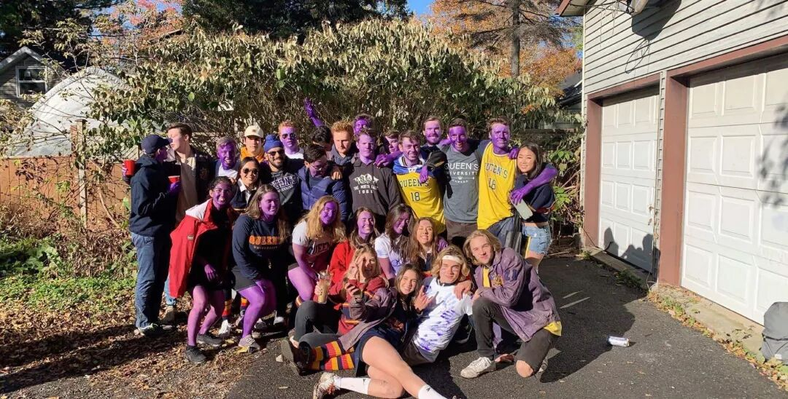

【IMAGE-005 END】

这样的

【IMAGE-006 START】

【IMAGE-006 END】

这样的

【IMAGE-007 START】

【IMAGE-007 END】

【IMAGE-008 START】

【IMAGE-008 END】

Engineering 到底是什么意思呢?

解释一

来自有道词典的释义

【IMAGE-009 START】

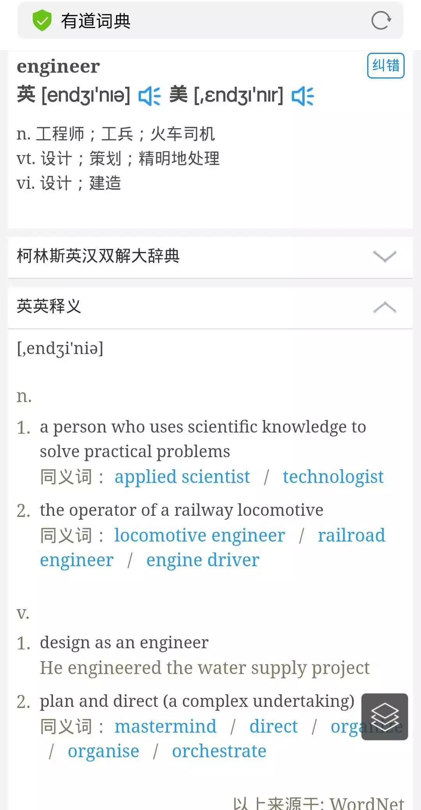

【IMAGE-009 END】

由此可见，“土木工程师” 仅仅是engineer众多释义中的一种，不能很好的起到概括作用。

解释二

来自皇后官网

【IMAGE-010 START】

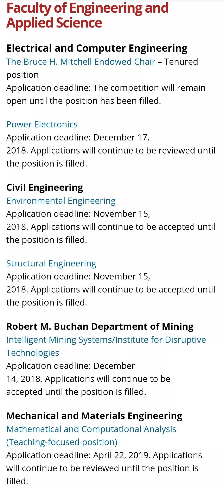

【IMAGE-010 END】

**原来，eng是一个与Arts and Science平级的faculty，**

**其下有划分更为细致的majors**

那eng和其他faculty横向对比来说是不是有什么特别的地方呢?

答案是肯定的

01

课程表更加充实

这是我的课程表(大一上/下)

【IMAGE-011 START】

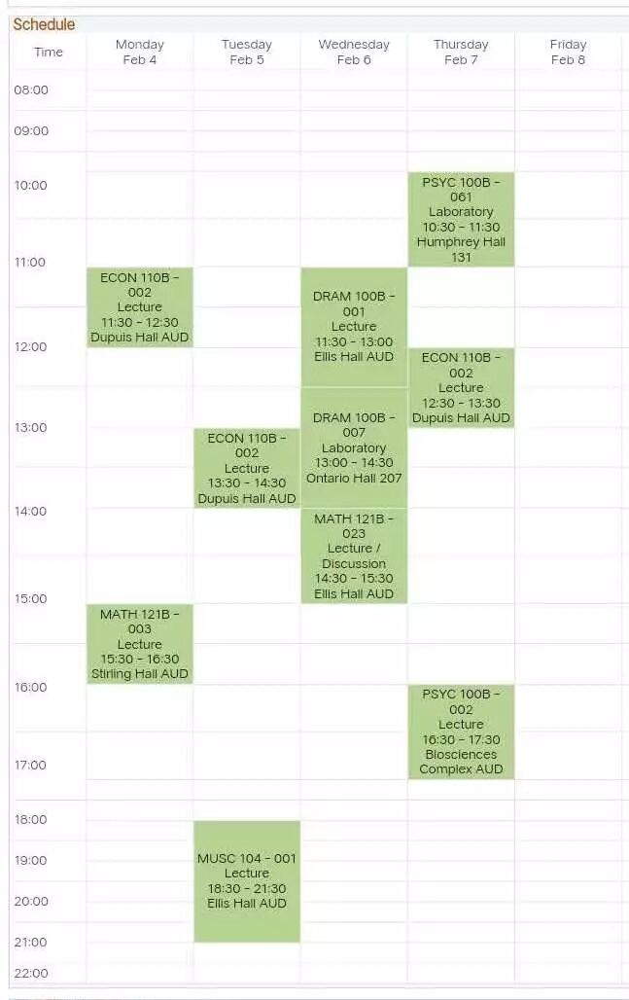

【IMAGE-011 END】

【IMAGE-012 START】

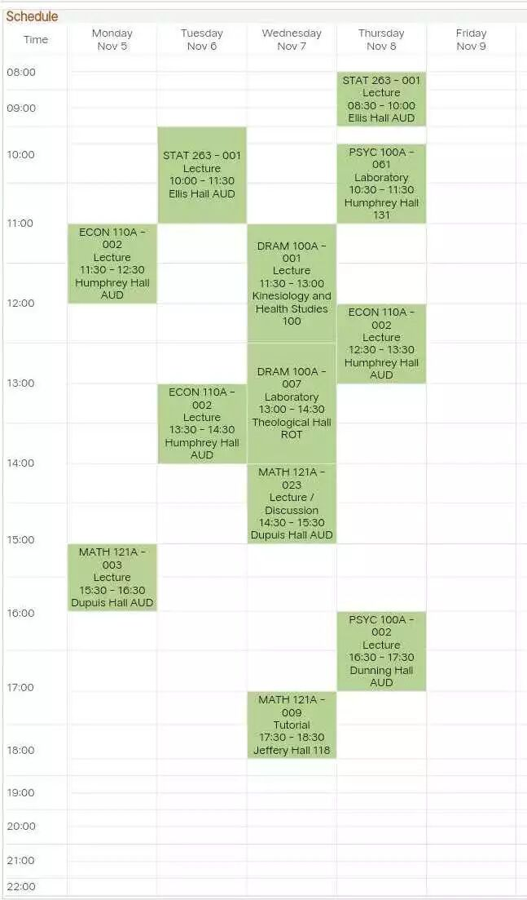

【IMAGE-012 END】

这是某eng同学的课程表(大一上/下)

【IMAGE-013 START】

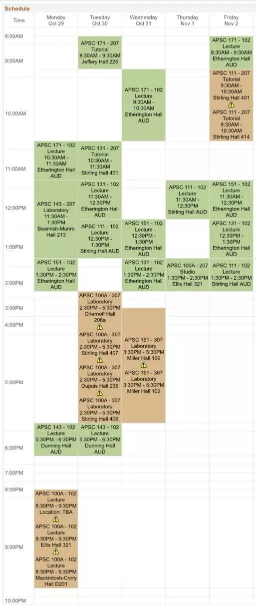

【IMAGE-013 END】

【IMAGE-014 START】

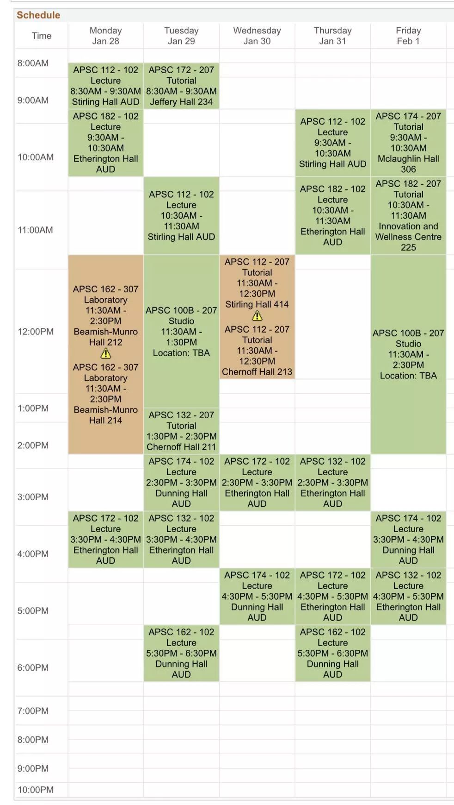

【IMAGE-014 END】

02

大一课程内容是学校规定的

在皇后Arts&Sci大一可以根据自己的兴趣或者想进的专业degree plan选择自己的课程表，但是Eng的同学在大一选择工程的时候有两种选择，一种是**ECEI**（电子与电脑工程） ，一种是 **General Engineering**（普通工程）。假如你选择的是Queen’s的General工程，那便是大二再选择专业，大一大家的课表是一样的，学校想让学生们尝试不同方向，然后选择最适合自己的专业。

【IMAGE-015 START】

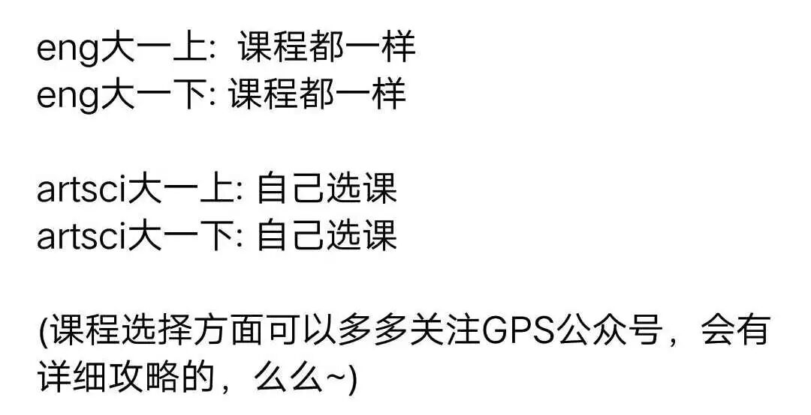

【IMAGE-015 END】

【IMAGE-016 START】

【IMAGE-016 END】

想要更好的了解engineering这个紫色部落，

不如让我们听听eng的同学是怎么说的

【IMAGE-017 START】

【IMAGE-017 END】

每天的生活匆忙简单却充实 我还记得大一上半学期 最令人头疼的就是lab上完紧接着就是数学 这两个建筑是相隔最远的 跑过去课基本上就上完了 课余时间会打打游戏 跟朋友打打台球 关于课程 大一的课程挺简单的 基本上都是**高中的知识** 但是我高中学的不太好 导致很多知识需要巩固很久 建议来eng的**把高中的知识学扎实** 不然很麻烦

国内高考来的 考的还不错 大一物理化学基本被高考内容包了 因为选修不一样 化学学原子结构的时候有点吃力 学什么课程从官网上找得到 可以根据自己情况适当drop掉课 鉴于我是不喜欢背东西类型的 地址和线性代数学的都一般 基本都是考试之前疯狂乱看 平时主要被report占满 如果经历过国内高三的同学 放心 绝对**比高三轻松很多**

【IMAGE-018 START】

【IMAGE-018 END】

每日学习10点，然后洗澡，玩玩dota2，12点左右睡觉。第一年上了：化学，微积分，物理，工程制图，地质，计算机，工程建造，线代，以及工程的三门小组课。课余玩玩游戏，看看视频。在**加拿大萨斯卡通省上的高中**，国外高中很简单，天天划水。**大学比高中难多了，压力一下子就大了**，尤其是工科。

**总结地来说，eng 的学习难度因人而异，需要根据每个人的学业背景来衡量。没有在国内有过普高数理化基础的同学，推荐您带上霸王洗发水。**

今天的Engineering 分享就先告一段落了，

**感谢大家的分享点赞与关注**。

(强烈暗示)

其他专业分享

is coming soon。。。

【IMAGE-019 START】

【IMAGE-019 END】

【IMAGE-020 START】

【IMAGE-020 END】

**什么?你以为看到这里就真的结束了?!**

【IMAGE-021 START】

【IMAGE-021 END】

**停下你点击叉叉的手!**

【IMAGE-022 START】

【IMAGE-022 END】

**我们GPS是这么敷衍的社团嘛?**

**一点实际内容都没有!**

(虽然我是想交了任务完事儿，但是我有认真负责的领导啊)

【IMAGE-023 START】

【IMAGE-023 END】

**划重点!!!下面是考试必考内容!!!**

【IMAGE-024 START】

【IMAGE-024 END】

**课程介绍**

大一上

微积分 / 物理 / 化学 /

c语言 / 地质

和小组project

微积分物理化学大部分知识国内普高都学过 加拿大高中也基本学过 都没什么问题 只要按着老师进度认真学习 成绩方面**就不会有大问题。**

c语言和java有些相似，都是编程语言，没有基础的同学 **会有些吃力。**

地质包含**大量专业名词** 对许多老外来说都很难 中国学生可想而知，平时物理化学小菜一碟的朋友，每每遇到地质考试也躲不开**抓耳挠腮**。

【IMAGE-025 START】

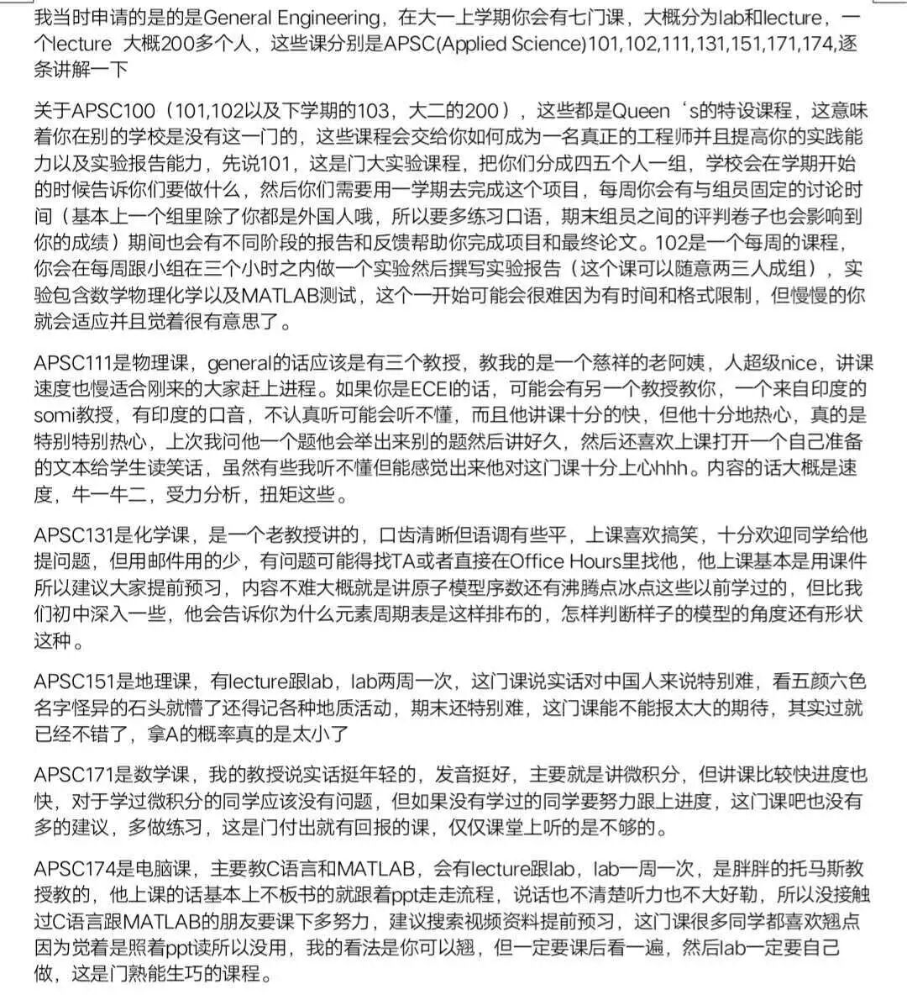

【IMAGE-025 END】

(这里超级无敌巨详细的千字内容来自于人帅腿长的行走荷尔蒙-通哥)eng新生可以把这个图片单独下载到手机上，每天睡前认真读三遍。

大一下

微积分 / 物理 / 化学 / 线性代数 / 工程力学 / 工程画图 /

和 小组project

线性代数、工程力学、工程画图这三门，即使零基础学也没有地质和c语言吃力，所以有些同学会感觉下半学期比上半学期要**舒服很多。**

【IMAGE-026 START】

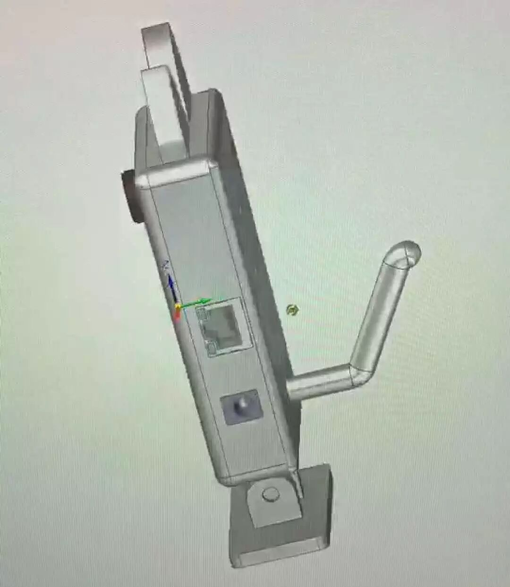

【IMAGE-026 END】

【IMAGE-027 START】

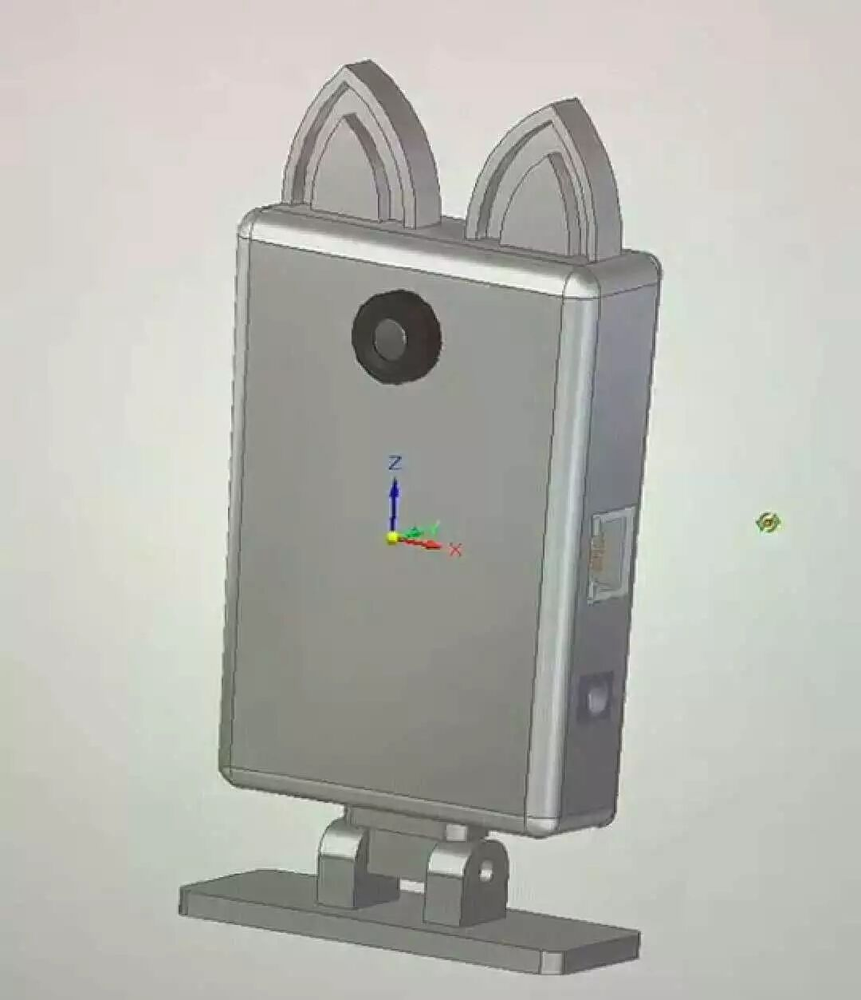

【IMAGE-027 END】

【IMAGE-028 START】

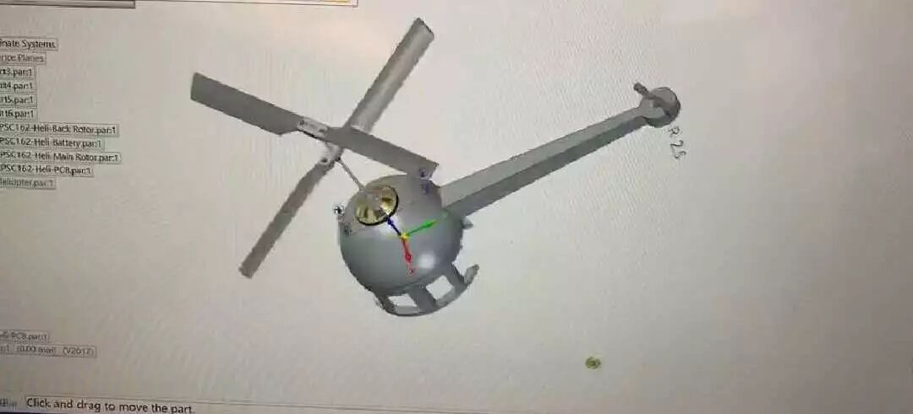

【IMAGE-028 END】

【IMAGE-029 START】

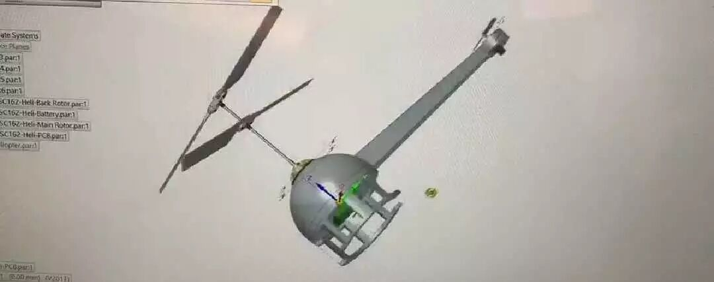

【IMAGE-029 END】

(优秀学生代表作业赏析---图片来源于英俊潇洒米豆桑)

至于为什么下半学期写的文字内容这么少

醒醒吧，朋友，字那么多你会认真看完嘛?

【IMAGE-030 START】

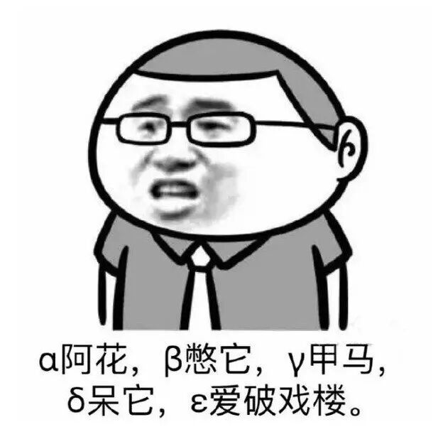

【IMAGE-030 END】

**小组project**

每个小组有**四到五名成员**， 在**每学期**要完成一个项目，比如小米豆上半学期是用老鼠夹做小车子，下半学期是做出一个装在拐杖上的杯架。

在完成项目的过程中涉及：写**论文、**和组员口语**交流、**以及一起**动手做东西。**

小组活动的成绩有一定比例和小组成员**相互打的分数**相关，所以也一定程度上的锻炼了**interpersonal skills**。

(友情提示读工程的小伙伴们可以给未来的组员带一些简单的小礼物哦~)

【IMAGE-031 START】

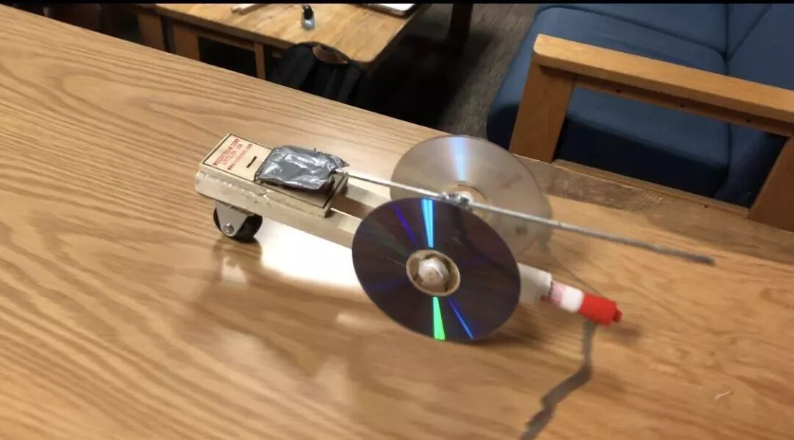

【IMAGE-031 END】

(图片还是来自于风流倜傥米豆桑)

**相关教学楼**

我们都知道art&sci的academic advisers在学校的Dunning Hall一楼

【IMAGE-032 START】

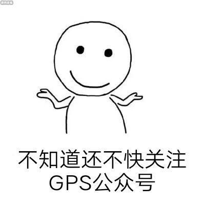

【IMAGE-032 END】

**那么Eng的相关教学楼都在学校什么位置呢?**

【IMAGE-033 START】

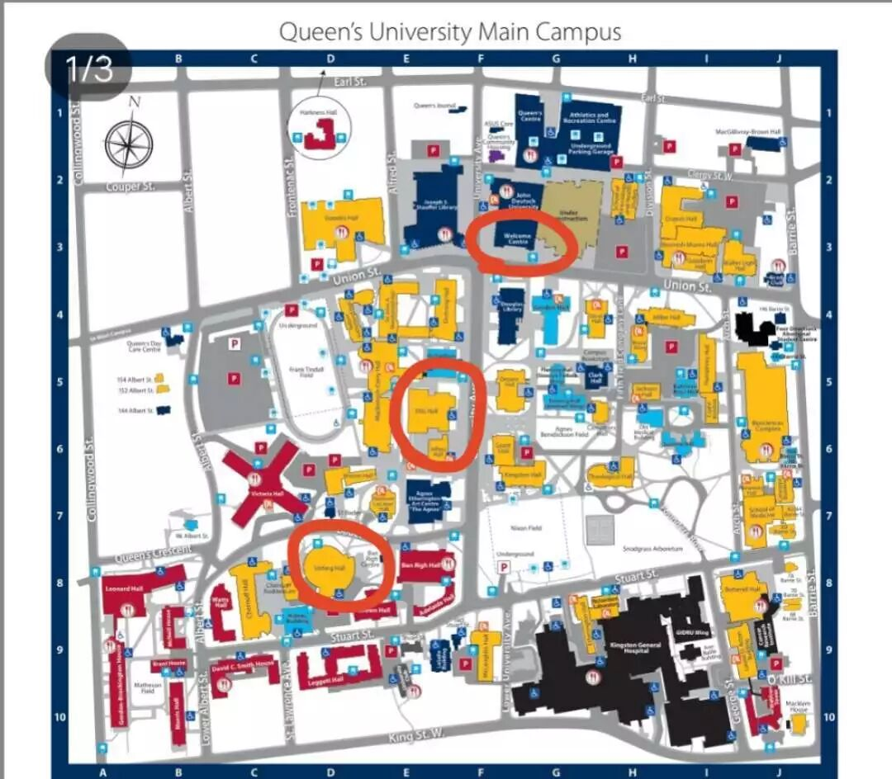

【IMAGE-033 END】

什么?你说看不清楚?

没关系，我就是让你稍微看一下。

【IMAGE-034 START】

【IMAGE-034 END】

由图可见，一共有三个圈圈，最上面的圈圈里是**John Deutsch University Center (JDUC)**，里面有academic advisor，想要转进eng专业的朋友可以去那里的三楼。它相当于art&sci的Dunning Hall

中间的圈圈里是**Eills Hall**，是我们俗称的eng楼，eng 大部分课都在这栋楼里。

最下面的圈圈里是**Stirling Hall**， 是一栋和数理化关系特别好的楼，物理化学最喜欢在这栋楼里开课了。

【IMAGE-035 START】

【IMAGE-035 END】

(我又觉得内容写的差不多了，

那么让我们把刚才的结尾复制粘贴下来)

【IMAGE-036 START】

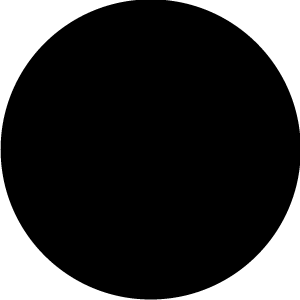

【IMAGE-036 END】

今天的Engineering 分享就先告一段落了，

**感谢大家的分享点赞与关注**。

(强烈暗示)

其他专业分享

is coming soon。。。

(一篇微信推文就完成了)

【IMAGE-037 START】

【IMAGE-037 END】

感谢友情提供课表和活动照片的小米豆，

分享真实生活经历的eva，ja桑，Paul，和通哥

帮助校对的小米豆和安妮。

**更多精彩内容请持续关注GPS公众号**

**新生见面会，GPS 与你不见不散**

【IMAGE-038 START】

【IMAGE-038 END】

6月1日 南京

6月2日 济南

6月2日 广州

6月8日 成都

【IMAGE-039 START】

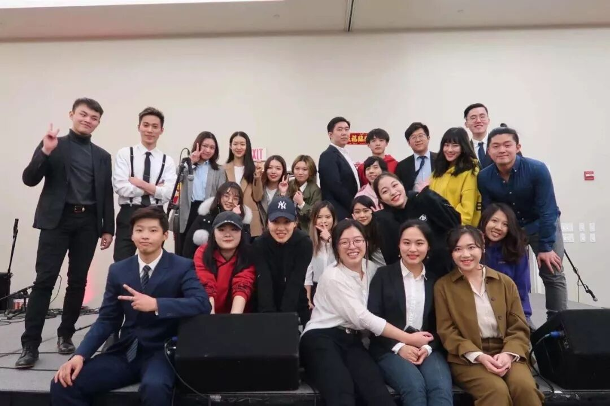

【IMAGE-039 END】

见面会报名网址: www.queensgps.com

文字 / 王婧迩 

排版 / 王婧迩

编辑 / Lucas TT

校对 / Kedi Bill

【IMAGE-040 START】

【IMAGE-040 END】

【IMAGE-041 START】

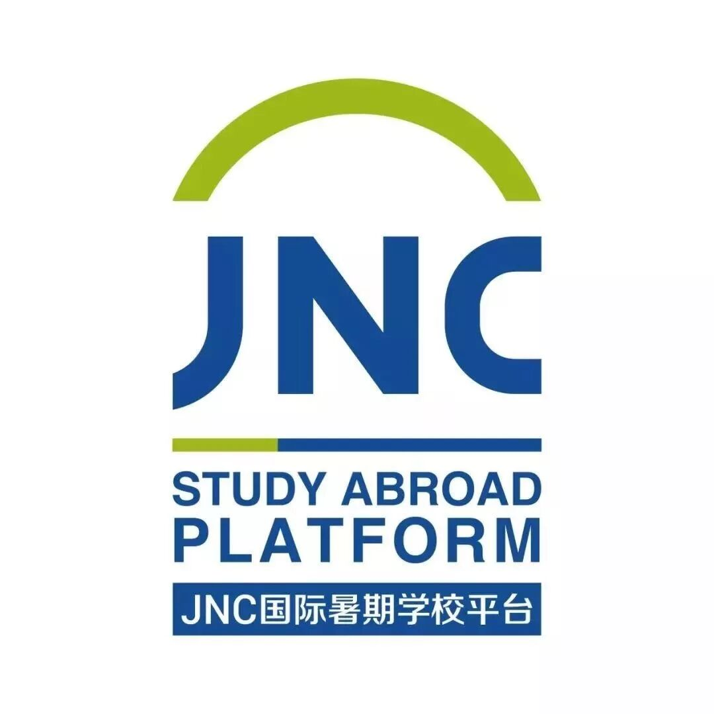

【IMAGE-041 END】

❤️ ❤️ ❤️

【IMAGE-042 START】

【IMAGE-042 END】
