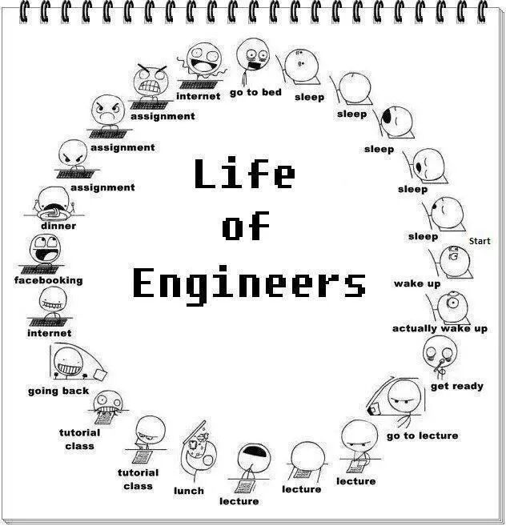
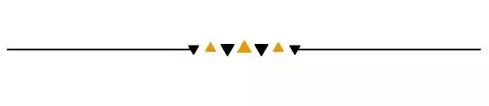
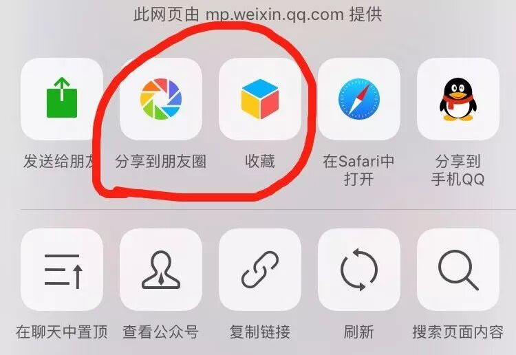

# GPS专业攻略 | 工程篇：十大专业一个对策，看这篇就够了~

> 来源：微信公众号  
> 原链接：https://mp.weixin.qq.com/s/tOaDDiwyhtH9hldCL_-iEQ  
> 状态：自动搬运，暂未分类  
> 图片数量：28  
> OCR 图片文字数量：0

---

## 人工整理说明

本文件保留了公众号文章中的所有图片，没有自动删除装饰图。  
每张图片都用 `IMAGE-编号` 标记，方便后期人工检索、删除或补充说明。  
如果图片下方出现 OCR 文字，说明脚本尝试识别了图片中的文字，但需要人工检查准确性。  
OCR 文字只是辅助，不代表一定需要保留到最终正文。

---

【IMAGE-001 START】

【IMAGE-001 END】

【IMAGE-002 START】

【IMAGE-002 END】

手机屏幕面前的朋友们大家好！本人是目前就读于大二计算机工程『computer engineering』并在工程之路上越走越远的脱发学姐Evelyn。相信点开推文的你，多多少少对“工程”这个神秘的词汇感到好奇。

为了给大家一个更加全面及具体的工程十大专业介绍，我从身边各个专业的朋友那里获取了最真实的感想和干货。在此，特别感谢文中提供信息的工程小伙伴们！无论你是刚刚收到offer心中犹豫不决，还是在面对即将进入大二专业的生活而感到害怕，又或者只是想了解更多关于engineering的事，我都希望你能耐心地看下去，愿这篇推文能够起到帮助。

大一进入工程系后，Queens's会提供各种各样的基础课程，目的就是为了让学生对工程的每个方向有一个大概的了解。大一下半学期会进行专业选择，大二就能进入自己的专业了。整个工程系分为以下十大专业：

Applied Mathematics in Engineering 

Chemical Engineering 

Civil Engineering

Computer Engineering 

Electrical Engineering 

Engineering Chemistry 

Engineering Physics 

Geological Engineering 

Mechanical Engineering

Mining Engineering

【IMAGE-003 START】

【IMAGE-003 END】

---

- 应用数学 -

Applied Mathematics in Engineering 

『Apple Math』

▌Sub-Plans: 

① Applied Mechanics Sub-Plan 

② Computing and Communications Sub-Plan 

③ Systems and Robotics Sub-Plan 

**@一个不愿意透露姓名的学姐a：**

数学工程又叫Apple Math，应该是从applied math延伸过来的一个好玩点儿的说法（我猜的

【IMAGE-004 START】

【IMAGE-004 END】

）。女王是加拿大唯一有数学工程的学校！所以数学工程非常“unique”。除去所有工程专业都要上的工程实践设计课，数学工程会学很多数学的课程。有些数学课是和artcsi数学专业一起上的，有些是专业里的数学课。除了上数学课，数学专业还会根据不同的option上其他方向的课。

既要学机械有关的课程，也要学ECE的课程，总体来说这是一个非常有挑战性的专业。学生最好对数学有很高的兴趣，能对抗巨大的课程量… 能够在专业里顽强存活下来的都非常了不起！Apple Math的学生不仅建立了专业的数学思维，同时也掌握了其他工程专业的知识（我觉得基本算是工程里的双专业了……）。

Apple毕业之后的选择很广泛，大多数可以选择读研深造，因为Apple本身是工程专业里比较偏学术的专业。在就业方面，数学工程的学生可以从事数据分析、编程、机器人研发以及银行理财投资等等等很多领域。总之，如果你是一个热爱数学，想要挑战自己并且自信坚强努力的超棒人类，快来Apple Math吧！

【IMAGE-005 START】

【IMAGE-005 END】

---

- 化学工程 -

Chemical Engineering 『Chem Eng』

【IMAGE-006 START】

【IMAGE-006 END】

▌Specializations：

① Process Engineering

② Bioengineering

**@David:**

首先，选择化学的前提一定是喜欢化学。个人感觉只要这个大前提存在，就可以选了，撇开化学不说，其他的专业也是一样的。 化学的就业前景不是特别好，毕业大概有几个方向，亦或留校当教授，亦或去制药厂，亦或化工厂，亦或国家研究所，当然还有其他的小分支我就不一一细述了。就工资问题而论，虽然不好找工作，但是找到了资薪水平不会低，一般高于其他同等行业起步的engineers。想要一直读化学的话，要提前做好读phd的准备，因为化学本科毕业实在是机会太少。就工作环境而言，化工厂，制药厂一般都在郊区，交通可能不会太方便，工作环境也不会太好，但是当教授或者去研究室就另当别论了。总体来说好坏参半吧。

 

再聊一下workload和难度，说实话，是真的忙，真的难，但是大二工程大体上都是这个样子，只不过相比之下化学实验多一些，相应的实验报告也就更多（平均一周2.5个单位）。每周基本规律是2-3个lab+report每个lab都要写pre-lab，问题或者步骤，需要自己读的东西很多，教授基本上就是带着过slides，有问题了给你解答。只要不能理解问题，一定要去多问！！！

 

实验其实难度不大，都是根据一些基本的反应。只要课上认真听，课下自己看看理解了就okay。熟悉器具的使用以及化学物品的注意事项之后，一般是不会受伤的。而且有一个好处就是，你有可能会因为这个而让自己的生活变得更加有条理，更会规划时间（扯远了扯远了）。还有就是一定要火眼金睛选好实验partner！作业partner！另外，建议不要旷课，因为知识点之间跨度还是挺大的，一节课没有认真的话真的需要费很多时间去figure out个所以然。

俗话说得好，兴趣是最好的老师，要是对化学真的兴趣很浓厚，放心大胆去选，毕竟行行出状元。就我个人经历来说，我的初衷是学生物，然而并没有这个选项，所以就选了个自己还比较喜欢的化学，现在并不后悔。

【IMAGE-007 START】

【IMAGE-007 END】

---

- 工程化学 -

Engineering Chemistry 『Engchem』

▌Specializations：

① Biosciences

② Environmental

③ Materials Science

④ Process Chemistry

关于CHEM ENG CHEM的干货，我们会另起一篇推文提供更多干货，感兴趣的朋友们可以继续关注我们的公众号。

【IMAGE-008 START】

【IMAGE-008 END】

---

- 土木工程 -

Civil Engineering

【IMAGE-009 START】

【IMAGE-009 END】

▌Specializations：

① Structural Design

② Geotechnical,Hydraulics

③ Environmental,

④ Public Health

**@Stella：**

课程难度差不多中等，比大一难度提升了一些，但是没有特别难，不过要得理想的成绩也是要付出一些努力的。Civil一学期平均五门课，比起其他的专业，平时上课时间比较散也比较少，有很多时间可以自己利用，比如参加一些club，健健身，或者party啦。

Civil这个专业有四个方向，大二大三上的课是专业基础课，大四才根据自己的喜好选一些方向相关的课。

**@小台：**

这个专业还是很有趣的！学到的东西都很实际很有应用性！比如污水处理，做混凝土...既有理科的各种计算分析、实验，有的课也有文科那样很多要记和背诵的东西。

 

大二上课时间比大一轻松一些！tutorial时间比较长，比如3小时...但事实证明这3个小时很灵活，一般都是做题，可以提前结束。Civil各种due会很多而且很规律的每周都有，作业还蛮多...课下要废不少功夫的。

除了专业课，一个很特殊的课叫CIVL200。CIVL200是大二开学的第一个周不上课，小组合作一起用纸壳做船，而且真的会下水测试！这一周还穿插了『technical report、presentation、group work』的一些培训。总之是蛮有价值而且很有趣的一周呀！在APSC100阴影的笼罩下，令人恐慌的APSC200最后的Challenge是做一个木头桥会有载重测试！值得一提的是，Civil在大三大四都有课要求先修APSC200，如果没有按时上大二没有上APSC200很可能会影响毕业时间，最晚可以大三上学期上APSC200下学期上CIVL360大四正常读，所以各位小伙伴一定至少要在大二一年加油考过EPT！

大二上学期课程难度Math和Solid Mechanics都比较好学，Chemistry我们今年换了一个临时的instructor出题有点不一样，听说原来的教授已经回来了所以暂不作参考...下半学期的课难度都还可以，Material是要记很多很多东西要认真背诵，其他的课属于认真学多刷题多理解肯定可以学明白的类型！亲测！（来自本来数理化都差的我...

 

欢迎加入Civil Engineering大家庭！

【IMAGE-010 START】

【IMAGE-010 END】

---

- 计算机工程 -

Computer Engineering 『Comp Eng』

【IMAGE-011 START】

【IMAGE-011 END】

**@Evelyn：**

就我目前大二的课程来看，比起隔壁专业CS，我校的CompEng其实比较偏硬件。学习内容涉及范围很广泛，不仅包括了不同的编程语言，还有计算机的组成和运作，以及微电子电路的应用等等。

相比其他专业，我们专业的人数其实是偏多的，这一届大概有一百多个人。大二上半学期EE和CE的课是一样的，下半学期有两门课不一样，所以如果想CE和EE互相转的话，务必在下半学期开始之前申请。大二的课程难度相较大一，提升了不少，主要是涉及到了很多电路和计算机方面的东西。毕竟是工程专业，对物理的要求比较高，同时也需要有不错的逻辑思维能力（毕竟也是敲代码的活）。我们专业的教授都还是比较友好的，如果课上有不懂得知识点，课后或者office hour一定要去多问问题，他们都会很耐心的解答。

平时的考试也明显增多，一门课最多有5个quiz，所以即使不是final期间，每一科的学习进度都不能落下。为了学好这个专业，每个人都需要拥有合理分配时间的能力，课下需要花很多时间去巩固和自学。到了大二下半学期，课程量逐渐增大，实验课特别多（六门课只有一门没有实验课），需要提前写prelab并且理解实验步骤，不然可能到了lab就只有傻眼盯着示波器神秘的图像发呆了。

 

Comp Eng没有提供具体的Sub-Plans，但是在大三大四学校提供了许多选修课程，让学生可以选择自己喜欢的方向。总之，这是一个很灵活很有前景的专业。如果你对计算机感兴趣，CE会是一个很好的选择。

**@一个不愿意透露姓名的学长a：**

如果你觉得大二的CE很难的话，大三的难度会更上一个层次，两极分化其实蛮严重的。在大三，很多学习较弱的学生都留级了，进入大三的小朋友们水平都还是不错的。这就导致了一个有趣的问题，大三的课出现bonus的几率会小很多。我记得在大二的时候有一门课号是ELEC252的课（Electronics）,一群人final考十几分，更有甚者交了白卷。这个现象在大三就很罕见了，你会突然发现身边的学渣都没了。你上课听的一脸懵逼的时候，好多人还在和教授“谈笑风生”…

 

当身边的人都考高分的时候，你认为教授会给bonus吗？所以，我们不能拿着大二的刷分策略来应对大三的挑战。大三很多课是CS开的，这些课给的bonus都很小，或者干脆就不给bonus。上学期有一门CS的算法课，我和几个小伙伴都学的比较烂，指望会像大二时ELEC252一样curve一下，结果被教授毫不留情的给了C。CE大三的课很多是概念课，如果数学好但不擅长背东西的话，学EE是一个好选择。

 

大三让人分心的事情会很多。一部分学生开始申请internship，还有一部分学生开始准备4+1项目申请，或者是准备GRE考试。所以投入在学习上的时间相比大一大二会少一点，成绩也可能会受到影响。学习效率对大三学生来说就尤为关键了。如果学习效率不高的话，尽可能减少一点休息娱乐的时间。

 

如果你还在大二的话，一定要尽可能的把专业课学懂，大二的知识点在大三基本全部要用到。如果大二的课都学懂了，大三可以节约很多的查缺补漏时间。大一的课程把你引入了工程的大门，大二的课则是带你进入计算机工程的大门。如果你连CE的门都没进，大三就要踹门了。一定记住，现在欠的，以后都是要还的。

 

最后的最后，大三的学生是可以上大四的课的，但是一定要慎重，大四的课就像南孚电池，一节更比六节强。

【IMAGE-012 START】

【IMAGE-012 END】

---

- 电气工程 -

Electrical Engineering 『Elec』

**@一个不愿意透露姓名的学长b：**

这里EE大三在读生，相比Comp Eng来讲，Elec涉及的硬件会更多。大二上学期的课和CE一样，偏向intro更多一些，像简单的『circuit, data structure, diff equation』之类的。到了大二下学期，EE会教『complex analysis, numerical method』。『Complex analysis』加入了虚数的运算，这个在电学里应用非常广泛，而『numerical method』则是用不同的数学方法来解决数学问题，我们lab的时候要求我们解决蝴蝶效应。除此之外，还会学『电磁, electronic components』之类的东西（elctronics那门课很难）。下学期有个编程小机器人的课，基本上就是142/143的升级版，超级有趣的一门课，在课程最后会让机器人互相比赛来着，运气好的话教授会给奖励。

ECE并没有像别的系要求大二一定要定specialization的，你可以按照自己喜欢的方向走，我是对robotics这个方向感兴趣所以我大三选了sensor和robotics有关的课。大三上学期我们学了『概率, Antenna, continuous signal, embedded system, electronics II(没错还是electronics...套路更深...) 』大部分人选了EE都是focus on power这一块，毕业以后基本上都是在Toroto Hydro One这样的电力公司工作，也有一些选robotics和mechatronics。

Anyway，欢迎各位加入EE大家庭。

【IMAGE-013 START】

【IMAGE-013 END】

---

- 工程物理 -

Engineering Physics (EngPhys)

【IMAGE-014 START】

【IMAGE-014 END】

▌Specialization: 

① Electrical

② Materials

③ Mechanical

④ Computing

**@Astral:**

工程物理，简称EngPhys，传说中全工程系第二难的专业(第一难的是EngChem)，分四个小方向：机械、电子、材料、电脑。虽说有这四个小方向的存在，工程物理仍然是以物理为主。工程物理一个学期一般有七门课，其中除去和工程有关的课，只有一门是小方向的课，剩下的全是物理和数学。

如果是对高等物理很感兴趣的同学可以考虑来EngPhys, 在这里你可以学到相对论、量子物理，学会熟练运用偏微分方程、线性代数等数学工具。可是与此同时，你得到的专业知识并不会很多，如果只是对物理感兴趣，但今后不想做全职物理研究的，一定不能忘记在学业之余为今后的职业做准备，自学专业知识，寻找实习机会等等。

**@一个不愿意透露姓名的学姐b：**

我们专业呢，不算是什么热门专业 。我们这届总共大概也就60人左右。 无论在哪个specialization，每学期都是平均7-8门课，平均每人每周大概是30个小时的课。这些课涉猎的范围也非常广，光是大二这一年，就有数学方面的vectors，diffs，有Matlab，python编程的ENPH213和ENPH252，有专注relativity/quanta 的ENPH242，当然还有工程专业课200 和293，等等。所有的课程，可以说是都是非常time-consuming，而且基本上都需要一定程度的自学。水课？不存在的。

在Eng Phys我个人总体的感受呢，确实忙确实累确实难，偶尔也会很烦躁，但是，我还是很开心这是我的选择。我们专业总体的气氛很独特，group chat里除了日常讨论学习，还会有人突然爆发疯狂吐槽教授，吐槽作业，会有人发别人上课睡觉的照片，甚至我还看到过有人催另外一个人去睡觉…. 每天能聊个好几十条…. 开玩笑归开玩笑，这些人都是很热心很友好的。总之，Engineering Physics真的不是大家想象的那么可怕。

【IMAGE-015 START】

【IMAGE-015 END】

---

- 机械工程 -

Mechanical Engineering (Mech)

【IMAGE-016 START】

【IMAGE-016 END】

▌Sub-Plans:

①General Sub-Plan 

②Materials Sub-Plan

③Biochemical Sub-Plan

**@Roxanne & @Maggie：**

机械工程是每个大学的经典专业，也是我们这一届人最多的专业。机械工程的就业方向比较广泛，从工业制造到设计，再或者研究领域，都有机械工程师的身影。总的来说，Solid Edge或者其他作图软件对于机械工程是必不可少的。和Civil Engineering相似，机械工程的有比较多自己动手做东西的机会，比较适合喜欢自己动手，喜欢画图设计的盆友们。

大二的课在数量上和大一差不多，上学期6门课下学期5门课。无论你选的是什么specialization, 大二的课都是相同的，到了大三才会有所不同。和大一相比，大二上半学期课会多一点，下半学期上课的时间会少一点。但是每个学期基本上都是每周有考试，大部分的课都会有3-4个quiz，而不是一个或者两个midterm。

上学期的课，麻烦之王〖Mech217〗比较无厘头，和组员一起做，花费的时间比较长，但是最后得分还是不错的。不过听说下一届这门课要改革，那只能祝你们好运了哈哈。最难的小妖精〖Mech230〗。一开始不难，越学越难越学越难，然后到最后final再来一记暴击🙂。大家一定要在这门课上多下功夫。『Mech221, Mech270, Meth225, Mech213』都是比较好拿分的课，认真一点都拿到A。

下学期的课，麻烦之王: 『APSC200』，大二下半学期『APSC 200/293』绝对会是你花最多时间的一门课！200和293总共有5个学分！对GPA的影响会是最大的！这两个课号实际上是一门课，只不过评分的时候一个是偏内容方面，一个偏语法语句方面的。这个课每周不仅有两个lecture，还有两个两小时的studio，还有无数的meeting，report，project...（meeting会充斥在你的脑海）一定要和组员搞好关系，多贡献一点自己的力量，和APSC 100不一样，peer review的成绩会直接扣最后的总分！一共两个peer review！祝你们好运！最难的小妖精：Mech241，学姐表示考了两次test的我还是对这门课一脸懵逼。教授属于比较坑的类型，所以这门课全靠自学了。但是这门课是可以暑假上网课的，建议大家能在暑假把它上完的就尽量把它上了。同样可以在暑假上的『APSC221, MTHE225, MECH230』。其他的课有『MECH228, ELEC210, MTHE272』，228和272都是quiz比较多的课大概两周一次，210就还好，认真学还是挺好拿分的。

【IMAGE-017 START】

【IMAGE-017 END】

【IMAGE-018 START】

【IMAGE-018 END】

---

- 地质工程 -

Geological Engineering 『Geo』

▌Specializations:

①Geotechnica 

②Geoenvironmental

③Resource Engineering

④Applied Geophysics

【IMAGE-019 START】

【IMAGE-019 END】

【IMAGE-020 START】

【IMAGE-020 END】

---

- 矿业工程 -

Mining Engineering

▌Sub-Plans:

①Mining Sub-Plan 

②Minerals Processing Environmental Sub-Plan

③Mine-Mechanical Sub-Plan

【IMAGE-021 START】

【IMAGE-021 END】

关于Geo和Mining，由于没有找到读这两个专业的朋友，这里就只是简单列举了一下specialization。据我了解，这两个专业由于规模较小，所以学生和学生，学生和教授之间联系特别紧密，也是很不错的专业。而关于它们具体的信息，大家也可以在学校的官网上找到。

【IMAGE-022 START】

【IMAGE-022 END】

非常感谢很有耐心阅读到这里的你。

【IMAGE-023 START】

【IMAGE-023 END】

继颈椎病、眼疲劳、久坐肥胖和饮食不规律逐渐成为程序猿的职业病以后，越来越多的人开始对计算机这个专业产生一种不敢尝试的想法。其实不然，每个专业或是工作都有各自的利和弊。不要因为害怕就不敢尝试。

在工程这个系呆的越久，越来越接近佛系的一种生活状态。咖啡配枸杞，保温杯里养身体。为了配得上毕业的iron ring，作为工程系的一员，愿大家无论是在哪个专业，都能熬得了夜，刷的了题，踏踏实实走过大学四年。

【IMAGE-024 START】

【IMAGE-024 END】

#互动#

如果你想跟我交流佛系护发养生心得，非常欢迎来打扰脱发学姐Evelyn。如果你对这些专业还有什么问题或是有其他想了解的专业，非常欢迎在后台或者本文下方留言，我们会尽力帮助你。

这么多干货

下一步应该做什么？

当然是**「点赞+收藏+转发」**呀

【IMAGE-025 START】

【IMAGE-025 END】

【IMAGE-026 START】

【IMAGE-026 END】

别忘了转发别忘了转发别忘了转发别忘了转发别忘了转发别忘了转发别忘了转发别忘了转发别忘了转发别忘了转发别忘了转发别忘了转发别忘了转发别忘了转发别忘了转发别忘了转发别忘了转发别忘了转发别忘了转发别忘了转发别忘了转发别忘了转发别忘了转发别忘了转发别忘了转发别忘了转发别忘了转发别忘了转发别忘了转发别忘了转发别忘了转发别忘了转发

■ Over ■

文字编辑 /奕凡

排版 /奕凡

校对 / 楚晗，子奇

编辑 / 奕凡

全年赞助 / Tian Bao Travel

【IMAGE-027 START】

【IMAGE-027 END】

                                                                                         

【IMAGE-028 START】

【IMAGE-028 END】
