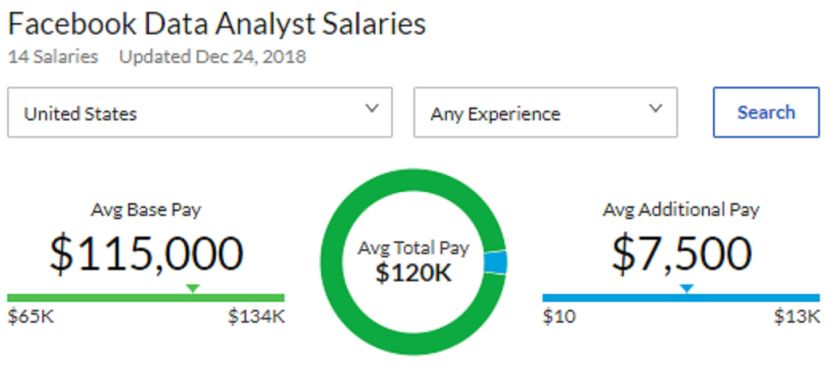
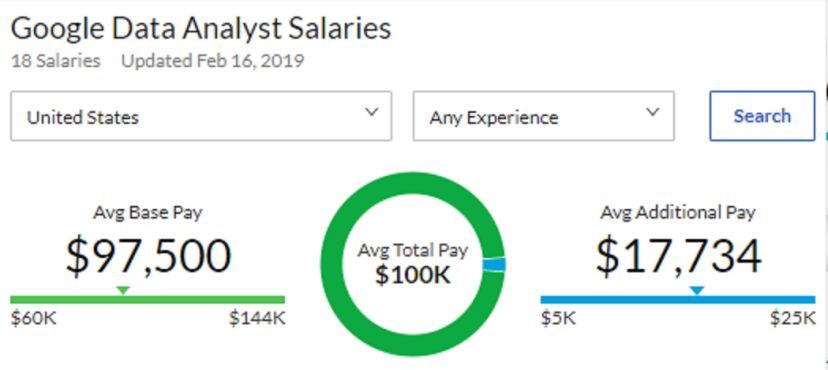
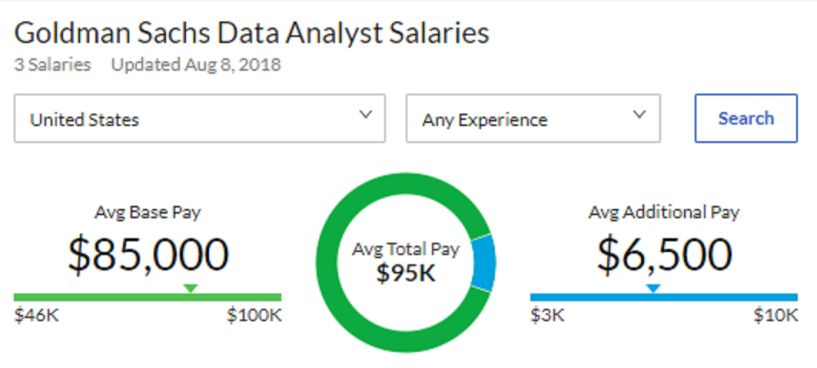
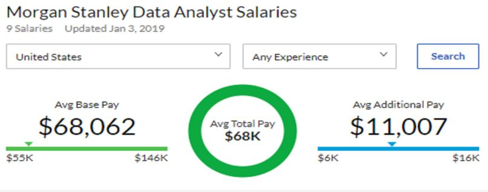
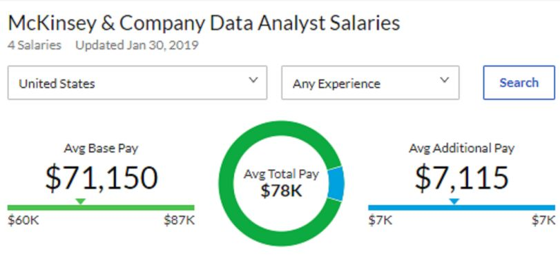
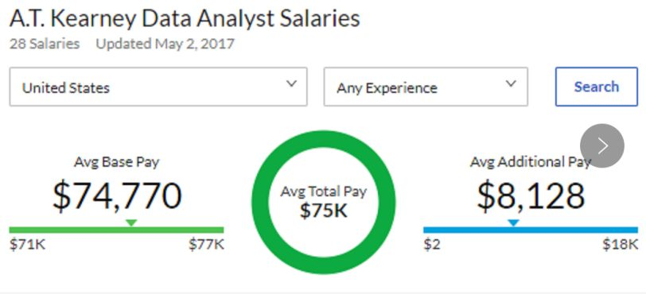

# GPS专业介绍 | 高贵COMA暴风来袭

> 来源：微信公众号  
> 原链接：https://mp.weixin.qq.com/s/70bQc29EJm3h5zl3wnLi8A  
> 状态：自动搬运，暂未分类  
> 图片数量：18  
> OCR 图片文字数量：0

---

## 人工整理说明

本文件保留了公众号文章中的所有图片，没有自动删除装饰图。  
每张图片都用 `IMAGE-编号` 标记，方便后期人工检索、删除或补充说明。  
如果图片下方出现 OCR 文字，说明脚本尝试识别了图片中的文字，但需要人工检查准确性。  
OCR 文字只是辅助，不代表一定需要保留到最终正文。

---

【IMAGE-001 START】

【IMAGE-001 END】

**“Computing and Mathematics：**

**一个听起来就很有（diao）逼（tou）格（fa）**

**的专业”**

**目录**

**背景介绍**

**专业概况**

**课程介绍**

**职业前景**

**不足&提升**

**结语**

【IMAGE-002 START】

【IMAGE-002 END】

壹·背景介绍

近几年来，互联网发展风起云涌，互联网的全球信息化发展俨然已成为一种趋势，而物联网，电子商务以及社交媒体的迅速发展已带领我们进入了**大数据时代**。如今，**越来越多的学生选择数据科学&分析/数学与计算机/大数据等专业，而关于Data的职位也越来越多**。目前，美国Data人才短缺15万人，2019年Data行业人才需求将提高50%-60%，2020年，有关数据分析/数据科学的岗位预计将增加36.4万个，成为真正的岗位需求量大，薪资高，门槛较低的职业。**来看一下在各个领域里数据分析师的薪资：**

\*Tech Company

【IMAGE-003 START】

【IMAGE-003 END】

【IMAGE-004 START】

【IMAGE-004 END】

\*Investment Bank

【IMAGE-005 START】

【IMAGE-005 END】

【IMAGE-006 START】

【IMAGE-006 END】

\*Consulting firm

【IMAGE-007 START】

【IMAGE-007 END】

【IMAGE-008 START】

【IMAGE-008 END】

**选择这个专业你将成为精通数学，统计，编程三方面人才，从此走上巅峰，迎娶白富美~**

【IMAGE-009 START】

【IMAGE-009 END】

贰·专业概况

是不是各位对做数据分析师已经跃跃欲试了呢~

咱们现在来看一下Queen‘s里可以对应Data analysis的专业。根据最新版degree plan，在理学院里面有两个相对适合的专业：第一个就是今天要介绍的Specialization in Computing and Mathematics（新版degree plan改叫Computing，Mathematics and Analytics），还有一个就是Computing major下面的Data Analysis（这个之后会介绍到）。

Computing and Mathematics（以下简称数学与计算机）这个专业在QS世界排名处于150左右的位置，高于整体排名，是一个由School of Computing和Department of Mathematics and Statistics合作提供的专业，**必修课一共占到了84个学分，其中computing的课占到了39个学分，math&stats的课占到了33学分，其他option课占12学分**。

这个专业下面又细分成了三个focus：Communication and coding，Data Analysis，Theory in computer science。Option的课可以从这三个focus里面选哟~ 这个专业在大一介绍的时候在Solus上就可以declare，但这个专业并没有自动录取，也就是说，你要经过**computing advisor和math&stats advisor的双重审核**，双方都审核通过方可进专业。

同学们最少最好也要达到大一累计GPA2.3和（CISC121或CISC124）达到B-及以上的成绩才给予考虑，当然成绩越好进专业几率越大。**所以说这是一个集编程，数学与统计为一体多方面发展的专业**。

（详细的要求请参见：https://www.queensu.ca/artsci/sites/default/files/comp\_0.pdf

degree plan

https://www.queensu.ca/artsci/sites/default/files/degree\_plans\_and\_course\_lists\_final\_1.pdf#%5B%7B%22num%22%3A705%2C%22gen%22%3A0%7D%2C%7B%22name%22%3A%22FitH%22%7D%2C796%5D)

【IMAGE-010 START】

【IMAGE-010 END】

叁·课程介绍

**【大一课程】**

**Math110：****Linear Algebra 线性代数**

这门课无论对数统专业还是对Computing and Mathematics的人来说都是**必修课**，也是再给大二的课打底，让同学们能很好地适应upper level math/stats course。上学期主要讲一些**基本概念**，比如vector的性质，点与线，complex number（复数），叉乘和点乘，投projection和超平面hyperplane。之后会讲如何解一个linear system，这就用到了矩阵。所以第二个月主要focus on在如何解matrix。December exam会主要集中在matrix的应用。考试一共100分，10道题，有一多半是根matrix有关的，剩下的是考前面的概念，BUT，这些概念全都是通过证明来考的，或者让你用这些概念去证明其他的东西。所以**理解是很重要的，不要死记硬背**，math110与其他大一linear algebra的课不同，**他几乎不会让你去用那些概念去算而是去证明**。

第二学期比起第一学期明显升高了一个level，就好比说**从平面到了空间**。而且第二学期比起第一学期，证明的更多，难度也更大。开学先讲了vector space（向量空间），一些满足vector space的性质，以及linear subspace（线性子空间）。之后讲到了basis（基），coordinate vector，linear transformation（线性变换），change of basis（换基），eigenvalue（特征值）和特征向量，QR分解，正交基，最小二乘数.....这些都是建立在在第一学期学的基础上的，而且都跟matrix有关，所以学好第一学期的知识极为重要。April exam只考第二学期的知识，计算量大而且证明题多，相比第一学期的考试来说，**难度提升了不少**。这门年课除了作业以外上下学期分别由两个test和一个final。

**Math120：****Differential and Integral Calculus 微积分**

这门课当然也是你们的**必修课**，但是个人认为没有那么难。如果是普高的同学或者国际高中/美高/加高上过Gr.12 Calculus的同学, 那应该没有太大的问题。上学期主要讲的就是极限的证明, 极限运算, 微分及其应用，可能还会涉及到一点点积分的内容(不同的教授有不同的大纲, 具体看教授), 但是大体的方面不变。December exam就围绕着讲过的东西考, 不难。下学期的重点主要在于积分的求解方法, 积分的应用和级数。相比于第一学期来说, 第二学期会**稍微偏难一点**, 但是跟着老师走好好刷题还是可以拿个好成绩的。这门课的评分标准和110一样。

**CISC121: Intro to computer science l   python编程**

这门课讲的是**Python编程**, 这门虽说是CS的入门课但是建议有编程经验或者之前学过python的人直接上, **没有接触过编程的同学建议去学CISC101**, 这里就不过多介绍了。121主要讲一些python简单的算法和结构, 比如说linked list（链表）, computational complexity（复杂度）, 递归, 二叉树等。难度中等一步一步跟着老师走, 按时做作业还是可以接受的。这门课除了coding assignment以外还有midterm和final（老师不同可能不一样）

**CISC124: Intro to computer science ll   Java编程**

这课怎么说呢, 要是遇到一个叫Alan Mcleod的教授, 那恭喜你, 你遇到了queens计算机系其中一个教的最难, 最严(bian)厉(tai)的老师, 这个老师出题及作业偏难, 出题范围很广, 拿高分不算容易。这门课主要讲面对对象编程, Java语法, 结构(Java封装,接口,继承)等。想拿高分就要**多看, 多问, 多练**。这门课除了coding assignment以外还有quiz和final。

**【大二课程】**

大二的数统必修课并不是唯一的，一个领域的课会有两节或以上供同学们选择，可以根据自身的情况来选择，具体请参考degree plan。

**Math280：****Advanced Calculus 进阶微积分**

这是一门（math120+math110）升级版的课，讲的是极限（多元），连续性，导数/偏导数及其应用，多重积分及数学三大定理：格林公式（滑稽.jpg），斯托克斯定理，高斯定理。这门课计算量非常大，所以大一的微积分一定要好好上，打好基础，课程难度会**根据老师由适中到偏难**。这门课除了作业以外还有会两个test和一个final。

**Math231：****Intro to differential equation 微分方程入门**

这门课是小编大二上过**最简单的数学课**，主要讲如何求解一阶，二阶及多阶微分方程及应用。难度不算很大，跟着老师给的题做就可以了。这门课小编上的那年是没有作业分的，只有quiz，midterm和final。

**Math210：****Ring and Field  环与域（数论）**

这门课**有一点点像数论**，内容从群，环，商环等延伸到环的同构与同态，之后又讲了同余方程，中国剩余定理等。关于这门课的评分标准，每次课都有计分的quiz，所以尽量少缺勤~除此之外还有作业，midterm和final，final占比并不高。

**STAT268：****Statistics and Probability l 概率论**

这门课讲的是**最基础的概率论**，如random experiment/variables，期望值，独立事件，条件概率，矩量母函数（moment generating function），以及一些特殊的分布（二项分布，几何分布，泊松分布等），还会讲到大数法则及中央极限定理。难度适中，自己**多多练习**就可以了。这门课评分标准跟280类似，除了作业还有两个midterm和final。

**STAT269：****Statistics and Probability ll 数理统计**

这门课讲的是一部分是讲**基础的统计估计**，比如无偏估计，矩估计量，最大似然估计，假设检验，置信区间；另一部分则是讲统计分布，例如t分布，f分布，正态分布，beta分布，卡方分布等。**难度不大**，教这门课的是个中国教授，人也很好~这门课的评分标准和268一模一样。

**CISC271：****Linear Data Analysis 线性数据分析**

这门课前面几周都是讲**math110的东西**，如果没上过math110的同学一定要好好听，老师讲的都是在**为后面铺垫**。后一半的课会讲到现在很热门的**机器学习**，主要讲一些基本的算法，比如：感知器，支持向量机，主成分分析，简单逻辑回归，最小二乘法圆拟合，k聚类分析等。像以后往机器学习，人工智能方向走的人可以好好上这节课，算先打了个基础~这门课没有final哦，只有test和作业。

**CISC221：****Computer Architecture 计算机结构**

这门课讲的是**硬件和软件**，比如数据是如何在电脑中储存的，汇编语言，汇编语言和C语言互相转换，逻辑电路等。建议有学过C语言的人上，**如果没有C语言基础，可以先上CISC220**。当然没有C基础直接上也可以，小编就是无C基础直接上的这门课，不过就是有一点吃力。这门课的老师不怎么讲课，多半靠自学，以小组的方式上课。评分标准为lab，作业，test和小组内互评。

以上就是大一大二要学的课程，说实话都不是很轻松，需要同学们认真听讲，多多练习，争取拿个好点的GPA~

选修课在这里就不介绍了，因为这个专业本来选修课也不多，同学们可以根据自己的爱好来选~

【IMAGE-011 START】

【IMAGE-011 END】

肆·职业前景

在当今社会，数学与计算机专业就业广泛。像我们文章一开始所说，这个专业最适合做**数据分析，**在这个大数据驱动的时代，不管是券商，投行，四大会计师事务所，咨询公司都需要数据分析师，想去投行的话最好懂一些金融方面的知识，这样更有几率转行Quant（股市分析员）这个职位也是特别吸金的哟~ 如对当今火热的人工智能，机器学习感兴趣，则可以攻读硕士甚至是博士，以后可以去到科技公司当一名**程序猿做开发或AI/机器学习工程师**~ 如果你想把专业知识应用到实际生活中，则可以向小编一样考虑去**信息技术咨询**，利用大数据，云平台和数据分析工具去帮助客户去解决一系列的实际问题。如果有商科背景的话，则可以考虑去做当今也很受欢迎的**Business Analyst（商业分析师）**。

【IMAGE-012 START】

【IMAGE-012 END】

伍·不足&提升

尽管这个专业未来职业前景很好，但是在学校里学的知识偏少，而且大多数也都是概念，很少有实际应用，这些知识对于想在大二或者大三找实习的同学们来说可能不足以支持他们顺利通过笔试或面试。在这里，作为正在实习的学长小编给你们一些建议：

Ø  **对于想做数据分析的同学们**，因为学校里的Python课并不讲任何的关于数据分析的知识，小编建议大家在网上（b站）找一些**Python数据分析的教学视频**，边学边练。此外，数学和统计的知识也不能落下，很多算法都是基于**统计概念**的，比如最经典的回归模型和时间序列。除Python以外，小编建议还需掌握**一门额外的编程语言**，如R或Matlab和一门查询语言，如SQL。这些都是小编在实际工作中经常要用到的。

Ø  如果想从事**人工智能/机器学习方面**的实习，可以先从最简单的算法入手，要做到理解而不是死记硬背。同学们以后在学的时候不难会发现**机器学习的算法也会经常运用在分析数据**上，两者有很大的相似性。

Ø  想做**Quant（量化）**的同学则需要自己去网上搜索一些关于**Python做量化金融的视频和一些金融的基础知识**，但一定记住Quant对金融知识掌握的要求并不高，主要还是考察的还是数学（随机积分），统计（机器学习，回归，时间序列）以及编程（C++，Python，R）的能力，对Quant感兴趣的同学可以自行学习～

Ø  此外，同学们还可以去参加一些学校的社团比如**Queens Data Analytics Association**，另外如果想亲自实践的话可以去挑战**Kaggle的竞赛**，里面都是关于机器学习及数据分析的各种案例，自己写完可以和Kaggle上评出来的最优答案（源码）进行对比，查漏补缺~

【IMAGE-013 START】

【IMAGE-013 END】

陆·结语

数学与计算机这个专业相比于其他文理学院的专业来说在大一大二就具有一定的**挑战性**。大一虽然不是很忙，但小编希望同学们**把握好空闲时间**，在做好分内工作的情况下多多学习课外知识；大二尽管课多也很忙，但小编还是建议同学们可以**安排好自己的时间**哦，注意劳逸结合。你们今天的努力，是为了将来成就更好的自己！

**最后祝同学们学业有成，前程似锦（比心）~**

【IMAGE-014 START】

【IMAGE-014 END】

文字 / Simon

排版 / 王婧迩

编辑 / Lucas TT

校对 / Kedi Bill

【IMAGE-015 START】

【IMAGE-015 END】

【IMAGE-016 START】

【IMAGE-016 END】

【IMAGE-017 START】

【IMAGE-017 END】

❤️ ❤️ ❤️

【IMAGE-018 START】

【IMAGE-018 END】
