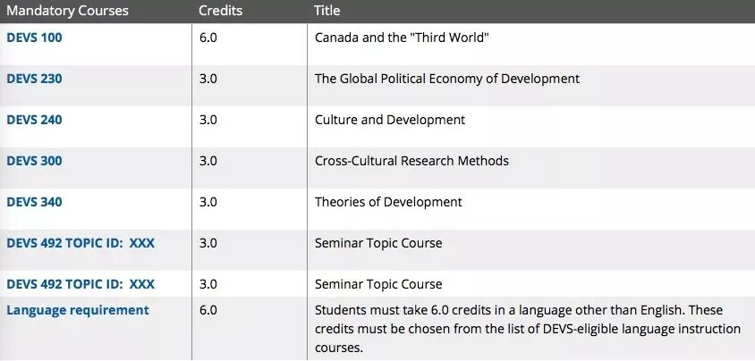
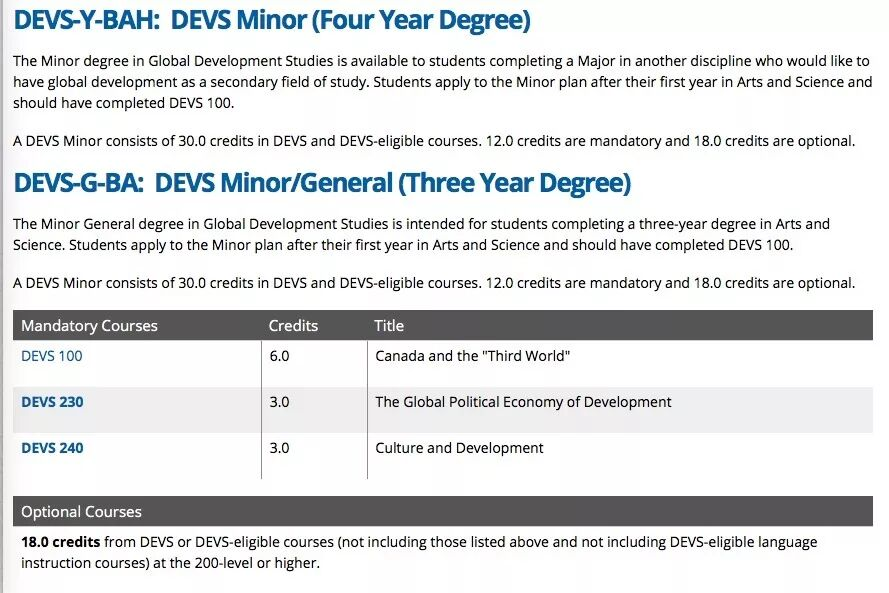
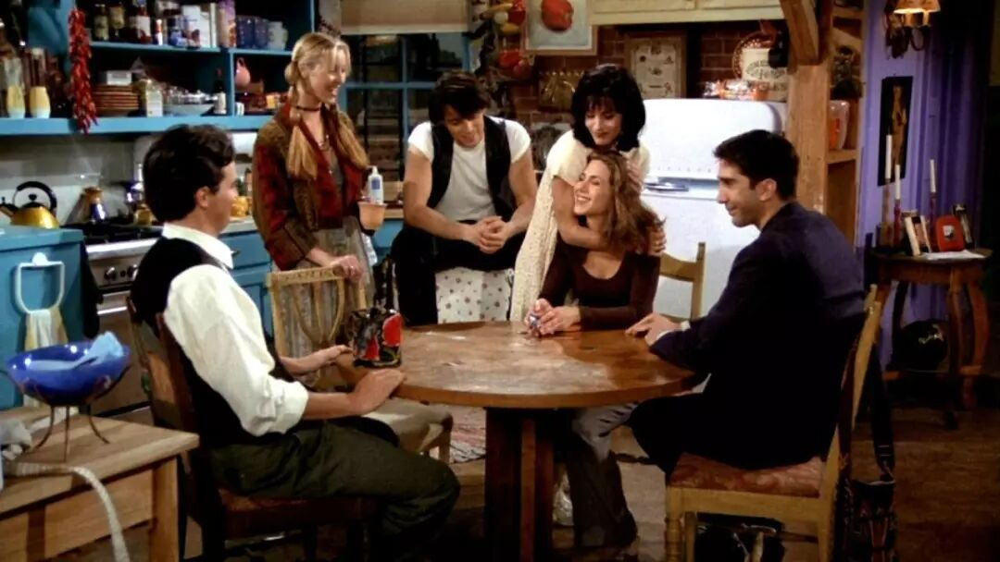

# GPS专业介绍  | Hi DEVS

> 来源：微信公众号  
> 原链接：https://mp.weixin.qq.com/s/0g-mVBLW24cDJTq7G9-B5w  
> 状态：自动搬运，暂未分类  
> 图片数量：7  
> OCR 图片文字数量：0

---

## 人工整理说明

本文件保留了公众号文章中的所有图片，没有自动删除装饰图。  
每张图片都用 `IMAGE-编号` 标记，方便后期人工检索、删除或补充说明。  
如果图片下方出现 OCR 文字，说明脚本尝试识别了图片中的文字，但需要人工检查准确性。  
OCR 文字只是辅助，不代表一定需要保留到最终正文。

---

DEVS，全称Global Development Studies，是最能体现Queen's arts男女比例不平衡的专业之一。一节课99个人中常常只有3-5个男生，Prof在课上最不用担心的事情应该就是讲到任何feminism相关的知识点台下没有共鸣吧~

DEVS是一门有点神秘感的学科，因为学这个专业的中国学生真的很少。不是相比于通常认为的热门专业来说少，而是200level以上的课程基本跟你一起上课的中国同学永远都是那一两个（感谢大家不离不弃！）。这种体验是很微妙的，因为以Chinese identity在基本全白人的tut上发言会很有意思，但另一方面有时候又可能会因为这个种族身份若有若无的感受到那么一丢丢……

总之，我们先来看一看，Devs到底是怎样一个学科。

**01**

What is DEVS?

先说这个专业是学什么的。Devs如它的名称，是学习国际发展问题的。从200+的课程开始，你会接触到各种研究，比如政治经济学、环境、城市、文化、难民、人口等各种主题的课程。课的等级越高，研究的主题越细致，也越有趣。但在有深度和广度的同时，难度也是不小的。

Devs并不是我的major，至于major这个专业的朋友们，总有找工作的困扰。记得在Devs100的第一节tut上（只有我一个中国人），TA问打算major这个专业的大家以后想做什么，基本回答都是进政府系统工作/慈善机构/社区建设/学术研究……（而这也是devs专业最容易给出的职业建议方向）大家反问TA未来的计划，TA说因为学了这个本科毕业不知道做什么所以一直念到了博士。就业是很现实的一个问题，Devs是一门学术性大于实践性的专业，所以对这个专业感兴趣的学弟学妹，尽量做好长期规划再做选择。

02

Devs Requirements

想要进入devs专业，大一需要上Devs100这门全年必修课。官网上并没有给出进专业的具体GPA要求，我大一的时候是按照人数录取major/medial/minor（印象中大概是75或60个major+15个medial+30或45个minor，时间久远记的不是特别清楚，数字仅供参考）。也就是根据devs100的成绩和平均GPA，在大一结束申请进入专业的同学中按排名选择。翻了一下我那年的grade distribution，想要进入devs专业，拿到B+及以上的成绩会比较稳妥。

Major devs的同学们一定要上的课程是Devs100，230，240，300，340，492（这门课是topic course，每个学期的topic不一样，要上两次不同主题的课）。同时，需要从devs-eligible language instruction courses里选择上6个学分的语言课（除英语以外），常见的法语、西语、意大利语、德语、日语等都是可以选择的。要注意的是国际学生母语是中文的话不可以选择中文。

【IMAGE-001 START】

【IMAGE-001 END】

https://www.queensu.ca/devs/undergraduate/degrees/major

minor的同学们就相对要轻松一些，除了Devs100，230，240是必修，只需要再学6门devs或devs eligible的课程即可，也没有二外的要求。

【IMAGE-002 START】

【IMAGE-002 END】

**03**

DEVS Eligible Courses

Devs eligible courses指的是不在Devs department，但可以被认证为Devs学分的课程。通常这些课程都关于Global North - South relations，涉及发展问题、理论范式、地缘政治等领域。

基本上a&s的专业都有一些课程可以被认证为Devs eligible，最常见的是Politics政治，History历史，Gender Studies性别研究，Art History艺术史，Languages,Literatures and Cultures (LLCU)语言文化研究等的课程，也包括小部分Econ经济，Music音乐，Film电影等专业的课程。2018-2019年的Devs eligible courses（包括major可以选择的语言）可至以下网址查看，每年认证的课程都会有略微变化，马上入学的同学们记得follow一下它的update哦。

https://www.queensu.ca/devs/sites/webpublish.queensu.ca.devswww/files/files/DEVS%20ELIGIBLE%20Courses%202018-2019.pdf

关于Eligible courses的常问问题也可以在这个网址了解更多详情信息：

https://www.queensu.ca/devs/sites/webpublish.queensu.ca.devswww/files/files/Frequently%20Asked%20Questions%20About%20DEVS%20Eligible%20Courses.pdf

04

DEVS Courses

以下分享部分Devs的课程体验~

**Devs 100**：必修，大一全年基础课。上学期的重点是介绍一些大的概念和理论知识，经济政治文化都会涉及。下半学期主要focus加拿大和第三世界国家的关系，包括indigenous communities，加拿大的国际关系等等。评分包括tutorial发言，小组的poster和presentation，essay，偶尔还会要去看画展写essay，每年评分细则都会有变化。不变的是惨无人道的期末考试，三小时手写essay，给terminology写解释+举例子，解答题等。考试时间一般安排在12月某个寒冷的晚上7-10点，没有更酸爽~

**Devs 230**：必修，政治经济学。非常干货的课，Prof人美心善但是节奏非常快，每次lecture都觉得大脑爆炸。贯穿全课程的是分析structural power在各种regime里的作用，每周都会有一个问题要求从政治经济学的角度分析某一事件，比如布雷顿森林体系，1982债券危机，企业社会责任等等。阅读量大且烧脑，但如果想拿高分一定要好好看书并且每节课都去。tutorial的参与度很重要，有midterm是take home exam，在限定时间内写essay（两篇各1500），有final exam也是考试现场写两篇essay~

**Devs 240**：必修，文化研究。相对于230来说没有那么紧张的课。每年的Prof好像都在变，所以评分、上课内容都会有调整。今年的评分极其注重参与度，无论是tutorial还是lecture的出勤/参与都会计入考量，tutorial是每周一个小组做一节课的presentation，给分完全看TA，队友很重要。其实这门课的内容乍一看还是蛮有意思的，会分析网络文化、旅游业、食物等很日常的话题，但reading不算少，essay也有，final exam也要背很多概念和相关作者名，期末想拿高分一定要好好好好好好复习。

**Devs 250**：选修，环境研究。从四个角度分析各种环境问题。非常喜欢这个英国腔的Prof（目前也是devs department的head！），上课很有意思，很inspiring。要写的东西多，评分基本全是essay，大概每三周一个限时essay，会给一篇文章然后要求从哪些角度支持/反对这个文章的观点或分析文章反映的环境问题。final exam也是写essay。reading非常多，因为基本每周都有来自四个角度的四篇文章。

**Devs305**：选修，古巴文化研究。winter term的课，6个学分，因为5月会去古巴哈瓦那大学两个星期。这门课也可以认证为film、gnds、llcu的学分（貌似还有额外几个专业，具体要去官网看哦）。这个可以说的太多了有机会专门写一篇推文分享。总之，如果你不怕苦不怕晒不怕脏不怕累想体验真·社会主义就来选这门课吧hhhhh。。。。。（如果报名的人多会要选拔，专业相关度、GPA、报名理由、年级等都会列入考虑）

05

How is Devs？

我和devs专业的朋友们最大的体验就是，DEVS IS DEPRESSING。这句话常常在每一节devs课最后一次tutorial被所有人说到并获得极大认同，因为devs总是在提出问题、分析问题，但没有办法解决问题。

它是一个很辛苦的专业（不过arts还有更辛苦的专业科科~），但是也很rewarding，因为系统学习这些知识会真的会影响你看待世界的一些想法和角度。但如果没有和这个专业纠缠不清相爱相杀的打算，并且非常不喜欢看reading+写essay+在tut发言的话，我个人的建议是不要选devs的课程，因为有更多同样有趣的课程作为选修能帮助你提高GPA。

但如果你有关怀世界的胸怀和学术研究的兴趣，也不妨首先尝试一下Devs100这门课，了解西方思维看待国际发展的方式，打开新世界的大门~

最后，把David McDonald教授在Devs100最后一节课送给我们的话送给大家：

The world is a fucked up place, but you are gonna get used to it.

【IMAGE-003 START】

【IMAGE-003 END】

文字 / Kedi

排版 / Kedi

编辑 / Lucas TT

校对 / Kedi Bill

【IMAGE-004 START】

【IMAGE-004 END】

【IMAGE-005 START】

【IMAGE-005 END】

【IMAGE-006 START】

【IMAGE-006 END】

❤️ ❤️ ❤️

【IMAGE-007 START】

【IMAGE-007 END】
