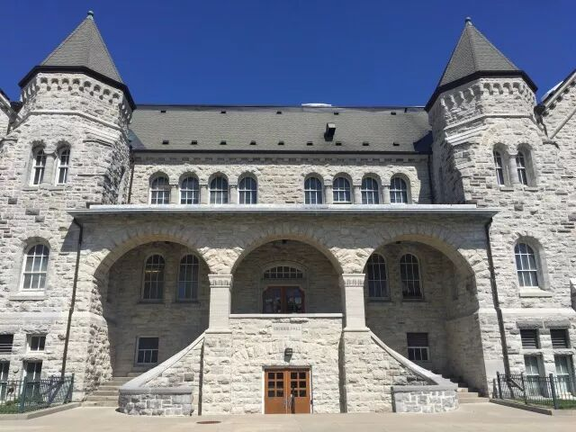
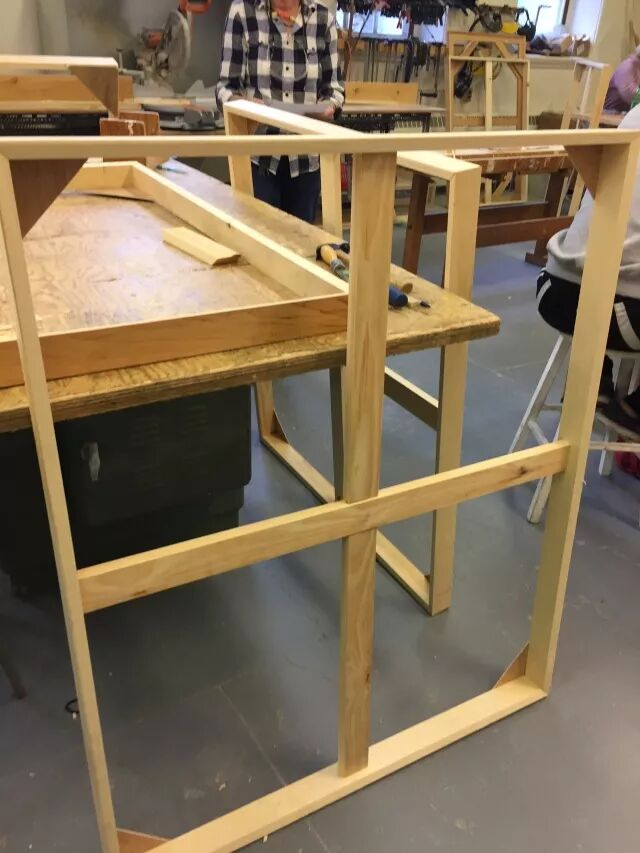
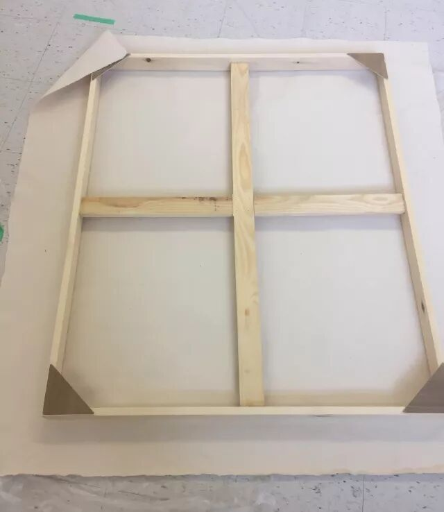
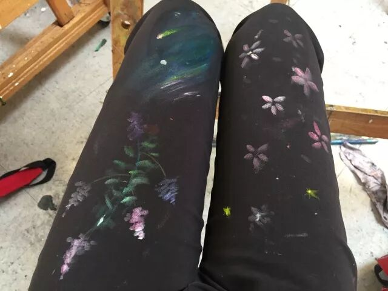
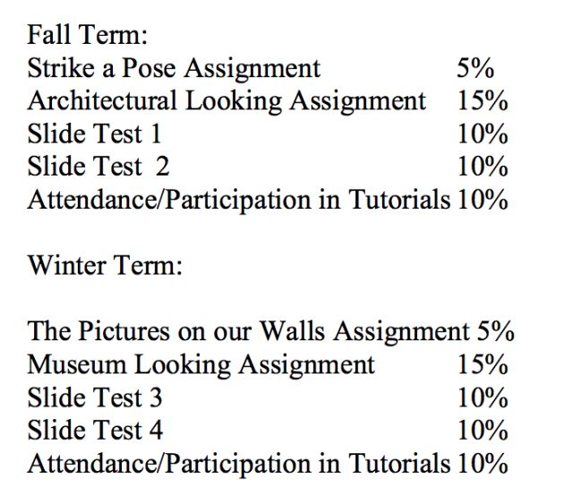
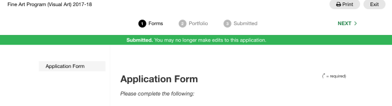
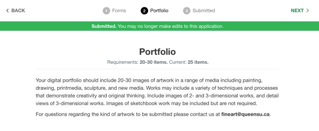
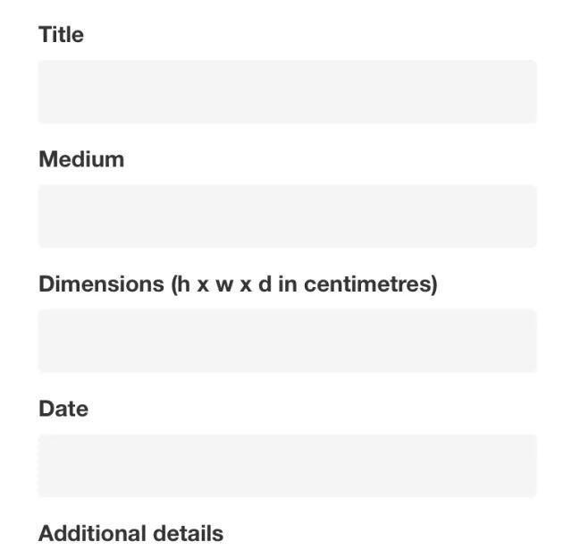

# GPS专业攻略 | 美术篇：艺术生的日常了解一下？

> 来源：微信公众号  
> 原链接：https://mp.weixin.qq.com/s/qhCLcPyHc70-QMHEaINYpA  
> 排版：已整理；正文图片：8 张

---

画

大家好呀！这里是画画画了一年的美工燕子。相信大家都不怎么了解Queens的美术系吧毕竟整个专业也就只有5个中国留学生。那我就介绍一下Queens其实并不神秘就是人少而已的美术系吧～

Fine Art(visual art) program 是个纯美术的专业，包含绘画(drawing and painting)， 雕刻印刷(printmedia)，雕塑(sculpture) 和新媒体(new media)。

官网：*http://www.queensu.ca/bfa/*

美术系是皇后大学里人数极少的专业之一。每年只招大约30个新生，以至于大一到大四可能一共才120个学生。这其中大部分都是漂亮可爱有才的小姐姐们，男生们少之又少，全系加上男老师可能还没有十个而且十男九gay真的不是说说的而已。

你以为我们的日常就是据锯木头，画画画画，裁裁纸板而已吗？

是的没错就是这样！

好了说正经的，接下来给大家介绍下大一的必修课。

因为美术专业需要特别申请，所以我也会在最后详细介绍如何申请这个专业。希望对大家有所帮助哦。

必修课

美术系是有必修课的，除了大一到大四都要上的美术课之外，大一和大二各要修6学分/年的美术史。大一要学绘画和雕刻；大二学绘画、雕刻和印刷；到了大三就可以三选二了。

大一到大三都是周一至周四每天一节课，每节课3小时（大四自己安排时间）。

周一到周三：11:30 - 2:30

周四：2:30 - 5:30

（时间仅供参考，具体按照自己的课表上课。）

千万别翘课！老师每堂课都会点名的！也就30来个人谁不来一目了然OK？翘课不单止会扣分，严重的话会被踢出专业的。

我们美术生四年来的上课地点在Queens最好看的拍照胜地——Ontario Hall！

**ARTF 127/6.0**

第一学期的ARTF 127分为三部分。

第一部分是每周一的wood shop。

是的你没想错！就是用《电锯惊魂》里的同款工具锯木条！

这节课就是为了让大家学会如何使用锯木头的工具。最后会要求大家做一个大画框，为下学期的final painting做准备。

第二部分是素描，从周二到周四学半学期。先是练习画静物和裸模（放心，不会有身材好的小哥哥小姐姐的，全都是大妈大叔）。还要要完成5幅左右不同尺寸题材的画和一幅大画。这些画老师会定个大概的题材，比如说自画像/静物。至于用什么画材和具体内容就随你喜欢啦。

第三部分是做3D作品，也是从周二到周四学半学期。这部分就是用纸板做出一个半人高的物品，和用大量的同一个小物件拼成一个作品。很考验手工技能和耐心，手残党的克星。

**ARTF 128/6.0**

前半学期练习画速写，后半学期画油画。最后也是要交4幅由特定条件和画法的小油画，和一幅大油画。这时候上学期做的画框就派上用场了！自己订上画布，刷上石膏底料（gesso）才可以开始画。学会这些技能后麻麻再也不用担心我买不到画板了呢。

平时没有什么作业，但是课堂上画不完的画还是要在课后完成的，所以一定要有due前睡画室的觉悟啊。

每天上美术课都是干干净净地去，然后带着满身木屑/炭粉/颜料出来。

想要做好看的美甲，穿漂亮的衣服？

别想了，到最后都会变得一团糟的。大家还是准备多点耐脏的衣服吧QAQ。当然你也可以把弄脏的裤子画成全球唯一一件的春季高定秀款哦。

虽然说美术课课时多又长，但是其实每天画画都是一个享受。老师并不会严格要求你的画法画技，而是给更多的空间我们让自由发展出自己的风格。想要提高的话，除了上课学习，也是要下课自主练习的。

哦对了，没有final exam哦～

哦对了，大二的十月下旬的时候会有个field trip去纽约参（玩）观几天哦～

**ARTH 120/6.0**

美术史是全年课程，从史前文明山洞壁画学到现代艺术，比较笼统（并不）地学习不同时期的著名画作。

到大二的课程就会分成不同时期，有文艺复兴时期、巴洛克时期、印象派、现代艺术…….任君挑选。

上美术史的好消息是没有final exam。但是！这可不代表就没有考试了！每个学期都会有两次课堂考试，1小时的时间里要写出老师随机选的10幅画的画名、作者名、年份、2句话描述和写一篇两幅画的comparison essay。

所以大家一定要去上课或者是看书啊！

平时有时间就背背画啊！

临时抱佛脚真的是在作死啊！

如何申请

聊完大一的专业课，大家对美术系有没有一点心动呢？

那就让我认真地教大家如何申请吧。

申请美术系除了要交基本的成绩资料以外，最重要的是交作品集。

作品集一般在二月中旬截止提交，具体看那年要求。

下面是申请资料网址

*https://queensbfavisualart.slideroom.com/#/login*

点进网址之后，先注册一个账号。

然后回答下列问题：

1. *Please tell us about your art training.*

（Include school, class level, techniques learned and materials used.）

2. *What do you hope to gain from a BFA program?*

3. *What are your other interests?*

（Tell us about your hobbies and other extra curricular activities.）

再上传20-30幅作品。

**所有作品只需要拍照上传照片即可。**

除了画作以外，还可以上交雕塑，摄影作品以及原创短片。

每幅作品都要介绍下作品名，材料，尺寸，完成日期/创作时间和详细资料。

tips：详细资料这里可以说多点关于你的创作想法或者是特殊的创作方式。

**大家记得按保存哦！**

Queens的美术系看重的并不是高超画画技法。他们最主要是希望看到你对美术的热情和你的创造力，你如何用你的作品来反映出你的个人经历思想观念，或者是纯粹为了美而诞生的作品。

希望这篇文章能让大家了解一下Fine Art，也希望热爱画画的小伙伴们来加入我们美术系哦～

大家要是有什么问题的话可以后台留言或者直接评论。

谢谢大家看到最后！

文字 / 彦之

排版 / 彦之

校对 / Jiana、Archie

编辑 / 奕凡

全年赞助 / Tian Bao Travel

分享加拿大女王大学学长学姐的经历

有趣好玩的活动

以及各专业信息和生活指南等

相见恨晚｜相见不晚

微信ID：QueensGPS

长按熊猫爪子关注
