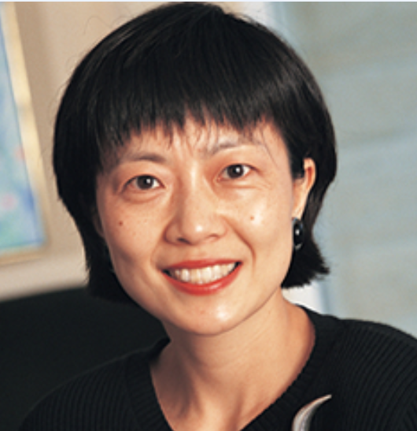

# GPS干货 | COMM系列课程教授推荐（Ladies篇）

> 来源：微信公众号  
> 原链接：https://mp.weixin.qq.com/s/IF8iKoKz0xztyz53JoVvBA  
> 状态：自动搬运，暂未分类  
> 图片数量：22  
> OCR 图片文字数量：0

---

## 人工整理说明

本文件保留了公众号文章中的所有图片，没有自动删除装饰图。  
每张图片都用 `IMAGE-编号` 标记，方便后期人工检索、删除或补充说明。  
如果图片下方出现 OCR 文字，说明脚本尝试识别了图片中的文字，但需要人工检查准确性。  
OCR 文字只是辅助，不代表一定需要保留到最终正文。

---

【IMAGE-001 START】

【IMAGE-001 END】

前

言

每年8月底，那令人紧张而又刺激的选课季即将拉开帷幕。提前做好准备，像迎接一场挑战般，方能在最后的关键时刻选到心仪的课程和教授！

        为了在这场选课的“战役”中旗开得胜，熊猫酱特别为亲爱的同学们整理了一份**Commerce教授的介绍**，希望这份资料可以成为你们焦头烂额时的得力助手，帮你们更有信心地选择适合自己的课程和教授。让我们一起迎接挑战，开启新学期的精彩旅程吧！

本篇主要介绍Commerce的几位美丽的**女性教授**，帅气的**男性教授**则会放在熊猫酱的**下一篇推文**中哦~

【IMAGE-002 START】

【IMAGE-002 END】

**Nailin Bu**

【IMAGE-003 START】

【IMAGE-003 END】

【IMAGE-004 START】

【IMAGE-004 END】

COMM173 Intro. to International Business

COMM376 Doing Business in Asia-Pac Rim

Nailin Bu 是**一位国际贸易方面的教授**；她和Susan Bartholomew共同教授COMM173，主要负责上半学期的教学工作。她来自上海，虽然可以使用中文进行交流，但更prefer使用英文。Bu上课风格温和有趣，然而，**她所出的试卷却相当具有挑战性**：这份试卷涵盖了课堂内容、PPT、阅读材料以及视频中很多容易被忽略的细节。因此，**学生们需要对每周课前准备的内容做出详细的笔记**。这样的教学要求对学生们来说是一项挑战，需要他们对课程的各个方面都有深入的了解和准备。

**Nicole Berube**

【IMAGE-005 START】

【IMAGE-005 END】

【IMAGE-006 START】

【IMAGE-006 END】

COMM181 Intro. to Human Resources Mgmt

COMM357 Interpersonal Skills for Managers

Nicole Berube 是一位专注于**人力资源领域的教授**，除了之前提到的两门课程外，她还曾教授过Organization Behaviour。她的课程时长一般都持续3小时。与其他教授相比，Berube的**课程设置中没有做题类的考试，而是要求大量的写作**。在她曾经的一次期末要求同学们在短短3小时内撰写出10页, double-space的作文，非常考验学生的手速和应变能力。尽管考试难度较大，但评分相对宽松，不会过于苛刻，给予了学生们在表达和展示能力上的一定发挥空间。

**Susan Bartholomew**

【IMAGE-007 START】

【IMAGE-007 END】

【IMAGE-008 START】

【IMAGE-008 END】

COMM173 Intro. to International Business

COMM374 International Business Strategy

Susan Bartholomew 是另一位**国际贸易的教授**，负责COMM173下半学期的教学。和Bu相比，**她的出卷方式更加仁慈**，不会过于纠结细枝末节的内容，课上讲了什么考试就考什么（课前阅读还是要认真读）。如果说Bu的考试只能拿到六七十分，那她的考试则可以拿到八十几分。她会用每周小quiz来督促学生认真预习上课内容（**敲重点！！**Final可能会考quiz原题）。她的Participation很难拿到10分满分——每节课发言+每周在discussion borad上完成上课总结可以拿到9分。这种设置旨在鼓励学生积极参与课堂讨论，加深对课程内容的理解。

**Christine Coulter**

【IMAGE-009 START】

【IMAGE-009 END】

【IMAGE-010 START】

【IMAGE-010 END】

COMM181 Intro. to Human Resources Mgmt

COMM351 Leadership

COMM358 Managing Human Capital

Christine Coulter是一位非常和蔼的**人力资源管理相关教授**。她注重多元性，经常邀请交换生分享他们国家的相关规章制度，以促进多元文化的理解和交流。Coulter在人力资源相关课程中经常涉及加拿大的劳动法，帮助学生更深入地了解员工在加拿大可以如何保障自己的权益。Coulter也**十分理解学生繁忙的课业，不会给他们过多的压力**。

**Olena Ivus**

【IMAGE-011 START】

【IMAGE-011 END】

【IMAGE-012 START】

【IMAGE-012 END】

(COMM172 Managerial Econ)

\*加上括号的课程表示这位教授曾经负责过这（些）课程，然而由于某些原因，在2023年暂时告别了这些课程的教学，未来可能重新接手这些课程。

Olena Ivus **主要教授低年级COMM的Econ课程**。她会细致地帮学生解答问题，努力确保每个学生都能够理解和应用课程内容，确保他们在学习过程中一直感到被支持着。

**Yulia Nevskaya**

【IMAGE-013 START】

【IMAGE-013 END】

【IMAGE-014 START】

【IMAGE-014 END】

COMM432 Brand Management

Yulia Nevshaya**非常注重课堂表现**：participation占总分的20%。Nevshaya通过大量真实的品牌广告例子，为学生提供实际的案例分析，帮助他们更好地理解如何经营一个品牌以及品牌建设的关键因素。这种实用的教学方法不仅帮助学生理论联系实际，还培养了他们在实际商业环境中判断和运用品牌经营策略的能力。

**Nicole Robitaille**

【IMAGE-015 START】

【IMAGE-015 END】

【IMAGE-016 START】

【IMAGE-016 END】

COMM131 Intro. to Marketing

Nicole Robitaille的授课方式**非常适合激发一年级学生对市场营销的热情**。她善于在课堂中运用大量生活中的例子，生动形象地解释市场营销的概念，使同学们更容易理解抽象的理论。很多大二后选择Marketing方向的同学多少都受到了她的影响。

**Tandy Thomas**

【IMAGE-017 START】

【IMAGE-017 END】

【IMAGE-018 START】

【IMAGE-018 END】

COMM336 Consumer Behaviour

Tandy Thomas是一位非常开朗有趣的教授，她的课堂总是充满了活力，也会鼓励并记录同学们的发言。Thomas尤其**重视学生的日常学习和写作能力**：她会有意给第一个小组作业打一个较低的分数并提供修改建议, 鼓励学生学习进步；拼手速的闭卷线下期末考试占40%，其中简答题和长篇幅问答题也占据期末考试总分的75%。

**Erin Webster**

【IMAGE-019 START】

【IMAGE-019 END】

【IMAGE-020 START】

【IMAGE-020 END】

COMM311 Fin Acctng Pract Prin & Concepts

COMM313 Financial Accounting II

COMM317 Auditing

COMM414 Management Control

COMM417 Business Combinations Accounting

Erin Webster是一位备受学生喜爱的**会计教授**，有学生形容她犹如天使一般给予学生温暖和鼓励。她深知会计的难度，**一个步骤一个步骤地引导学生解决问题**，通过细致的解题过程，帮助学生逐渐理解和掌握复杂的概念，应对会计学的挑战。考虑学习会计方向的同学来选择她的课程可能是一个不错的选择。

【IMAGE-021 START】

【IMAGE-021 END】

**Ending...**

**未完待续~**

更多精彩请期待熊猫酱下一篇推文！

【IMAGE-022 START】

【IMAGE-022 END】

文字 | 金秋灵

排版 | 金秋灵

编辑 | 金秋灵

审核 | Taniya, Jenny, Kyle
