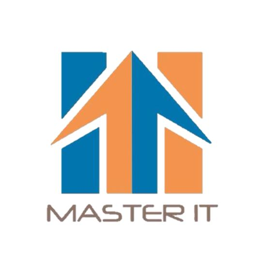

# GPS课程介绍 | Queen's100Level热门课程的正确打开方式

> 来源：微信公众号  
> 原链接：https://mp.weixin.qq.com/s/m0v-JmEExUkC_a4skoepHw  
> 状态：自动搬运，暂未分类  
> 图片数量：19  
> OCR 图片文字数量：0

---

## 人工整理说明

本文件保留了公众号文章中的所有图片，没有自动删除装饰图。  
每张图片都用 `IMAGE-编号` 标记，方便后期人工检索、删除或补充说明。  
如果图片下方出现 OCR 文字，说明脚本尝试识别了图片中的文字，但需要人工检查准确性。  
OCR 文字只是辅助，不代表一定需要保留到最终正文。

---

“

绿草茵茵，夏风习习，空气中飘洒着轻盈的栀子花香，莘莘学子又将踏上新的征程。跌入时间的洪流中，一晃神手里却攥着的却不只是汗水。

”

首先要恭喜所有攻克难关斩获offer，加入Queen's 大家庭的学弟学妹们。

入学最重要的事情之一就是选课了，由于Commerce和Firstyear Engineering的课程表已经被学校安排好，因此自己**选课**以及**排课表**基本就成为了**Art & Sci**学员在假期得到的第一项任务，哦不，是Art & Sci学员独享的一份自由和快乐！

本期我给大家分享几门**100Level**中自由快乐的课，一起来看看吧~ 👇

（p.s. : 想获知相关专业的内容，文末有贴心传送门哦）

【IMAGE-001 START】

【IMAGE-001 END】

【IMAGE-002 START】

【IMAGE-002 END】

【IMAGE-003 START】

【IMAGE-003 END】

【IMAGE-004 START】

【IMAGE-004 END】

**MATH 12x**系列

Full-year Courses & 6.0 Credits

MATH12系列的课学习的都是**微积分相关基础**，也是Queen‘s经济专业和几乎所有Sci范畴内专业在大一的必修课。

    具体课号有**126**、**124**、**121**和**120**这四门，但只能选其中一门来学。**课号**按**从大到小**排列来看，内容会变得**越来越丰富****深入**。

    像MATH121这门，你就会学到如何利用常见的微积分知识去解决**各类应用题**，Gottesman和Ableson教授那‘interactive’的课堂氛围，集体参加答题互动是家常便饭，课后可以去**网站上浏览课件**视频。而在MATH120的课堂上，黑板上总是有神秘的数学公式和从未见过的的符号等待大家探索，Mingo教授一丝不苟认真风趣……坚持去听课，很多难点教授讲过之后真的是茅塞顿开，一定会有所收获！

【IMAGE-005 START】

【IMAGE-005 END】

**SOCY 122**

Full-year Course & 6.0 Credits

相信大家看到这个名字的第一反应都是”这是个啥”。其实它全称是耳熟能详的‘**Sociology**’。（学长别卖关子了，名字这么“社会”，难道内容也······）

    这位同学你说的没错！它就是听起来“社会”，实际**对社会现象进行研究**的一个学科。122作为基础课就是——Introduction to Sociology。可以非常直接的了解到**各种主义**，如马克思、恩格斯等，以**社会学概论**根据微观和宏观**分析社会进程**，运用这些理论**剖析加拿大****社会**等等。

    因为是全年制的一门课，它分上下两个学期。每个学期内Tutorials占5%，Small Assignments占10%，Paper占15%，Exam占20%。大部分内容需要**理解并记忆**，对此科目感兴趣且不害怕背书的同学们（懂我意思吧），不要放过了喔。

【IMAGE-006 START】

【IMAGE-006 END】

**PSYC 100**

Full-year Course & 6.0 Credits

既然我说到了记忆，那就再提一嘴**心理学**。

    如果你想象中的心理学课是上天入地无所不能，那100这门神课可能让你有些小失望。它虽然不具备让你一眼洞穿人心那样酷炫奇妙，但作为一名初学者，接触到这个领域中依然惊喜不断。课程涵盖的知识繁多，从**认知**、**感知**、**大脑的构造和运作方式**，到研究**个体差异**，**社会心理**，**病态心理**诸如此类。

    这门课不用写那些长篇大论的essay，但每周要接触**大量的阅读**。课本，视频，课堂资料都是重要内容，一定要有耐心。**小组lab**是规定要参加的，对关键点的理解很有帮助。

【IMAGE-007 START】

【IMAGE-007 END】

**ENGL 100**

Full-year Course & 6.0 Credits

曾有幸成为这门课众多听客的一员，源于我本人的好学好奇。要是你认为学习ENGL就像是雅思阅读和写作，那可得打消这个念头。

    准确来说ENGL是和‘**English Literature**‘英文文学息息相关的科目，所以**世界名著**、**各路文学**，甚至**剧本**、**连环画集**，都有可能成为你的教科书哦。教授也会结合课文举很多例子，纠正大家写文章时常见易混淆的**语法**错误，以及**word choice**等一系列 常见问题。

    每周两节Lecture和一节Tutorial，一学期以Tut Participation / Assignment (short essay) / Exam按比例计算总成绩。同学们在盘之前要谨慎考虑，读文学**看书写心得**最最最重要！（敲黑板，快拿小本本记下来）

【IMAGE-008 START】

【IMAGE-008 END】

**FREN 106 / FREN 107**

Half-year Courses (Fall or Winter) & 3.0 Credits

顾名思义，它们是纯正的**法语语言学习**课程（在二外国家修一门三外，很刺激对吧 / 滑稽）。106是入门，107是进阶。当初选这两门课的时候我找了好半天，最后**网课**中捞到了它们。接下来我要介绍的诸多好处也正基于此。

    首先，线上课程对学生数量的限制没其它课大，并且本地学生大多在高中曾接受过法语的学习，来选修这门基础课的人相对不多，**抢课佛系**。其次，网课最棒的地方就在于**自由**，你可以**随意安排时间**学习，再也不用纠结课程时间冲突，也不需要在相隔万里的教学楼之间来回穿梭。再者，这两门课学习**任务较轻**，教授只负责学期规划，通常是TA以线上讨论的方式帮大家扫盲。

    **考试**统统**online**，作业只有每学期一个随机分组的**Group Presentation**外加每周一两小时的**线上教程**，而这些的**DDL都在学期末**，时间非常宽松。

【IMAGE-009 START】

【IMAGE-009 END】

**ECON 110 / ECON 111 & ECON 112**

110：Full-year Course & 6.0 Credits

111：Half-year  (Fall)   & 3.0 Credits

112: Half-year (Winter) & 3.0 Credits

之所以把它们放在一起，是因为**ECON 110**这门全年课的内容 **=** **ECON 111**（微观经济）**+ ECON 112**（宏观经济）。

    两种组合的学习任务近乎一致，一学期2个**Quiz**、3个**Assignment**、1个**Exam**。其中110上学期和111的任务相同。

    作为**经济专业**一年级**必修**课， 你可以根据自身需求选择每周固定三次Lecture，节奏相对舒适，每次只有一小时的ECON 110；或者选择每周只有一次Lecture，每次三小时，对自己排课更加灵活的ECON 111 + ECON 112.

【IMAGE-010 START】

【IMAGE-010 END】

**GEOL 102**

Half-year Course (Fall or Winter) & 3.0 Credits

Geology 102是地质学系中的一门基础兴趣课。主题非常具有逼格也足够吸引人，名曰——**宝石鉴赏。**

    对矿石感到好奇，渴望看到五颜六色的宝石或者对blingbling的东东有莫名执念的同学们，请吃下我这份安利！和蔼的教授会带着你从不同类型**宝石的历史**出发，讲解每一块宝石珍贵耀眼**背后的故事**，并且教你**逐一****辨认**。

    每周的**Tutorial**（实际上是个Lab）建议你们去参加，近距离**接触宝石**加以**研究**的机会就摆在你面前哟～平时没有任何测验，每节课的讲义都会放在网站上方便浏览和记录。Exam考一些讲过的知识点，注意细节便可过关。

    综上，GEOL 102是一门看起来有点梦幻，实则‘可玩性’很高的课。

【IMAGE-011 START】

【IMAGE-011 END】

**CISC 101 / CISC 110**

Half-year Courses (Fall or Winter) & 3.0 Credits

很多小伙伴都有一个编程梦，但觉得自己没什么基础，想入门却不知道从何开始？

    没关系！这里有面向广大没有接触过CS的同学们，**秋冬季都开设**的**CISC101**计算机入门课程，只要一个学期，你买不了吃亏买不了上当，还能把3个学分领回家！

    所用编程语言为简洁实用的**python**，内容包括：计算机构造等**硬件**方面的小知识和**语句嵌套**、**进制转换**等常用技能。课上会用大量实际操作来演示所学内容，作业都有相关要求和提示来帮助大家独立编写出好有意思的小程序。

    同样是入门课程的**CISC110**所用也是python语言，对比101则更加适合对**图像绘制**、**图像处理**有兴趣的小伙伴。

【IMAGE-012 START】

【IMAGE-012 END】

**CISC 102**

Half-year Course (Fall or Winter) & 3.0 Credits

这是一门披着Computer Science皮的数学课，也是**cs专业的必修课**，大名**Discrete Math**，离散数学。

    主要学习**计算机**需要的与**数学相关**的知识，包括**集合**、**数学归纳法**、**排列组合**、**矩阵**等内容。大佬们听到这门课都会轻飘飘的总结到：高中数学。的确，他没有高等数学的内容，平常课业轻松，因此也荣登queens“水课”排行榜之列。

    这门课fall和winter都有安排，以**三个Quiz**和**Final**计分，没有Midterm和其他Assignment的困扰。对于数学好的同学们是一节提升GPA的好课，但如果你没什么数学天赋，那需要花很多精力学习。

【IMAGE-013 START】

【IMAGE-013 END】

**DRAM 100**

Full-year Course & 6.0 Credits

作为戏精本精的你怎么可以错过dram100呢？不同于别的专业课，大一戏剧课可以说是一门相对轻松的课，一周一次的Lecture听两个教授聊聊艺术和人生，时不时鼓励你多喝水多运动多睡觉，生活不止学习，要享受人生。Lab上和十几个同学一起创作剧本，排练，聊天，做游戏。

    作为戏剧的启蒙探索课，你将在这门课上**深入了解戏剧艺术**，感受她的魅力，体会**另一种交流方式**，启发**对人生的新思考**，并且将有机会对灯光服装声音，演员导演编剧等**各个职位进行体验**，将你的成果通过**三次的展演**呈现给大家，演戏从此不是梦！

    不过，你以为就这样了吗？醒醒！这是大学，并不是排排剧划划水就可以拿高分了，你还会需要每周完成**Online Module**三篇各120字的问答，阅读7本左右的**剧本**，就每一部剧写千字以上的**剧评**，下学期还要完成一篇2500字的大**Essay**，并参与**Final**考试。除此之外还会有大量的**额外阅读材料**和多个两三小时的**戏剧**需要观看，想到拿到高分还是需要花心思，多思考，认真学。所以，Queens没有水课哦。

以上就是本期希望和大家分享的内容，如果还想了解100level哪些课程请在评论区留言哦~ 更多问题欢迎留言至微信公众号或者直接添加小助手微信获取更详细的情报！

（感谢TT和容易提供的帮助~）

【IMAGE-014 START】

【IMAGE-014 END】

各专业详情，请戳下方传送阵👇（持续更新中~）

· [GPS专业介绍 | 神秘的Sociology社会学](https://mp.weixin.qq.com/s?__biz=MzA3OTc3NDUxNg==&mid=2651191954&idx=1&sn=1e57859c7068e9c0ad88700aceeee5d9&scene=21#wechat_redirect)

· [GPS专业介绍 | Hi DEVS](https://mp.weixin.qq.com/s?__biz=MzA3OTc3NDUxNg==&mid=2651191998&idx=1&sn=f3bd122e7f4ea2bbe5b9d76675e95529&scene=21#wechat_redirect)

· [GPS专业介绍 | Economics：一个听起来很有钱的专业](https://mp.weixin.qq.com/s?__biz=MzA3OTc3NDUxNg==&mid=2651192004&idx=1&sn=dd1a9f64ee43d32620228fb620a2af2a&scene=21#wechat_redirect)

· [GPS专业介绍 | 一入Film&Media深似海 从此头发是路人](https://mp.weixin.qq.com/s?__biz=MzA3OTc3NDUxNg==&mid=2651191937&idx=1&sn=ba1d7d11df9799377b6577fc7bd48116&scene=21#wechat_redirect)

· [GPS专业介绍 | 在Queen's读Engineering是一种怎样的体验？](https://mp.weixin.qq.com/s?__biz=MzA3OTc3NDUxNg==&mid=2651191924&idx=1&sn=cdd1c4f9fa49c40d140ab6cdd763aaea&scene=21#wechat_redirect)

· [GPS专业介绍 | 万众期待的Comm来啦！](https://mp.weixin.qq.com/s?__biz=MzA3OTc3NDUxNg==&mid=2651191972&idx=1&sn=3f9adf751c9f8c4184c96dc27e470353&scene=21#wechat_redirect)

· [GPS课程介绍 | 选择PSYC100以前你需要知道的一些事](https://mp.weixin.qq.com/s?__biz=MzA3OTc3NDUxNg==&mid=2651192026&idx=1&sn=226bcb32e337991b0198ab889406962f&scene=21#wechat_redirect)

【IMAGE-015 START】

【IMAGE-015 END】

文字 / Jacky

排版 / Jacky

编辑 / Lucas TT

校对 / Kedi Bill

【IMAGE-016 START】

【IMAGE-016 END】

【IMAGE-017 START】

【IMAGE-017 END】

【IMAGE-018 START】

【IMAGE-018 END】

❤️ ❤️ ❤️

【IMAGE-019 START】

【IMAGE-019 END】
