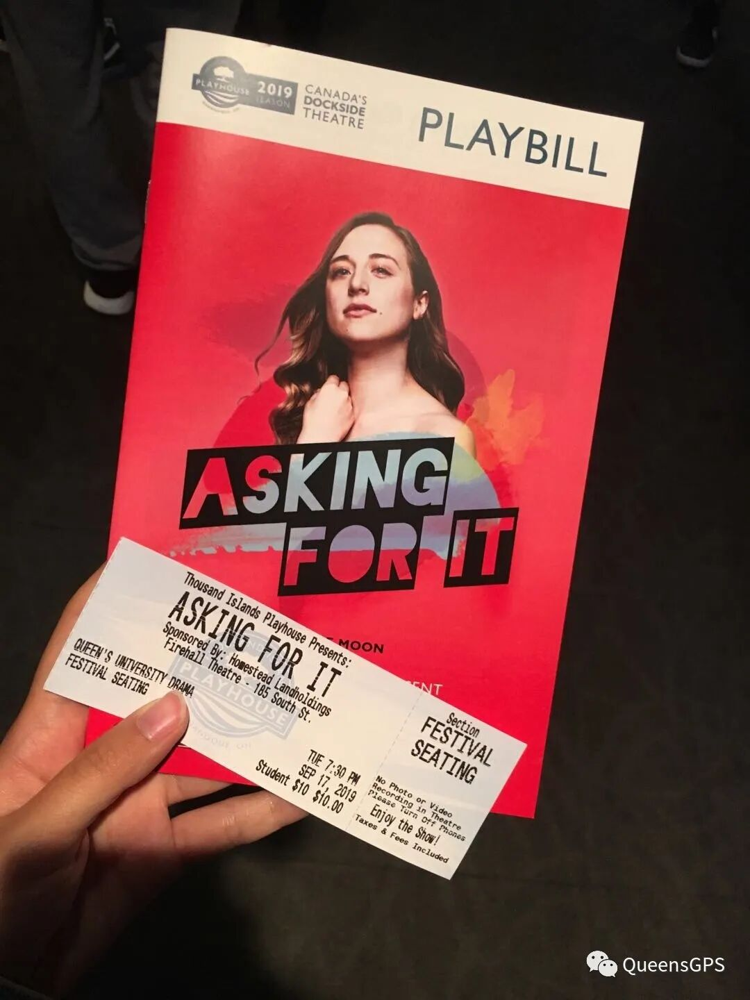
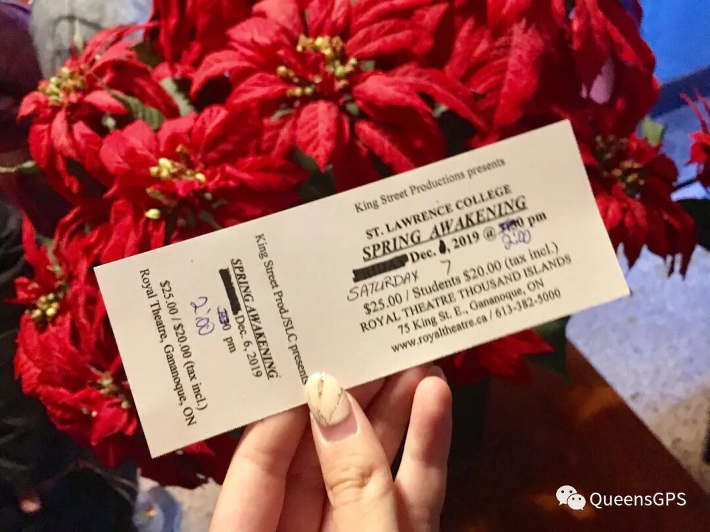

# GPS课程介绍｜Dram100：走进剧院

> 来源：微信公众号  
> 原链接：https://mp.weixin.qq.com/s/e3dmxcLiJNF_FBaEytWTYg  
> 状态：自动搬运，暂未分类  
> 图片数量：6  
> OCR 图片文字数量：0

---

## 人工整理说明

本文件保留了公众号文章中的所有图片，没有自动删除装饰图。  
每张图片都用 `IMAGE-编号` 标记，方便后期人工检索、删除或补充说明。  
如果图片下方出现 OCR 文字，说明脚本尝试识别了图片中的文字，但需要人工检查准确性。  
OCR 文字只是辅助，不代表一定需要保留到最终正文。

---

**怀念美好旧时光**

**Welcome to Dram100**

戏剧，是人类最古老的艺术之一。你或许对它一无所知，亦或者是有半只脚已经踏入门槛，再或者想多了解一下这个专业的魅力。如果你符合以上一条，那么Drama100无疑是你的最好选择啦！在这节6个学分的年课中，教授将带着你认识耳熟能详的莎士比亚，到本地的小众艺术家去了解戏剧的魅力，结构，与表演技巧。接下来就让熊猫酱带你了解一下DRAM100这节课吧～

**01**

怀念美好旧时光

**课上会教些什么？课程是怎样安排的？**

Dram100主要学习的还是基础类的戏剧知识。如：戏剧的不同种类，戏剧的基本要素，同时练习戏剧的表演／编导能力等等。

课程的话Drama是一周一节3小时的lecture，在课上我们会延伸上一周module的部分知识，同时教授会以此为引子，承接接下来的新内容。在lecture期间，教授一般都会放一些戏剧的影视片段供大家参考，同时时不时地组织小组讨论，还会跟大家交流小组讨论后的心得。

除lecture外，Drama每周还会有一节tutorial。在tutorial上，TA会引导学生运用课上学到的概念来表演。除表演外，TA还会组织活动，让同学们在熟练表演技巧中认识彼此，便于后期小组合作，以及之后的团队表演（Version1.0/2.0/3.0）

【IMAGE-001 START】

【IMAGE-001 END】

（Lecture课上教授邀请的guest speaker，在课上与学生交流心得与经验）

（图为DRAM100要求观看的戏剧之一的门票与宣传册，左图为同时担任编剧及主演的Ellie Moon受邀在课上与教授交流）

【IMAGE-002 START】

【IMAGE-002 END】

**02**

**课程量大不大？Assignment多不多？**

在介绍Work load之前，熊猫酱在这边提醒大家，Work load的主观印象较大，每个人心中都有自己的度量衡，推文中的只能作为参考喔～

在秋季学期中，学生大部分时间需要读一本戏剧后写一篇response（600-800字）看起来难度很大，但其实每周读的书都是偏口语化的内容，非常容易好懂。教授也提到了，response的内容可以是意识流，只要每周都写了就会有基础分。

在冬季学期中，学生需要每周看一部戏剧表演。教授会提供链接，不需要付费。同样的，看完后需要写一篇字数与秋季相同的response。如果这周没有需要读／看的戏剧，相对应要写的response字数也会变少（最少450字左右）。但值得注意的是，除了每周的基础分外，还有一部分分数是会从之前写过的response中抽取三篇，并对其中的quality进行打分。

除了每周需要写的response，贯穿秋季和冬季学期的还有三场presentation：version1.0，version2.0 和version3.0。第一场在秋季学期中举行，剩下两场都在冬季学期。这三场presentation需要同一个Lab的同学组织一场theatre performance。如果小组成员配合好的话，这项任务不会特别难的。

除此之外，drama每学期期末都会写一篇大paper。个人觉得这是drama100中最有难度的一项任务，非常考验理解能力和写作能力。

**03**

**平时上课会无聊吗？课后有活动吗？**

如果你对戏剧感兴趣，并且想寻找一位引路人带你跨进戏剧的门槛的话，Dram100是不会让你感到无聊的！

首先，Dram100的教授（Grahame Renyk）是一位非常优秀，且善于引导学生的老师。在平时的教学中，他能够将片段式的内容巧妙地用语言组织起来，方便学生理解。他对中国的戏剧、文化、历史等等都有一些了解，并且经常会在课上提到有关中国文化的例子。教授平时也是个平易近人的大（Lao）叔（Tou），无论是去找他问问题或者是讨论课上内容他都是很欢迎的。

其次，在平时Dram100的课程学习中，我们所学习的内容看起来是简单易懂，但是教授埋了很多供学生深入思考的小点。这样从浅入深地学习下来，不仅仅收获了戏剧相关知识，同时还锻炼了哲学的思辨能力。

最后，在Dram100的课程中，教授会在一开始给学生提供一张推荐观看的戏剧清单。中间有些剧是要求去观看的（教授推荐的大部分不会踩雷），还有一些剧是不强制观看的，去看会有bonus point，可以作为加在response里的附加分。在教授推荐的清单中，（个人觉得）基本上每个都很好看，很少会踩雷！

对戏剧抱有热情的你，快来体验一下Dram100的乐趣吧！

（秋季学期末，教授为大家争取到的免费剧场票）

【IMAGE-003 START】

【IMAGE-003 END】

【IMAGE-004 START】

【IMAGE-004 END】

（猜猜哪一位才是刚刚提到的教授呢？）

文字 Spencer

排版 Spencer

编辑 容易

审核 TT Chris

【IMAGE-005 START】

【IMAGE-005 END】

【IMAGE-006 START】

【IMAGE-006 END】
