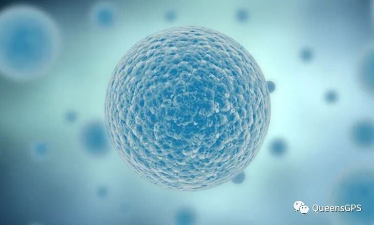
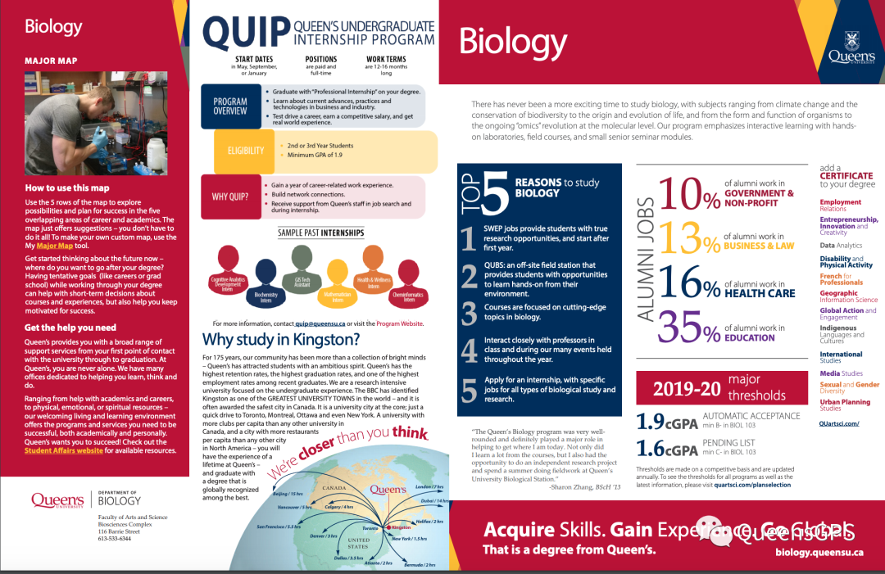

# GPS 课程介绍 |不是你以为的Biol 102

> 来源：微信公众号  
> 原链接：https://mp.weixin.qq.com/s/qSiS6mvUnUbHdcP5b5ihRQ  
> 状态：自动搬运，暂未分类  
> 图片数量：11  
> OCR 图片文字数量：0

---

## 人工整理说明

本文件保留了公众号文章中的所有图片，没有自动删除装饰图。  
每张图片都用 `IMAGE-编号` 标记，方便后期人工检索、删除或补充说明。  
如果图片下方出现 OCR 文字，说明脚本尝试识别了图片中的文字，但需要人工检查准确性。  
OCR 文字只是辅助，不代表一定需要保留到最终正文。

---

【IMAGE-001 START】

【IMAGE-001 END】

**WELCOME TO BIOL 102**

作为一门对**高中生物有一定基础要求**的课，看到它的第一眼，熊猫酱就优先考虑到了选**Biol 102**来作为一门选修课，毕竟本人高中三门科学分课时选的就是生物而且学的还不错！于是当年的我信誓旦旦地将秋季的Biol 102 和冬季的103 一口气全放进了我的“购物车”里。我依旧记得当时Biol103 还是排了老长的队才成功从waitlist里挤出来的呢！可当到了Queen‘s，上完第二个lecture以后，我突然开始意识到一个很严重问题。。。

**这门课真的适合我吗？**

【IMAGE-002 START】

【IMAGE-002 END】

【IMAGE-003 START】

【IMAGE-003 END】

**1.**

**课程内容介绍**

Bio 102 和 103 基本上可以算是一节课，前者讲**cell（细胞）**后者讲**organism（生物体）**。只不过它们分为了两个学期来上，每门课算**3个学分**一年可以拿6个学分。**102 是秋季第一学期上而103是冬季第二学期上**（因为熊猫酱只上过102 所以这里重点介绍102，是的你没想错，第二学期我果断把103 给drop了。。。＃－.－）但如果你是往生物专业这方面走的话，就请务必把**两门课都选上！**

    Biol 102 是一门**大一生物基础课**也是进生物专业的**必修课**，在大一新生中算是比较热门的。Biol 102 的主要内容是介绍一些**现代生物学的基本概念**，包括了从**分子到细胞**的组织层次等主题。也就是说它无疑是我们高中生物的升级版，将一些基本概念和themes讲解的更加深入和透彻。

其中一些重点的主题有：

**- 大分子分类/功能**

**- 细胞结构/功能**

**- 细胞呼吸**

**- DNA 复制**

**- 蛋白质**

**- 生物技术等**

【IMAGE-004 START】

【IMAGE-004 END】

**2.**

**课程形式**

Biol 102 的授课形式主要是由两个部分组成：**Lecture 大课 + Labs 实验课**。每周两次的lecture基本上都会在生物教学楼**Bioscience**进行，教授大多会以**ppt**的形式来传递教学内容，学生在下面记笔记。一般来说教授会把每节课的ppt提前**上传到Onq**（有点像大学生的Google Classroom，里面有每门课的详细信息和教学内容）上以供学生预习/复习。（这里熊猫酱还是给各位新生提一下，虽然不知道为什么但是一学期的课程是分别由**两名教授授课**的，前6星期一位+后6星期一位，分工明确👍）Lab每周一次，是一节平均20+人数的**小课**。生物实验课不像化学实验课是“wet lab”， 它不需要带护目镜或者实验服，也不需要写lab report，课上内容更多的是小组**case study**，来巩固lecture上讲的知识点。可不要小看这些labs，它们可是占了**三分之一**的总成绩呢 ！每节lab会有一个相应的主题和需要完成的小型**assignment**在下课之前上交，所以不会留作业。因为是小组assignment所以这时抱紧大佬大腿是很有必要的！

【IMAGE-005 START】

【IMAGE-005 END】

**3.**

**课程构成即评分标准**

除了lecture和labs，这门课一学期会有四个**online quizzes**，大概十几道选择题通常是课上讲到过的，可以自己做也可以找小伙伴一起（占比十几%）；然后每周需要在网上做每个chapter的**练习题**（完成就是满分8%）；两次lecture上的**随堂考**，占10%，虽然也是选择题但是出的题目都是大题，需要完全**理解知识并运用的**，如果没有好好复习的话可能连题目也看不懂（如果你隔壁坐了个大佬就另当别论）；还有每节课讲课前老师会出几道**Qlicker**题目复习一下上堂课的内容，这个是需要电脑操作的，也是选择题每个人选一个答案，选了也相当于是一次记attendance，只算完成分2%；最后的最后就是我们的**final exam**，总占比和labs一样也是三分之一，没错这门课**没有midterm！**但是没有的midterm的副作用就是到了考试周你需要用短暂的几天复习时间将整个学期的内容掌握，这可是一项大工程。。。

【IMAGE-006 START】

【IMAGE-006 END】

**4.**

**总结+建议**

总的来说，Biol 102 绝对**不是一门可以划水**的课。在高中基础上，它的知识点不知道扩展和复杂了多少倍，课程**进展飞快**，一节课一个topic。很多时候你会发现一个知识点还没完全弄明白就已经开始讲下一个了。而且众所周知，lecture通常是一两百人的大课，如果在课上有不明白的地方举手提问对于熊猫酱来说是非常有挑战性的，所以这里建议新生们一定要记好教授的**office hour**，找时间和老师面对面地把不懂的地方弄懂，不然的话你会发现后面的内容会越来越听不明白。另外建一个自己的**study group**真的是一个非常有效的方法，不管是考试复习，线上测试，还是小组作业，又或者只是想找个人梳理一下知识点，你的study group 都可以给予你一定程度上的帮助。

    Biol 102在课程设置方面和很多其他课程一样注重偏**独立学习和探索**，同时让学生学会利用好线上线下**丰富的资源。**说到资源，熊猫酱最后悔的一件事就是开学的时候去书店买了一本Biol 102的实体教科书📗。因为这门课有很多网上的练习题需要有书里的**access code**才能登陆网站，本来我可以直接买code然后看网上的e-text，可是我当时觉得实体书看起来会方便一点所以还是把书买了。结果。。。总共看了没有10次。。。或许当你看着一本几千页的教科书，密密麻麻的字而且还是散装的，你就提不起劲翻开它吧。

【IMAGE-007 START】

【IMAGE-007 END】

对于奔着生物专业来的小伙伴们，熊猫酱提醒Queen's进生物专业的分数要求是在Biol 103 达到B而且整体GPA需要达到1.9。以下截图是生物的Major Map，更多详情可以参考Art&Sci 官网。

【IMAGE-008 START】

【IMAGE-008 END】

https://careers.queensu.ca/sites/webpublish.queensu.ca.cswww/files/files/Biology%20Major%20-%20web.pdf

    看到了这里，相信各位小伙伴们对于这门课也有了一定程度上的了解。在这里需要申明的是，以上叨叨纯属熊猫酱**个人主观看法**，分享了我上Biol 102 时的一些心得，并不代表能其他学生的看法。而今年因为疫情原因改为线上授课，课程结构和评分方面也会有**相应的调整**所以以上介绍仅作为参考。说了这么多，熊猫酱还是想告诉新生们，如果你不是冲着生物/科学方面的专业来的，或者对生物感兴趣，单单只是想选一门选修课凑学分的话，一定要**谨慎**选这门课作为选修或者合理安排自己的课程不要给自己太大的学业压力哦！笔芯❤️

**THE END**

【IMAGE-009 START】

【IMAGE-009 END】

文字 Nina

排版 Nina

编辑 容易

审核 TT Chris

【IMAGE-010 START】

【IMAGE-010 END】

【IMAGE-011 START】

【IMAGE-011 END】
