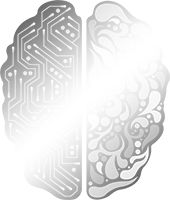
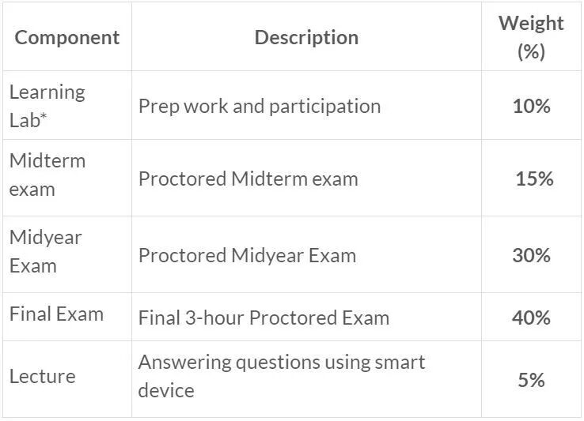
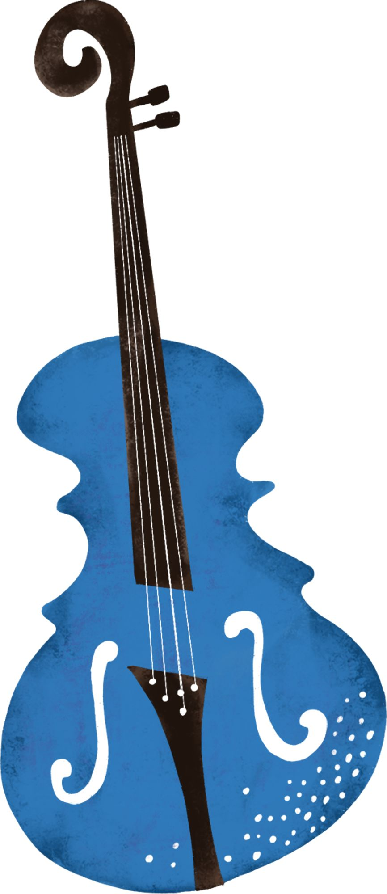
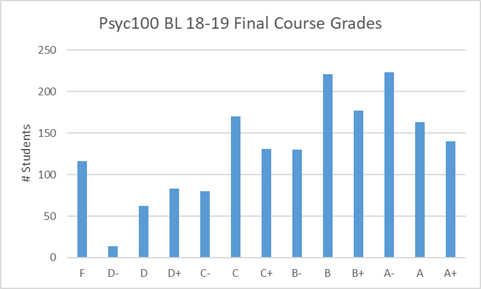
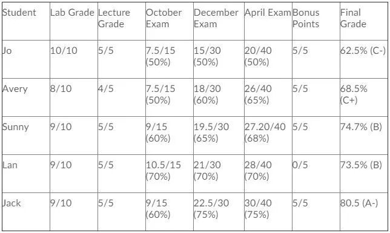

# GPS课程介绍 | 选择Psyc100以前你需要知道的一些事

> 来源：微信公众号  
> 原链接：https://mp.weixin.qq.com/s/b_148G1fHptymTCRTtapYA  
> 状态：自动搬运，暂未分类  
> 图片数量：9  
> OCR 图片文字数量：0

---

## 人工整理说明

本文件保留了公众号文章中的所有图片，没有自动删除装饰图。  
每张图片都用 `IMAGE-编号` 标记，方便后期人工检索、删除或补充说明。  
如果图片下方出现 OCR 文字，说明脚本尝试识别了图片中的文字，但需要人工检查准确性。  
OCR 文字只是辅助，不代表一定需要保留到最终正文。

---

【IMAGE-001 START】

【IMAGE-001 END】

你想在狼人局中一眼看穿别人的身份吗？你想读懂另一半内心真实的想法吗？你想解读梦境的潜在含义吗？来选psyc100吧，上完之后，以上这些，你，依旧都不会。: )

大部分的人对于心理学这个学科都有很大的误解，以至于抱着好奇的心理选择了这门课。然而当真正上了课后才发现，这个学科实在是与想象中的出入甚远，非但不能学习神秘的读心术，反而成了课业的一大拖累，学的又苦，分数又低。我当初就是怀着对高中心理社会老师的喜爱，和误以为心理学会和高中一样简单有趣的想法毅然决然选了psyc100，然后被现实重重打脸。╥﹏╥ 那么psyc100到底学什么呢？分数真的都很低吗？应不应该选呢？今天熊猫酱就以自身血泪史的经验就给大家深入解读一下psyc100，看看你是否真的适合读心理学。

**【课程介绍】**

大一心理学是准备读心理专业的必修课，同时也是Con-ed的大一必修，以**lecture，lab和online module为主要教学模式**。与大多数大一的课相同，psyc100也是一门**6.0学分的年****课**，分为fall和winter两个学期，分别由两位不同的教授授课。18-19学年开始在fall term新增了一个midterm的考试，加上常规的两个学期的final，一共有三次大考试。除此之外，这门课没有别的额外作业，剩下的计分项目只有lecture和lab。每两周一次的在线quiz仅做自我评估之用，不计入成绩。具体的分数比重可以参考下图。

【IMAGE-002 START】

【IMAGE-002 END】

可以看到**三次的考试分占比非常之大，高达85%**，可以说是一门一荣俱荣，一损俱损的课。剩余的分值分别为10%的lab参与分，和5%的lecture参与分。这里特别提醒一下，有些同学可能会选择不去lecture，但是**lab是一定要去的**，因为这门课有硬性的规定，一学期一旦错过两次lab你就挂科啦。不过这门课特设一个5%的bonus，只需要参加学校的心理实验即可轻松拿到。这5%可以说就帮了相当多的同学达到进专业的分数线，不过它并不能把fail变成pass哦，所以希望依靠附加分通过这门课的计划是不可行的。

【IMAGE-003 START】

【IMAGE-003 END】

**【课程内容】**

作为心理学的入门课，**psyc100涵盖的知识点非常之多**，上学期除了简单的心理学基础介绍外，会覆盖大量与生物相关的内容，包括大脑构造及神经，视觉感官和知觉，睡眠循环与记忆等，对于生物方面不好的同学来说可能有不小的难度。下学期的内容开始具化，覆盖了心理学的各个领域，包括认知心理学，发展心理学，社会心理学，还有mental health，学习范围非常大。可以说，心理学是一门文理结合的课，一个小时的lecture只能简单介绍一个大概，具体的深入学习完全依靠大量的online module课后阅读和自学。课程节奏快，基本一周一个知识点，**需要每一周都做复习与整理**，不然堆积到考试前才复习将会是一个女娲补天的大工程。

【IMAGE-004 START】

【IMAGE-004 END】

**【专业申请】**

每一年，除了大一的新生，还会有不少大二学生为了进专业而重修这门课，加上选择上网课的同学，一般来说上psyc100的总人数会达到两千多人。所以如果你与另外两三百个同学一起上课，请不要惊讶，这是psyc100的常规课堂规模。**为了筛选，这门课的难度也随之上升**，所以每一年挂科的人不在少数，具体可以参考以下18-19学年final grades分布图。在这里还是建议如果不是特别想学心理学的同学一定要谨慎选择，这门课可能一不小心就拉低了你的GPA。

【IMAGE-005 START】

【IMAGE-005 END】

最后提醒一下**想要进心理学专业的同学，major必须在psyc100拿到A-，GPA达到2.6，minor和medial必须拿到B，GPA达到1.9。**虽然达到B以上也会被放在pending list，但是由于该专业竞争激烈，几乎没有人能够从pending list进到major。附上心理学部门官方的成绩参考表，方便各位定制学习目标。

【IMAGE-006 START】

【IMAGE-006 END】

希望这篇推文能对各位的选课有所帮助，祝所有上psyc100的同学都能取得理想的成绩哦！

【IMAGE-007 START】

【IMAGE-007 END】

文字 / 容易

排版 / Lucas

编辑 / Lucas TT

校对 / Kedi Bill

【IMAGE-008 START】

【IMAGE-008 END】

【IMAGE-009 START】

【IMAGE-009 END】
