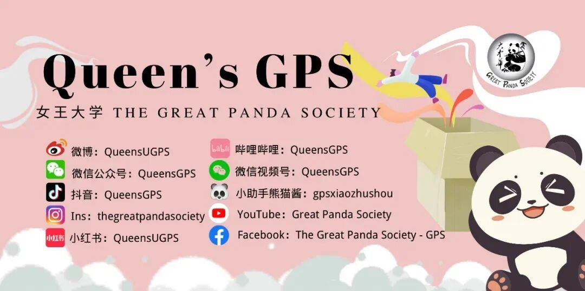

# GPS新生指南 | Smith商学院大一都在学啥？

> 来源：微信公众号  
> 原链接：https://mp.weixin.qq.com/s/6Egq4ZzApLul7ffEzl-yLg  
> 状态：自动搬运，暂未分类  
> 图片数量：11  
> OCR 图片文字数量：0

---

## 人工整理说明

本文件保留了公众号文章中的所有图片，没有自动删除装饰图。  
每张图片都用 `IMAGE-编号` 标记，方便后期人工检索、删除或补充说明。  
如果图片下方出现 OCR 文字，说明脚本尝试识别了图片中的文字，但需要人工检查准确性。  
OCR 文字只是辅助，不代表一定需要保留到最终正文。

---

【IMAGE-001 START】

【IMAGE-001 END】

**商**

**科**

Commerce可以说是Queen’s最有优势的专业之一，同时也是竞争最激烈的专业之一。新入学的大家可能会有些专业方面的疑问，不过不用担心，下面熊猫酱就来给大家简单介绍一下商科的**就读体验**和**大一课程**吧~

【IMAGE-002 START】

【IMAGE-002 END】

**专**

**业**

**简**

**介**

Commerce专业总共要修满126个学分，其中商科课程需要90-102学分（30-34门课），其他课程需要24-36学分（8-12门课）。

大一大二会接触到商科各个方向的基础课程，主要为了让大家找到自己感兴趣的方向，未来大三大四继续往那个方向深造。不过注意哦，商科不会细分专业，大家无论想往哪方面发展，都是同样的Bachelor of Commerce（除非选择accounting，会得到accounting的学位和证书）。

有以下几个方向可供选择↓↓↓

- Accounting 会计

- Business Economics 企业经济学

- Finance 金融

- General Management 综合管理

- International Business 国际商务

- Digital Technology 数字科技

- Marketing 市场营销

- Operations Management and

  Management Science 运营管理和管理学

- Organizational Behaviour 组织行为学

- Strategy and Organization 战略与组织

无论之后想选择哪个方向，熊猫酱都建议大家在大一大二**努力学习**，**打好基础**，这样后面学起来才不会太吃力~

【IMAGE-003 START】

【IMAGE-003 END】

【IMAGE-004 START】

【IMAGE-004 END】

**就**

**读**

**体**

**验**

Queen’s商科会给大家很丰富的机会，有专门找实习和工作的网站平台**Quest**，也有各种**coffee chat**增强networking的机会。大三还可以去世界各地的大学**交换**，了解不同地方的文化。

有关课程，感觉比较值得一提的是**小组合作**。商科课程会有很多小组合作！所有的课程，就连数学，都会有小组合作。以小组的形式一起完成presentation和report等作业，是锻炼社交能力的大好机会！

【IMAGE-005 START】

【IMAGE-005 END】

【IMAGE-006 START】

【IMAGE-006 END】

**课**

**程**

**介**

**绍**

学校会自动为大一大二学生分配课程，可以说是被安排的明明白白了！根据学长学姐的经验，大一fall被安排了**四门课**，而winter则被安排了**五门课**（具体课程安排可能会有变化，所以以下课程介绍仅供参考哦）。由于一个学期最多能上6门课，所以每学期只能选择1-2门自己感兴趣的选修课。

**Fall Semester**

***COMM 101: Intro to Commerce (年课)***

在这门课程中，大家会了解现代企业的基本要素和管理者的作用，了解自己，同事和企业本身是如何相互协调共同运作的。这门课会培养大家的领导能力、合作能力、沟通能力和批判性思维，也会鼓励大家探索解决问题的新方法~

***COMM 111: Intro to Financial Accounting***

基础会计课，每周都要完成作业练习哦！如果之前没有接触过会计，这个课需要很认真去学习。个人感觉这门课比较难，这门课是熊猫酱（只代表个人）永远的痛呜呜呜。

***COMM 161: Intro to Mathematical Analysis***

是数学课，有matrix，微积分等等内容。个人感觉和高中学的内容有一些相似。数学课也有小组合作哦！需要一起完成数学题。

***COMM 171: Principles of Economics for Business***

这门课是与商科有密切关联的经济课，为大家讲解经济学原理，帮助更好理解商科有关的经济概念。课程内容包括微观和宏观经济，不过相对比较浅。

**Winter Semester**

***COMM 112: Managerial Accounting***

这门课是面向公司内部管理人员的会计课程，方便公司管理人员做出益于公司的决定。熊猫酱感觉应该不如COMM 111难。多做题，熟练了就好~

***COMM 151: Organizational Behaviour***

感觉有点和心理沾边，学习在组织中人类的行为。这门课有很多写作，也有小组合作。不过别担心，认真听课没问题的！

***COMM 162: Managerial Statistics***

是COMM 161之后的数学课，学习统计。有很多应用题，也会经常用到excel。努力听课，多多做题，玩熟excel！

***COMM 172: Managerial Economics***

这门课是在COMM 171之后的经济课，会讲更深的经济知识理论。会运用到很多数学，主要是代数和微积分。

**~熊猫酱的小经验~**

总体来说，和数学相关的课（会计、数学、统计、经济）相对来说写作会少一些（有肯定还是有，逃不掉的哈哈哈）。但是熊猫酱本人数学不太好，所以可能需要多花时间捋清楚逻辑。

其他没有数学的课会有很多写作，也会有presentation。不过不用担心，只要你解释清楚，分析得有道理，用到课上所学的概念，根据rubric要求完成，就绝对没问题！相信自己，你ok！你稳！

【IMAGE-007 START】

【IMAGE-007 END】

【IMAGE-008 START】

【IMAGE-008 END】

**写**

**在**

**最**

**后**

商科专业先暂时给大家介绍到这里，剩下等着大家自己去体验啦！

在好好学习的同时记得多多走出舒适圈，尝试各种新的事物！你会发现不一样的自己~

【IMAGE-009 START】

【IMAGE-009 END】

【IMAGE-010 START】

【IMAGE-010 END】

文字 | Jenny 

排版 | Jenny 

编辑 | 然然 

审核 | Leo Simon

END

【IMAGE-011 START】

【IMAGE-011 END】
