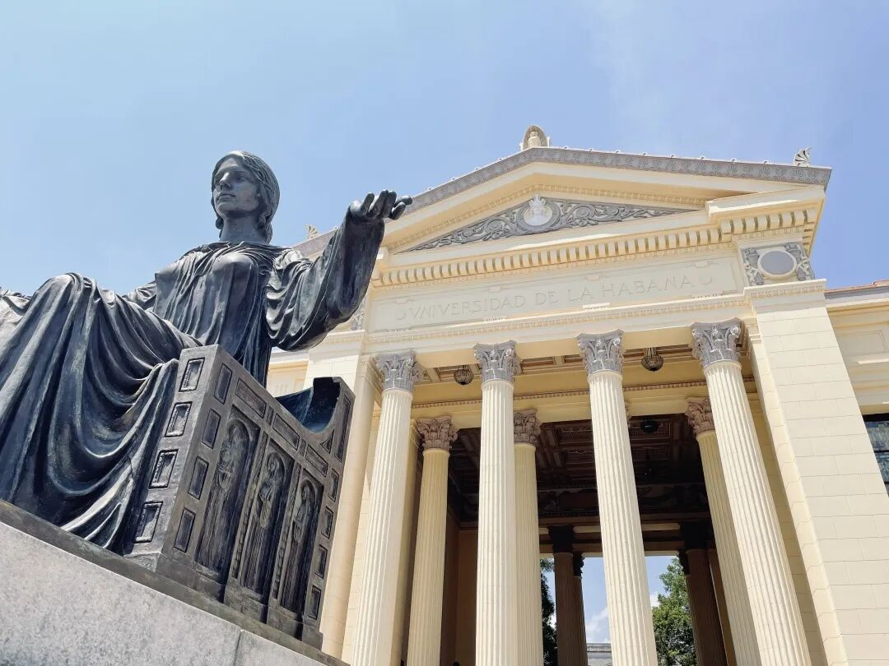
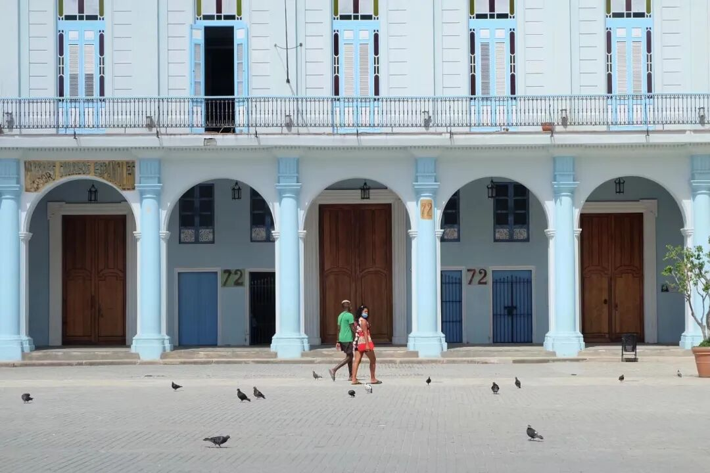
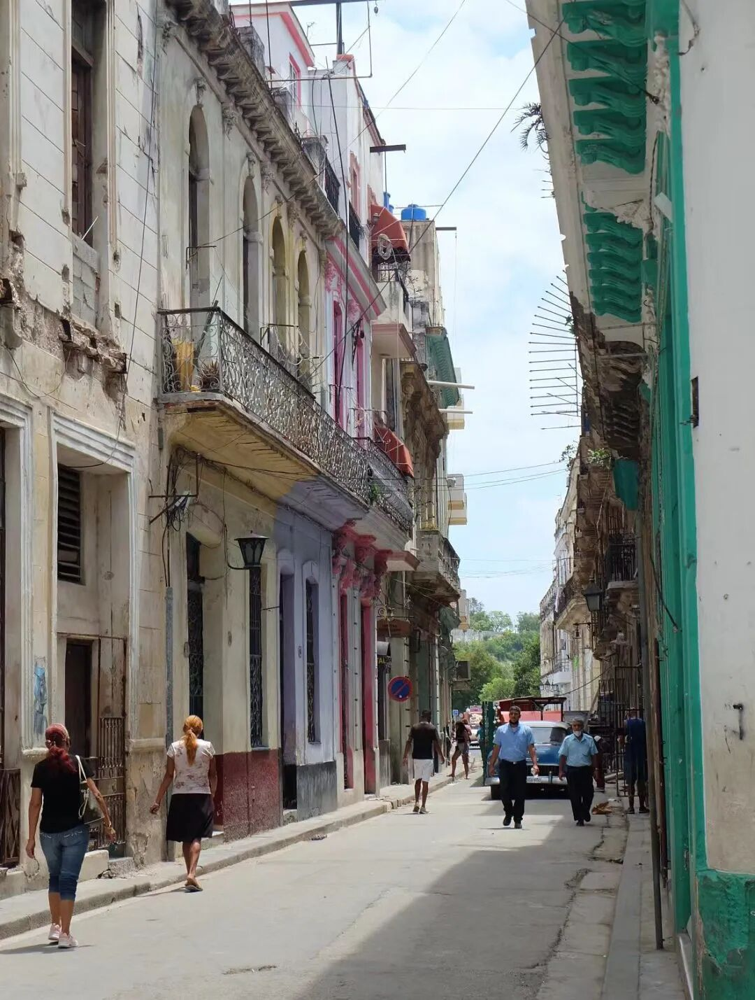
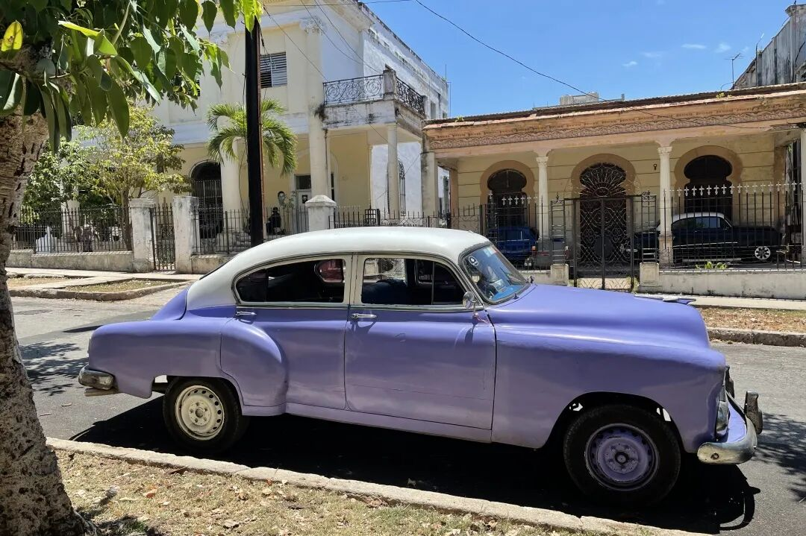
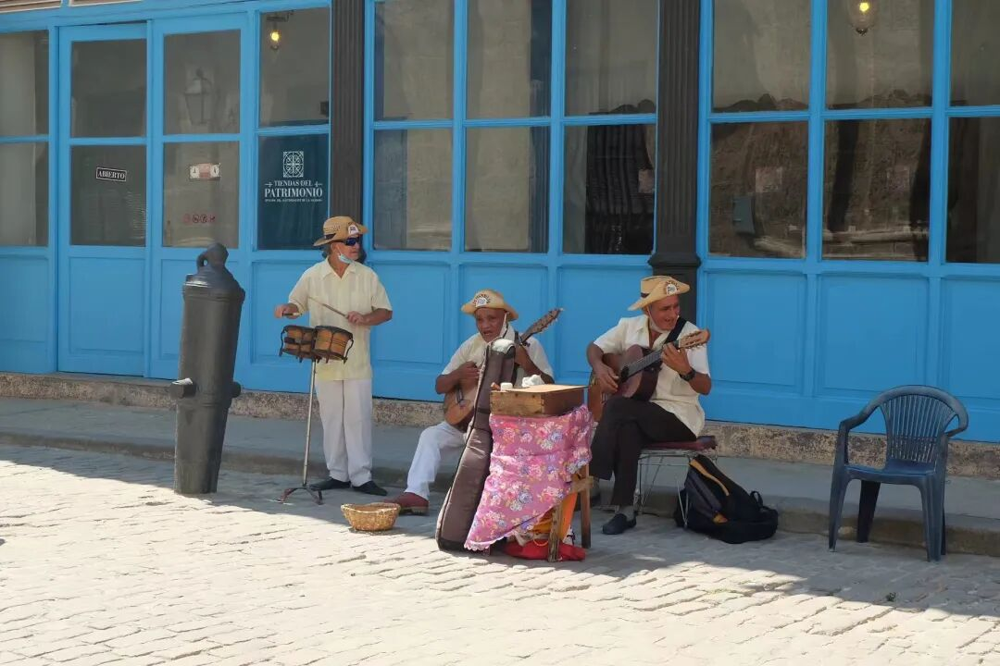
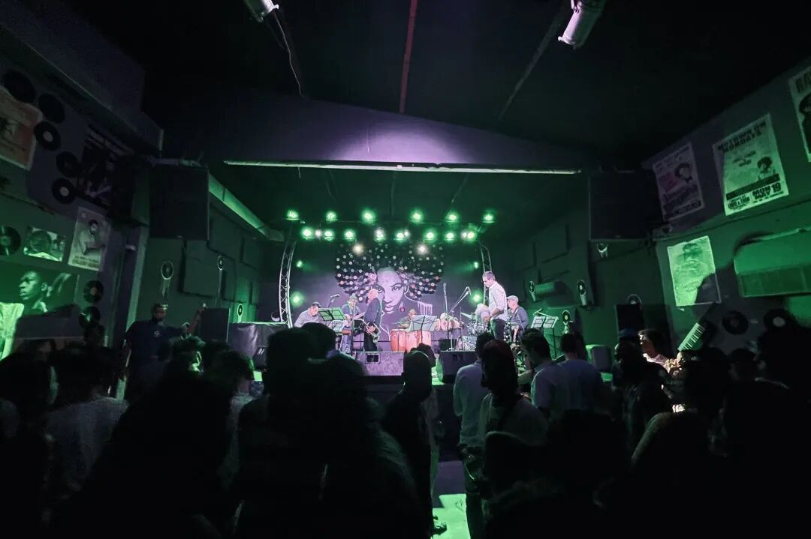
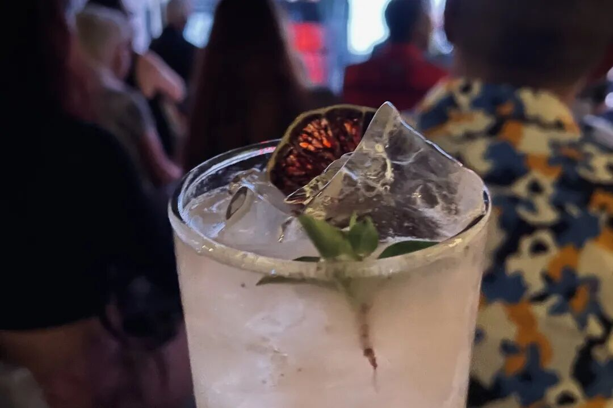
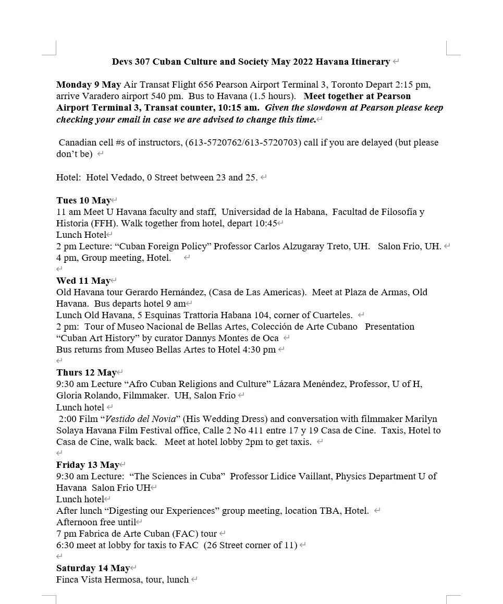
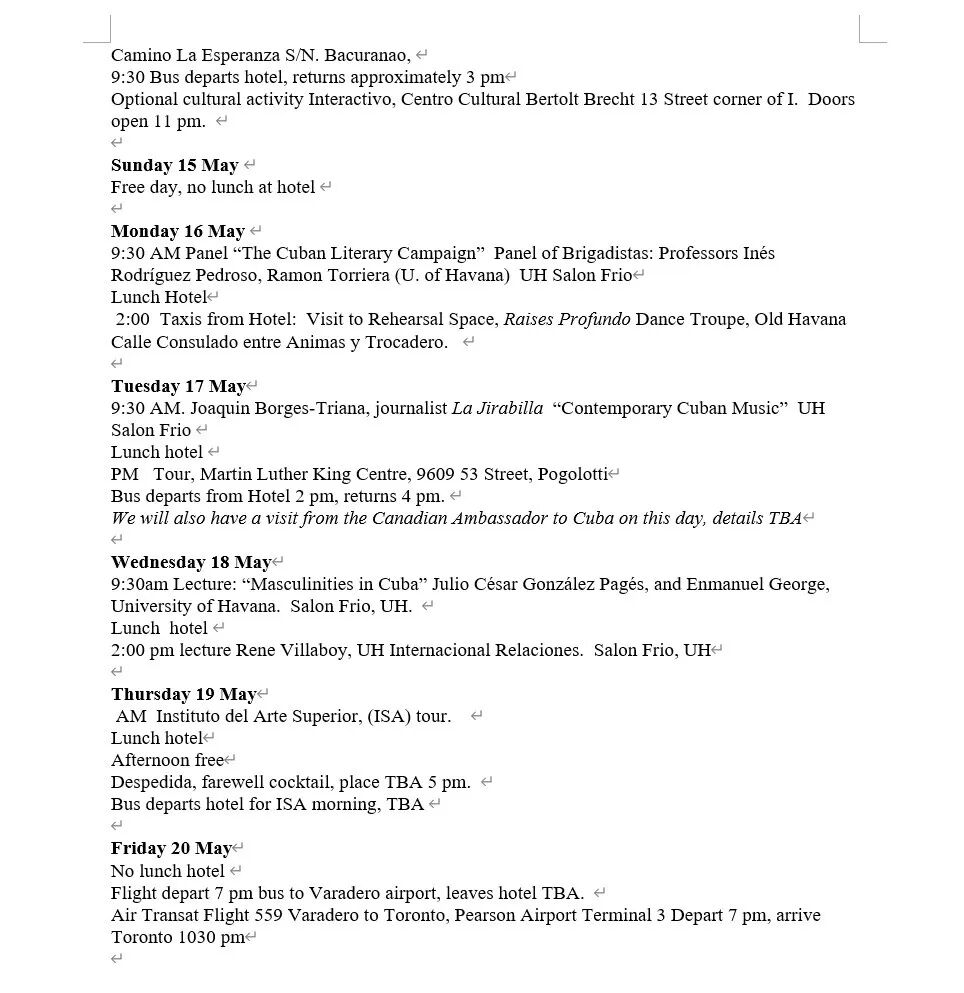
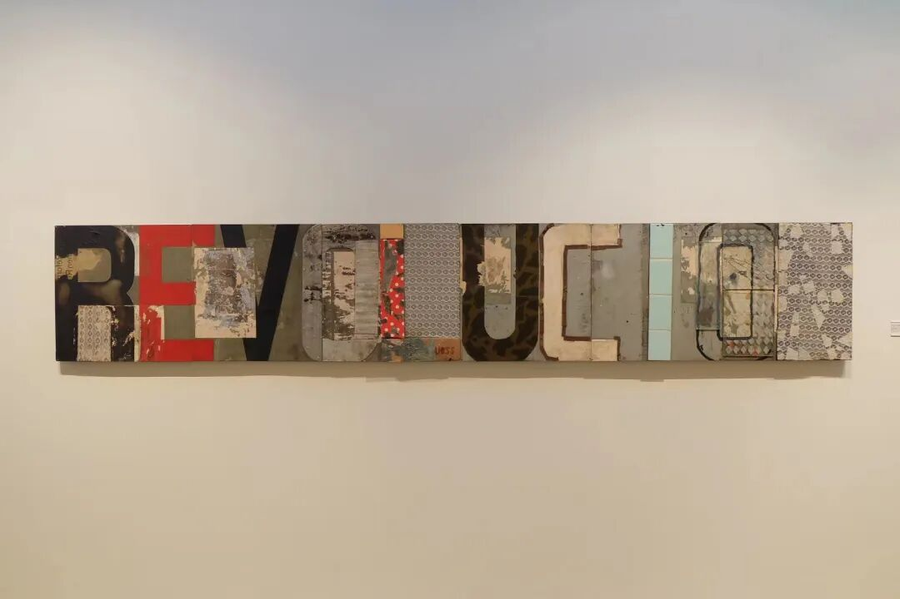

# GPS 课程介绍 | DEVS307带你感受古巴风情

> 来源：微信公众号  
> 原链接：https://mp.weixin.qq.com/s/OnTm7RJSn4FfZ4JWs5rtRg  
> 状态：自动搬运，暂未分类  
> 图片数量：11  
> OCR 图片文字数量：0

---

## 人工整理说明

本文件保留了公众号文章中的所有图片，没有自动删除装饰图。  
每张图片都用 `IMAGE-编号` 标记，方便后期人工检索、删除或补充说明。  
如果图片下方出现 OCR 文字，说明脚本尝试识别了图片中的文字，但需要人工检查准确性。  
OCR 文字只是辅助，不代表一定需要保留到最终正文。

---

**DEVS 307 Cuban Culture and Society**

深入了解古巴文化与社会

【IMAGE-001 START】

【IMAGE-001 END】

**Hola!**

你是否也想在加勒比海岸感受拉美的阳光？

你是否也想在哈瓦那的海滨大道漫步？

你是否也想享受一杯最正宗的古巴Mojito？

**欢迎选修DEVS 307，带你走进加勒比海岸的热情国度——古巴哈瓦那！**

课程介绍

【IMAGE-002 START】

【IMAGE-002 END】

HAVANA

STREET VIEW

【IMAGE-003 START】

【IMAGE-003 END】

在开启古巴游之前，有一些事你必须了解！DEVS 307这门课是由全球发展研究专业（Global Development Studies）所开设的一门课，专门研究古巴文化与社会。这门课在2020年疫情之前的课程代码是305，由6个学分组成。疫情后被拆分为306和307，分别为3个学分。306是Winter term在Queen's修读的课程，是古巴文化与社会的理论及小组研讨课程，307是为期两周的哈瓦那实践教学部分，一般在五月初。可以只上306，但是如果想上307则必须修读过306。所以这门课不只是纯玩！你在搭上飞机前往古巴之前，需要先进行一段硬核的学术洗礼，在回来后也需要完成final paper或project。如果你是非文科专业选手，可能需要谨慎选择。这门课除了可以作为DEVS专业的选修课程外，同时也可以算作Film，Sociology，Politics，History和Gender Studies的选修课程学分。相关专业的同学如果感兴趣，可以放心选修！

DEVS 306 at Queen's

这门课的任课教授是Karen Dubinsky和Susan Lord，分别来自Devs和Film系。她们两位开设这门课程已经十几年了，在疫情前每年都会带学生去古巴，对古巴有非常深刻的了解。两位都是学识渊博的教授，非常nice！在与他们一起旅行后，也会发现平常严肃的教授在生活上也是有非常可爱的一面。在Queen's修读的306部分所学习的是非常学术的知识，让你在去往古巴前先对这个国家有基础的了解。一般课程时长是三小时，每周都会有一个主题，例如古巴历史，大革命，社会发展，政治，古巴文化与音乐等。一般先由教授进行一部分lecture，再进行课堂讨论。由于这门课上课人数一般都只有十几二十人，所以课堂氛围更像研讨课。由于是文科课程，每周阅读量不小，需要做好充足的准备才能更好参与课堂讨论。而且讨论部分会算在最后总成绩中，所以需要积极参与其中不能摸鱼！作业评分一般由web post或各种大小paper组成，没有考试。由于我是2020年冬季修读的，所以对最新的评分标准并不了解，但是估计也不会有太大出入！

DEVS 307 in Havana

【IMAGE-004 START】

【IMAGE-004 END】

【IMAGE-005 START】

【IMAGE-005 END】

【IMAGE-006 START】

【IMAGE-006 END】

【IMAGE-007 START】

【IMAGE-007 END】

在经历了一整个漫长冬季的学习后，恭喜你！你即将解锁整个课程最激动人心的部分！把理论付诸实践，亲自前往这个拉丁美洲的国度。往年哈瓦那实践教学的行程都为14天，今年因为是疫情后首次travel，所以略有缩短，为12天。

我们一般的行程是上午在哈瓦那大学上课，下午进行游览或文化交流活动。我认为这次旅程与一般旅游最大的不同之处在于，你可以跳脱出一般游客的comfort zone，远离互联网的纷扰，走入哈瓦那人民的居住空间，与当地人进行深度的交流，更深刻地了解这个可能被过度浪漫化的国度背后的真实社会。在哈瓦那大学讲课的教授、学者或guest speaker也都是在古巴当地相关领域小有成就的人，能与他们交流的机会非常宝贵。

附上今年的行程单供大家参考。

**2022 Itinerary**

【IMAGE-008 START】

【IMAGE-008 END】

【IMAGE-009 START】

【IMAGE-009 END】

这个旅程的吃住等条件一定比不上你待在豪华的度假区酒店，12天的食物天天都是重复的，苍蝇是你每一餐的extra protein，房间会漏水等等。但是当课本上描绘的场景切实地在你眼前展现时，你才会意识到这样的经历是如何的宝贵。我对古巴的印象是复杂的，我喜欢古巴，但又不太喜欢。破旧的建筑被绚丽的色彩粉饰，热情的音乐徘徊于哈瓦那每一个街头巷尾，怀旧的古董车在夕阳下飞驰，加勒比海的微风吹佛在悠长的海滨大道之上，但夜场的live band和Mojito时常麻痹着我的神经，让我看不清这个城市下的挣扎、贫困与绝望。同行的同学在与宾馆酒保的交流中问道，如果有机会，你会离开古巴吗？他的回答是，yes。

我有时觉得我不只是一个游客，可是我确实又只是一个游客。像所有游客一样漫步在哈瓦那古城，在Hotel Nacional的louge喝着Mojito，打卡海明威时常光顾的五分钱酒馆，在夜晚的club里沉沦。除了带走雪茄和朗姆外，我不知道还能给这个城市留下什么。

【IMAGE-010 START】

【IMAGE-010 END】

我仍然会说，古巴绝对是值得一来的地方。介于每个人的感受不同，哈瓦那能给你留下什么，就需要你自己来发现了。

Frequent Quesntions & Answers

Q：哈瓦那的行程需要多少钱？包含在学费内吗？

A：大概3000刀左右，食宿和来回机票全包。不包括在学费内，需另付。

Q：如何报这门课？

A：这门课不能直接在solus enroll，需要在秋季向Devs系申请，提交成绩单、interest statement等材料后进行审核。如果申请通过会由部门老师在冬季直接帮你加入课程表。可以关注官网了解每年的申请时间和最新消息。【点击阅读原文即可跳转】

https://www.queensu.ca/devs/undergraduate/study-havana-cuba

Q：我可以只参与旅行，不上课吗？

A：可以的，需要单独联系Karen或Susan。外校生也可以参与！

A：我今年已经大四，五月上这门课会影响毕业吗？

Q：不会！如果你是毕业生，教授会安排你提前完成结课论文或project，保证你可以在六月按时毕业。

A：古巴的网真的很差吗？没网怎么办？

Q：真的很差，宾馆一般有网可以花钱买，但是非常不稳定，时有时无。都来古巴了就不要再盯着手机了，断网12天深度游，有点难熬，但是你会发现不一样的世界。

Q：最后有什么需要提醒的吗？

A：带美金！加元的汇率非常不划算！

最后想说的话。这门课是我在Queen's本科阶段上参与的最后一节课。2020年由于突如其来的疫情，我并没有如期前往古巴。很开心，时隔两年，毕业前夕，我终于完成了这个迟到两年的旅程，给自己的本科之旅画上一个完美的句号。很高兴你能看到这里，也希望这篇文章对你有所帮助。最后一篇推文，真情实感，献给GPS。❤

文字 / 容易

排版 / 容易

编辑 / 然然

审核 / 李一鸣 Simon

【IMAGE-011 START】

【IMAGE-011 END】
