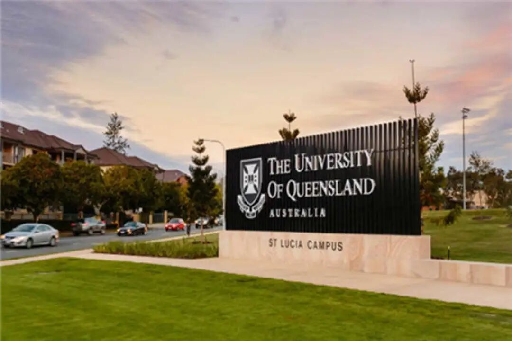
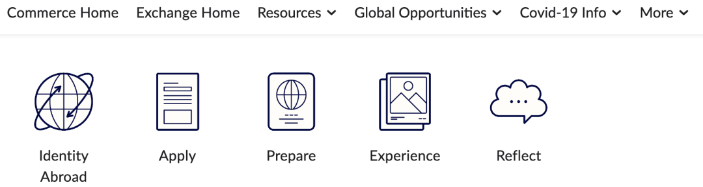
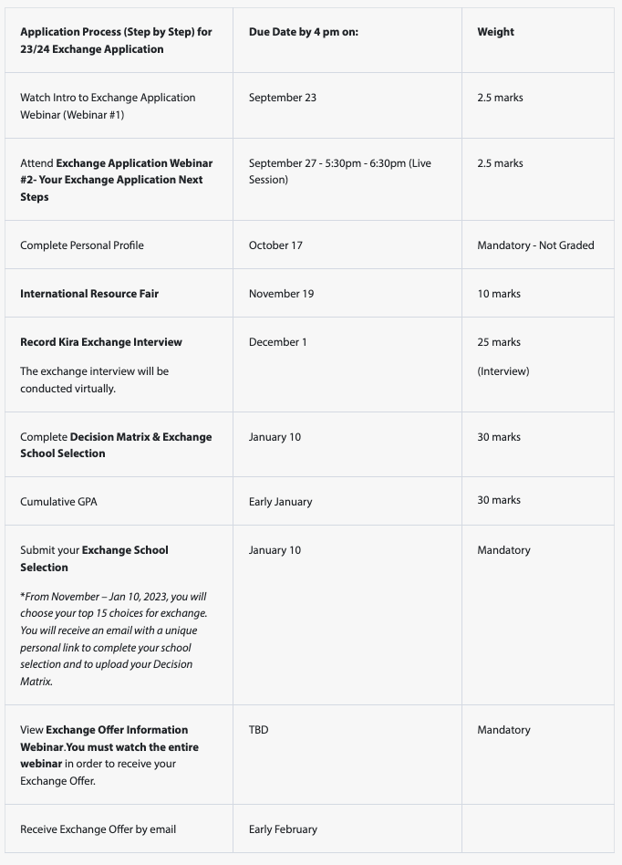
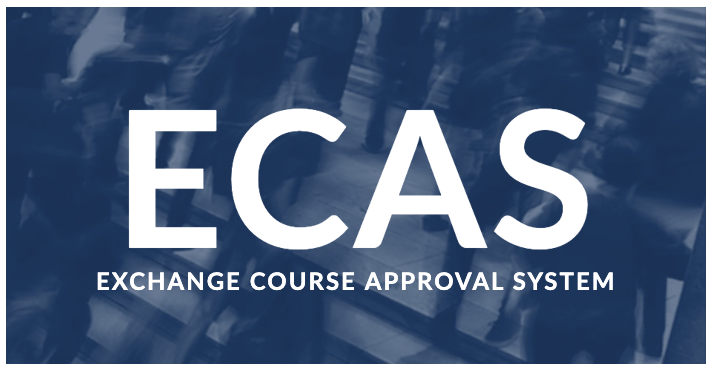
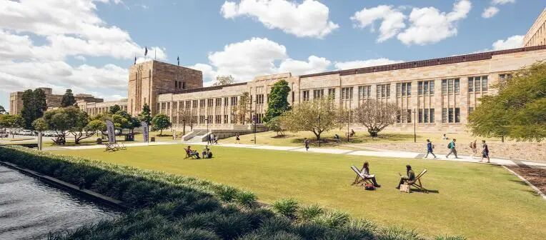
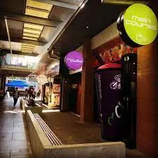

# GPS交换分享｜昆士兰大学交换日记

> 来源：微信公众号  
> 原链接：https://mp.weixin.qq.com/s/Sg2aNiTUMqzjiydREbA1CA  
> 状态：自动搬运，暂未分类  
> 图片数量：9  
> OCR 图片文字数量：0

---

## 人工整理说明

本文件保留了公众号文章中的所有图片，没有自动删除装饰图。  
每张图片都用 `IMAGE-编号` 标记，方便后期人工检索、删除或补充说明。  
如果图片下方出现 OCR 文字，说明脚本尝试识别了图片中的文字，但需要人工检查准确性。  
OCR 文字只是辅助，不代表一定需要保留到最终正文。

---

【IMAGE-001 START】

【IMAGE-001 END】

【IMAGE-002 START】

【IMAGE-002 END】

**昆士兰大学交换日记**

相信大家都有所耳闻澳洲八大吧，昆士兰大学就是其中之一～，这是一所建于1909年的综合型公立大学。今年我有幸参与商学院的交换项目成功体验了一把在**昆士兰大学St Lucia校区商学院**的学习和生活。

接下来我会分享一些自己的交换经验，希望可以给之后交换的同学们提供一些帮助～

1

**申请交换**

简单介绍一下我的**背景**， 我是24届Commerce专业的学生，多数商学院的学生会在大三的时候选择进行参加学院提供的International Exchange项目。在大二的秋季学期，达到申请标准的学生会收到来自学校关于交换学习的邮件并且整个申请过程中的所有重要时间点都会有邮件提醒，大家也可以在Smith portal上找到所有的申请相关信息，大家跟着提示一步一步申请就好啦～

【IMAGE-003 START】

【IMAGE-003 END】

需要注意的是商学院的交换申请采用的是“**积分制**”，每一项任务都有相应的分数，在学校录取学生时，**GPA只是其中一部分的决定因素，**更为重要的**学生的态度以及申请流程的完整性，**所以大家最好**不要遗漏任何的可以获得积分的事项。**

【IMAGE-004 START】

【IMAGE-004 END】

（上图是**2023-24年**的申请流程）

可以选择的学校有很多，所以大家可以做一些research选择自己想去的学校。不过在选择学校的时候一定要看好学期的duration，确保不会耽误自己的安排，另外想要回国交换的同学一定要注意看好交换的学校**是否接受中国国籍的学生。**

2

**课程安排**

每所学校提供的课程和对应的学分是不一样的，所以大家在接到offer之后都要在ECAS上递交审课，确保之后在交换学校的课程能够换取足够的学分。

【IMAGE-005 START】

【IMAGE-005 END】

在昆士兰大学交换想要修够**15个学分**只需要选4节课就够了，所以总体课还是不多滴～

我的课程都是**线下授课**，和本校的学生一起进行学习。昆士兰大学的教授上课都非常有耐心，并且生动形象，这让我非常有动力去学习。尽管课程安排比较少，但是各种考试和论文可是一点也不少，所以还是需要合理安排自己的课余时间去进行学习。

3

**校园生活**

【IMAGE-006 START】

【IMAGE-006 END】

在10-11月时，在昆士兰大学可以看到漫天的蓝花楹，仿佛置身紫色梦幻童话，只可惜我去的时候没有还没有开花啦～，不过蓝花楹有一个传说，谁若被掉落的蓝花楹花瓣打到，就要当心会挂科哦！

学校将古老的砂岩建筑、现代化建筑、绿地和湖泊融合在一起，在任何季节都是很美滴！

说到校园生活，社团当然是必不可少的啦。在学期开始前会有一个迎新周，其中有一天是market day， 学校的社团都会在这一天在学校进行招新， 可以看到很多有意思的社团如：手工社，弓箭社，海洋社团...。大多数社团只需要交5-10刀的费用就可以加入啦～。

此外每周三学校多有集市，有校内手工社出售精美的饰品，如果对尺寸不满意的话，还可以找社长定制哦，也会有很多校外的商人在这天来校内出售商品，买到很多独特的商品～。

【IMAGE-007 START】

【IMAGE-007 END】

昆士兰大学校内有两个主要的food court，并且提供的餐饮非常丰富，从中餐到墨西哥餐应有尽有。不过味道的话，我个人感觉和QU差不多。此外还有一些其他的餐厅，如酒吧，pizza店等，坐落在学校里～。另外学校有很多的饮品店可以满足大家的饮料脑袋！

当然交换不是必选啦，大家最好根据自己的实际情况来作出适合自己的选择～

【IMAGE-008 START】

【IMAGE-008 END】

文字｜Chloe

                                              排版 | Chloe

                                              编辑 | Eric

                                      审核 | Taniya Kyle

【IMAGE-009 START】

【IMAGE-009 END】
