# GPS 交换分享 | 商学院篇！同济大学交换日记

> 来源：微信公众号  
> 原链接：https://mp.weixin.qq.com/s/2Xm3E5iI0cIiVDu2-k5-Bw  
> 状态：自动搬运，暂未分类  
> 图片数量：24  
> OCR 图片文字数量：0

---

## 人工整理说明

本文件保留了公众号文章中的所有图片，没有自动删除装饰图。  
每张图片都用 `IMAGE-编号` 标记，方便后期人工检索、删除或补充说明。  
如果图片下方出现 OCR 文字，说明脚本尝试识别了图片中的文字，但需要人工检查准确性。  
OCR 文字只是辅助，不代表一定需要保留到最终正文。

---

同济大学

Tongji University

交 换 日 记

【IMAGE-001 START】

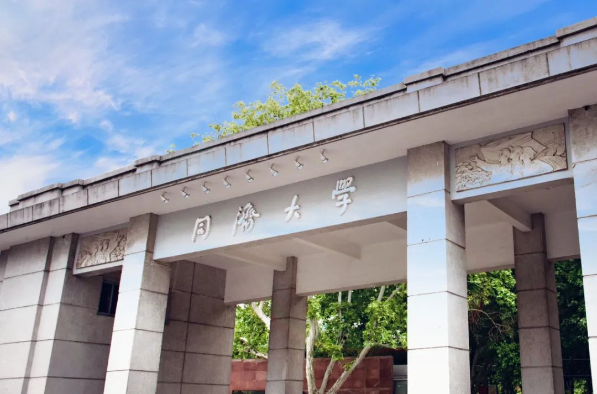

【IMAGE-001 END】

相信大家对**同济大学**一定不陌生吧！这所建于1907年，属国家“211工程”、“985工程”、世界一流大学重点建设A类的高校，一直都是众多学子的梦校。在同济114岁生日的2021年，我也有幸前往**同济大学经济管理学院**（以下简称“经管学院”）进行交换学习，度过了一个充实而难忘的学期。接下来我会为大家整理并分享这段美好的交换经历，希望对之后交换的同学们有所帮助！

本篇文章仅涉及**商学院**交换经验分享，文理学院的朋友们可以前往我们之前推出的复旦大学交换分享了解更多~

[GPS 交换分享 | 日月光华，旦复旦兮](https://mp.weixin.qq.com/s?__biz=MzA3OTc3NDUxNg==&mid=2651199142&idx=1&sn=124683d6ef1a2fab2b8902f182946c5f&scene=21#wechat_redirect)

那我们开始吧！

**01**

**如何申请交换？**

International Exchange一直是我们商学院的一大亮点，多数商学院学生都会选择在大三进行交换学习。不同于文理学院，商学院的交换申请流程可以说是更为直接。在大二的秋季学期，所有达到申请标准的同学都会收到学校发来的关于交换学习的邮件。同时，大家也可以在Smith portal上找到申请的链接，所有申请需要的信息都可以在这里找到。整个申请过程中的重要时间点都会有exchange office的邮件提醒，所有的流程也都会显示在portal上，大家只要跟着一步一步进行申请就好。

【IMAGE-002 START】

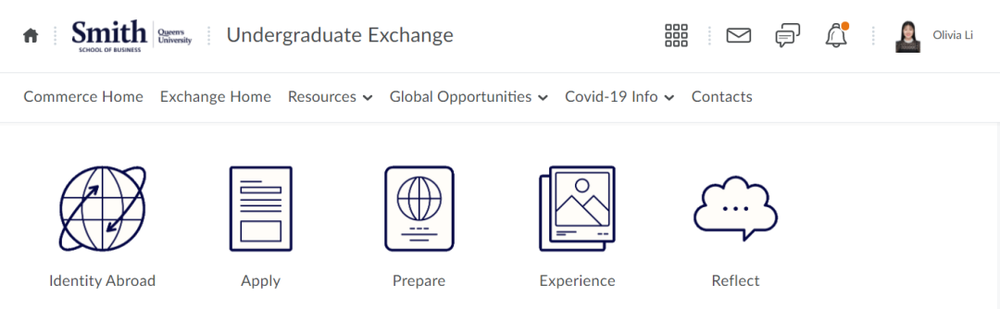

【IMAGE-002 END】

请注意！商学院的交换申请是**“****积分制****”**的，每一项任务（例如：讲座、School Research、Personal Profile）都有相应的分数，在学校录取学生的时候，**GPA只是其中一部分决定因素，**更为重要的是**你整个申请流程的完整性和你认真的态度**（也就是你整个申请流程的总积分）。**所以请一定！千万！不要遗漏任何一个可以积分的事项！**

【IMAGE-003 START】

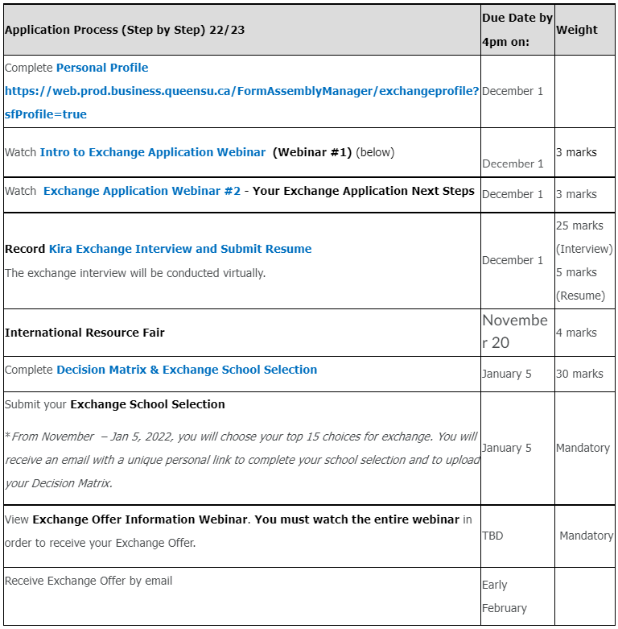

【IMAGE-003 END】

（上图是2022-23的申请流程）

交换学习是学生和学校进行的**双向选择**，在学校选择我们的同时，我们也要选择适合自己的学校。由于疫情原因，我身边2023届的朋友们多去了新加坡，法国和日本的学校，但其实学校的选择有很多，大家可以自己research，选择想去的学校。每个国家和学校的学期时间安排是不一样的，大家在选择学校的时候一定要**看好学期的duration**，确保不会耽误自己的假期实习或其他安排。而对于想要回国交换的同学们，交换学习一般会被安排在冬季学期，同也请大家一定看好交换学校**是否接受中国国籍的学生**。

我的情况比较特殊，在我大二也就是2021年秋季的学期，学校为中国的学生们提供了三所国内高校go-local的机会，包括北大、上海交大以及同济。这次交换无需进行额外的申请，学校会按照成绩排名给大家发offer，收到offer的同学们也可以选择去或者等待大三再交换。作为一个金斯顿度过了5年的“土著”，我本来就非常想要感受国内大学的氛围，这次机会可谓是恰到好处。最后我接到了同济大学经管学院的交换offer，也成功在今年的3月前往同济进行交换。

【IMAGE-004 START】

【IMAGE-004 END】

**02**

**课程安排**

每所学校提供的课程和对应的学分是不一样的，大家在接到offer后都需要**递交审课**，以确保你在交换学校上的课程能够换到足够的学分。

我本人就是一个“反面案例”。当时我在ECAS上看到之前审批通过的课程并没有出现在这学期的课程安排中，且我当时还处在开学换课和等待课程大纲的阶段，所以准备延后递交课程审批。结果万万没想到，这一拖就到了学期结束。所以我是在基本完成了自己的交换后才递交了审课流程，更难受的是，因为当时我在大二，有一部分基础课还没有上全，所以不能选择同济这边更高阶的课程，而正是这一门课居然和我大二的必修课撞了，无法兑换comm300 level的学分...... 在这里给大家再次提个醒，请务必在收到host school提供的课程安排及教学大纲后赶紧去ECAS进行审课！

【IMAGE-005 START】

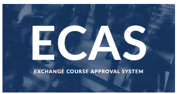

【IMAGE-005 END】

虽然“痛失”一节课的学分，但是我对自己整体的课程安排还是很满意的。因为同济没有给我规定选课的上限，且同济经管的专业课每门是2个学分，而交换学习要求我们**修够5门课程的学分**，也就是**15个学分**，所以我在2021冬季学期一共选了8门可换COMM学分的专业课，还给自己额外加了1节体育课和3节选修课，把自己的日程塞的满满当当。

值得注意的是，在我所有的课程中，**只有在经管学院上的专业课是可以直接换Queens学分的，其他选修课程学校不直接提供学分转换**。如果想要额外转换这些课的学分，需要自己将中文的教学大纲翻译成英文再提交审课，而有的课程是无法换学分的，这个大家也一定要确认好。

【IMAGE-006 START】

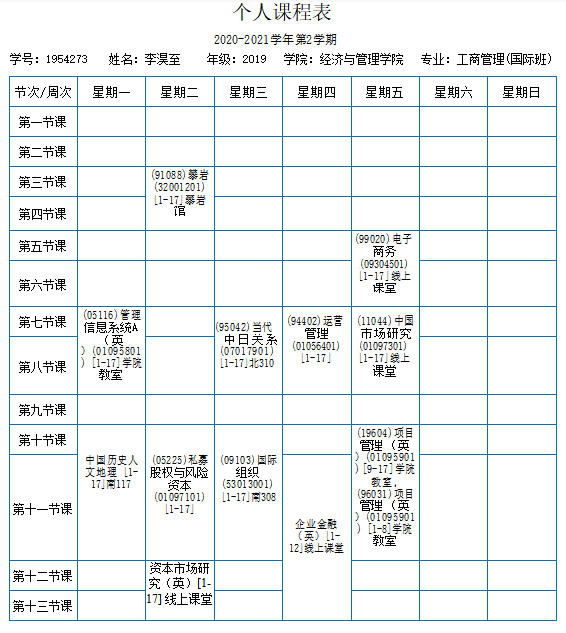

【IMAGE-006 END】

【IMAGE-007 START】

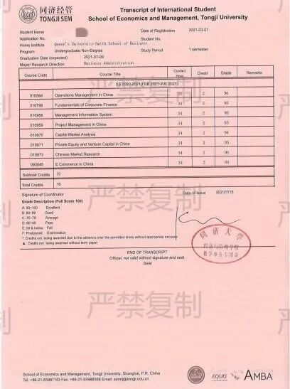

【IMAGE-007 END】

我在同济的课表和转学分成绩单

我的专业课程是**线上线下结合**进行授课，多数都是和经管国际班的同学们一起上的。他们有的来自欧洲或者亚洲其他国家，有的则参加同济中法项目，会在大三大四出国学习。和他们在一起我不仅了解了很多国内商业方面的知识，更开阔了自己的国际视野，还交到了很多新朋友。

而教授们也是各行各业的顶尖人才，例如我项目管理课两位教授之一曾参与2010年世博会项目的选址搭建和后期流程，他在课上带我们了解很多当时的“内幕”知识和项目难点，真正把知识具象到生活中。

比起专业课，我的选修课则更为贴近自己的爱好。我一直对国际关系这方面非常感兴趣，所以选修了中日关系和国际组织两门课。两位教授中一位曾在日本的大学任教，另一位曾在多个国际组织任职，让我感受到同济作为国内顶尖学府的师资水准。两位老师的课堂都生动有趣，学起来特别有劲头。但你们一定想不到，这两门课让我最头秃的地方居然是用中文写论文和考期末，让我深深体会到自己中文水平退步的多么严重！

【IMAGE-008 START】

【IMAGE-008 END】

**03**

**校园生活**

【IMAGE-009 START】

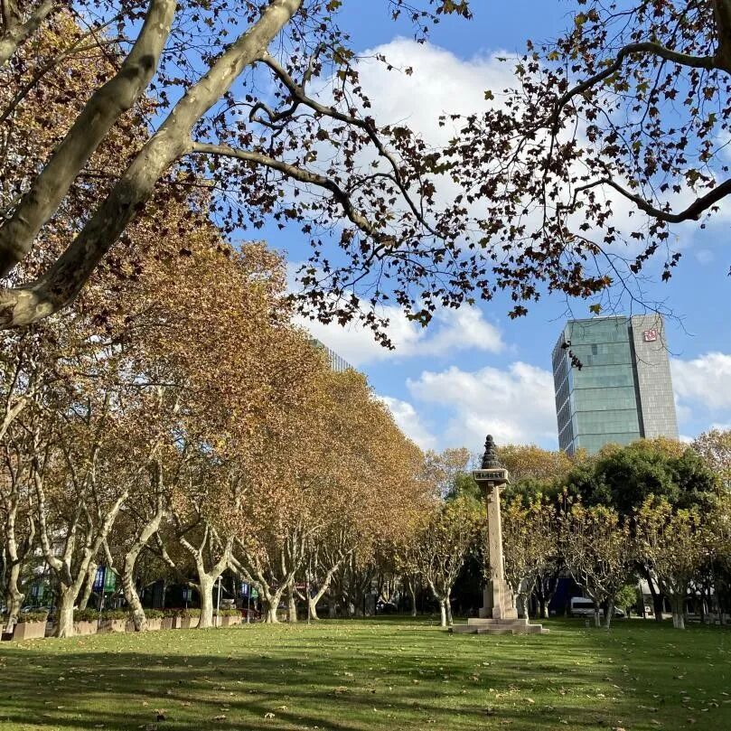

【IMAGE-009 END】

【IMAGE-010 START】

【IMAGE-010 END】

【IMAGE-011 START】

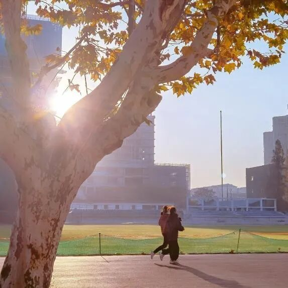

【IMAGE-011 END】

在我交换的时候，很有可能是因为疫情，同济是不给交换生提供留学生宿舍的。一般来说如果学校不提供住宿，大家就需要**提前校外租房**，或者咨询学校是否可以提供**住房资源**或者是否有**校内迎宾馆**可以长住。我当时很幸运，申请到了本科生宿舍，和三位非常优秀的小姐姐们住在一起。不得不说，每天住在校园，感受着青春校园小说中才有的情节，简直棒呆了！学校的林荫大道，阳光下的操场，网红樱花大道和我最最亲爱的小姐妹们，所有的一切组成了完美的校园生活！

【IMAGE-012 START】

【IMAGE-012 END】

【IMAGE-013 START】

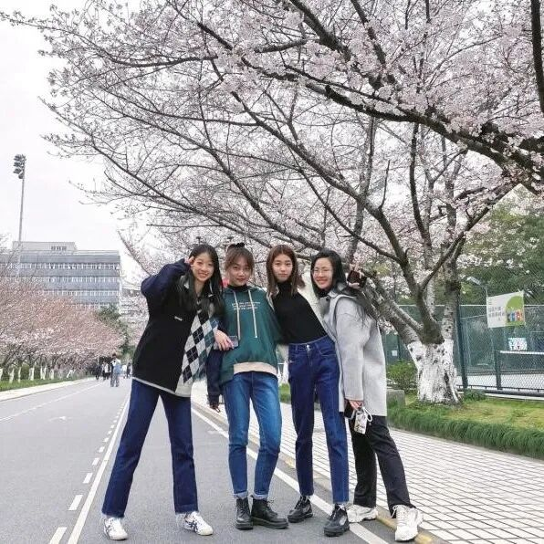

【IMAGE-013 END】

【IMAGE-014 START】

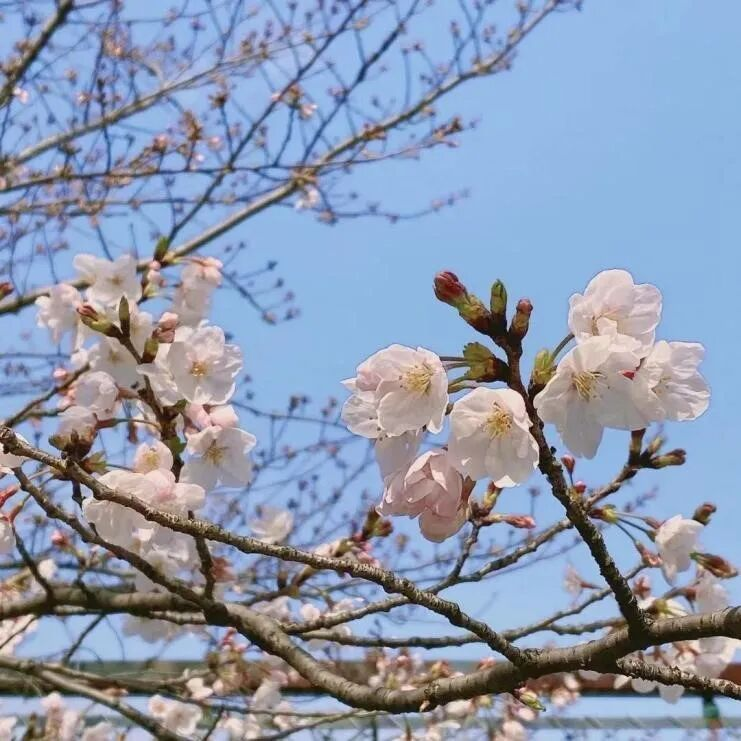

【IMAGE-014 END】

说到校园生活那一定离不开食堂，而我四个月飙升的体重无疑是**“食在同济”**最好的证明！同济的食堂又便宜又好吃，除了每次一到饭点就开始人山人海的排队外，我挑不出任何缺点！北苑西苑学苑食堂各有特色，校门口的联合广场各种美食汇聚，还有校内面包房和酸奶屋，满足了我的口腹之欲！每到传统节日，同济还会推出独家的传统美食，青团、粽子、月饼应有尽有！

【IMAGE-015 START】

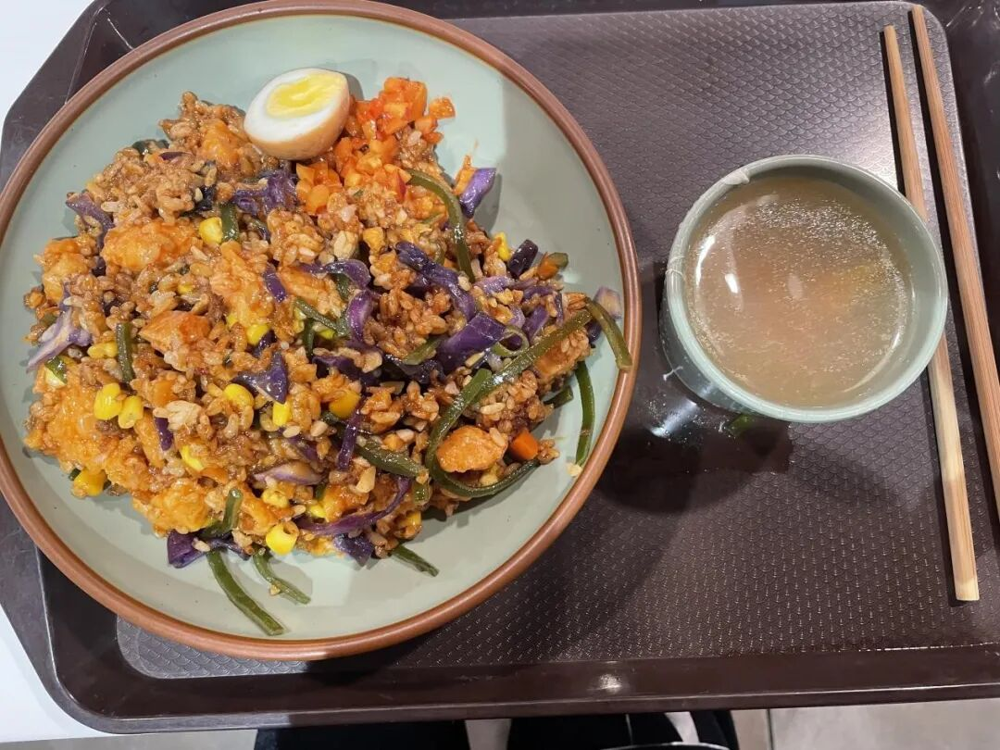

【IMAGE-015 END】

【IMAGE-016 START】

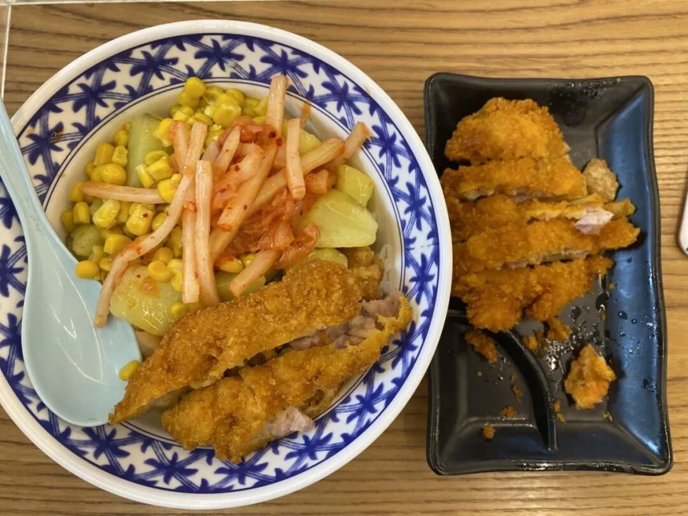

【IMAGE-016 END】

【IMAGE-017 START】

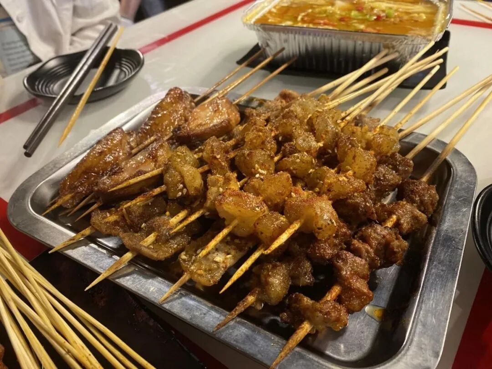

【IMAGE-017 END】

【IMAGE-018 START】

【IMAGE-018 END】

【IMAGE-019 START】

【IMAGE-019 END】

左右滑动查看更多

【IMAGE-020 START】

【IMAGE-020 END】

**我爱同济！**

曾经的我其实对同济了解的并不多，提到它也只能说出“985/211”“顶尖学府”“理工王牌”这些关键词。但当我真正来到同济，了解同济，我才发现这里是多么的美好。也正是因为在经管学院的这段学习经历，让我坚定了自己未来会朝着商业管理方向继续发展。我从来不后悔提前在大二交换，也不后悔选择了同济。相反，我认为这段经历是我留学中浓墨重彩的一笔，在同济的每一天我都觉得非常幸福。现在每次看到同济的学生卡，我脑子里就像播电影一样，总能再次见到漫天的樱花，夕阳下的篮球场，图书馆睡觉的猫和身边一起奋斗的朋友。如果可以，我真的真的很希望能把那四个月无限循环。

当然了，交换学习并不是必选，也不是说回国交换就是唯一选择，每个人都有自己的衡量，选择自己最想要、最合适的，才是最好的。希望商科和文理学院的同学们都能把握机会，合理进行规划，潇洒地走出自己的每一步！

**GPS 交换分享会来了！**

GPS独家学长学姐交换及申请经验分享会来袭！加拿大时间19日晚/中国时间20日早熊猫酱与你不见不散哦！记得锁定我们的zoom频道！

【IMAGE-021 START】

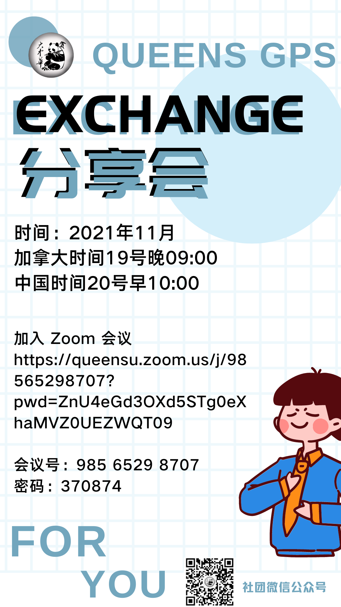

【IMAGE-021 END】

【IMAGE-022 START】

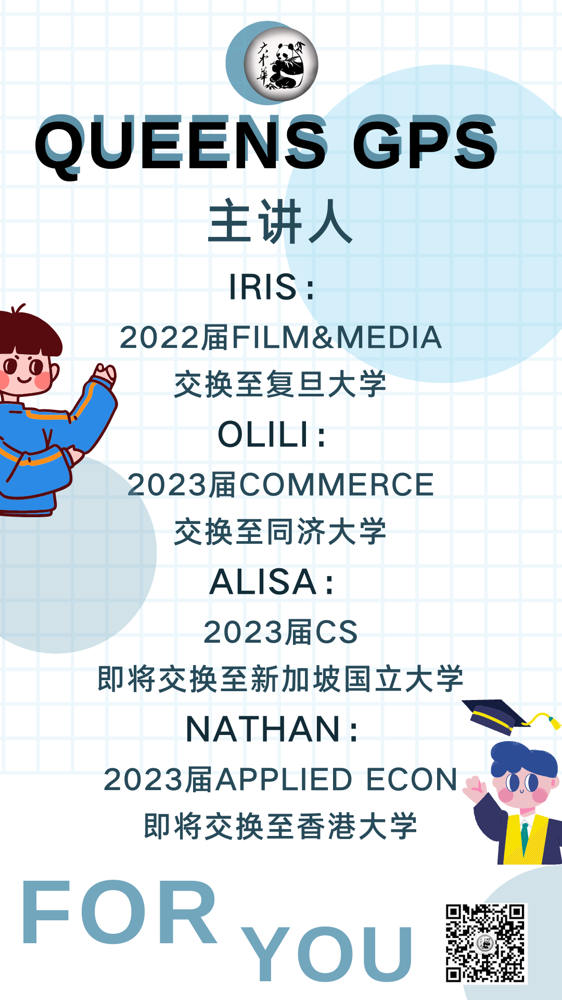

【IMAGE-022 END】

-THE END-

文字 | Olivia

排版 | 容易

编辑 | Rika

审核 | 容易 Olivia

【IMAGE-023 START】

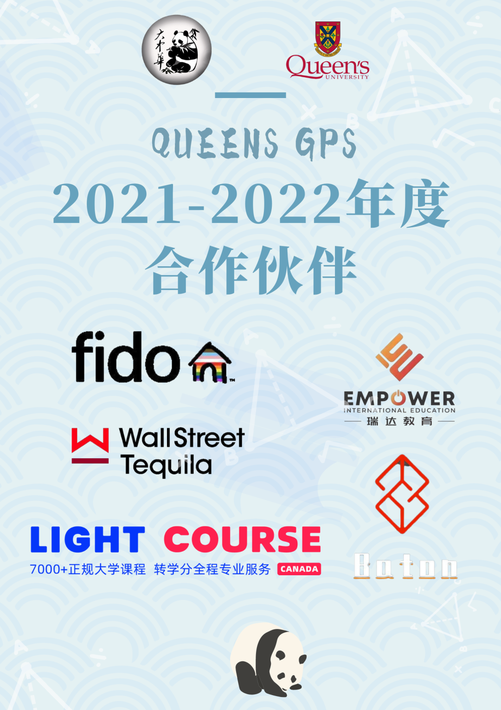

【IMAGE-023 END】

【IMAGE-024 START】

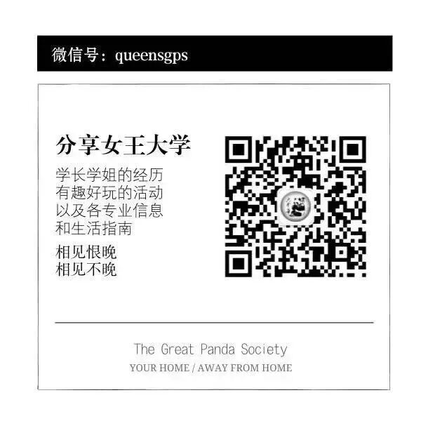

【IMAGE-024 END】
