# GPS 交换分享 | 日月光华，旦复旦兮

> 来源：微信公众号  
> 原链接：https://mp.weixin.qq.com/s/Nn1wi12ch6rbRQ63UKY81w  
> 状态：自动搬运，暂未分类  
> 图片数量：29  
> OCR 图片文字数量：0

---

## 人工整理说明

本文件保留了公众号文章中的所有图片，没有自动删除装饰图。  
每张图片都用 `IMAGE-编号` 标记，方便后期人工检索、删除或补充说明。  
如果图片下方出现 OCR 文字，说明脚本尝试识别了图片中的文字，但需要人工检查准确性。  
OCR 文字只是辅助，不代表一定需要保留到最终正文。

---

/ 复旦大学交换日记 /

**日月光华，旦复旦兮**

【2021.03 - 2021.06】

【IMAGE-001 START】

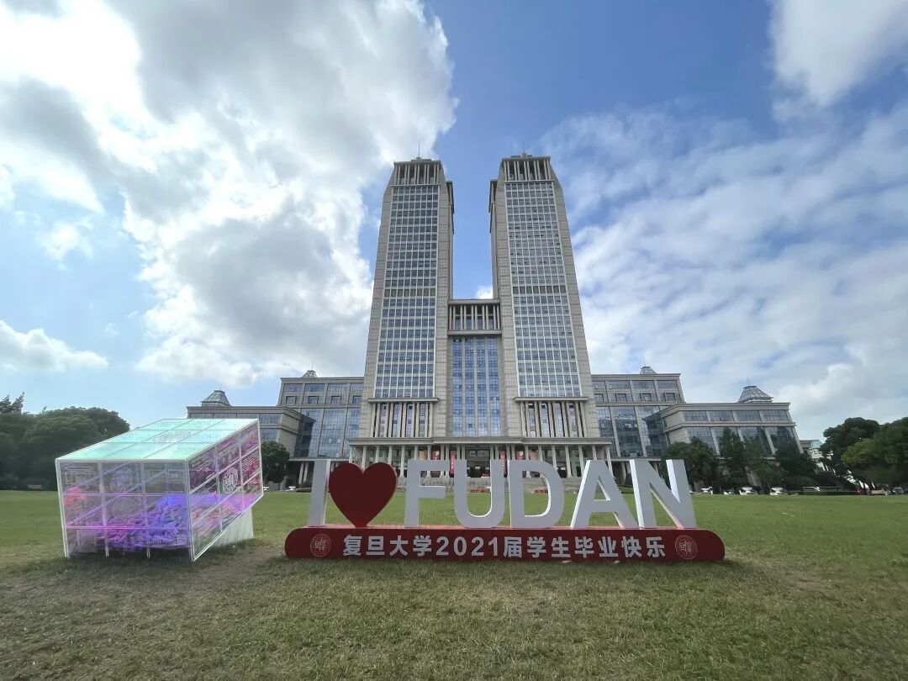

【IMAGE-001 END】

MYLIFE

**“博学而笃志，切问而近思”**是复旦大学的校训，也是我很喜欢的一句话。三个多月的交换时光不长，但在复旦校园里的日子，我也深切感受到了这句话所传达的精神。一转眼，这段时光竟也过去了要将近三个多月。我将这段经历以文字的方式记录下来，是对那段时光的回忆，也希望对有意向交换的你们有所帮助。本篇文章仅涉及**文理学院**交换经验分享，**商学院的流程略有不同**，可以关注我们后续由另一位小姐姐带来的**同济经管学院**交换分享~篇幅较长，请耐心看完~

**INTRODUCTION**

**如何申请？为何选择复旦？**

先向大家简单介绍一下自己的背景。我是2022届主修Film and Media，辅修Sociology的，目前大四，大三下学期在复旦进行了一个学期的交换。选择交换学校的第一条件一定是看**对方学校与自己专业的匹配度**，毕竟这些学分是要转回Queen's的，如果对方学校都没有你的专业课程，可能会影响你的degree plan和毕业进程。与Queen's有交换合作协议的学校名单可以在IPO官网找到，每个学校也有往年成功转学分课程的记录。学校也很贴心地根据不同专业，推荐了合适的交换对象，大家可以自行在官网查阅，做好申请前择校的准备。需要提醒的是，文理学院中国内地的交换合作对象仅有清华，人大和复旦，且**只有复旦**仍然接受中国籍学生交换申请。商学院多了交大，同济和北大的选择，但也不是所有学校都接受中国籍学生交换。

我自己本身的志愿其实不是复旦，而是新加坡的两所学校。毕竟作为中国学生，交换回中国，是一件比较奇怪的事情，我自己本身也没有这样的想法。我当初的意向是回亚洲地区交换，由于我在2019年申请的时候，正是香港事态比较严重的时候，所以我并没有选择任何香港的学校，第一第二志愿都是新加坡的学校，只是顺手填了复旦。不过由于新加坡竞争激烈，很遗憾我并没有拿到校内名额，这才被选上了第三志愿的复旦。本来对此我还并不是十分开心，不过谁能想到2020年新冠疫情全面爆发，交换项目全部取消，只有中国情况相对较好，接受已经在国内的中国籍学生进行交换，所以复旦的交换成了2020-2021学年唯一顺利进行的项目，想来也都是命运的安排。

关于具体该如何进行申请，我们在去年推出过一篇推文，里面详细介绍了申请的流程和步骤，大家可以点击以下链接查阅，在这里就不过多赘述了。

[GPS干货 | Exchange 申请流程来啦](https://mp.weixin.qq.com/s?__biz=MzA3OTc3NDUxNg==&mid=2651194956&idx=1&sn=11f50085742eda625524f01ebebd774b&scene=21#wechat_redirect)

值得一提的是，Queen's和复旦还有一个**Semester in Shanghai**的项目，与普通交换项目不同，是与社会发展与公共政策学院合办的交换项目。这个项目对本专业有一定要求，课程也有局限，因为我走的是Bilateral Exchange Program，所以对这个项目了解不多，感兴趣的同学可以点击以下链接查看。

https://www.queensu.ca/ipo/study-abroad/semester-shanghai

【IMAGE-002 START】

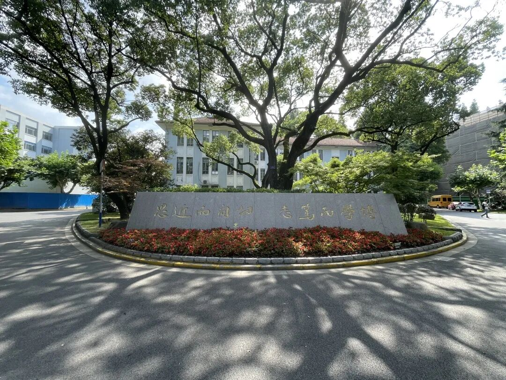

【IMAGE-002 END】

【IMAGE-003 START】

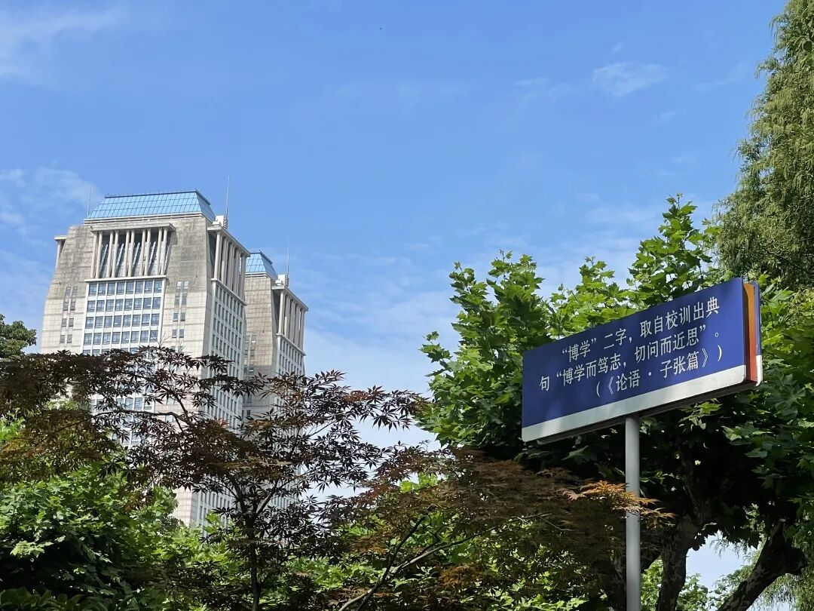

【IMAGE-003 END】

**COURSES**

**在复旦选课**

关于选课，有一点我之前不知道的是，在复旦的选课是**完全自由**的。我在交换之前也曾疑惑过，我是不是只能选择英语授课的课程，那样我的选择会狭隘很多。但是在交换过后发现，作为交换生，只要你中文流利，就可以自由选择复旦所提供的任何一门课程（除了为外国人提供的中文语言课程）。从专业课，到体育课，再到公共选修课，横跨各个学院，都可以作为你的课程选择，只要你能够保障完成你本校的degree plan。中文授课的课程只需要将syllabus翻译成英文再提交给学校审核就行啦。

在你向复旦提出交换申请的时候，会让你填写一张想要选择什么课程的表格。由于我当时并不确定是不是能选中文授课的课程，所以在表格上填写的都是社会学相关的英语课程，这也导致我之后在复旦的专业是被分到了社会发展与公共政策学院下的社会学。其实就我的本专业来说，新闻学院是比较适合我的，社会学只是我的辅修。不过好在这个专业只是作为一个记录，并不影响你实际选课，我之后的大部分课程也都是修读的新闻学院课程。唯一影响的只是你选课的优先程度，受到专业保护限制，跨学院选课优先度会在本学院之后。不过个人认为影响不大，想选的课一般都能选上，或者也可以通过加课申请选上。

关于选课数量，复旦交换生的选课限制是**16个学分**，一般是八节课的样子。本校生一般都选十几节课，我个人也是非常佩服了。不过我觉得有些课程确实比较水，没有什么平常作业，只需要在考试前冲一冲，和国外五节课就忙得焦头烂额相比，在国内选十几节课好像也不足为奇了。大部分的课程都在复旦的邯郸校区，但也有部分计算机或者生命科学相关课程会在复旦的其他几个分校，选课的时候需要注意一下校区。复旦提供各个校区的接驳校车，所以如果想选其他校区的课程也完全没有问题。不过个人建议体育课还是慎选，因为听说需要早上六点在复旦体育馆打卡晨跑，不要被舞狮运动木兰扇等新奇课程冲昏了头脑。

【IMAGE-004 START】

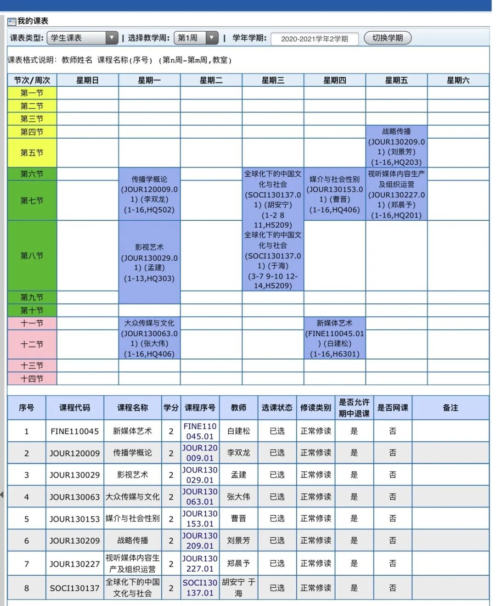

【IMAGE-004 END】

我在复旦的课表

我个人在复旦是选满了**八节课程**，毕竟机会难得，复旦有太多课程我都非常想上。除此之外，我还会去一些没有选但又十分感兴趣的课堂上旁听，比如我最常去听的一节课就是“宋词导读”。我也鼓励大家多把握机会，去听一些Queen's没有的课程。

关于转学分回Queen's，我们在交换时，还是向Queen's提交学费的，而且是**按正常一学期五门课收费**，所以转回Queen's的也是五门课。审课过程有两次，一次是正式选课前的**pre-exchange**初审，由你所属的department审核。第二次是完成交换后的**post-exchange**转学分审核。关于这个部分学校都会把相关材料和详细步骤发邮件给你，填好表格加syllabus一起发给department chair审核签字就行。最后正式的转学分批准是IPO批的，所以记得将第二次签完字的**post-exchange审课表格返还给IPO**才能顺利拿到学分。

学校在交换前就有提醒，需要上满交换学校的**full courseload**。我个人建议上满五节是必须的，最好的情况是上六节到七节，因为在后期转学分回来的时候，我有同学遇到了复旦的两节课合起来只能算Queen's一节课的情况，也就导致了她虽然在复旦上满了五节课，但只能换到四门Queen’s的学分，影响了正常的degree plan安排。这样的情况确实有可能发生，因为每个学校的学分算法和课程都不同，有些课可能不能转回Queen's。所以为了避免这种情况，交换前的department审课很重要，而且在实际交换时，建议**多选一两门课的富余**。

与国内成绩最优秀的一批人坐在同一个课堂上课是非常有压力的。就大部分课堂来说，课上的思考是深入的，话题是尖锐的，理论是扎实的，用词也是学术的。你瞬间就能理解为什么985是985，每一次的课堂总能带给我新的启发和思考，也每一次都让我觉得自己的知识储备和理论积累是多么薄弱。大佬真牛啊，我都不敢在课上说话。不过这一次的经历也打破了我以前一些对985的刻板印象，原来复旦的学生也都打扮得青春靓丽，原来复旦的学生也会上课玩手机~我非常感谢这段经历带给了我新锐的思想碰撞，也让我从亚洲视角思考当代中国社会问题。能够研究自己更加熟悉的文化真的很幸福，能够向大佬们学习的机会也是非常难得。

个人认为国内高校带给我另一大体验就是，有非常非常多优秀的**讲座和客座教授演讲**。各个学院和社团都会邀请到一些业内特别优秀的嘉宾带来演讲，也会不定时举行各种活动，所以你在复旦的课外生活一定不会无聊。这些讲座带给我各个领域不同的视野，也引发我的思考，对我来说是获益匪浅，也是我觉得这段交换带给我最宝贵的经历之一。大家来交换的话可以多注意一下宿舍区和主干道的横幅，会有很多近期的校招或者活动讲座宣传。

【IMAGE-005 START】

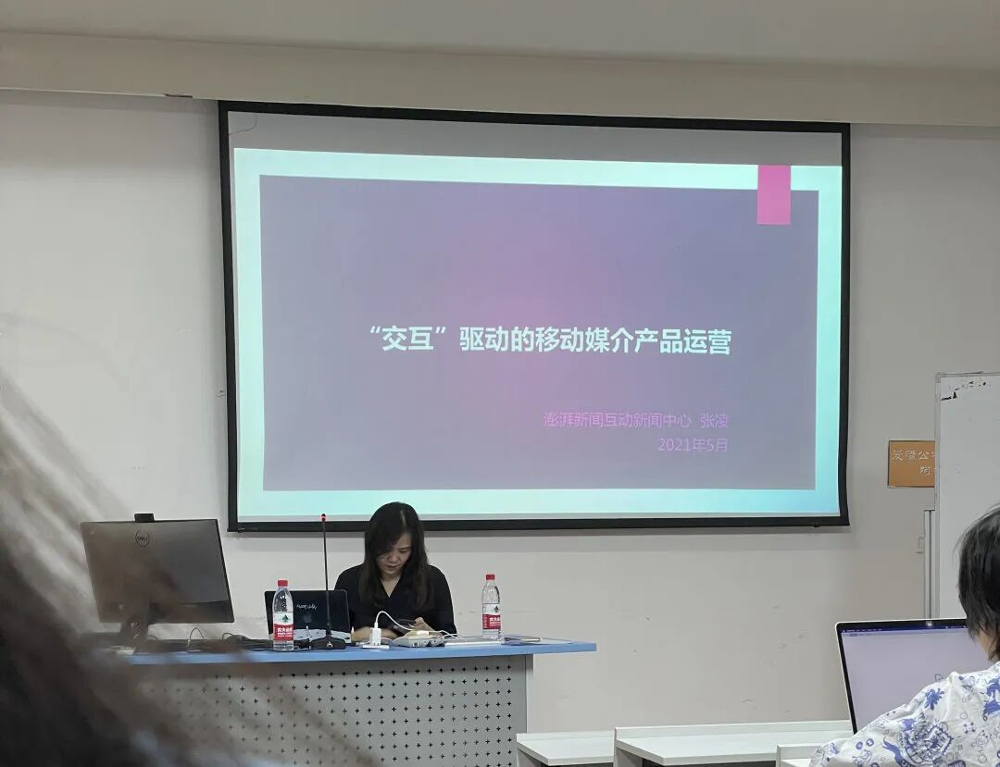

【IMAGE-005 END】

【IMAGE-006 START】

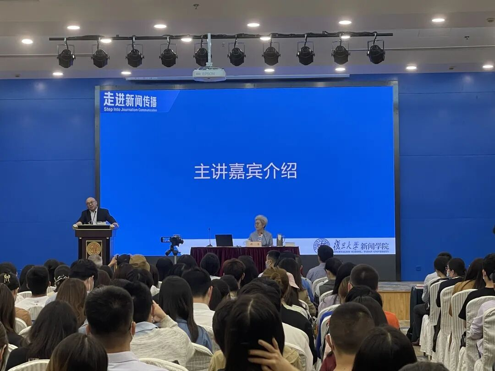

【IMAGE-006 END】

澎湃新闻互动新闻中心主管和前外交部副部长傅莹

【IMAGE-007 START】

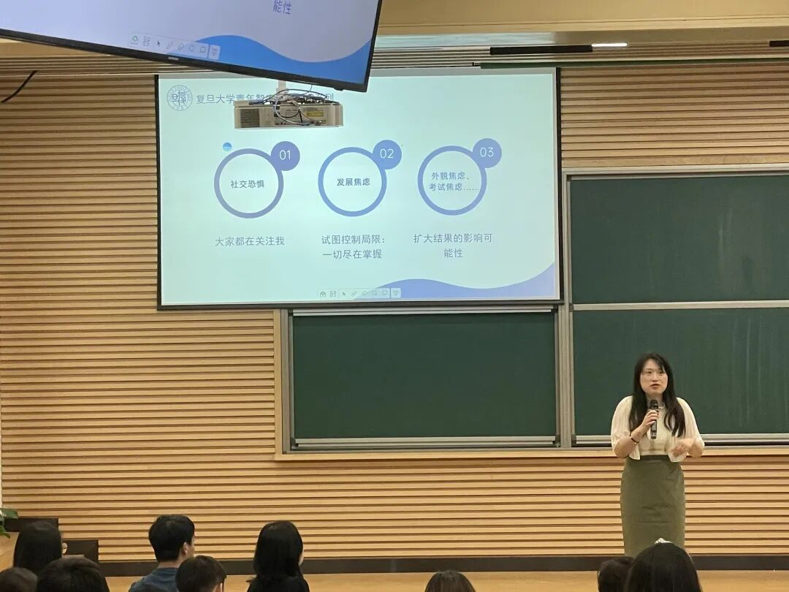

【IMAGE-007 END】

【IMAGE-008 START】

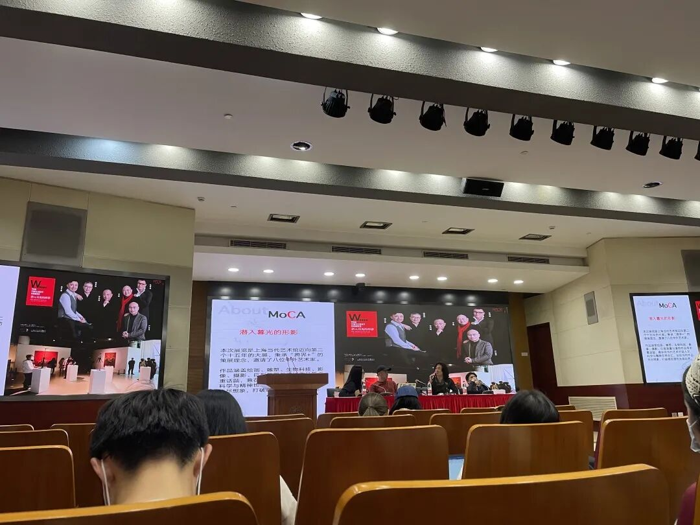

【IMAGE-008 END】

B站知名Up主沈奕斐教授和上海当代艺术馆校园行

**LIFERECORD**

**在复旦生活**

关于生活方面，复旦是**不给中国籍交换生提供宿舍的**。因为你是交换生，所以不能住一般学生宿舍，又因为你是中国籍，所以不能住留学生公寓。所以来复旦交换只能自行在**校外租房**，或者住在校内的**卿云宾馆**。卿云宾馆的话有一定的长住优惠，如果可以接受的话其实是不错的选择。我自己本身就是上海人，家里也正好在杨浦区，所以我平常上下课一般都是骑车或者公交，并不太能解答租房问题。听说上海租房不太好找，如果想租房在确认交换的时候就可以找起来了。

作为经历过国外食堂摧残的人，阔别中国七年之久，回到国内高校的食堂，我只能发出一句感概：**太好吃了！！**我真的觉得国内大学生很幸福，食堂又便宜选择又多又好吃，不想吃了可以点外卖，下了课就可以去买奶茶。不用自己烧饭，不用点一两个菜就心疼钱，也不用安慰自己说在国外能吃到中国菜就不错了。我那个时候只要去学校都会去吃食堂，我愿称之为复旦养猪场。回想真的是非常幸福的日子。我自己经常去的是**旦苑**，因为这个是位置最方便的一个食堂。里面有一家西餐厅专门卖韩餐和西餐，非常不错，楼上清真餐厅的牛肉面也非常不错，五块钱就能吃到饱。楼下的面包房会卖各种面包糕点，我特别喜欢蛋挞和奶茶！另一个推荐的食堂是**北食**，靠近留学生公寓，前几年翻新过，条件非常好，不是饭点的时候也可以在那里自习。推荐北京烤鸭！就是稍微远一些，我一般都骑车过去。可能一直在国内的同学不能理解为什么我会觉得食堂好吃，哎我只能说，没经历过失去，就不会懂得珍惜……

【IMAGE-009 START】

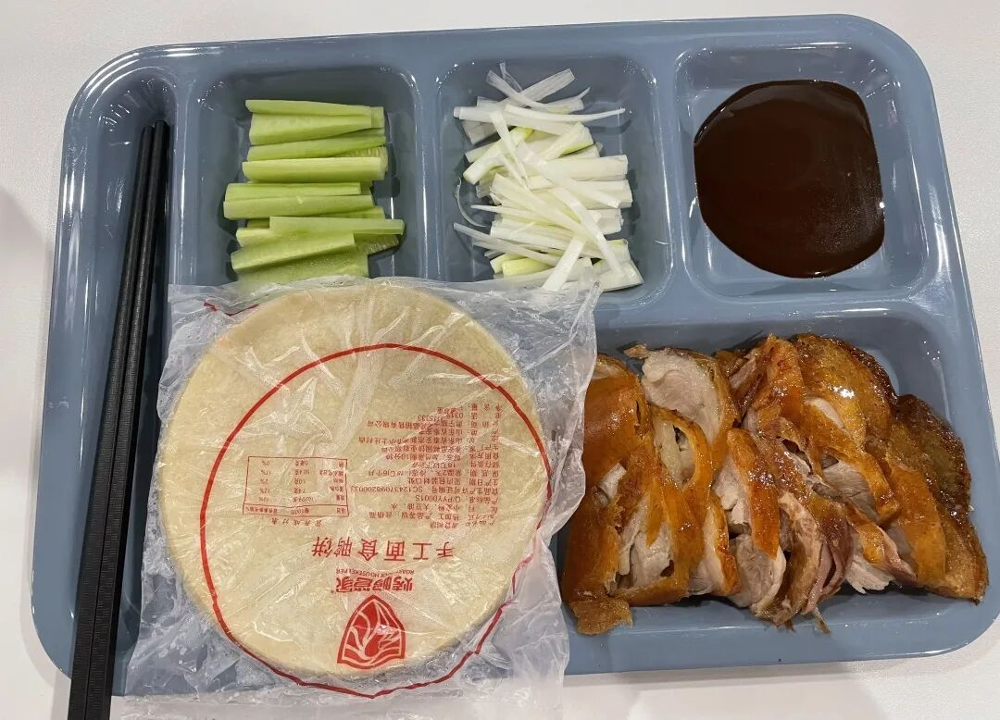

【IMAGE-009 END】

【IMAGE-010 START】

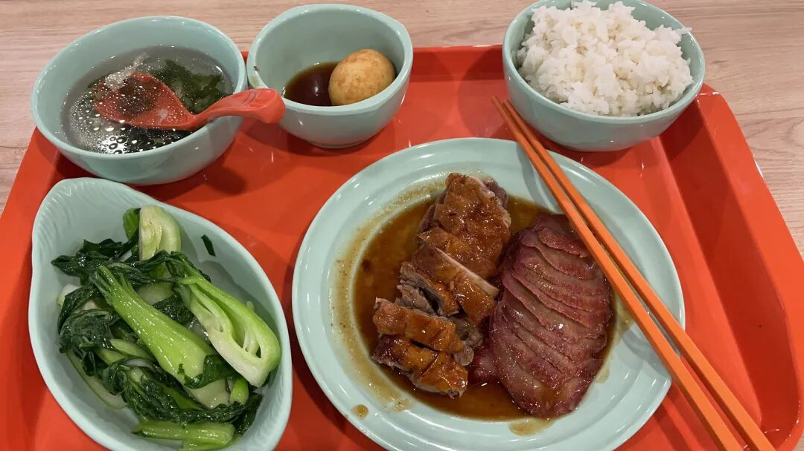

【IMAGE-010 END】

【IMAGE-011 START】

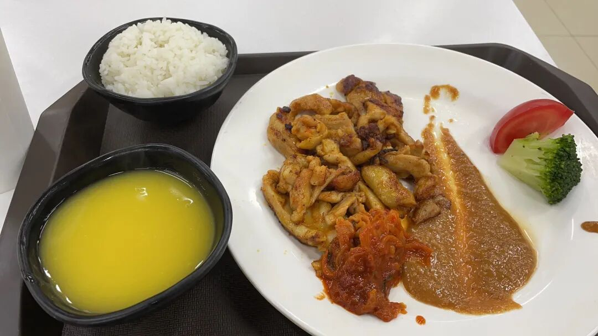

【IMAGE-011 END】

【IMAGE-012 START】

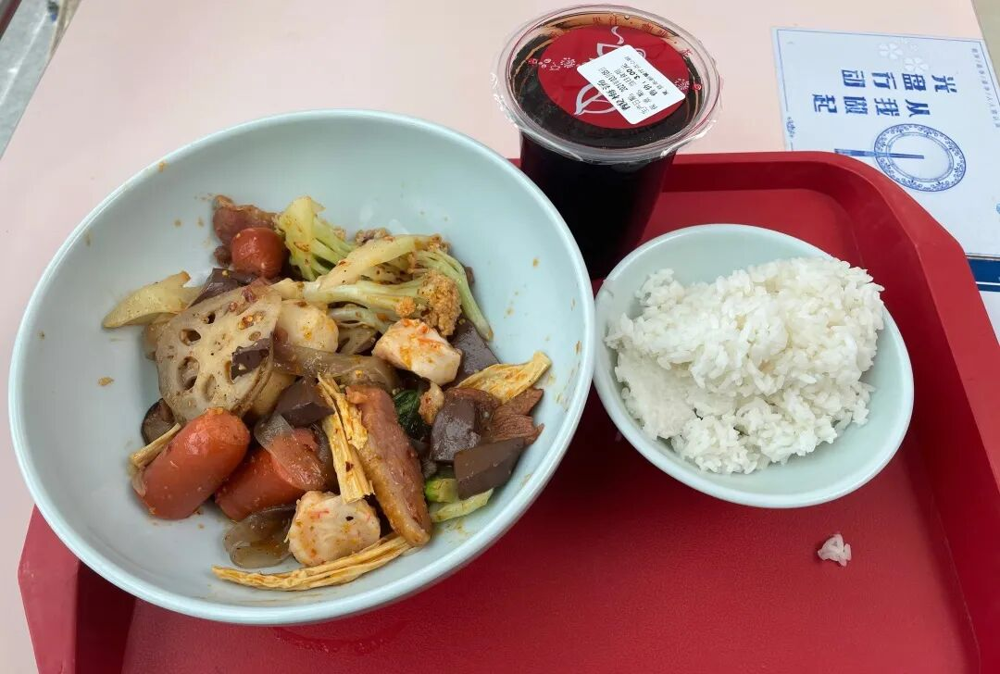

【IMAGE-012 END】

(向左滑动查看更多照片)

另一个复旦的网红打卡点就是光华楼的**星空咖啡厅**了。我记得当时去的时候，门口写的是“咖吧”，非常复古，有老上海的味了，脑袋里蹦出来的是阿德咖吧哈哈哈！（上海人懂的都懂）在没有疫情的时候这个咖啡馆是对外开放，是可以不用校园卡消费的地方，但是现在学校封闭管理，只有校内师生可以来了。个人体验是平均价格就复旦的整体消费来说确实是贵的，而且东西味道一般，不是特别推荐。不过光华楼15楼可以看到远方的陆家嘴三件套，想来看个风景消磨一下午后时光的话还是一个不错的选择。

【IMAGE-013 START】

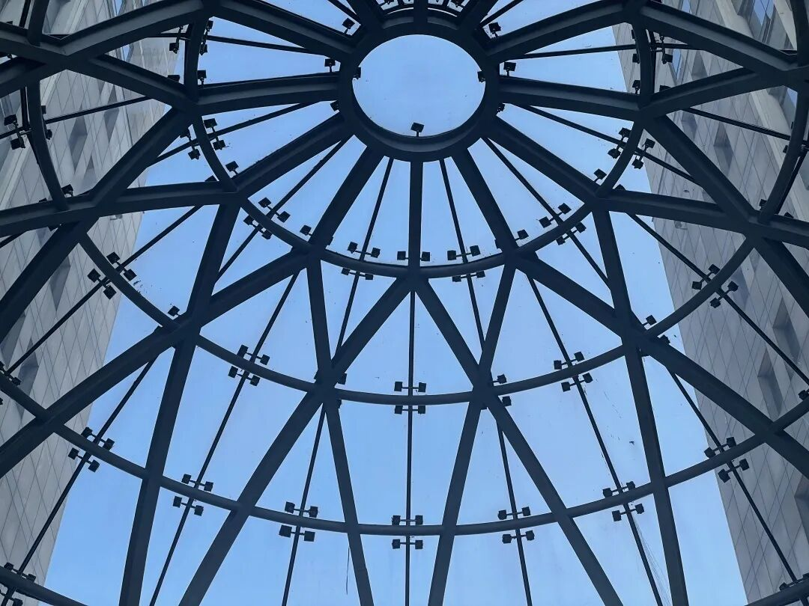

【IMAGE-013 END】

【IMAGE-014 START】

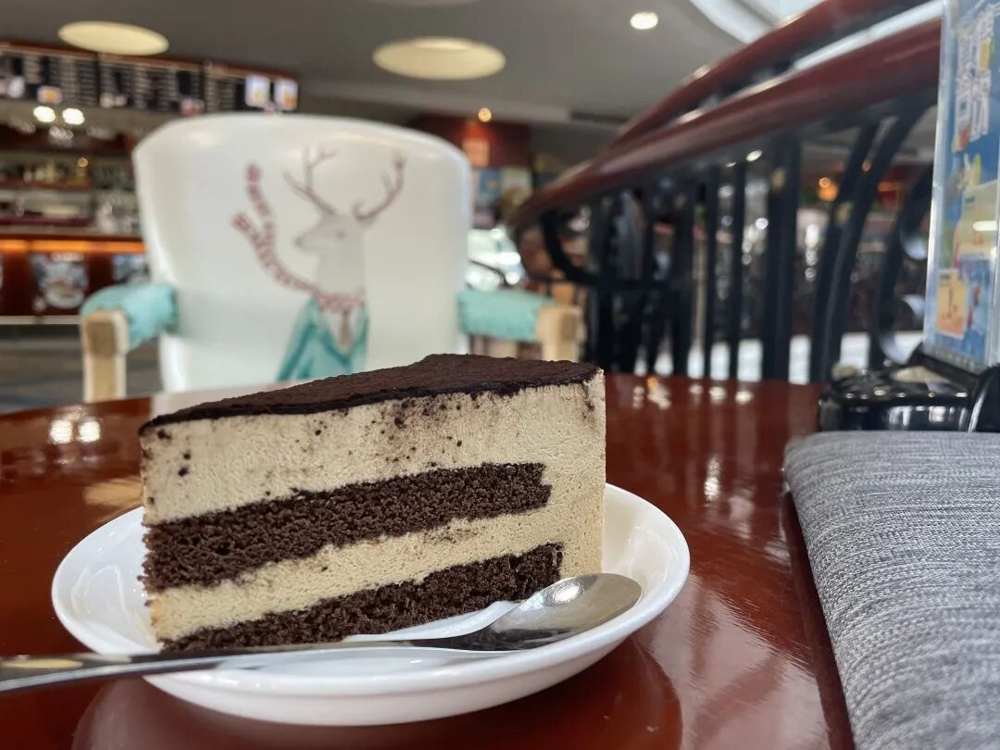

【IMAGE-014 END】

其他生活方面无非就是学校的**社团活动**了。我认为短短三个月的时间其实比较难和本校的学生有深入的认识，也很难说真正融入复旦人的圈子。你毕竟是交换生，而且也不住校。我认为社团活动是除课堂小组作业之外可以认识一些同学的地方。我是下半学期进行交换的，相信学校活动一定不如九月迎新时那么多，但是还是向大家推荐**百团大战**！就是在特定的某一日，学校所有的社团都会在指定的操场摆摊招新，你可以通过这个机会加到很多社团的微信群和微信公众号，了解他们的招新进程和最新活动。社团种类还是很多元的，有品酒社，麻将社，猫协，国标舞协，还有法援社！如果遇到感兴趣的不妨可以去试一试。唯一一点就是交换时间太短，加入核心成员组不太可能，但是还是可以去参加社团举办的活动认识一些大佬。参观完百团大战的体验就是，优秀的人不只是学习优秀，而是什么都优秀。相比之下，本懒人花了20元加入了复旦羽协，却因丢了羽毛球拍而一次没有去过，真是惭愧……

【IMAGE-015 START】

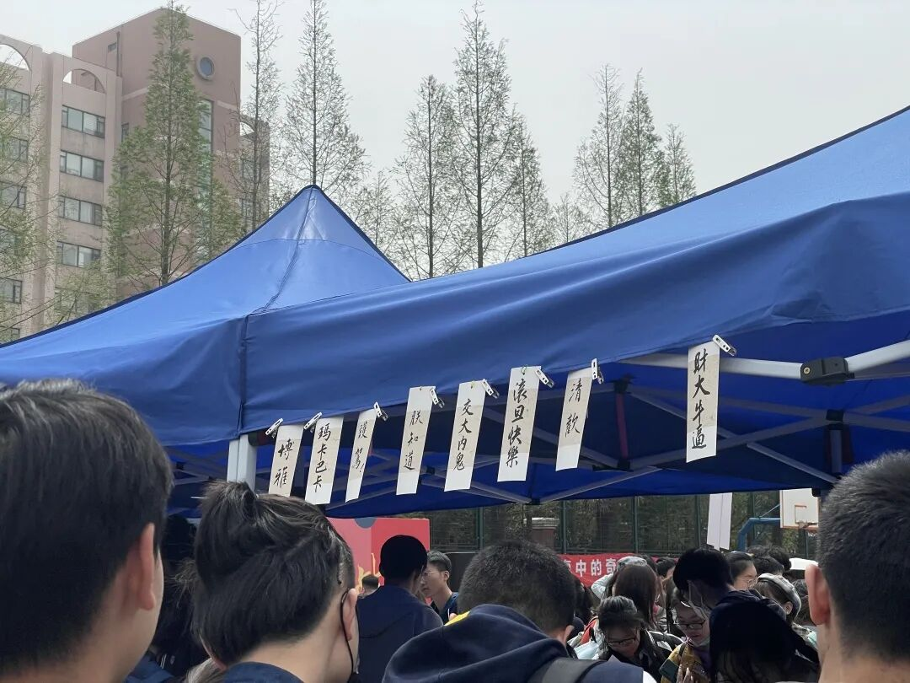

【IMAGE-015 END】

【IMAGE-016 START】

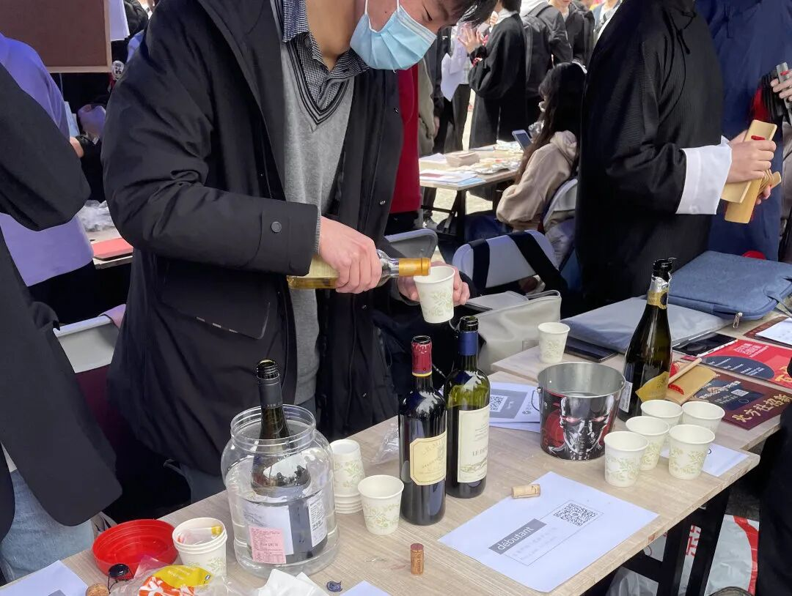

【IMAGE-016 END】

**CONCLUSION**

**复旦交换值得吗？**

如果你问我，在复旦的交换经历对在国内求职，甚至说对在国内考研有帮助吗？我只能回答说，我不知道。如果你问我交换值得吗，我觉得答案是**肯定的**。这段经历对开拓我的眼界，提升我的学术背景和批评思考能力来说，一定是很有帮助的，而且你在任何一个国家任何一个学校交换都能得到这样的经历。学习是一个探索的过程，要学会利用学校的资源，而交换则为你提供了更多的资源，让你接触不一样的学术环境和文化背景，从而更好地提升自己。

时常还会想起在复旦的校园中骑行，在光草躺草撸猫，在文科图书馆自习，在宋词课堂蹭课，穿梭在新院教学楼的时光。从初春的樱花，看到盛夏的炽阳。这段时光虽然短暂，但是我很珍惜，也非常感恩。我甚至认为这段经历让我把握了未来的学术方向。退卡的那天，我又逛了一遍校园，喂了复旦校草叮当，在光草坐了很久。虽然走到腿酸，晒到发烫，喂蚊子喂到饱，但是多希望时光停止，就让一切留在那一刻。

如果专业允许的情况下，我推荐大家都要**把握交换的机会**。不过我并不是很建议把回国内交换当作唯一的目标，毕竟IPO就只有复旦一个学校可选，可能会失望。既然人在海外，还是应该把握机会，提升全球视野。**希望大家都能合理规划，去到理想的学校交换~**

【IMAGE-017 START】

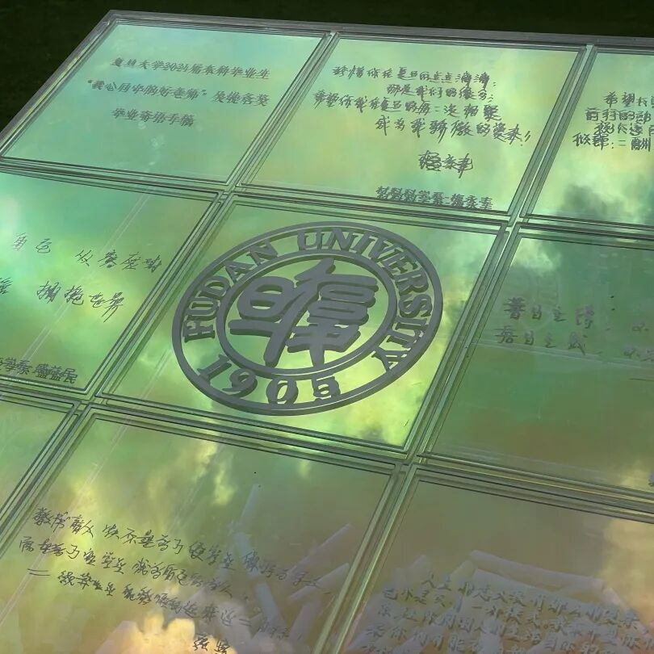

【IMAGE-017 END】

【IMAGE-018 START】

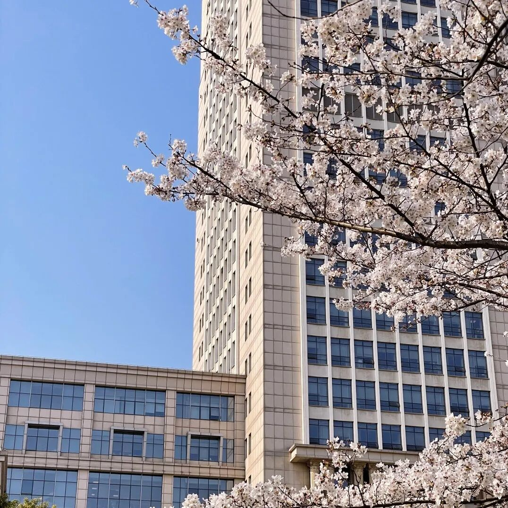

【IMAGE-018 END】

【IMAGE-019 START】

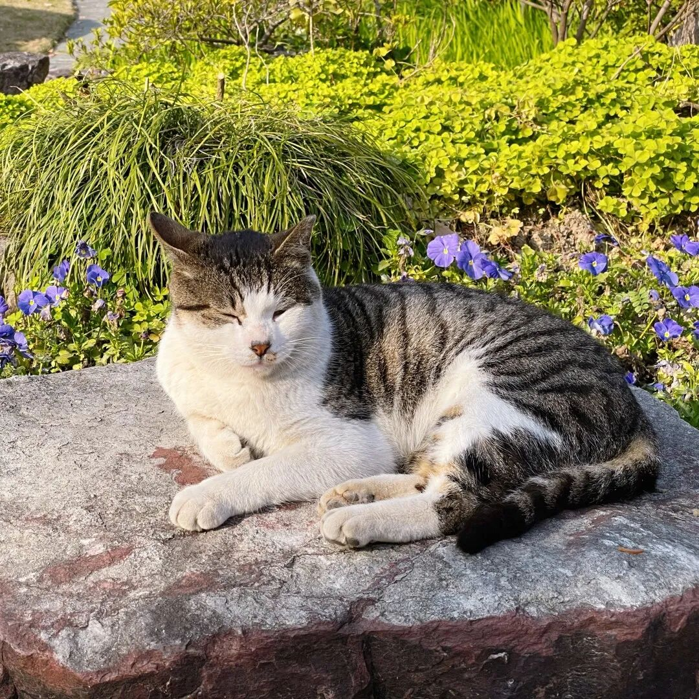

【IMAGE-019 END】

【IMAGE-020 START】

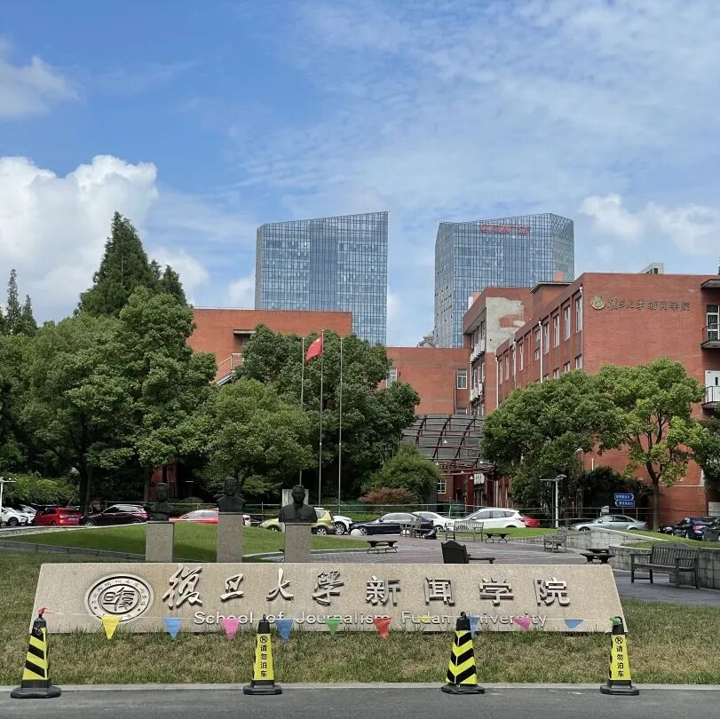

【IMAGE-020 END】

**2021**

FUDAN

【IMAGE-021 START】

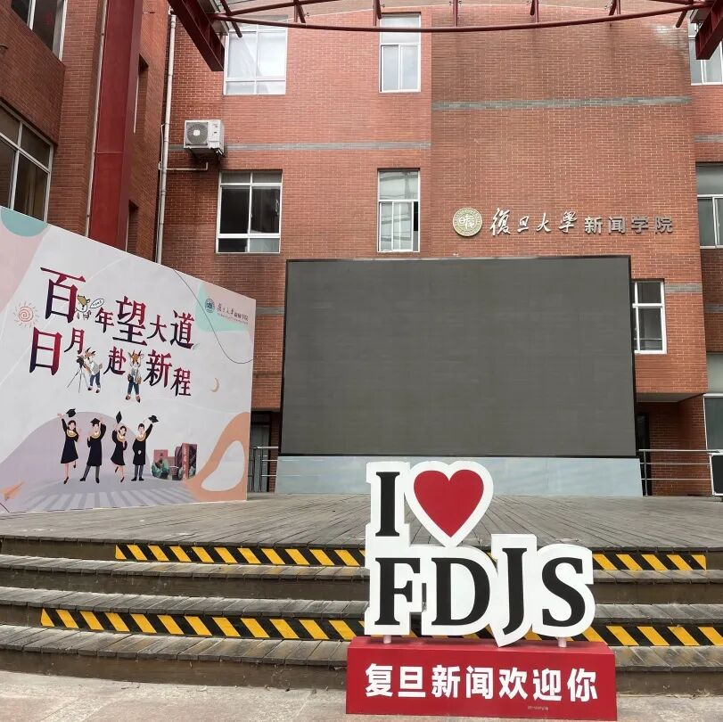

【IMAGE-021 END】

【IMAGE-022 START】

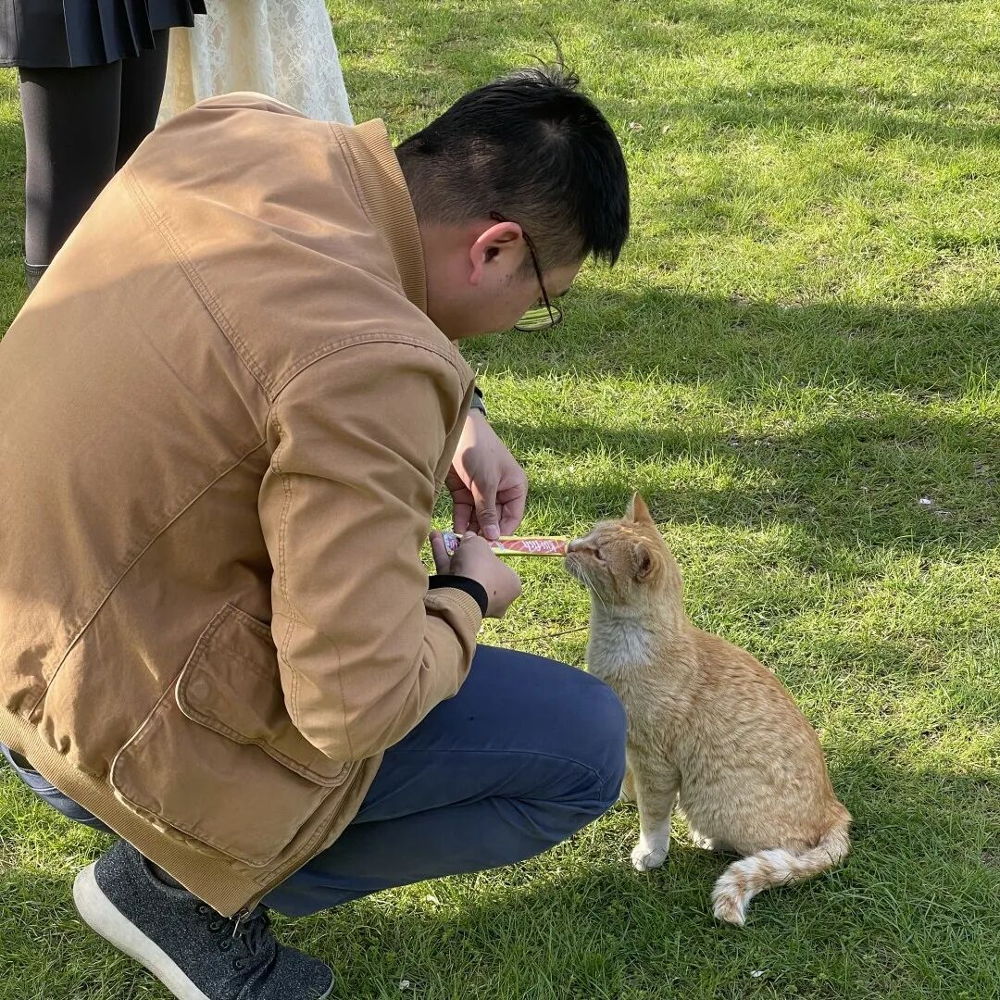

【IMAGE-022 END】

【IMAGE-023 START】

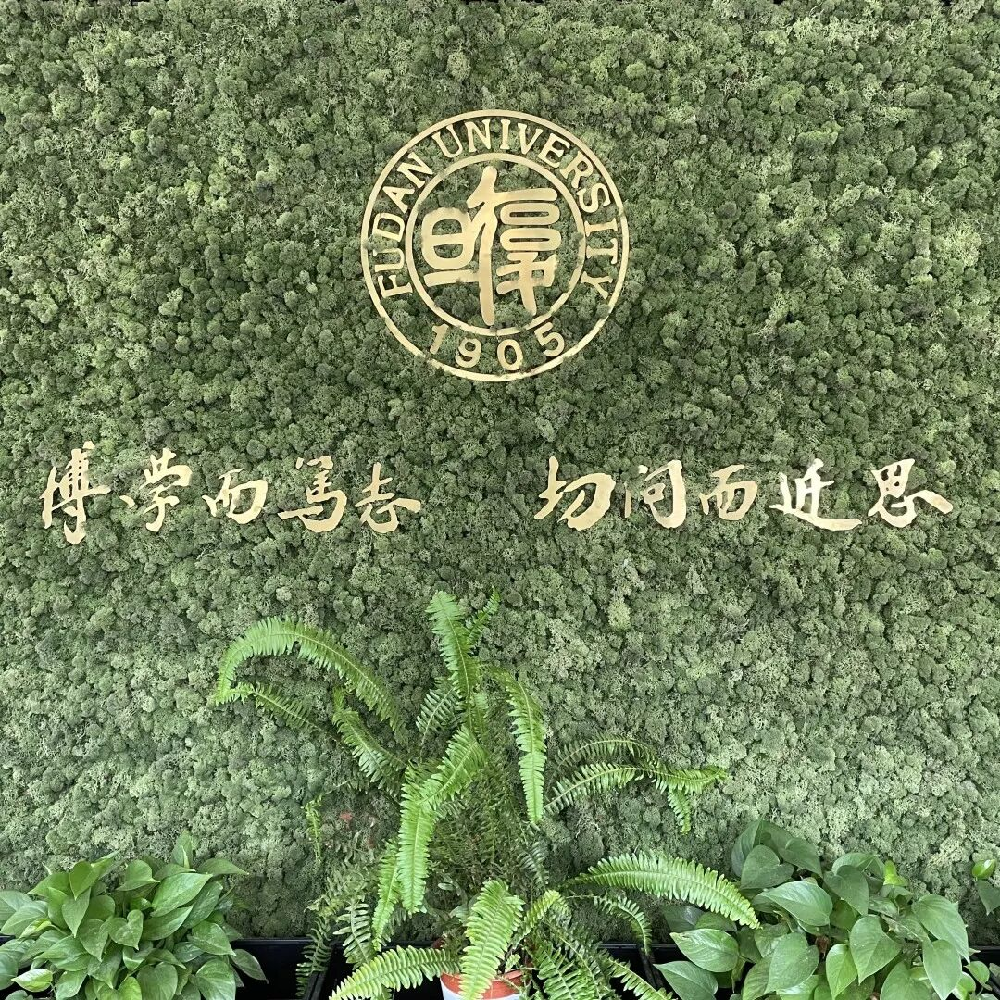

【IMAGE-023 END】

【IMAGE-024 START】

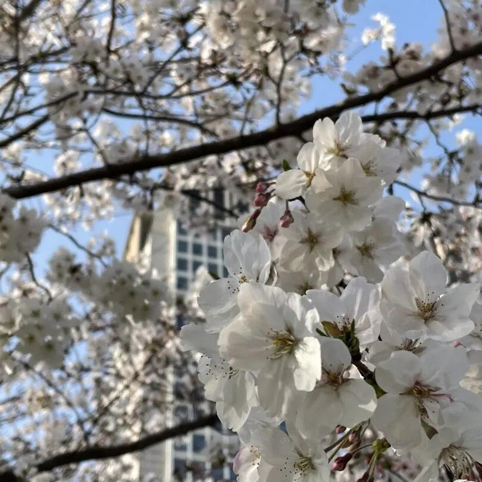

【IMAGE-024 END】

**EXCHANGE FAIR**

**2021交换咨询展来了！**

说了这么多，你是不是早已经蠢蠢欲动了？各位大二的同学们注意了！2021学校官方交换咨询展又如期而至了！本次展会依旧是线上的方式进行，将在**11月15日至11月18日**举行，每天都将由不同国家和地区的学校代表来介绍交换学校的情况。有计划交换的同学不要错过！申请准备第一步，了解学校！点击以下链接了解详情报名哦~

https://www.queensu.ca/ipo/exchange-fair-2021

【IMAGE-025 START】

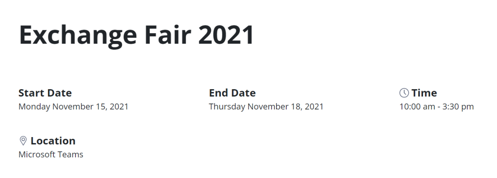

【IMAGE-025 END】

【IMAGE-026 START】

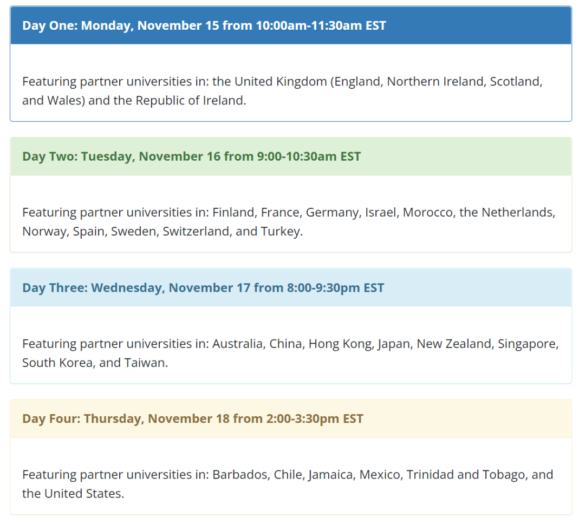

【IMAGE-026 END】

**如果你对我的复旦交换经历非常感兴趣，有更多的问题想要问我的话，好消息来啦！****我们GPS计划在11月中下旬左右举办学长学姐交换经验线上分享会****，届时如果你有什么具体的问题，欢迎来提！具体时间还请关注我们的微信公众号，届时会发布具体时间信息~谢谢大家支持！**

【IMAGE-027 START】

【IMAGE-027 END】

文字 | 容易

排版 | 容易

编辑 | Rika

审核 | 容易 Olivia

【IMAGE-028 START】

【IMAGE-028 END】

【IMAGE-029 START】

【IMAGE-029 END】
