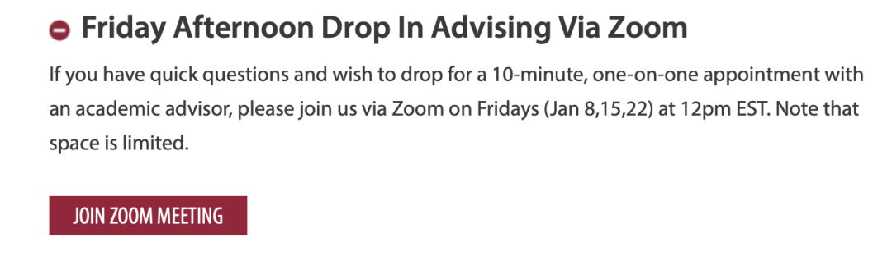
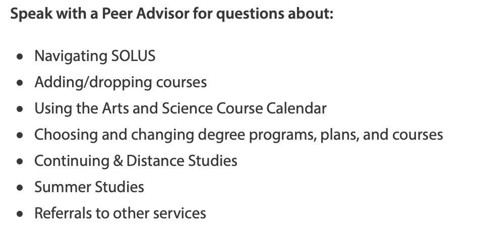
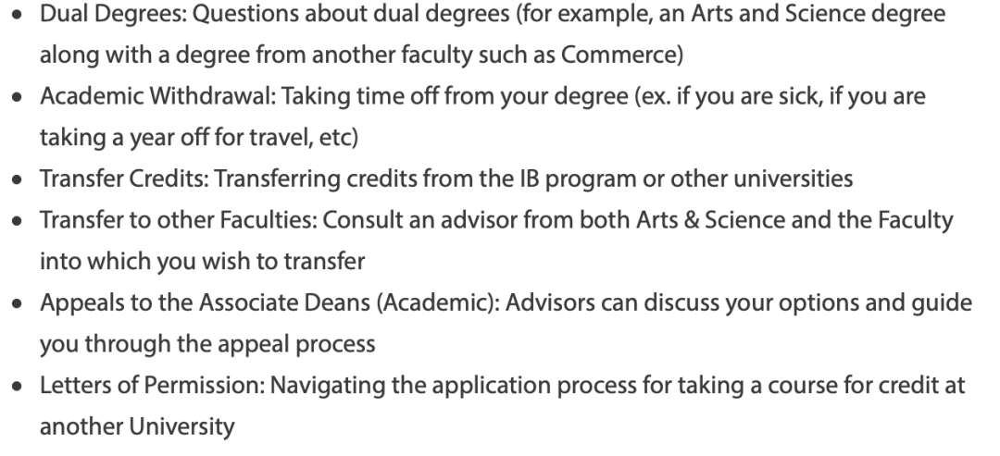
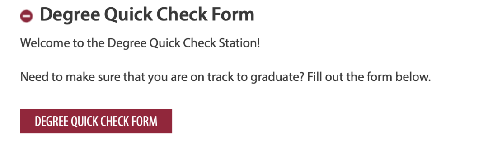
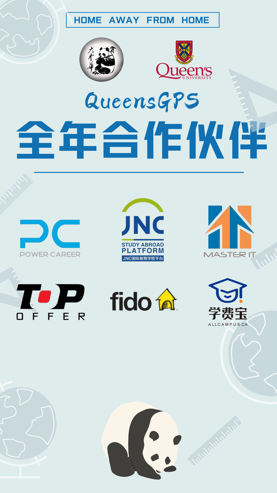

# GPS干货 | 课程规划有问题？快来问问神奇的ACADEMIC ADVISOR！

> 来源：微信公众号  
> 原链接：https://mp.weixin.qq.com/s/9_MOuyaVfYGtdnHjSHxCmw  
> 状态：自动搬运，暂未分类  
> 图片数量：7  
> OCR 图片文字数量：0

---

## 人工整理说明

本文件保留了公众号文章中的所有图片，没有自动删除装饰图。  
每张图片都用 `IMAGE-编号` 标记，方便后期人工检索、删除或补充说明。  
如果图片下方出现 OCR 文字，说明脚本尝试识别了图片中的文字，但需要人工检查准确性。  
OCR 文字只是辅助，不代表一定需要保留到最终正文。

---

ACADEMIC ADVISING服务

ACADEMIC ADVISING服务项目是女王大学官方的课程规划服务项目其服务定位为：

**Are you looking for some guidance? Our Faculty Office is here to help. Check out the sections below to learn about Peer Academic Support Service (PASS) as well as Academic Advising.**

ACADEMIC ADVISING组织向大家提供了五大类别的服务，让我们一起来探索一下吧！！！

ACADEMIC ADVISING网站链接：

https://www.queensu.ca/artsci/undergrad-students/pass-academic-advising

**周五快问快答**

如果你有快速简短的问题，想立刻知道答案，并希望与学术顾问进行10分钟的一对一交流。你可以在美国东部时间周五（1月8日、15日、22日）中午12点通过Zoom与顾问交流。请注意，名额有限哦！！！

报名网址：

https://www.queensu.ca/artsci/undergrad-students/pass-academic-advising）

【IMAGE-001 START】

【IMAGE-001 END】

**Drop or Not drop**

Drop or Not drop这是个问题！

我应该drop这门课吗？我什么时候要决定？drop课能退回多少钱呢？我怎样才能补上错过的学分？在我这种情况下，drop课对我有什么影响？如果你感到课程负担过重，本课程将概述一些选项，并为你提供一些答案，帮助你做出这些重大决策。

【IMAGE-002 START】

【IMAGE-002 END】

**大一学术顾问**

大一阶段的学术规划咨询由PASS组织与学术顾问老师共同负责。PASS团队由来自文理学院不同专业和背景的高年级志愿者组成。所有的志愿者都接受过关于所有研究领域的培训。

你可以与PASS顾问咨询以下问题：

【IMAGE-003 START】

【IMAGE-003 END】

如果想咨询下面的问题，你可以直接与学术顾问老师沟通交流：

【IMAGE-004 START】

【IMAGE-004 END】

**高年级学术顾问**

当高年级学生开始考虑毕业时，可以与学术顾问联系，询问如果要毕业还需要学哪些课程？我需要获得什么样的成绩来满足毕业要求等问题。

高年级学生可以选择拨打电话613-533-2470来预约30分钟的学术咨询（电话接通时间为Monday-Friday, 9am-12pm and 1pm-4pm）也可以通过邮件咨询，邮件内需要包含姓名，学生号，与你想问的问题，学术顾问会在48-72小时之间回复。

邮件地址：asc.academic@queensu.ca

**Degree check**

通过网站degree check模块，来确认本专业的课程要求哦

【IMAGE-005 START】

【IMAGE-005 END】

**其他帮助链接**

如果学生想得到非学术方面的帮助，可以根据实际情况，在以下网站寻找帮助：

Mental health appointments are available remotely via Therapy Assistance Online (TAO) for students who need to speak to a counsellor.  

For general counselling inquiries, email counselling.services@queensu.ca(link sends e-mail)  

Medical appointments are available remotely (phone and online) for some requests. For general health inquiries, email health.services@queensu.ca(link sends e-mail)  

Health lifestyle appointments are available remotely for students who want help changing a health behaviour. For general inquiries, email healthed@queensu.ca (link sends e-mail)  

“TAO” is Therapy Assistance Online. This is an interactive tool for Queen’s students. You can access it here: https://queensu.ca/studentwellness/TAO  

Empower Me is a 24/7 phone service for crisis situations and scheduled sessions that allows students to connect with qualified counsellors, consultants, and life coaches for a variety of issues. 1-844-741-6389 You can also log in to the Empower Me website and use "Studentcare" as the password or download additional Empower Me student assistance tools on the iAspiria mobile app. 

Enter "Studentcare" as the Login ID and select "Student" in the drop-down menu. Good2Talk for post-secondary mental health support - call1-866-925-5454, available 24/7 or text GOOD2TALKON/ALLOJECOUTEON to 686868

文字：Nathan

排版：Nathan

编辑：容易

审核：唐韬tt ChrisJiang

【IMAGE-006 START】

【IMAGE-006 END】

【IMAGE-007 START】

【IMAGE-007 END】
