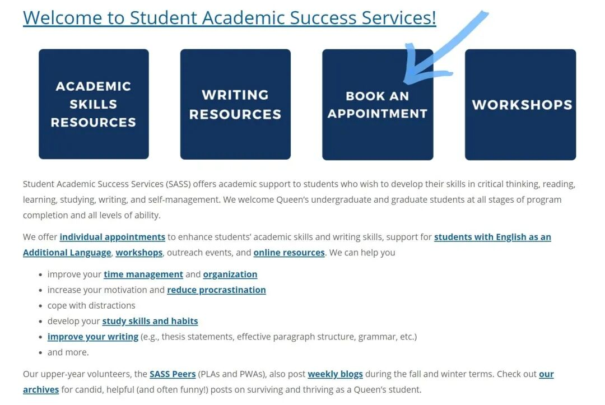
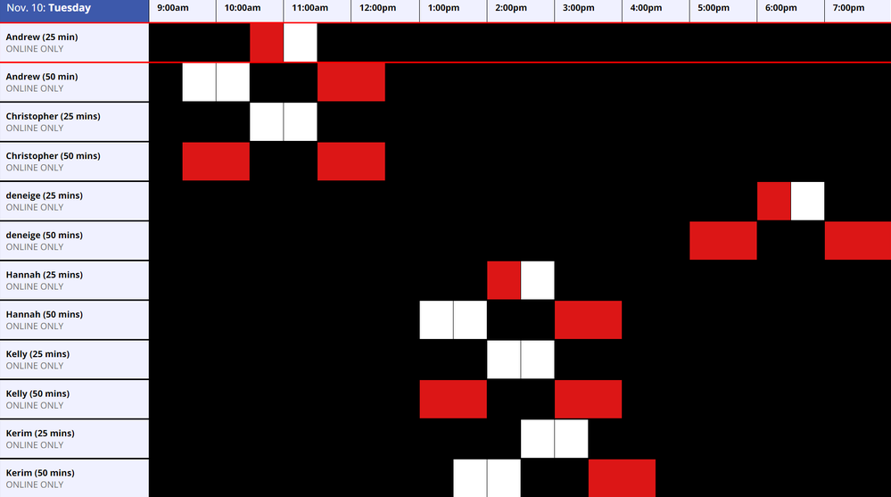

# GPS干货｜写作必备好帮手——Writing Centre

> 来源：微信公众号  
> 原链接：https://mp.weixin.qq.com/s/8gX_KHxyJUGQe0PmQVqkMA  
> 状态：自动搬运，暂未分类  
> 图片数量：4  
> OCR 图片文字数量：0

---

## 人工整理说明

本文件保留了公众号文章中的所有图片，没有自动删除装饰图。  
每张图片都用 `IMAGE-编号` 标记，方便后期人工检索、删除或补充说明。  
如果图片下方出现 OCR 文字，说明脚本尝试识别了图片中的文字，但需要人工检查准确性。  
OCR 文字只是辅助，不代表一定需要保留到最终正文。

---

作为留学生的你，有没有过为写essay愁眉苦恼的时候？不知道论文怎么写，如何构建thesis statement，用词是否妥帖，该用什么样的格式，如何引用文献，开头陈述不知道怎么编排... 今天熊猫酱就来介绍一个大家在平时写作时可以用到的资源－**Writing Centre**！（文末有实用essay指导指南！）

SASS是什么

Writing Centre隶属于Student Academic Success Services(简称SASS)，是Queens大学为学生设置的学业辅导机构。**SASS致力于帮助学生在学术写作、阅读、自主学习等方面提升技能，以便在未来更高效地学习**。SASS欢迎来自Queens大学各个院系，各个年级的学生前来寻求帮助。

**Writing Centre是SASS其中一项服务，主旨是为帮助学生提高写作水平。**

大家最常用的一个功能就是Writing Centre的一对一论文写作辅导 (Individual appointments)。在SASS的官网上，这项服务是为了帮助学生在写论文时出现的一些列问题。**如：培养学习习惯，提高写作水平（如何写开头的陈述段，合适的段落结构，改善语法...）等。**如果学生对上述问题有疑问，可以与Writing Centre的老师一对一咨询。

预约前，你需要知道...

1.所有学生一学年只能预约**10个appointment**

2.每周只能预约**1个appointment**

3.Appointment有两种，**一种是25分钟，另一种是50分钟**。

如何预约

**如何Make an appointment？**

首先，前往SASS的官网，点击Book An Appointment。

网站链接：https://sass.queensu.ca/

【IMAGE-001 START】

【IMAGE-001 END】

进到界面后选择日期，时间段和辅导老师。记得**只能选择白色的预约时间**，红色表示已有人预约了这个时间段；黑色表示这段时间无法预约；灰色表示预约时间段已经无效。选择后系统会跳出预订窗口，按照网页上的指示填写就好啦。预约成功后，你会在Queens邮箱收到确认邮件。

往年正常情况下，学生都是前往位于Stauffer Library一楼的SASS中心面对面接受辅导的。由于今年的特殊情况，目前所有的预约都改成了online模式。建议大家在预约成功后自行先试运行一下online meeting的系统，确保一切顺利。

【IMAGE-002 START】

【IMAGE-002 END】

**如何加入Waiting List？**

在每个日期的时间表下方，有一个**Waiting List**的选项。点击想要预约的日期，填写相关信息。当有人取消预约时，学生的Queens邮箱将会收到自动通知。邮件仅是为了通知学生可用的时间，并不代表已经帮助学生完成预约了。如果学生还需要预约，需自行前往官网预定。期中期末前为预约高峰期，大家记得尽早预约哦！不然可能就约不上啦！

如果你是大一大二的新生，也可以参与**Peer Writing Assistants**这个项目，将由高年级受过专业训练的学长学姐为你辅导。（100&200 level courses only）

该项目每次session是25分钟，**并且参与次数是不计入每学期10次的限制**。也就是说，如果大一学生对写作有问题可以无限制地参加这个drop-in session！

**注意！如果你临时改变了计划，需要修改或取消预约，记得提前6小时在官网上操作！预约界面有“取消预约”选项。不然将面临罚款！请大家千万注意！（Peer Writing Assistants 需提前2小时取消）**

以上就是熊猫酱为大家总结的Writing Center预约指南，希望可以帮助到大家！SASS为学生提供了不少实用的学术资源，对于如何写作、构建thesis、查找引用文献等有疑问的同学，可以向SASS寻求帮助。特别是大一刚刚入学的新生！向大家强烈推荐SASS！为未来的专业学习打好基础！祝大家学习顺利！

实用推文指南：

[GPS干货 | 手把手教你写一篇论文](https://mp.weixin.qq.com/s?__biz=MzA3OTc3NDUxNg==&mid=2651192267&idx=1&sn=57219eec06b2daa584dd3db557375d81&scene=21#wechat_redirect)

文字/ Spencer

排版/ Spencer

编辑/ 容易

审核/ 唐韬 Chris

【IMAGE-003 START】

【IMAGE-003 END】

【IMAGE-004 START】

【IMAGE-004 END】
