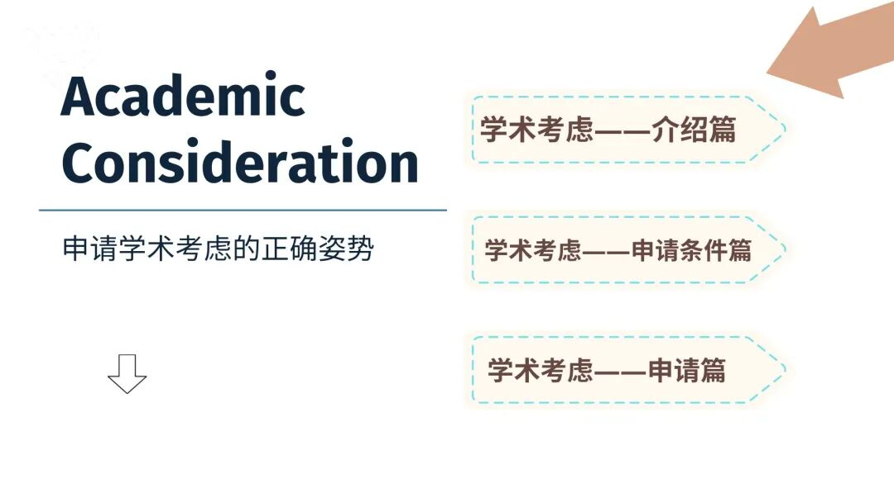
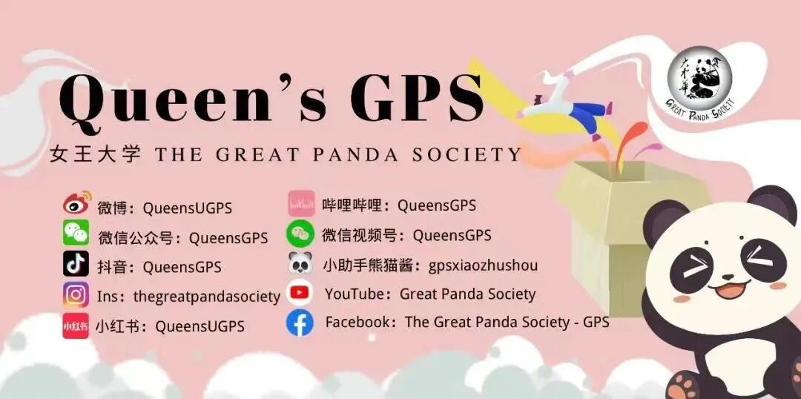
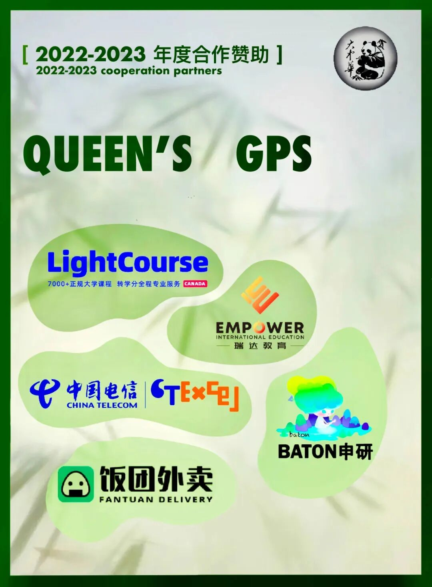

# GPS干货｜“关键时刻的救命恩人”——学术考虑该怎么申请？

> 来源：微信公众号  
> 原链接：https://mp.weixin.qq.com/s/3Kb5WEDJvWZDy5-bS4JDRw  
> 状态：自动搬运，暂未分类  
> 图片数量：7  
> OCR 图片文字数量：0

---

## 人工整理说明

本文件保留了公众号文章中的所有图片，没有自动删除装饰图。  
每张图片都用 `IMAGE-编号` 标记，方便后期人工检索、删除或补充说明。  
如果图片下方出现 OCR 文字，说明脚本尝试识别了图片中的文字，但需要人工检查准确性。  
OCR 文字只是辅助，不代表一定需要保留到最终正文。

---

**GPS干货｜GPA的“意外险”——学术考虑**

GPS Introduction of academic consideration

- 目录 -

【IMAGE-001 START】

【IMAGE-001 END】

**引言**

不知道在校园中生活的小伙伴们，是否在生活中遇到一些令自己无可奈何的情况，例如当你花费了数周的心血，字斟句酌地敲击键盘，在数个夜晚坚守在屏幕前一字一句润色而完成的final essay，就为了在教授那儿薅来一个高分，却在上交前的时候电脑死机而导致essay交不上去，又或者是精心准备了数天的presentation，一切就绪后却在演讲的前一天晚上高烧不退……

【IMAGE-002 START】

【IMAGE-002 END】

是不是光想象一下这两种场景是不是就血压飙升? 在感叹自己不走运的同时又不禁暗暗担心这些事故会不会影响自己的GPA，而这个时候就轮到情有可原的学术考虑来“救你一命了”。

【IMAGE-003 START】

【IMAGE-003 END】

**01**

**情有可原的学术考虑是什么？**

情有可原的学术考虑（Academic Consideration）是学校为了帮助学生减小**因出现无法预料到且情有可原的个人原因****，即个人无法控制的情况****，**而对学术成绩产生负面影响的人性化政策。学生通过递交“学术考虑”申请，向教授或学院申诉自己遇到的情况，阐述自己的诉求，并双方沟通后确定一个方式去“弥补受到影响的GPA”。

例如上文提到的，如果presentation前一晚高烧不退，可以通过提交学术考虑申请去请求教授延期你的演讲日期。

“学生提出，并可以被学院考虑的诉求” 包括但不限于：缺席部分课程、重新提交一项作业、推迟/修改/重新规划实验，作业，项目或考试时间表、进行一个替代作业或考试、重新分配分数权重、取消课程而不受处罚（需要向学院提出上诉），或学院或学校办公室认为适当的其他考虑（具体的考虑选项需要和教授沟通后确定）。

注：申请学术考虑的学生必须满足该项目的所有基本学术要求和标准，例如文理学院要求GPA不低于1.9。

**02**

**什么情况下能申请学术考虑？**

每个学院在细则或申请流程上有些微差距，这里引用文理学院的符合条件，请以自己学院的“学术考虑页面”为准。

**包括但不限于**

**健康状况或受伤**

**·** 短期身体或精神疾病（例如肠胃炎、短期焦虑或抑郁） 

**·**严重受伤（例如，脑震荡或骨折） 

**·**需要接受治疗（例如，手术或根据医生的要求用药）

**对个人造成影响的隐私事件**  

**·**重要的其他/家庭成员的严重伤害或疾病而导致的影响（例如，车祸或死亡）  

**·** 创伤事件（例如，离婚、性侵犯、社会不公）

**任何法律或公共卫生当局的要求**

· 被法律性质要求出席/到场的日期（例如法庭陪审义务、传票，警察局传唤等）

·意外的、非旅行性质的（被要求）隔离

**重大事件**

**·**大学运动会

**·** 杰出活动（大学赞助的比赛或重大事件）

**·** 服役要求

**其他**

    如果遇到上面未列出的不可预见的情有可原的情况并且不确定它是否符合条件，可以在https://www.queensu.ca/studentwellness/forms 中寻找自己学院的相关联系人咨询，或直接通过asc.consideration@queensu.ca联系学术考虑团队。

**02**

**该如何申请学术考虑？**

学术考虑分为最长3天的短期学术考虑和4天至最长数月的长期学术考虑，**如有任何个人无法控制的情况出现且有可能影响你的学术成绩，学校鼓励学生立刻申请学术考虑。**

注：自11月16日之后，因出现新冠肺炎症状或有自我隔离需求的学术考虑申请将无需提供相关的医疗证明，仅根据自己学院的学术考虑政策提出申请即可。

**申请无需证明文件的短期学术考虑**

-仅需通过自己学院内的学术考虑网站提交申请并填写**情有可原申请表证明**即可。

    -这些请求必须在情有可原的情况出现后 4 天内提交 （例如，如果9月1日出现情况，则必须最迟在 9 月 4 日之前将请求提交到该系统）。

    

    -每个学生可以提出一个最多 3 天的短期申请，每个学期的第一次申请无需提供证明文件。（即秋季、冬季、夏季）。

**这类请求在exam period不能使用（exam期间的任何申请都需要证明文件）**，并且一旦提交申请后也不能撤回。在同一学期的剩余时间内，如果需要再次申请短期学术考虑则需要提供相关证明文件。

**申请需要证明文件的长期学术考虑**

-此类请求需要支持文件，证明文件的详细描述可在https://www.queensu.ca/studentwellness/forms网站中查询，对个人造成影响的隐私事件等不同情况的具体要求。

    -在提交申请后，校方如果需要更多证明文件，则会通过你填写申请时留下的联系方式与你联系。

 

证明文件需要在提交请求后的5 个工作日内提交。如果未提交证明文件，申请可能会被驳回，并且**所有因情有可原的学术考虑的长期请求必须在课程结束/结束之前提交，对于全年课程，请求必须在求学术考虑的学期内收到。**

【IMAGE-004 START】

【IMAGE-004 END】

最后的最后，啰啰嗦嗦的熊猫酱再提醒大家一些小tips

**Tips：**

1）学术考虑可以一直追溯申请，即申请过去的日期。只要在同一学期内，即使在学期末，也可以为学期刚开始时因个人无法控制的情况而耽误的作业/考试等申请学术考虑，直到学期结束。

2）因身体疾病原因而需要申请长期的学术考虑，一定需要提供来自医疗或其他熟悉情况的专业人员的证明/报告（如果是国内医院的证明则需要同时提供原件和翻译件）。即使身体出现症状但没有相关证明文件的话，申请依然可能会被驳回。

3）在校园中，可以通过学生健康服务团队Student Wellness Services（SWS）咨询医疗建议，在和学生健康服务团队沟通后，确定你需要学术考虑，那么学生健康服务团队会为你提供相关的医疗证明文件。

以上就是本期对于Queen‘s Academic Consideration的科普啦，感谢大家的阅读~

如果这篇文章可以成功帮助到小伙伴们或者小伙伴们的小伙伴（套娃），那么也请点赞支持一下熊猫酱吧，一个赞温暖熊猫酱一小会儿，足够多的赞可以暖熊猫酱一整个冬天~

【IMAGE-005 START】

【IMAGE-005 END】

咱们下期再会！

1

**END**

1

文字 / Eric

排版 / Eric

编辑 / Crystal

审核 / Leo，Simon

【IMAGE-006 START】

【IMAGE-006 END】

\*如有合作意向，请联系微信：gpsxiaozhushou

【IMAGE-007 START】

【IMAGE-007 END】
