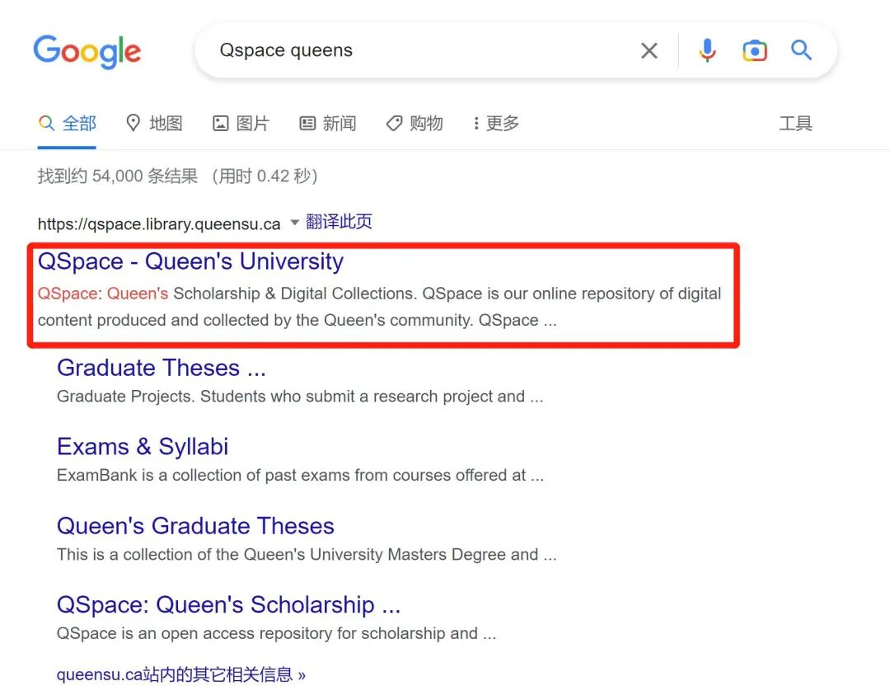
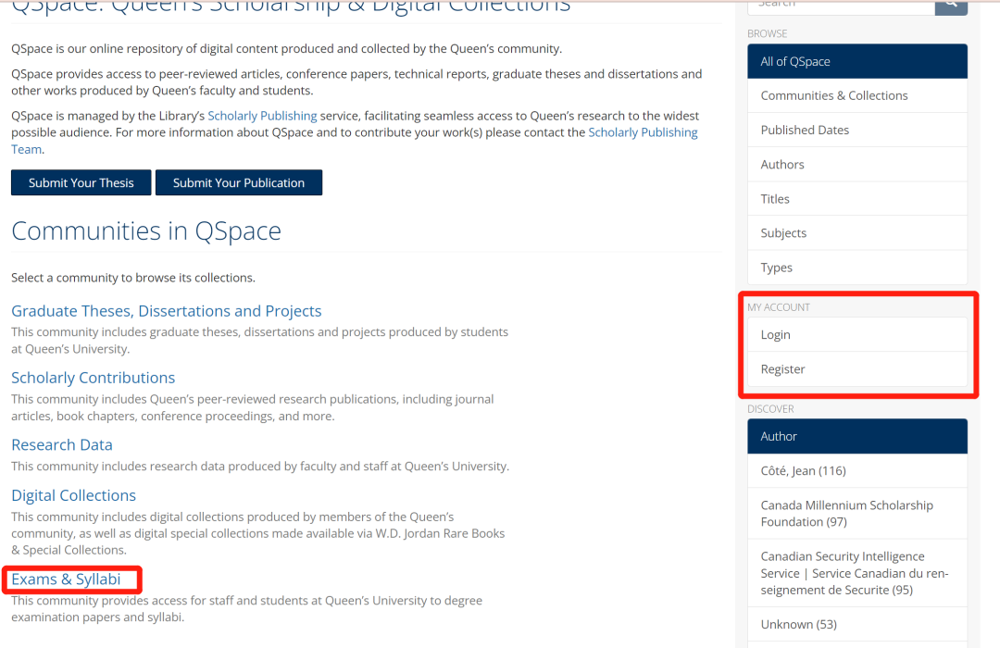
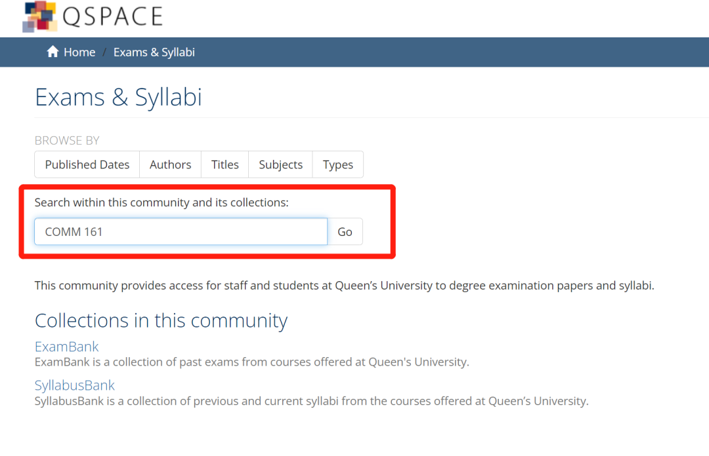
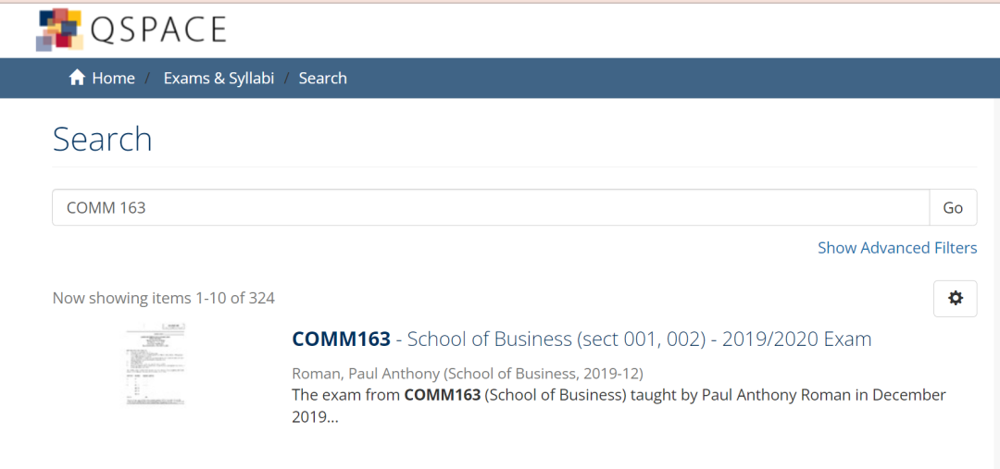
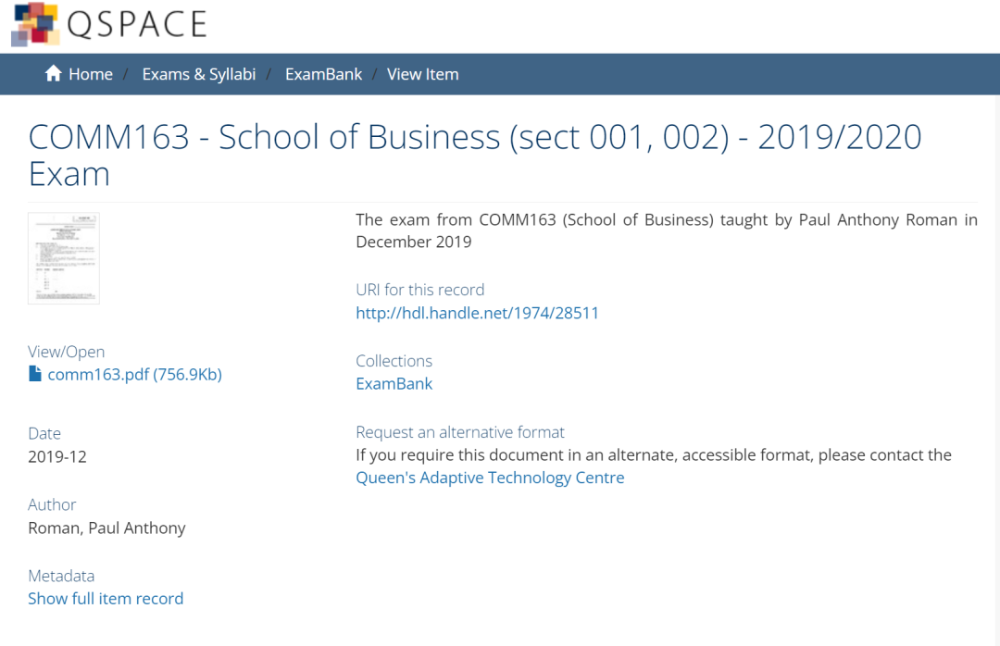

# GPS干货 | 复习利器，Exambank 怎么用？

> 来源：微信公众号  
> 原链接：https://mp.weixin.qq.com/s/bdcjC3RlN8at42LpbDYRTA  
> 排版：已整理；正文图片：5 张

---

**期末来了**

DECEMBER

岁末将至，

期末考试也即将到来，

那么，我们该如何为考试做准备呢？

时间过的超快！熊猫酱眼瞅着自己大学生活已然过了大半，多少回忆涌上心头～啊～～还有好多好玩的地方没去，还有好多好吃的没吃......

不做梦了！要 **期 末 考 试** 啦！

一学年四度的战斗时刻又来了，已哭晕在自己的房间。

莫慌莫慌！熊猫酱作为在Qu摸爬滚打顽强生存下来的一份子，今天给大家强烈安利**Exam Bank！**

**Exam Bank**是女王大学历年所有课程期中期末考卷的集合，需要登陆学生账号进入。这是一项帮助学生学习的服务，可以查询往年期中期末考试试卷的地方。

想知道如何使用它吗，那就跟着熊猫酱往下看吧~

**Exam Bank**

1. 在浏览器上搜索“Qspace queens”

2. 直接点击步骤1中“Exams & Syllabi”。

 

从Libarary 进入的同学可能会看到以下这个界面：

    - 点击下图中的"Login"按钮；

    - 用Student ID和密码登录；

    - 点击 “Exams & Syllabi”；

3. 直接输入课程名称，也可以在 “ExamBank”里查询。

4. 然后，你会惊喜发现了往年的考试卷啦!

学有余力的同学们可以用它来**刷题**，复习**巩固知识点和盲区**；焦头烂额的学子们同样可以通过 Exam Bank 判断出题的**难度和复习范围**

当然，不能完全依赖往期试卷！事实证明，有些刁钻的教授会出一些和往年完全不一样的题目！So, 好好利用**本学期的课件**，认真钻研透教授提供的练习题/各种资料，才是打好复习基础的第一步！！！

还有一点需要注意的是 exam bank里历年考卷虽然很全，但是**很多不提供答案哦！**同学们做完了，一定记得去找TA/教授索要相应的考试卷答案，发现问题解决他们。

有些课程的教授会直接在OnQ上放历年考题，一般都是带答案的。大家优先参考教授主动提供的真题哦！

好啦，对Exam Bank的介绍就到这里啦！欢迎知道更多考试复习小技巧的学长学姐们在评论区留言哦～最后，熊猫酱祝大家的Final都能取得满意的成绩！考的全会，门门A+，4.3满绩达人就是你！

文字 | 金秋灵, Fiona

排版 | 金秋灵

编辑 | Crystal

审核 | Leo, Simon

\*如有合作意向，请联系微信：gpsxiaozhushou
