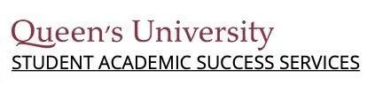
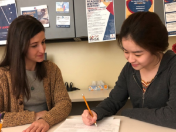
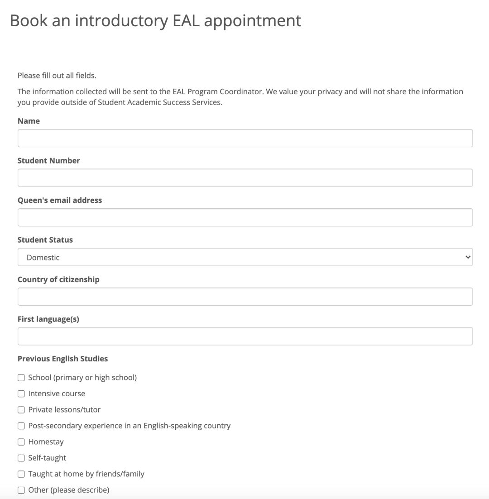
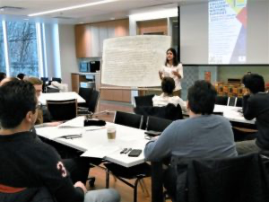

# GPS干货｜EAL Support 提升英语水平的制胜法宝

> 来源：微信公众号  
> 原链接：https://mp.weixin.qq.com/s/yV-Vb4BwCt2ha8VWdqOUtA  
> 状态：自动搬运，暂未分类  
> 图片数量：11  
> OCR 图片文字数量：0

---

## 人工整理说明

本文件保留了公众号文章中的所有图片，没有自动删除装饰图。  
每张图片都用 `IMAGE-编号` 标记，方便后期人工检索、删除或补充说明。  
如果图片下方出现 OCR 文字，说明脚本尝试识别了图片中的文字，但需要人工检查准确性。  
OCR 文字只是辅助，不代表一定需要保留到最终正文。

---

【IMAGE-001 START】

【IMAGE-001 END】

对于许多国际学生而言，陌生的语言环境成为了留学生涯的一大难题。我相信大家都会好奇如何在长篇文章写作，演讲，报告，小组合作中做到用词妥帖，表达清晰，结构完善。今天，熊猫酱便向大家介绍一下女王大学国际学生们提升英语水平的制胜法宝——EAL Support。

**01**

**EAL Support是什么？**

【IMAGE-002 START】

【IMAGE-002 END】

EAL Support由学生学术成就服务中心(SASS)提供，面向广大英语并非母语，而是作为一门额外语言的学生。这项服务的目的是为帮助学生提高他们的学术英语技能。学生们可以从听说读写四个角度出发，通过专业技巧训练来提高交流能力，并在英语技能提升的同时，建立自信，减轻学习压力。

【IMAGE-003 START】

【IMAGE-003 END】

**02**

**EAL Appointments**

【IMAGE-004 START】

【IMAGE-004 END】

EAL Appointments是可供学生预约参加的项目。为满足学生们的不同需求，EAL Appointments的侧重点是不同的。有些课程侧重于发音，同学们可以通过口语训练，得到自己的英语发音反馈，更加有针对性地提升自己的英语口语。学术写作课程则更侧重于写作能力的提升，该项目的负责老师可以帮助大家识别文章中意义不明确的地方。通过讨论单词的选择，过渡语和句子结构，帮助学生发展他们的写作能力，有效地交流批判性的想法。

【IMAGE-005 START】

【IMAGE-005 END】

如果大家对于EAL Appointments有兴趣的话，可以在SASS提供的连接处填写预约表格 ( request an introductory appointment )。同学们会在申请邮箱中收到在线预订的详细介绍。

申请表链接：（该申请表只需填写一次）

https://sass.queensu.ca/eal/form/

【IMAGE-006 START】

【IMAGE-006 END】

图｜样表

**03**

**Weekly Programs**

【IMAGE-007 START】

【IMAGE-007 END】

SASS和QUIC(皇后大学国际中心)每周都会为学生们提供练习学术英语技能和提高写作的机会。

【IMAGE-008 START】

【IMAGE-008 END】

**周二 7:30pm-9:00pm  Write Nights**

每周会设立不同写作主题的互动研讨会，比如批判性思维或句子变化。学生们可以加入他们感兴趣的话题，以建立写作基础，学习写作策略。

**周三 6:00pm-8:00pm  Drop-In EAL Support**

助教将会在会议中回答学生们在写作中遇到的困难，有针对性的给出反馈并提供策略。

**周三 7:30pm-9pm 周四5:30pm-7pm  English Conversation Group**

志愿者通过小组活动和讨论帮助引导英语会话。每周都有一个新话题。在友好的环境中学习成语、表达和发音。

**周一周四 9am-12pm  Grad Writing Lab**

研究生们都可以在一个在线的研究生社区中进行写作，将会有专门的学术写作专家帮助学生们解决写作问题。

注意以上时间皆为加拿大东部时间。同时受到疫情影响，今年所有的meeting都是线上会议。大家可以根据自己的需求，参加相应的活动。会议申请和注册链接可以在官网查看。

https://sass.queensu.ca/eal/

**04**

**总结**

【IMAGE-009 START】

【IMAGE-009 END】

好啦，这就是熊猫酱为大家带来的EAL Support的介绍。希望大家都能攻克语言难关，在课下时间，不妨参加一些EAL活动，该项目的老师和同学们都能为你提供一些实用有效的英语学习建议，帮助并提高你的学术写作能力。SASS还有许多其他的学术支持项目，我们将会在后续的推文中向大家介绍！祝大家学习一切顺利！

文字 Irene

排版 Irene

编辑 容易

审核 唐韬 Chris

【IMAGE-010 START】

【IMAGE-010 END】

【IMAGE-011 START】

【IMAGE-011 END】
