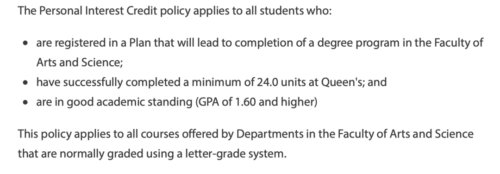
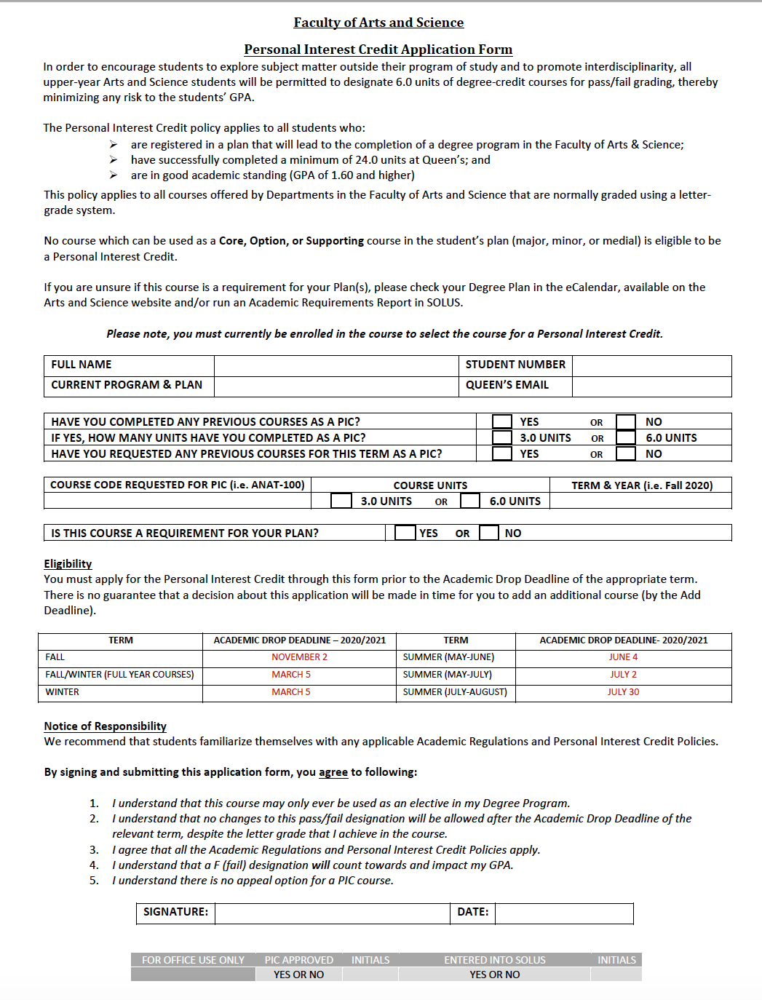
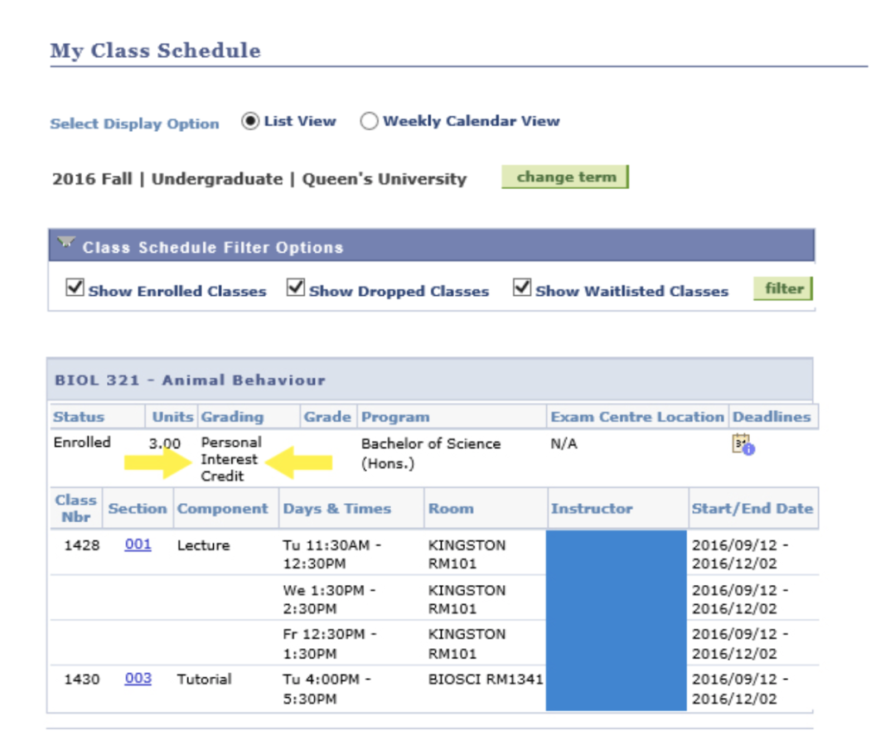
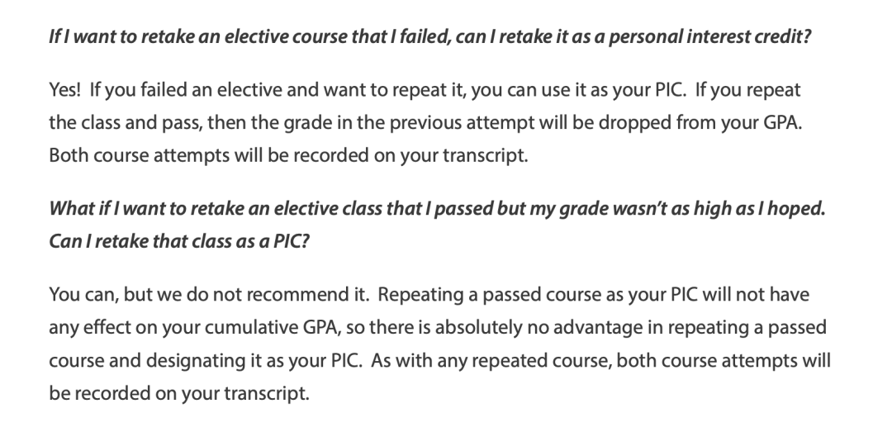
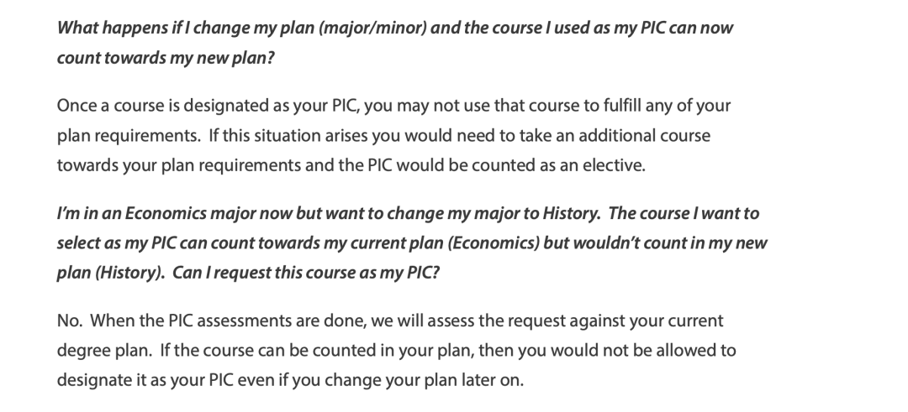
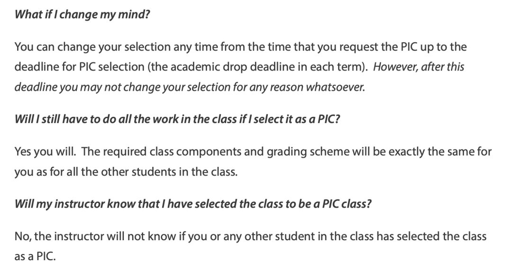

# GPS干货｜如何让选修课不计入GPA？PIC了解一下！

> 来源：微信公众号  
> 原链接：https://mp.weixin.qq.com/s/aLeVOl9vSlwGEBM-g0U39g  
> 排版：已整理；正文图片：7 张

---

PIC 申请指南

每年开学前，在自己的专业课选课已经选完的时候，同学们大多会在选择什么选修课上绞尽脑汁。有人会选择一门水课来拯救自己的GPA，但是由于教授的更换，大纲的变化，屠龙少年最终变成恶龙，水课成为了杀手课……

**“所以，水课会消失，对不对？”**

也有人会选择一些使用的课作为选修课，但是学着学着发现，这么课和自己想象中的不大一样，这类选修课可能会大量占用你的学习时间，甚至会抢了你学专业课的时间。更绝望的是，现在已经过了可以换课的时间，所以我们只能在drop后没法添加新课，本学期少了3个学分和继续让这门课拖垮GPA之间抉择吗？

其实，我们还有第三种选择！兴趣课PIC（Personal Interest Credits）是学校提供给学生的可以将非专业相关课程在通过后**只在成绩单上显示Pass**的机会。也就是说如果将一门课选为PIC课程之后，如果这门课最后顺利通过可以获得相对应的学分，只不过这门课的成绩可以不在成绩单上显示。

那么选择PIC课程有什么条件呢？

从下图可以看出，选择PIC的条件要求有三项，后两项要求在申请PIC课程时必须已经学满24个学分，并且GPA达到1.6，这两项要求意味着大一的新生暂时还不能选择PIC课程。此外学校提醒在申请研究生项目时，有些项目不承认PIC学分，因此选择PIC学分要谨慎！！！

申请条件

对于课程方面PIC课程有什么限制呢？

1. 每学期最多选择一门PIC课，大学期间最多6个学分的PIC课程
2. PIC课程不能在你的degree plan里，包括 core, option or supporting（尽管你不想用这门课作为option，但是一旦这门课被写在degree plan中，就不能申请这门课的PIC）

时间要求：

必须在deadline to drop a class without academic penalty 之前完成申请。

**今年是11月2日！！！！**

如何申请

需要在https://www.queensu.ca/artsci/students-at-queens/the-personal-interest-credit下载申请表，在线填写完成之后（可以用Adobe的pdf阅读器填写），发给邮箱asc.registration@queensu.ca

申请表样表

查看申请是否被批准

办公室会在收到申请的24-48小时通知你最终的结果。之后可以去solus上自行查看。

SOLUS

常见问题

文字 Nathan

排版 Nathan

编辑 容易

审核 唐韬 Chris
