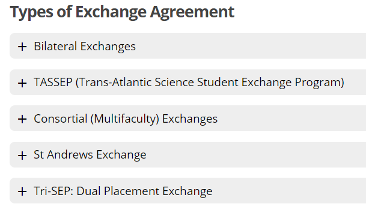
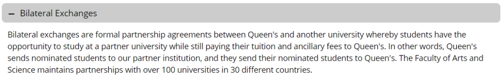
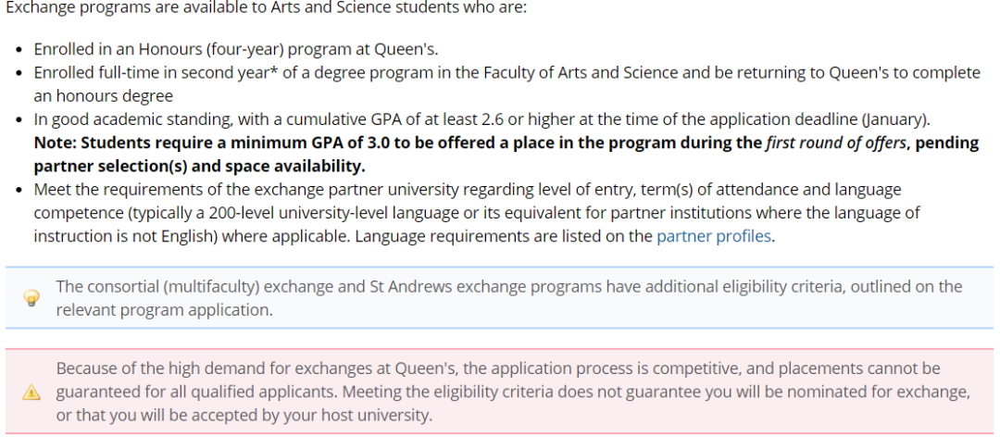
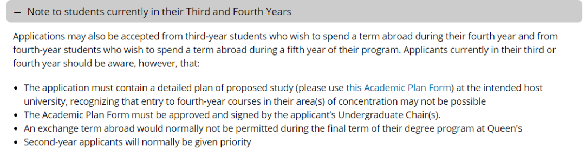
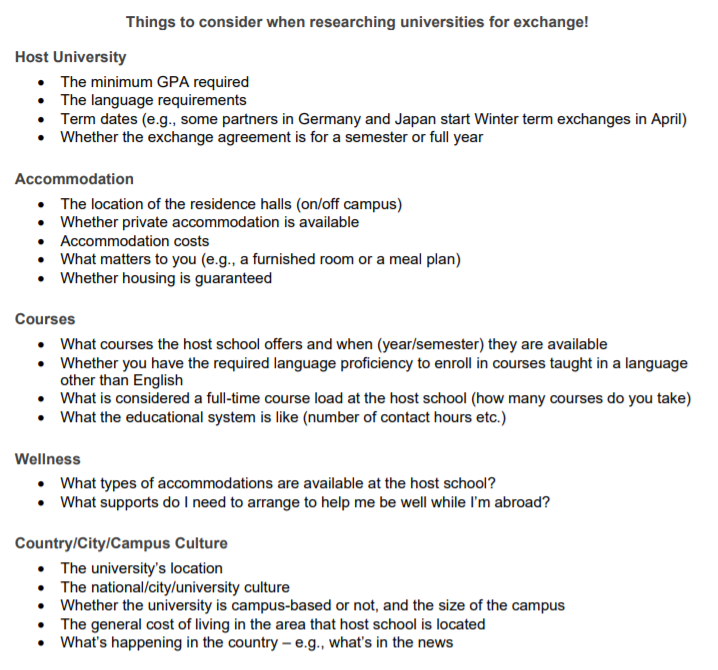
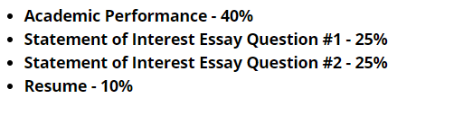
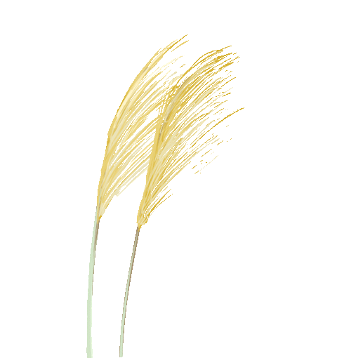
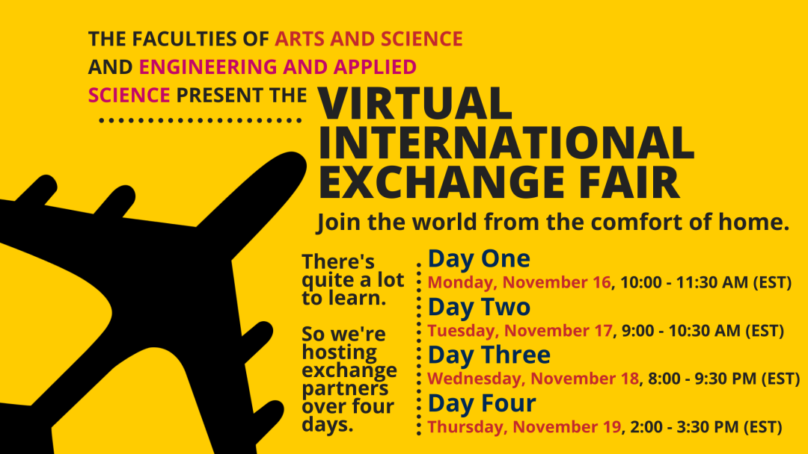
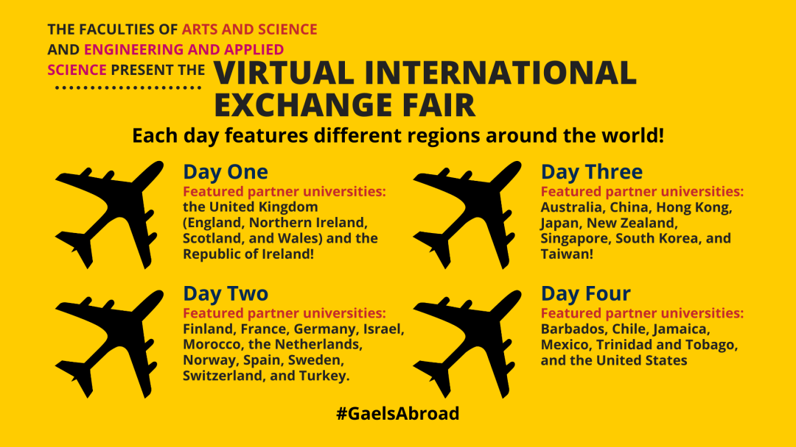

# GPS干货 | Exchange 申请流程来啦

> 来源：微信公众号  
> 原链接：https://mp.weixin.qq.com/s/CG0zyJWbdrrKUjIqTIFxhQ  
> 状态：自动搬运，暂未分类  
> 图片数量：15  
> OCR 图片文字数量：0

---

## 人工整理说明

本文件保留了公众号文章中的所有图片，没有自动删除装饰图。  
每张图片都用 `IMAGE-编号` 标记，方便后期人工检索、删除或补充说明。  
如果图片下方出现 OCR 文字，说明脚本尝试识别了图片中的文字，但需要人工检查准确性。  
OCR 文字只是辅助，不代表一定需要保留到最终正文。

---

【IMAGE-001 START】

【IMAGE-001 END】

交

换

指

南

梦想多远都可以到达

【IMAGE-002 START】

【IMAGE-002 END】

**一切皆有可能**

我想去欧洲小镇里歇脚，

每天看日出日落，

和邻近的人分享新鲜出炉的糕点。

我想去异域城邦热舞，

向每个陌生人微笑着问好，

再一起在沙滩上排球。

我想去古老城堡做自己的公主，

读几本莎士比亚，

周末在附近村镇里开车闲逛。

**IPO**

上述的一切想法都有机会在IPO实现。

IPO（international program office）是QU专门处理exchange和summer school的学校部门。

每年秋冬学期，大二的同学们可以选择是否要申请大三的交换，如果确定申请的话，选择交换学校，并提供所需材料。

IPO网站：

https://www.queensu.ca/ipo/home

**问**

**exchange一定适合我吗？**

这个问题的答案看每个人自己，如果你想去其他地方，找到了合适自己的exchange项目（下图有五个），而且符合要求的话，就可以在申请季申请啦！

**答**

【IMAGE-003 START】

【IMAGE-003 END】

**问**

**我该申哪一种呢？**

每一种都在官网有详细介绍，适用于不同情况，比如最后Tri-SEP会让学生有机会在其他两所大学（the University of St Andrews in Scotland and the National University of Singapore）上八个月的课程，但要求申请学生来自指定专业。大家根据自己的专业和个人爱好来自由选择。

今天会着重强调一下**bilateral exchange，也是涉及最广的一个项目。**

**答**

【IMAGE-004 START】

【IMAGE-004 END】

上图是官网给出的解释，换句话说：QU和一百多个学校有双方相互一换一交换项目。学生先申请这个项目，被QU选出来，欸小伙子不错，把你的材料发给你申请的友校A去，如果A觉得也可以，QU也挑中了A的一名交换生，这事儿就成了，你自己最后再确定一下，然后收拾收拾自己准备文件。

另：小熊猫去年申请的经历：

一共可以选六个学校。有点像高考志愿那样。

学费交给自己的学校。（也就是说，交换费用和平时在QU上课一样，再加200刀的申请费。交通住宿等自理。可以申请exchange的奖学金）

**问**

**exchange有什么要求呢？**

IPO已经非常贴心的准备了要求和注意要点。小熊猫就不多废话了，直接上截图。大家自由阅读。

能不能得到机会一方面和你本身的成绩，实习经历等有关，另一方面和你选择的学校也有关系。有些学校的竞争会相对激烈一些（如新加坡……不要问熊猫酱是怎么知道的555）

**答**

【IMAGE-005 START】

【IMAGE-005 END】

**问**

**我大三了，还可以申吗？**

可以但有条件。

IPO 也有针对这个问题的回答。熊猫酱只是个没有感情的搬运工。

**答**

【IMAGE-006 START】

【IMAGE-006 END】

**选学校**

在确定交换意向之后，就来到了选学校的步骤。与Queens签署过交换协议的学校列表可以在以下网页找到。

网页链接： 

https://www.queensu.ca/ipo/outgoingstudents/exchange/find-university

**问**

**选择的时候有哪些需要注意的问题吗？**

有！有n多点一定要注意！

这里熊猫酱强调一下最重要的两点，其余图片里都有涉及。

1. 首先要看上课语言是不是英语，如果是小语种，你该语种有达到QU200level水平吗？
2. term的开始结束时间也很重要，如果开始结束时间和QU对不上，比如日本有些学校4月开始winter term的exchange，就要考虑申全年的交换。（一些学校提供一学期/全年的交换选择）

**答**

【IMAGE-007 START】

【IMAGE-007 END】

**问**

**我在好几所学校里面纠结，该怎么办呢？**

其实可以多选几个。一共可以选6个学校，把最想去的放到第一位。

如果还是很纠结，有两个小方法可能会有帮助。

1. 关注IPO的活动。IPO每年会请一些有交换经历的学长学姐做讲座/1v1交流经验。可以和他们讨论一些。

2.到目标学校官网了解。去ins或fb或官网看看宿舍/伙食。

**答**

**开始申请**

确定自己符合条件并且选择完学校之后，申请就正式开始啦。每个项目有不同的要求，这里只提到bilateral exchange。

大二的学生需要提交下列材料。

**2021-2022学期的申请截止日期是2021年1月15号**。

【IMAGE-008 START】

【IMAGE-008 END】

statement of interest essay 的两个question：

1. Why do you want to go on exchange?

2.What did you learn through your research about the university partner that makes you feel it will fit both your personal and academic goals?

这两个问题主要针对你list中最想去（排第一位的学校）

需要把word count列在开头。

两个问题的总字数要求：500字以内。

Resume 介绍一下你的经历，譬如参加过哪些社团，志愿者活动等等等等，最多两页。

网页链接：

https://www.queensu.ca/ipo/outgoing-students/exchange/apply

**IPO对大三大四的申请者要求如下**

【IMAGE-009 START】

【IMAGE-009 END】

**其他**

**问**

**什么时候出结果啊？**

有两轮审核，第一轮GPA 3.0以上的同学，去年在2.14情人节前后出结果。第二轮属于GPA2.6以上的同学和第一轮流产的同学。

**答**

**问**

**申请到可以选择不去吗？**

可以！通知你得到这个机会后，有一段时间供你选择是否要交换。

**答**

**问**

**GPA达到多少分一定能申到想去的学校啊？**

没有确定的结论。

首先，GPA越高越好。

其次，要看你申请的学校是不是很popular。

最后，一定要选择保底学校。

**答**

**问**

**申请完，通过了，确定要交换之后会发生什么？**

IPO的负责老师会与你联系，同时还会组织大家进行一系列出发前的讲座，争取为大家提供最好的交换准备。（IPO快给我打钱）

**答**

【IMAGE-010 START】

【IMAGE-010 END】

【IMAGE-011 START】

【IMAGE-011 END】

11月的16号到19号，IPO组织了针对不同交换国家的讲座，如果你对交换感兴趣，不妨可以去参加一下。

报名链接：点击 阅读原文

https://queensu.qualtrics.com/jfe/form/SV\_0e7pZL49Ig2LyCh

【IMAGE-012 START】

【IMAGE-012 END】

【IMAGE-013 START】

【IMAGE-013 END】

这就是今天的全部内容啦~熊猫酱补作业去啦

麻烦大家一键三连（啊不是）分享给朋友们吧！

文字 Judy

排版 Judy

编辑 容易

审核 唐韬 Chris

【IMAGE-014 START】

【IMAGE-014 END】

【IMAGE-015 START】

【IMAGE-015 END】
