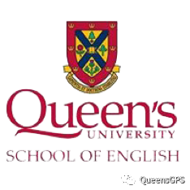
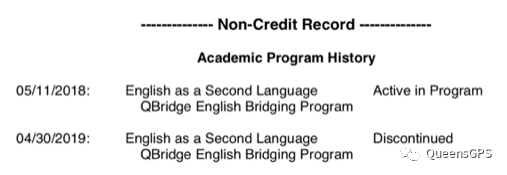
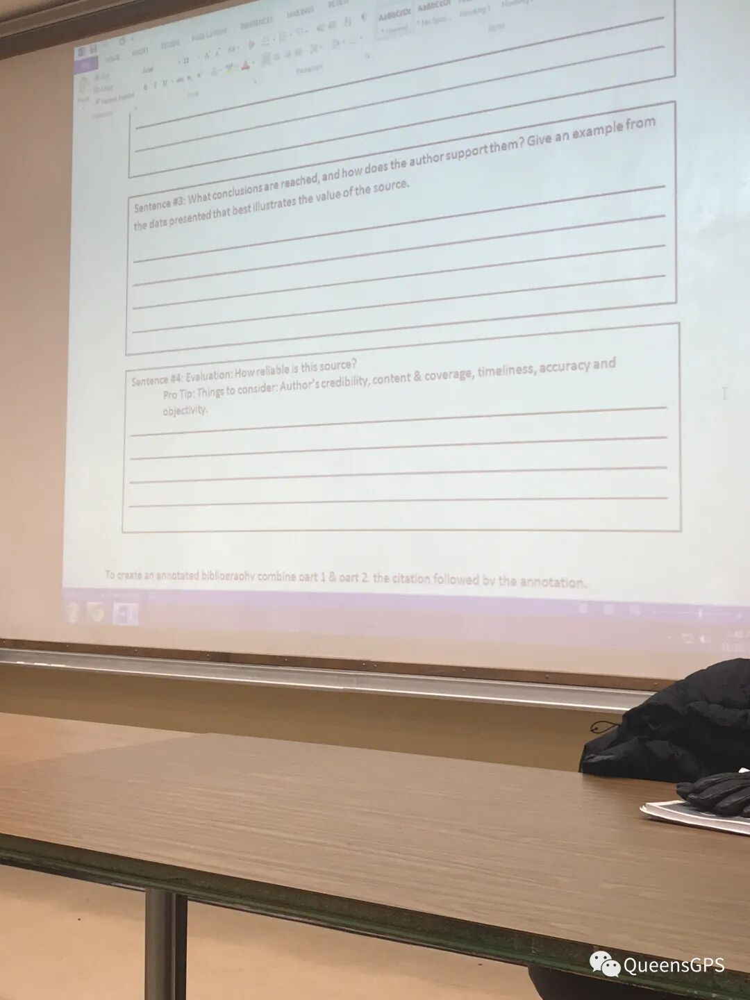

# GPS 干货 | Queens语言课程介绍

> 来源：微信公众号  
> 原链接：https://mp.weixin.qq.com/s/Mr59fhRbtgGhFeeK2tD0CQ  
> 状态：自动搬运，暂未分类  
> 图片数量：6  
> OCR 图片文字数量：0

---

## 人工整理说明

本文件保留了公众号文章中的所有图片，没有自动删除装饰图。  
每张图片都用 `IMAGE-编号` 标记，方便后期人工检索、删除或补充说明。  
如果图片下方出现 OCR 文字，说明脚本尝试识别了图片中的文字，但需要人工检查准确性。  
OCR 文字只是辅助，不代表一定需要保留到最终正文。

---

Q：如果特别喜欢Queen‘s但语言成绩差强人意怎么办？A：没有关系，Queen’s有提供语言桥梁课程噢。

关于语言班的总述

桥梁课程主要分为两种：QBA（暑假两个月课程，雅思单项达到5.5）和EAP（学期12周课程，雅思单项达到5）。

我因为一些特殊原因去上了EAP，并且在那里度过了8个月。EAP究竟是好是坏，我周围的同学褒贬不一。有人觉得EAP可以为大学入学做好准备，也有人觉得这个项目除了耽误青春也没有别的用处，并且到处是坑。

就我个人而言，如果有第二次选择的机会，我会去好好考雅思。因为它并不比本科轻松多少，有的时候压力会更大。

EAP（English for Academic Purposes）隶属于Queen’s School of English，一期持续12周，每年1月、5月和9月滚动开班。（注意：学校不会给语言学生提供宿舍，请大家自行解决！）

【IMAGE-001 START】

【IMAGE-001 END】

EAP的宗旨是帮助英语非母语的学生们为大学本科的学习做好准备，并且授予部分大学生活中所需要的基础技能（例如APA论文的具体格式，如果高中有接触过APA，这里教授的可能有一些细微差别）。

EAP的所有课程都是没有学分的，而这个记录在你的成绩单上也会显示。（如下图）

【IMAGE-002 START】

【IMAGE-002 END】

语言班课程安排详情

EAP在分班之前会有一个Placement Test，你这次考试的成绩将会决定你在哪个等级就读。EAP等级分为110、120、130、132、140和150，数字越大等级越高，而等级越高代表着你在语言学校就读的时间会越短。

请注意，Placement Test和你自己的雅思成绩没有任何关系，考得好只需要待4个月，考不好有可能会待一年甚至更久，所以就读EAP的小伙伴们在假期也不要放松英语的学习！

考试总体难度不算很大，但是考得很细，包括语法、词汇、作文等。考试成绩很快就会出来，大概一两天左右，之后会宣布分到的班级以及导师，同时会拿到课表。如果没有分到高等级也没关系，因为开学第一周老师们会观察每个学生，如果他（她）觉得你的等级应该更高，你就有可能会被调级，当然也有可能降级。

EAP的课程排列一般是从早上8点半到下午4点，一节课持续80分钟，中途会有10分钟左右的休息时间。中午会有1.5小时的午休时间，大家可以去食堂就餐或者用学校的微波炉自己热饭。（食堂午餐如下图）

【IMAGE-003 START】

【IMAGE-003 END】

EAP学生平时大多数的课程会在西校区（Duncan McArthur Hall），偶尔会有主校区的课程。总体不算忙，一般来说，周五下午、周四两点半之后和任意一天的半天（根据等级决定）不会上课，所以平时空闲时间还是有一些的，可以去做一些自己喜欢的事。

一共有四门课程：Core（主课）、Discussion（自由讨论，140以下的课）、Vocabulary（词汇，140以下课程）、Lab/Spoken（听力）、ESAP（类似于本科预备课、140及以上的课程）。除此之外，还会有一门Electives（兴趣课），这门课程是根据个人爱好选择的兴趣班，不会记入总成绩，但是一学期出勤率需要达到85%及以上。

**语言班课程通过要求**

每完成一学期课程，你的分数将决定你是升一级、升两级、提前毕业或者重修课程。

132学生成绩达到63%算通过，可以升入140，达到80%可以升入150。140学生成绩达到63%算通过，可以升入150，80%可以直接进入本科。150是73%可以直接进入本科（如果数据有错欢迎各位大佬指正。）

【IMAGE-004 START】

【IMAGE-004 END】

（某位EAP同学正在上课中的照片）

如果没有达到通过的分数线可以重修，但是如果超过了重修的次数限制会被开除。我当时分班被分到132（不算很好，因为很多人被分到140和150），理论上我需要读三期，实际上我只读了两期。原因就是这个升级、跳级制度。

每一期课程结束之后，大家可以在毕业典礼上拿到自己的成绩单，如果成功进入本科，语言学校会把你的档案直接交给Registration office，之后大家就可以安心就读本科课程啦！（注意，暑期选课的时候可能会有无法选课的情况，这是因为学校将你的SOLUS锁住了，请直接发邮件给学校，他们会解除权限）

**一些小tips**

1. 140和150 Level可以选择一定数量的本科课程，但是你需要平衡好你的语言课程和本科课程，不要顾此失彼、因小失大。

2. 如果想提前进入本科（140达到80%以上），你需要付出比常人更多的努力，因为这代表了你平时的任何一门考试都要上80%，否则最后很难达到提前毕业的分数线。说实话，140上80%比150上73%要难得多，4个班可能只有5个学生能通过。

3. 因为EAP的课程是早上8点半开始，请大家一定要规划好时间，尤其是冬天。不要迟到！不要迟到！不要迟到！这会影响你的得分。

4. EAP平时空余时间不少，但是不代表你可以懈怠，自律很重要。

5. 如果被分到低等级请不要气馁，一定要尽自己最大的努力完成每一次的Assignment，因为可能到最后会有意想不到的收获。

6. EAP班级里会有强制讲英语的要求，如果没有讲英语可能会收到警告信…（这个还是看你的老师的处理态度，班上中国人占大头，但是也会有来自别的国家的同学。）

7. QSoE的老师总体都很nice，但是会有压分，也会有比较mean的老师。一切看自己分班的运气。

8. QSoE平时会举行一些有趣的活动，有时间可以去参加一下，会很好玩。

9. 有不懂的地方直接去问老师，直接发邮件或者当面谈。

10. 平时的作业还是要认真完成，因为要算分。课上积极一点，不会有坏处。

**总结**

不可否认，语言课程是本科之前一个不差的铺垫，因为它可以帮助你做好准备。另一方面来说，语言课程有的时候负担也会更重，心理压力也会更大。所以希望大家可以根据自己的情况选择适合自己的方案。

最后，希望所有读语言的同学可以早日顺利进入本科课程的学习！

再次特别鸣谢本文作者奶茶精同学！！

感谢分享！！疯狂打call！！

以上就是关于Queens 语言课程的全部内容啦，希望大家喜欢！熊猫酱祝大家身体健康，万事如意！

文字 / 奶茶精

排版 / 小土

编辑 / 容易

审核 / TT Chris

【IMAGE-005 START】

【IMAGE-005 END】

【IMAGE-006 START】

【IMAGE-006 END】
