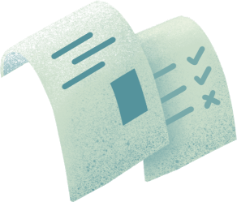

# GPS干货 | 手把手教你写一篇论文

> 来源：微信公众号  
> 原链接：https://mp.weixin.qq.com/s/2fP7MtPi_CzIXu46HqO1EA  
> 状态：自动搬运，暂未分类  
> 图片数量：15  
> OCR 图片文字数量：0

---

## 人工整理说明

本文件保留了公众号文章中的所有图片，没有自动删除装饰图。  
每张图片都用 `IMAGE-编号` 标记，方便后期人工检索、删除或补充说明。  
如果图片下方出现 OCR 文字，说明脚本尝试识别了图片中的文字，但需要人工检查准确性。  
OCR 文字只是辅助，不代表一定需要保留到最终正文。

---

【IMAGE-001 START】

【IMAGE-001 END】

一转眼学期已经过半， 想必有很多同学已经被布置或者已经将要提交他们的第一篇论文作业。

不管高中时有不有过写论文的经历，大学论文对很多人来说是一个不小的挑战。 

别担心，熊猫酱今天就在这手把手教你写一篇好论文！不管你是新生或者老生，这篇干货值得你收藏！

**本篇文章包括：**

1. 论文评分要素

2. 论文结构

3. Thesis statement

4. 学术研究和取材

5. 不同的citation&reference 和学术惩罚 academic penalty

6. Queen’s 的学术支持

**1.论文要素**

【IMAGE-002 START】

【IMAGE-002 END】

什么决定一篇好论文：

**大学本科的论文一般包含以下要素**（顺序不决定其重要性）

1.论文：Subject (主题），Thesis Statement (论题）， Argument (论据）

2. 研究：Research（学术研究）, Sourcing, Citations & Reference

3. 写作：Structure (结构)，Grammar (语法），Wording (用词）

一般对论文的评分也是根据以上要素！同时强烈推荐同学们在写之前通过仔细阅读教授提供的rubric来了解更详细的评分要点！

**2.论文结构**

【IMAGE-003 START】

【IMAGE-003 END】

一篇好的论文要有一个清晰 / 有逻辑性的结构，才能更直接明了地传达你的观点给读者。熊猫酱就拿一个传统的5段式论文给大家举个例子：

1. Introduction （一般thesis会在Intro的结尾提出来，前面根据情况而定可介绍你研究的方式（approaches），介绍context，罗列论点）

2. Argument 1

3. Argument 2

4. Argument 3

5. Conclusion (Highlight论点，重申thesis）

这个结构就像是堆雪人，有小头（intro）大腹（arguments） 小尾（conclusion)。

当然在现实中分段多少还是依情况而定，5段式适用于2000字左右的论文。如果你有更多的论点，可以分更多段。

切记除了头尾，中间段落也要注意逻辑性。例如你的论题是反驳一个已有的观点，中间的第一个argument可以是用论据证明为什么这个观点不成立，第二个可以说明它在现实中产生的负面影响，第三个可以提出你自己的观点并用论据证明为什么你的观点成立，最后可以提出一个解决方案等等。

**3. Thesis Statement**

【IMAGE-004 START】

【IMAGE-004 END】

论题是一篇论文的核心所以它有多重要不必多说，可以说整篇论文是围绕论题展开的。

论题主要是陈述你自己的观点，这样才能用论点加以论证 （arguable）。**切记不是陈述事实（fact ）！**

例如论题可以是“自由党的治理理念更能促进现代经济发展”，而“自由党是加拿大的一个党派”属于陈述事实，所以没有论证的必要。

论题可以根据论文的进展改变，所以不用担心起初的论题可能不成立。但是一开始就拥有一个清晰有力（strong）的论题会为接下来的工作省很多力，所以建议大家在建立论点前先做好充分的研究。

**4.学术研究和取材**

【IMAGE-005 START】

【IMAGE-005 END】

充分的学术研究对成就一篇好的论文也至关重要，研究应该从建立论题之前就开始。

围绕给予的subject寻找相关的学术材料来给论题打基础，建立论题后还要深入相关的学术材料寻找论据。一般教授会规定最少引用多少篇学术材料，但研究的越多越好。

网上充满各种各样的学术资源，但是他们的可靠性差别很大，寻找权威可靠的学术资源也很重要。

**可以根据以下几点来判断学术文献的权威性 ：**

高专业性的作者 / 文章发布时间近 / 文章发布机构的权威性高 / 该文章被cite的次数多

**不同种类学术文献以及他们的权威性：**

**Academic Journals** - 学生或学者发表的专业学术研究，一般来说较可靠

**Articles** - 种类和来源有很多，需要用以上4点仔细考量

**Essays** - 学生和学者发表的论文，需要考量权威性

**Books** - 出版的学术研究，一般来说较可靠

**Textbook** - 课本一般来说不属于学术资源，但是课本知识也要cite

**取材：**

**Google Scholar** - 较权威的网上学术资源，只提供research papers

**Queen’s Library** -可以网上搜索你想要的资源，我们学校也联通其他城市的图书馆，如果你要的文献不在Kingston可以order让他们运到Queen’ s的图书馆。

**各种学术杂志刊期** - ex.  “The Economists”, “Journal of World History”, “Natural Geographic”等。

**各种权威的学术网站** - ex. “sci-hub”, “HighWire”等。

注意：百科网站像是Baidu, Wekipedia都不属于学术资源，虽然很方便，请不要把百科网站作为的research 资源。

**5. Citation & Reference**

【IMAGE-006 START】

【IMAGE-006 END】

当我们做足了研究，找到了很好的论据之后，应该如何把它们放到论文里并cite呢？

我们有两种方式：

**1. Paraphrase (倒相）** - 把从其他文献里找到的论据用自己的话说出来

**2. Quote（引用）**- 把其他文献的话原模原样搬来

不管用哪种方式，每一段quote或paraphrase的文字前面都应该address原作者，后面加上正确的citation标注来源，除非这个知识点是大众认为的常识。如果标注不全或标注错误可以被视为plagiarism (抄袭），这是属于严重的学术不端，轻则导致作业0分，重则导致被学校开除，所以请同学们切记。

那么接下来熊猫酱来介绍一些最常用的citation形式：

**MLA (在人文学科里最常用）**

**APA（在心理学和教育学最常用）**

**Chic****ago （在商学，经济学和历史学里最常用）**

给同学们推荐一个网站  https://owl.purdue.edu，上面可以找到不同citation以及对应的具体格式，他对不同citation的应用也解释得很全面。另外，还有一个比较常用的查重复率的网站 https://www.turnitin.com/。多加利用这两个两个网站，就再也不用担心plagiarism了！

最后在文末也因有额外一页reference/work cited标注引用文献的作者和来源，有时候教授会要求写annotated bibliography。别担心，只要在每个文献来源的上方加上一段简要的对该文献的描述就行了！

**另外，在Word上也可以生成不同的citation。**

Go to References > Insert Citation, and choose the source you are citing.

To add details, like page numbers if you're citing a book, select Citation Options, and then Edit Citation.

**6. Queen's 的学术支持**

【IMAGE-007 START】

【IMAGE-007 END】

最后，要想拿高分，在提交前找教授或者ta多改几遍也十分有效，因为不同人有不同的评分标准这样做可以让你的论文更符合评分人的胃口。

学校也有很多可以利用的学术支持如 sass, 同学们可以提前一周到Stauffer Library一楼或者到点击原文到这个网站预约论文修改：

http://sass.queensu.ca/programs/appointments/。

**会有高年级的小哥哥小姐姐给你修改论文或report的grammar，wording和structure等等！**

另外，在Micheal Hall的QUIC,每周二下午5:30-7:30都会有Writing Support, 同学们可以直接drop in，不用预约！

好啦，

今天的干货文就到这里结束了～

如果还有其他写作的问题，欢迎在留言区评论！

熊猫酱🐼

祝大家赶due顺利！

【IMAGE-008 START】

【IMAGE-008 END】

文字 / Lucas

排版 / Lexi

编辑 / Lucas TT

校对 / Kedi Bill

【IMAGE-009 START】

【IMAGE-009 END】

【IMAGE-010 START】

【IMAGE-010 END】

【IMAGE-011 START】

【IMAGE-011 END】

【IMAGE-012 START】

【IMAGE-012 END】

【IMAGE-013 START】

【IMAGE-013 END】

【IMAGE-014 START】

【IMAGE-014 END】

【IMAGE-015 START】

【IMAGE-015 END】
