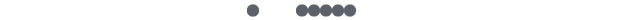

# GPS干货 | 这是一个严肃的学术诚信规范科普

> 来源：微信公众号  
> 原链接：https://mp.weixin.qq.com/s/3FXAXgbD_TEZHugLvBqFLg  
> 状态：自动搬运，暂未分类  
> 图片数量：13  
> OCR 图片文字数量：0

---

## 人工整理说明

本文件保留了公众号文章中的所有图片，没有自动删除装饰图。  
每张图片都用 `IMAGE-编号` 标记，方便后期人工检索、删除或补充说明。  
如果图片下方出现 OCR 文字，说明脚本尝试识别了图片中的文字，但需要人工检查准确性。  
OCR 文字只是辅助，不代表一定需要保留到最终正文。

---

学术诚信规范&处罚

Academic Integrity

众所周知，国外大学有着严谨的**学术诚信规范条例**，对学术不端的投机取巧者都是报以零容忍的态度，因此每所学校都有着相应具体且严格的**学术处罚**。大部分学生对何为学术不端可能只知道一个大概，例如不能作弊，代写，代考等，但是对具体的规定和处罚并不是非常了解。这篇文章将会详细罗列**Queen’s现有的学术规范和相应的处罚条例**，希望能帮助各位同学避免不必要的麻烦。（篇幅预警！）

以下内容摘取翻译于Queen’s Academic Regulations and University Policies.

【IMAGE-001 START】

【IMAGE-001 END】

根据学术诚信规范政策，任何违背这些价值观的行为都将损害**“大学基础的核心目标：自由探索和自由思想表达”**。违反学术诚信的类型包括但不限于以下几点：

1. **抄袭**（在没有正确引用的情况下窃取他人的想法和用语，并把其当作为自己个人的想法）

例如：未经适当引用，从网络、书本或其他资源复制及粘贴语句；抄袭其他学生的作业；在作业中使用直接的引用语或大篇幅的段落和意译材料，而且未标注适当的引用；未经导师许可，将同一份作业提交至多个课程。

2. **使用未经授权的材料**

例如：在考试期间拥有或使用未经授权的学习资料或辅助工具；抄袭他人的试卷；在考试中使用未经授权的计算器或其他辅助工具；未经许可从图书馆移走资料，或故意隐藏图书馆资料。

3. **促使他人违反学术诚信**

例如：向其他学生提供信息；允许他人抄袭自己的论文或作业；购买或出售本学期的论文或作业，并将其作为自己的论文提交，以达到剽窃的目的。

4. **伪造文件**（提交伪造文件或声明）

例如：伪造成绩单和其他官方文件。

5. **弄虚作假**（虚假陈述自己，自己的作业，或自己与大学的关系）

例如：修改与学生成绩有关的成绩单；或其他官方文件；在考试中冒充他人；提交全部或部分由他人代写的带回家的试卷；伪造或篡改实验或研究数据。

违反学术诚信的**处罚**和**补救措施**

导师(Instructor)可以指定的处罚和补救措施 -

导师可考虑一系列补救措施或制裁措施，包括但不限于:

1. 口头或书面警告，指出该违规行为所构成的不可接受的学术不端；

2. 允许学生重写或修改原作业，将其作为一种学习经验；

3. 提交一份新的作业；

4. 完成另一份别的课题的作业；

5. **扣除**部分或全部的作业/考试分数；或

6. 此门课以**不及格**或**零分**处理。

**如果学生因受到学术处罚而导致这门课的不及格，无论是否在截止日期内，其都无法退修（drop）此门课程。**

【IMAGE-002 START】

【IMAGE-002 END】

如果导师认为有理由给予比导师可以指定的处罚更严重的措施，则导师将会把案件提交给副院长(Associate Dean)审查。

副院长可以指定的处罚和补救措施 -

如果发现违反学术诚信或未能遵守学术规则，由副院长可进行以下一项或多项的一系列补救措施或制裁，包括但不限于：

1. 口头或书面警告；

2. 允许学生重写或修改原作业，将其作为一种学习经验；

3. 提交修改过的或者新的作业；

4. **扣除**部分或全部的作业/考试分数；

5. **扣除**部分或全部的此门课程的分数；

6. 一份正式的书面警告，随后对此违规行为的处罚可能是要求其在规定的最短时间内从学院或大学**退学**；

7. **取消**大学或学院颁发的奖学金、奖品和/或助学金；

8. 要求其在规定的最短时间内从学院(Faculty)**退学**；

9. 建议其在规定的最短时间内**退学**；或

10. 建议**撤销**或**废除****学位**(degree)。

**学生因违反学术诚信而被要求退学的，在处分期间不得申请毕业。**

【IMAGE-003 START】

【IMAGE-003 END】

制定处罚时要考虑的因素 -

在指定补救或处罚时应考虑的因素包括：

1. 考虑此违规行为导致的实际或潜在后果，以此来判断其程度和严重性；

2. 所涉工作或行为在最终评估中所占的**重要部分的比例**，以及所涉工作或行为所显示的违规程度是否重大；

3. 根据**学术经验**来区分，区别对待大一新生或修选修课的学生与高年级学生，后者应该更加熟悉学科、系和/或学院对学术诚信的要求；

4. 考虑同一事件内的多次违规记录或同一时间内发现的多次违规记录，而非个别一次的违规记录；

5. **蓄意**赚取利益的证据；

6. 对其他学生或学校造成的**伤害**；或

7. 恐吓他人或激起别人不端行为的行为。

【IMAGE-004 START】

【IMAGE-004 END】

减轻情节不能免除或原谅对违反学术诚信的处罚，但可以考虑这些因素，以确保施加的制裁是公平、合理的，并与发现的违规行为的严重性相称。该处罚决定必须概述可以支持减轻情节的证据。学生有责任提供减轻情节的证据，其中可能包括：

1. 由适当的专业人员提供的**书面证据**，证明在相关时间影响学生致其无法遵守学术诚信条例的因素；

2. 学生立即**承认**自己违反了学术诚信，并**表示悔悟**和**愿意采取**教育补救措施；或

3. 有证据表明，在当时的情况下，没有合理正确的指导措施，让学生注意到学术诚信的标准。

**总而言之，任何处罚都应对应违反学术诚信的程度和严重性，以及学术单位的先例，并考虑到任何可以减轻处罚的情况。**

【IMAGE-005 START】

【IMAGE-005 END】

**一级（轻度）违规**

一级违规行为不会保存在学生的档案中，而是保存在一个单独的特殊文件中，只有在将来有需要时才会被审阅。将调查结果从学生的主要档案中分离出来的核心是试图平衡补救和制裁。虽然在发现学生违反学术诚信的情况下，制裁是必要的，但该政策因避免在任何情况下对学生进行惩罚性的对待，并允许采取补救措施，及对学生进行与学术诚信有关的教育。一级违规的记录自学生毕业之日起便会被销毁。

以下情况会被归为一级（轻度）违规：

1. 违规行为的程度和严重性**较小**；

2. 对作业上的违规行为，其处罚带来的影响**小于**此门课总成绩的**50%**，且此处罚**不会**导致这门课成绩的不及格；

3. 该学生正处于其学术生涯的**早期阶段**，特别是大一的学生，或该学生在某一特定学科的课程中的经验很少或没有（例如在历史或心理系的首次经验）；

4. **没有直接证据**显示其有蓄意赚取利益；或

5. 对其他学生或院校**没有直接影响**。

【IMAGE-006 START】

【IMAGE-006 END】

**二级（重度）违规**

二级违规记录将会被保存在学生的主档案中。这份档案是保密的，仅用于学术建议目的。当调查结果被抄送至本处时，亦会咨询副院长（Associate Dean）的意见。在极少数情况下，一些机构（如美国法学院，医学院和警察学院）会要求副院长提供参考资料，并参考档案中的材料，回答关于学生学术历史的具体问题。

二级（重度）违规将在下列条件下进行评估（只有一项因素会被适用）：

1. **显著重大**的违规程度和严重性（例如，在剽窃的情况下，违规行为涉及一个或多个未被引用的来源）；

2. 处罚会**直接导致**这门课成绩的**不及格**

3. 发生违规行为的是一个已经上过多门这个学科课程的**高年级学生**（例如大四学生）；

4. 此学生有过有违反学术诚信的**先例**（此情况应将案件提交副院长处理）；

5. 有证据显示其有其他**额外**的不当行为，包括伪造、协助等；或

6. 对其他学生或院校造成了**直接的负面影响**（例如：偷取其他学生的论文、作业、实验报告）。

**由于导师通常是最熟悉学生情况的，因此其应该使用明智的判断和合理的自由裁量权来判定二级违规。**

根据学院现有的做法，一级违规不会导致进一步的措施；两个一级违规的调查结果会由副院长（Associate Dean）对案件进行审查，并会在学生的主档案中保存一封警告信；有三个一级违规的案例会被进行调查，以决定是否应该向学术程序委员会（SCAP）建议退学要求。这些当前的做法可能会根据每个人违规行为的严重性而有所不同。

**、、**

文件网址：

https://www.queensu.ca/artsci/sites/default/files/academic\_regulations\_19\_final.pdf

文字 / 容易

排版 / 容易

编辑 / Lucas TT

校对 / Kedi Bill

【IMAGE-007 START】

【IMAGE-007 END】

【IMAGE-008 START】

【IMAGE-008 END】

【IMAGE-009 START】

【IMAGE-009 END】

【IMAGE-010 START】

【IMAGE-010 END】

【IMAGE-011 START】

【IMAGE-011 END】

【IMAGE-012 START】

【IMAGE-012 END】

【IMAGE-013 START】

【IMAGE-013 END】
