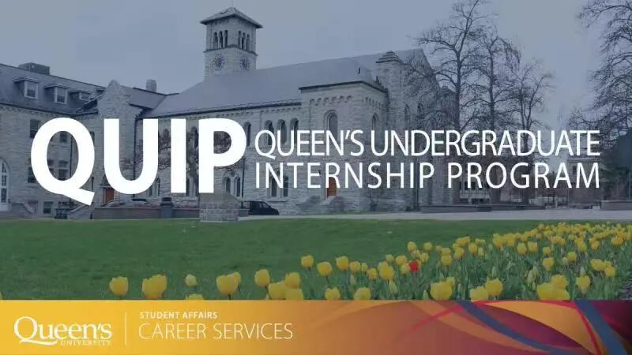

# GPS干货 | 还在为实习发愁？Queen's官方实习平台QUIP了解一下！

> 来源：微信公众号  
> 原链接：https://mp.weixin.qq.com/s/KWkaiTyGeFoUPPa4cW4ZKQ  
> 状态：自动搬运，暂未分类  
> 图片数量：4  
> OCR 图片文字数量：0

---

## 人工整理说明

本文件保留了公众号文章中的所有图片，没有自动删除装饰图。  
每张图片都用 `IMAGE-编号` 标记，方便后期人工检索、删除或补充说明。  
如果图片下方出现 OCR 文字，说明脚本尝试识别了图片中的文字，但需要人工检查准确性。  
OCR 文字只是辅助，不代表一定需要保留到最终正文。

---

导语

大家好呀，今天熊猫酱带领大家来看一看Queen's为大家提供的实习平台QUIP，并且带领大家对QUIP有一个基本了解，以便于大家在大二大三时可以顺利申请到实习项目。

QUIP简介

QUIP，全称**Queen’s Undergraduate Internship Program**，是学校为**大二和大三**的学生提供的**实习平台**，学校提供的intern一般是**12-16个月**，**国内学生和国际学生皆可申请**。这些带薪实习通常有**专业指导**并且可以**积累工作经验**，旨在带领学生体验行业进步，并且对当前匹配领域的技术革新有基本了解。

【IMAGE-001 START】

【IMAGE-001 END】

申请要求

QUIP对**本国学生与国际学生都开放**，如果想申请实习项目，需要满足：

1、**大二、大三**学生，并且必须**在实习结束后返回学校**完成Degree Plan所规定的课程

2、**GPA最低1.9**

3、属于**文理学院、工程学院、计算机学院与健康研究（Health Studies）学院**

4、在参加CO-OP之前，国际学生需要**确保自己的学习许可在实习结束后依旧处于有效状态**，否则可能会被要求申请延长学习许可，具体情况可以联系QUIC。

申请方法

1、在**QUIP官网上找到与自己学院相符的申请表**，并且下载下来

https://careers.queensu.ca/students/services-students/employment-programs/queens-undergraduate-internship-program-quip

2、**阅读申请表中的政策与要求**。

3、**再次确认**自己是否满足前文所提到的要求

4、填写申请表

5、将申请表**发给自己的Department的Undergraduate Assistant**，参加QUIP的项目需要**获得Undergraduate Chair的许可签名**

6、前面的步骤完成之后，**登入MyCareer**（https://careers.sso.queensu.ca/home.htm），点击**右下角蓝色的三个点**，提交申请表并且**缴纳35加元的申请费**（不可退还）

在注册步骤完成之后，会收到一封来自QUIP的欢迎邮件，并且在ONQ平台上也有QUIP的内容（和别的课程一样），在申请实习之前，学校会开展一些**Workshop**以帮助大家**为申请和面试做好准备**，学校**强烈建议大家去参加**这些Workshop，以便更快并且更有效率申请到自己心仪的实习

各个学院的注意事项

*1、工程学院*

工程学院学生会注册**10.5**（**12个月**）-**14**（**16个月**）个学分的实习，分别为**ASPC302/3.5、ASPC303/3.5、ASPC301/3.5或ASPC304/3.5**（**二选一**）

这些实习课程**不可以替代你的required courses**。在这些课程中，你需要**完成小组作业或者semina****r**，并且**接受雇主的评价**以获得学分。成功完成实习可以在毕业证上**获得标注**（with professional internship）

*2、计算机学院*

计算机学院的学生也可以申请实习，分别为**COMP 390/6.0, COMP 391/3.0, COMP 392/3.0 和 COMP 393/3.0**。这四门课**可以替代专业课**，分别是**CISC 496/3.0 或CISC 498/6.0 或 CISC 499/3.0 或 COGS 499/3.0**（**只能替代一门**）。

在实习课程中，你需要**完成实习报告**以获得学分。成功获得学分后，毕业证与成绩单上**也会拥有标注**，与工程学院一样。

*3、文理学院*

文理学院的学生**可以拿到6个学分**的实习，无论是BAH还是BSCH，可选择课程分别为**INTN 301/1.5; INTN 302/1.5; INTN 303/3.0 或** (**INTN 304/1.5 和 INTN 305/1.5**）。

这些实习**既不能替代专业课也不能代替electives**，但由于**各个系的规定不一样**，学生可以选择**3-6个学分**的实习，这些课也有可能应用到你的major、minor、medial和specialization plan里面，建议大家**先向department咨询**。同样的，成功完成实习之后，**成绩单与毕业证上会有标注**。

*4、健康研究学院*

BHSc的学生**无论线上还是线下**，都可以申请实习，可选择课程分别是**HSCI 301/1.5; HSCI 302/1.5; HSCI 303/3.0** (**12个月**) 或 **HSCI 304/1.5; HSCI 305/1.5** (**16个月**)。

这些课程属于BHSc的Degree plan，因此它们**既不可以充当必修课也不可以充当非必修课**。同时，BHSc的学生**每学期最多可以修3个学分**的intern，在成功完成intern过后，成绩单和毕业证上都会有标注。

结语

以上就是对于QUIP的介绍啦，申请intern**越早越好**，所以大家看到有合适的就尽快下手吧！在大家大二入系之后，**系里面也会为大家提供internship的机会**，遇到喜欢的可千万不要错过！**我们也为大家建了一个QUIP的交流群，感兴趣的同学欢迎添加下方小助手微信进群。**最后，希望大家可以找到合适自己的实习，为自己的大学生活留下特别的回忆！

【IMAGE-002 START】

【IMAGE-002 END】

【IMAGE-003 START】

【IMAGE-003 END】

文字 | Christy

排版 | Christy

编辑 | Rika

审核 | 容易 Olivia

【IMAGE-004 START】

【IMAGE-004 END】
