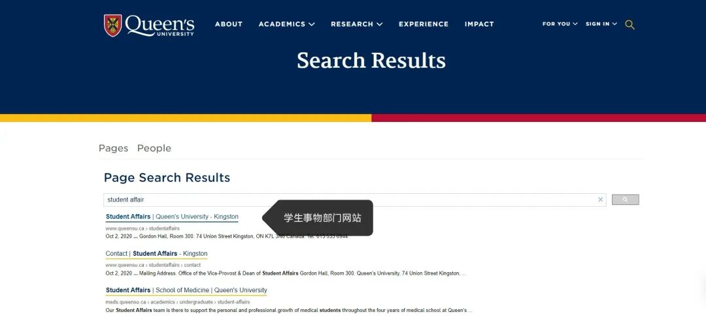
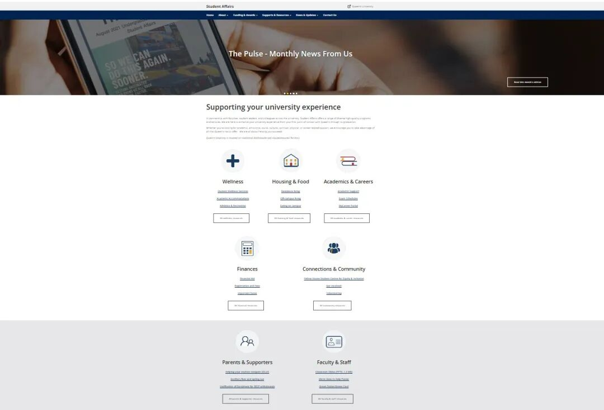
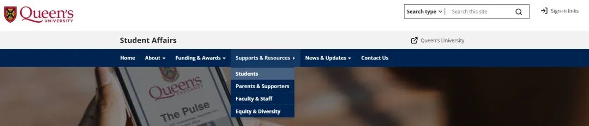
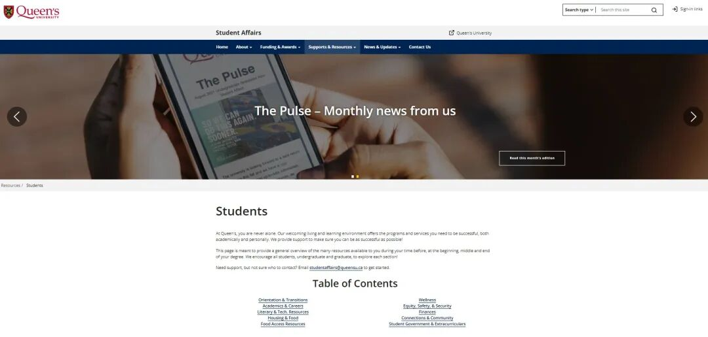
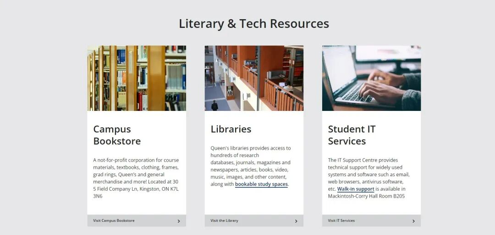
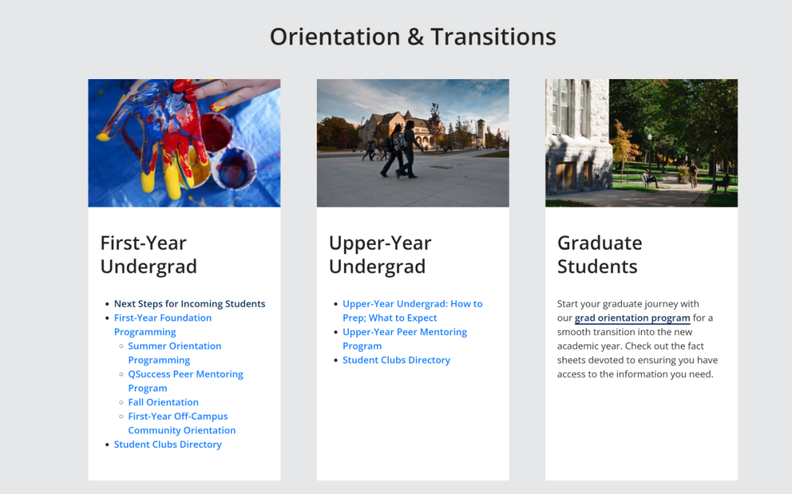

# GPS干货 | 所有校内资源现在都能一键查询啦！

> 来源：微信公众号  
> 原链接：https://mp.weixin.qq.com/s/iaD6abscWVTynzXnP7T_Zw  
> 状态：自动搬运，暂未分类  
> 图片数量：12  
> OCR 图片文字数量：0

---

## 人工整理说明

本文件保留了公众号文章中的所有图片，没有自动删除装饰图。  
每张图片都用 `IMAGE-编号` 标记，方便后期人工检索、删除或补充说明。  
如果图片下方出现 OCR 文字，说明脚本尝试识别了图片中的文字，但需要人工检查准确性。  
OCR 文字只是辅助，不代表一定需要保留到最终正文。

---

**INTRODUCTION**

**INTRODUCTION**

【IMAGE-001 START】

【IMAGE-001 END】

**如何玩转校内资源**

STUDENT AFFAIR

**学生事务部门网站**

GPS 干货

【IMAGE-002 START】

【IMAGE-002 END】

【IMAGE-003 START】

【IMAGE-003 END】

**Student Affair**

**什么是学生事务部门**

学生事务部通过与全校教师、各个学校相关部门合作，为学生提供一系列多样化的高质量服务和学术资源。旨在丰富女王大学学生的在校学习，生活体验。并帮助学生解决校内生活和学习中遇到的问题。

**学生事务部网站汇总了学生在攻读学位之前、开始、中期和结束期间可以使用的许多校内服务的详细信息和不同学校部门的联系方式。学生们可以通过探索这个网站了解校内资源的种类和获取这些资源的方式。**

【IMAGE-004 START】

【IMAGE-004 END】

**Resources**

**如何使用这个页面**

【IMAGE-005 START】

【IMAGE-005 END】

1. 通过学校官网搜索Student Affair进入学生事务部的网站页面

【IMAGE-006 START】

【IMAGE-006 END】

2. 进入页面后可以看到页面上提供的信息目录，涵盖了校内各个方面资源的多元化信息，***包括学术、情感、社交、文化、精神、身体健康，求职等相关的信息***

【IMAGE-007 START】

【IMAGE-007 END】

3. 在这里熊猫酱仅为大家深入讲解一下大家最关心的校内学习相关的信息该如何寻找，点击页面上方的**Support&Resources**选项，在下拉菜单中选择**Student**

【IMAGE-008 START】

【IMAGE-008 END】

4. 进入Student Resources页面后就能看到***所有学校为学生提供的服务***，这里建议大家每个单元内容都自行进行探索一下，这些内容介绍了很多非常有价值的校内学习/生活资源和学术服务！

【IMAGE-009 START】

【IMAGE-009 END】

5. 例如目录中的Literary & Tech. Resources单元索引的就是学校的校内图书店，图书馆以及学校提供的IT服务的***详细信息和联系方式***，图书馆的页面中有图书馆当天的开放时间和如何预定自习室的教程，建议大家每个页面都仔细了解一下喔~

【IMAGE-010 START】

【IMAGE-010 END】

6. 除此之外，Student Resources页面还包含了***学校建议学生在攻读学位之前、开始、中期和结束期间取得学术和个人成功所需的计划和服务***，大家有兴趣的话也可以自行探索一下~

【IMAGE-011 START】

【IMAGE-011 END】

**常用校内部门联系方式**

**在这里，熊猫酱也为大家介绍一些新生朋友们在入学期间常用的学校邮件地址~**

**QUIC**

**quic@queensu.ca**

Queen's University International Center女王大学国际学生中心旨在帮助国际学生更快融入校内生活，如果有签证/国际学生求职等国际学生相关问题可以向QUIC寻求帮助！

**Solus相关**

**solus@queensu.ca**

在使用solus的过程/注册课程的过程中/对solus显示的学杂费产生任何疑问，请向这个邮件地址寻求帮助！

**UHIP**

**uhip@queensu.ca**

大学健康保险计划 (UHIP) 是学校强制性要求学生参与的基本健康保险计划，适用于所有将在安大略省居住超过 3 周的国际学生及其家属。对保险内容/费用/获取保险卡的疑问可以向这个邮件地址寻求帮助！

**学生卡**

**Student.card@queensu.ca**

学生卡是校内的身份证明，并作为学生享受多种校内服务的通行证，例如：进入食堂就餐或使用学校的健身房都需要刷学生卡。补办学生卡，更新学生卡等相关疑问可以向这个邮件地址寻求帮助！

**校内咨询**

**Studentaffairs@queensu.ca**

在学校遇到学习或校内资源上的问题需要学校老师的帮助，但不确定该联系谁时，请发送电子邮件至学生事务部门咨询如何在校内寻求帮助！

【IMAGE-012 START】

【IMAGE-012 END】

文字 | Eric

排版 | Eric

编辑 | Eric

审核 | Taniya、Kyle
