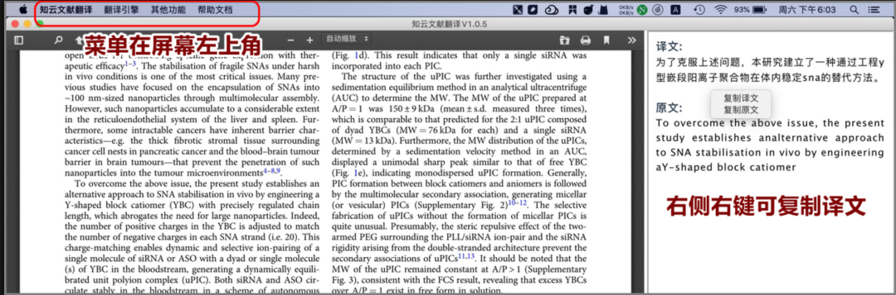
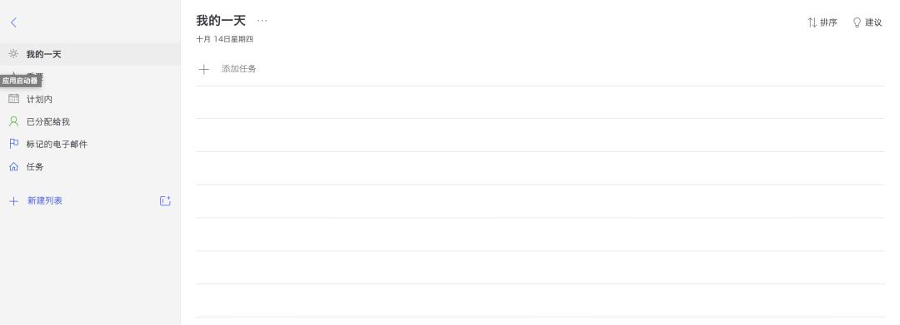
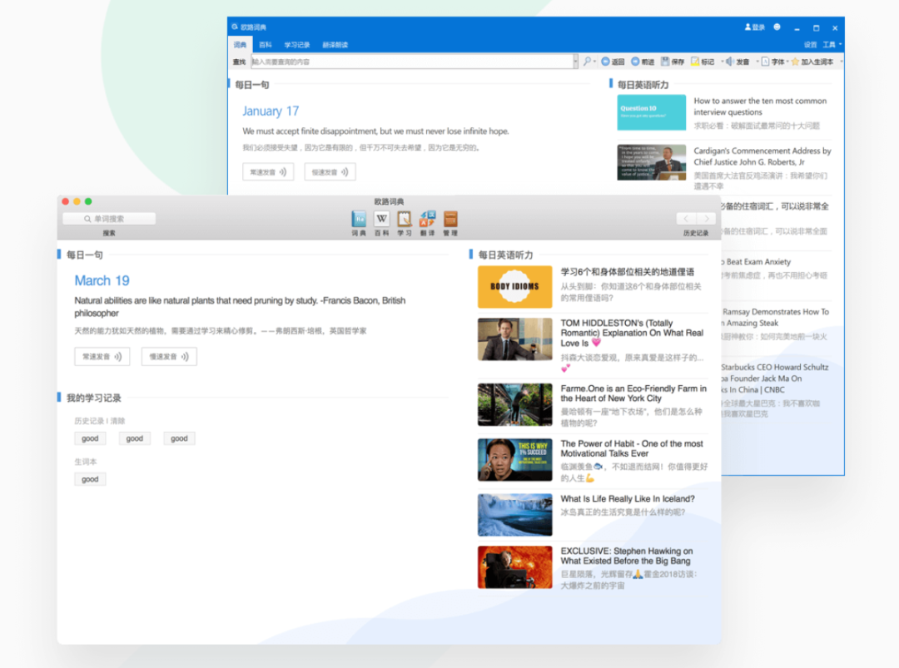
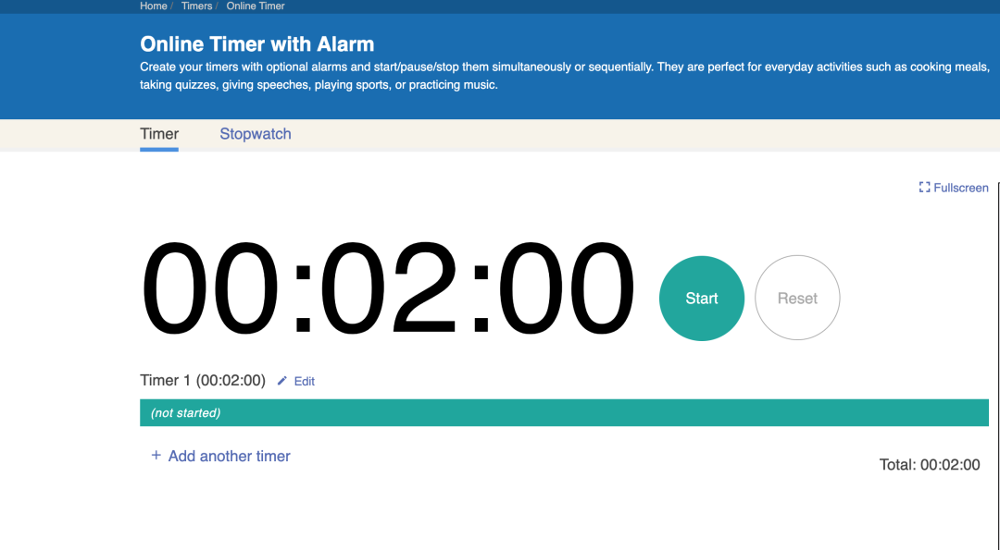
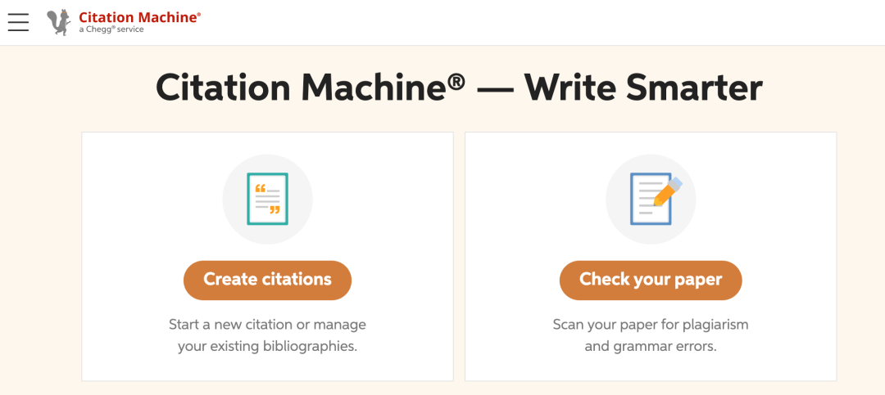
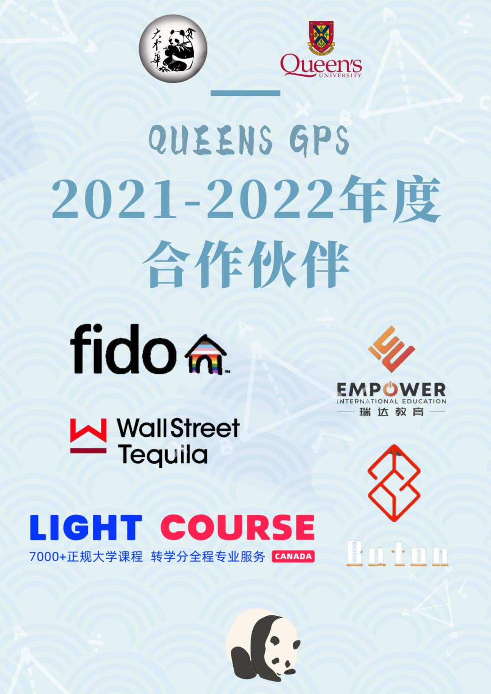

# GPS 干货 | 超实用工具助力Midterm

> 来源：微信公众号  
> 原链接：https://mp.weixin.qq.com/s/vTQ13-I5MigSBfO4yBbfOQ  
> 状态：自动搬运，暂未分类  
> 图片数量：8  
> OCR 图片文字数量：0

---

## 人工整理说明

本文件保留了公众号文章中的所有图片，没有自动删除装饰图。  
每张图片都用 `IMAGE-编号` 标记，方便后期人工检索、删除或补充说明。  
如果图片下方出现 OCR 文字，说明脚本尝试识别了图片中的文字，但需要人工检查准确性。  
OCR 文字只是辅助，不代表一定需要保留到最终正文。

---

【IMAGE-001 START】

【IMAGE-001 END】

你是不是还在为看⽂献头痛？你是不是还在为reference 劳⼼劳⼒？留学⽣涯困难重重，没有好⽤的⼩装备怎么事半功倍呢？

接下来熊猫酱就为你带来五个实⽤的工具。从听课到写论⽂看⽂献，⼀步到位，让你轻松拿⾼分～

01

**知云⽂献翻译**

【IMAGE-002 START】

【IMAGE-002 END】

知云是⼀个我⽤了就再也不能舍弃的⼯具，感觉已经想象不到不⽤知云是什么样的⽇⼦。知云⽂献翻译，顾名思义是⽤来翻译⽂献的。你只需要把pdf格式的⽂件拖进翻译器⾥，你看哪⼀句就

⽤⿏标像复制黏贴⼀样划哪⼀句，这⼀句话的对照翻译就会出现在边上。

知云有五⼤翻译引擎，从⾕歌⽣物医学翻译到百度AI翻译，你可以选择你喜欢的翻译引擎使⽤。因此，知云⾮常适合写论⽂时突击使⽤，或者⽤来降重。⽐如⽤⾃⼰的⽅式将知云中的中⽂翻译写成英⽂，就完全不会重复啦。你学会了吗？最关键的是，他是免费的哦。

02

**Microsoft to do**

【IMAGE-003 START】

【IMAGE-003 END】

这是⼀个超级好⽤的计划软件。在Microsoft to do 当中，你可以把⾃⼰的每⼀个assignment 都记进去。他能够设置due day，也可以设置在某个时间提醒你，还可以在备注框⾥写下这个作业的占⽐和格式⼀类的要求噢，省去了⼤家去翻找的时间。更厉害的是，Microsoft to do 可以筛选出今天，这⼀周，这⼀个⽉的due，⽽且还能显示离你的ddl还剩多少天，这样⾮常⽅便⼤家寻找离⾃⼰最近的那⼀个due，然后抓紧完成。同样的，它也可以设置今天你要做的事和有哪些due是⽐较重要的。

03

**欧路词典**

【IMAGE-004 START】

【IMAGE-004 END】

这款词典我愿称之为留学⽣必备词典。⾸先，在中译英时，它能为你提供很多种选择，如果意思过于相近，他会解释每⼀个意思，⽅便⼤家寻找最合适的那个。如果是⼀些专有名词，如数学名词，地理名词，或者是历史⼈名，他都会在下⽅有个详细的百科参考，可以直接就知道这个单词的解释，⽐如这个地理名词⻛化是什么意思之类的。再往下呢，就会有⼀些固定搭配，⽐如⽐例这个单词，在短语搭配这⾥就会有如⽐例原则，⽐例模型⼀类的例⼦了。

接着，在英译中时，上树功能也⼀样会有，更锦上添花的是，它会提供近义词和反义词供你选择，⾮常⽅便。再说⻓句翻译， 在⻓句翻译这块，它最出彩的功能就是能不仅翻译英⽂，也能够法译英，中译⽇等⼋种语⾔互译，⽽且正确率⾮常⾼噢，很适合选修⼩语种的⼤家来使⽤。

04

**Timer**

【IMAGE-005 START】

【IMAGE-005 END】

正所谓one day a deadline fighter，always a deadline fighter. ⼀⽇赶due⼈，永远赶due⼈。这款软件就是为各位赶due⼈量身打造的。

作为⼀款倒计时软件，能够精确地告诉你离你的ddl还剩多少分钟。然后在你屏幕的边上，指针缓缓倒退⾮常适合赶作业使⽤。⽽且因为是分钟，没有秒钟那么压迫⼈，也没有⼩时那样显得很快，因此总是显得⾮常的紧急但是⼜时间充⾜。让⼤家不焦虑地赶作业。最让我喜欢的是，这款app⾮常简洁计时只需要按住指针转动到想要的时间就可以，界⾯也不花⾥胡哨，很适合喜欢美观的朋友噢。

05

**Citation Machine**

【IMAGE-006 START】

【IMAGE-006 END】

有没有和熊猫酱⼀样写reference抓⽿挠腮的呢？好像写多少遍也不确定是不是这个格式。那citation machine就⼀定是你⽂件夹必备了。这个⽹站能⾃动帮你写好你想要引⽤和格式，你仅仅只需要输⼊你的⽂章或者是书本新闻稿的⽹址，他就能搜得到这⼀篇⽂章，然后帮你写好引⽤，⼤家再复制黏贴进论⽂的reference部分就完成了。不只是APA，Chicago等等，都能写的⾮常完美。同时，这个⽹站也附带引⽤知识，你可以查询你想要的引⽤格式的使⽤⽅法等，或者是这个格式需要的封⾯之类的写法，也⼀并都能查询得到。可谓论⽂必备之法宝！

以上就是熊猫酱收集到的一些⼩众留学法宝，⼤家有没有觉得⼀下轻松了很多呢，快去试试吧！期望⼤家都能在留学⽣活⾥⾛出⼀条繁花似锦的路。

文字 |  小土

排版 |  亨亨

编辑 |  Rika

审核| 容易 Olivia

【IMAGE-007 START】

【IMAGE-007 END】

【IMAGE-008 START】

【IMAGE-008 END】
